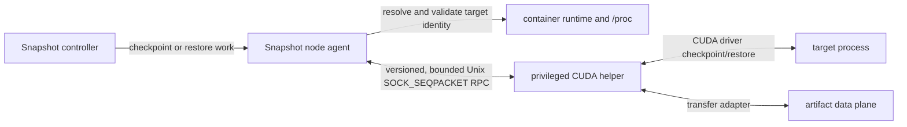

# CUDA checkpoint helper

This directory contains Snapshot's node-local CUDA checkpoint helper. The
helper isolates CUDA driver calls and CustomStorage callbacks from the Go
agent. It is an implementation detail of the Snapshot agent, not a
workload-facing lifecycle API and not the PageBroker transaction protocol.

## Communication boundary



The controller decides which workload operation is running. The node agent
owns target discovery, ordering with CRIU, durable manifest construction, and
the final checkpoint or restore result. The helper owns CUDA driver calls,
CustomStorage callback lifetime, per-operation transfer cancellation, and
reporting the observed CUDA target state.

The helper RPC is local to one Snapshot node agent. It does not define:

- the Kubernetes Snapshot API;
- workload quiesce or resume semantics;
- durable `checkpoint_id` or manifest publication;
- PageBroker transaction, commit, or abort semantics; or
- a network API that PageBroker must implement.

A PageBroker GPU engine may reuse the CUDA operation and transfer behavior
without adopting this socket protocol. Conversely, Snapshot's local path may
provide a transfer adapter without changing the workload lifecycle.

## Running

The Snapshot integration configures one privileged helper beside each node
agent. The helper needs host PID visibility and CUDA driver access so it can
validate and checkpoint CUDA-owning processes on that node. The operation
socket is private to the pod and is shared with the agent through an `emptyDir`
volume.

```text
cuda-checkpoint-helper --daemon \
  --socket /run/cuda-checkpoint-helper/helper.sock \
  --max-operation-seconds 3600
```

The chart checks readiness through the separate health socket derived from the
same path:

```text
cuda-checkpoint-helper --health \
  --socket /run/cuda-checkpoint-helper/helper.sock
```

Health succeeds only after the daemon has bound both sockets and advertised
the deferred-CUDA capability. CustomStorage availability is reported as a
separate capability so callers can fail before state-changing work when the
driver or transfer adapter is unavailable.

## Request and response envelope

Each request contains the protocol version, action, validated node-local PID,
PID identity, storage mode, device mapping, selected GPU UUIDs, and
operation-specific paths. The bounded request is carried in one
`SOCK_SEQPACKET` message so the daemon never accepts a partial request as a
complete operation.

Each response contains the protocol version, operation result, capability and
fatal-state flags, and a bounded diagnostic payload. Health responses advertise
capabilities before the agent starts state-changing CUDA work.

The agent must revalidate PID identity before the helper signals or mutates a
target. Raw host PIDs are node-local execution details and are never durable
checkpoint identity.

## Operation lifecycle

For checkpoint, the helper locks the target, starts the CUDA checkpoint
operation, transfers every CustomStorage extent through the selected adapter,
and completes the CUDA operation handle before returning success. For restore,
it restores the target from the recorded extent manifest and completes the
handle. After all restore targets succeed, the agent sends a separate unlock
request for each target.

One helper request operates on one CUDA-owning PID. The Snapshot agent may
issue several requests for one workload, but it retains ordering and an
individual result for every target.

The daemon retains primary contexts only for the request's selected GPU set.
After a successful operation, it associates those references with the exact
target PID, process start time, and cgroup. It releases them only after `/proc`
confirms that target exited or its PID was reused, or during daemon shutdown.
An inconclusive identity read retains the contexts and defers new work rather
than risking release underneath a live restored target. A release failure is
fatal because continuing would make GPU-resource ownership ambiguous.

On graceful shutdown, the helper identity-pins every retained target with a
pidfd, signals all matching targets before waiting for exit, and releases
primary contexts only after every target is confirmed gone. If identity or
termination cannot be proved, shutdown remains pending and retries. A forced
container or Pod kill can still bypass this process-local cleanup; the shipping
integration therefore treats unexpected helper loss as a fail-closed preview
condition and documents the whole-DaemonSet watcher limitation separately.

## Failure rules

- Failure of any extent cancels sibling transfers for that operation.
- Every newly written extent carries a SHA-256 digest. Checkpoint computes it
  inline while streaming GPU bytes to storage; restore verifies it during the
  sole storage read before acknowledging the CUDA operation. Manifest formats
  without per-extent digests are rejected.
- The helper applies one configured cooperative watchdog, capped at one hour,
  to extent transfers and reports an unhealthy in-flight operation after that
  threshold. CUDA driver calls are not forcibly interruptible. The client waits
  up to five minutes longer; an absent response is an unknown outcome and is
  not replayed.
- Once a state-changing request may have reached the helper, an unknown result
  is not replayed automatically.
- A CUDA operation handle must be completed or resolved before the helper
  reports a reusable target. An unresolved handle is fatal to that helper
  process.
- Storage cleanup, including a future PageBroker abort, does not prove that the
  CUDA target or workload is safe to resume.

The no-backend build used by the first stack slice validates compilation,
linkage, and the standalone protocol, manifest, transfer-configuration, and
cancellation contracts without choosing a production transfer implementation.
The Snapshot-local NIXL/POSIX adapter and its rollout are added separately.

The no-backend helper proof target compiles against `cuda.h` copied from the
digest-pinned CUDA 13.4 development image, which is the canonical owner of the
CustomStorage types. Its compiler and the final agent image remain on the
existing CUDA 13.0 base, so using the newer header does not change the shipped
runtime or its system-library closure. The helper still resolves
`cuCheckpointOperationComplete` dynamically and fails closed when the host
driver does not export the 13.4 API.

## Local validation

`make test` always runs the Go suite. On Linux, when a C++20 compiler and the
OpenSSL development headers and library are available, it also runs the
standalone CUDA-helper tests; missing helper prerequisites are fatal when `CI`
is set.
`make test-cuda-helper` is the strict local target for running only the C++
suite.
