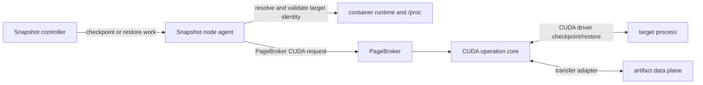

# CUDA checkpoint helper

This directory contains the transfer-neutral CUDA checkpoint operation core
and its standalone validation harness. It isolates CUDA driver calls and
CustomStorage callbacks from orchestration. It is not a workload-facing
lifecycle API and does not define the PageBroker transaction protocol.

## Communication boundary



The controller decides which workload operation is running. The node agent
owns target discovery, ordering with CRIU, durable manifest construction, and
the final checkpoint or restore result. The helper owns CUDA driver calls,
CustomStorage callback lifetime, per-operation transfer cancellation, and
reporting the observed CUDA target state.

The standalone helper RPC exists to validate the core before production
integration. It does not define:

- the Kubernetes Snapshot API;
- workload quiesce or resume semantics;
- durable `checkpoint_id` or manifest publication;
- PageBroker transaction, commit, or abort semantics; or
- a network API that PageBroker must implement.

The production integration reuses the CUDA operation and transfer behavior
behind PageBroker's protobuf transaction boundary. Snapshot does not add a
second local storage backend or require PageBroker to adopt the standalone
socket protocol.

## Standalone validation harness

The first stack slice builds a privileged standalone helper to exercise the
operation core without linking a production transfer adapter. It needs host
PID visibility and CUDA driver access when run against live targets, but it is
not deployed by this slice.

```text
cuda-checkpoint-helper --daemon \
  --socket /run/cuda-checkpoint-helper/helper.sock \
  --max-operation-seconds 3600
```

The harness can check readiness through the separate health socket derived
from the same path:

```text
cuda-checkpoint-helper --health \
  --socket /run/cuda-checkpoint-helper/helper.sock
```

Health succeeds only after the daemon has bound both sockets and advertised
the deferred-CUDA capability. CustomStorage availability is reported as a
separate capability so callers can fail before state-changing work when the
driver or transfer adapter is unavailable.

## Request and response envelope

Each request contains the protocol version, action, validated node-local PID,
PID identity, storage mode, device mapping, selected GPU UUIDs, and
operation-specific paths. Version 8 also carries PageBroker's observed
launch-job device and inode so a worker can reject path replacement before
CUDA dispatch; workers retain request-parser compatibility with version 7.
The bounded request is carried in one
`SOCK_SEQPACKET` message so the daemon never accepts a partial request as a
complete operation.

Each response contains the protocol version, operation result, capability and
fatal-state flags, and a bounded diagnostic payload. Health responses advertise
capabilities before PageBroker starts state-changing CUDA work.

PageBroker must revalidate PID identity before a worker signals or mutates a
target. Raw host PIDs are node-local execution details and are never durable
checkpoint identity.

## Operation lifecycle

For checkpoint, the helper locks the target, starts the CUDA checkpoint
operation, transfers every CustomStorage extent through the selected adapter,
and completes the CUDA operation handle before returning success. For restore,
it restores the target from the recorded extent manifest and completes the
handle. After all restore targets succeed, PageBroker sends a separate unlock
request to the worker that owns each target.

A checkpoint operation locks the complete target set before checkpointing each
CUDA-owning PID in request order. Before restore and CRIU, PageBroker
conservatively reserves one isolated worker slot per target. Regular targets
without a launch-job file run concurrently; participants sharing a launch job
are restored in request order. For CustomStorage, PageBroker groups nonempty
launch-job paths by verified filesystem identity. Participants sharing one inode
are sent to one worker, which prepares their CUDA handles in request order and
then transfers their independent extents concurrently. Distinct launch-job
groups and targets without a launch-job file use separate workers concurrently.
PageBroker evaluates the request as one transaction, unlocks targets in reverse
request order, and retains every worker/context if any post-dispatch outcome is
uncertain. Independent CUDA restore transactions may run concurrently under
PageBroker's bounded restore admission and worker pools. GMS weight restore is
owned and coordinated by GMS, outside PageBroker; end-to-end qualification must
separately prove that GMS transfer overlaps engine CUDA restore.

The daemon retains primary contexts only for the request's selected GPU set.
Checkpoint references are scoped to that invocation and released after CUDA
operation completion. After a successful restore, the daemon associates the
remaining references with the exact target PID, process start time, and cgroup.
It releases restored-target references only after `/proc` confirms that target
exited or its PID was reused, or during daemon shutdown. An inconclusive
identity read retains the contexts and defers new work rather than risking
release underneath a live restored target. A release failure is fatal because
continuing would make GPU-resource ownership ambiguous.

Every restored target is identity-validated and pidfd-pinned before PageBroker
dispatches native restore work. CustomStorage workers independently retain that
exact-lifetime handle when adopting primary contexts and fail the restore closed
if they cannot. Graceful shutdown signals the retained pidfds, waits for those
exact processes to exit without consulting `/proc`, and only then releases
primary contexts. A forced container or Pod kill can still bypass process-local
cleanup; the shipping integration therefore treats unexpected helper loss as a
fail-closed condition.

## Failure rules

- Failure of any extent cancels sibling transfers for that operation.
- Every newly written extent carries a SHA-256 digest. Checkpoint computes it
  inline while streaming GPU bytes to storage; restore verifies it during the
  sole storage read before acknowledging the CUDA operation. Manifest formats
  without per-extent digests are rejected.
- The helper applies one configured cooperative watchdog, capped at one hour,
  to extent transfers and reports an unhealthy in-flight operation after that
  threshold. CUDA driver calls are not forcibly interruptible. An absent
  response is an unknown outcome and is not replayed.
- Once a state-changing request may have reached the helper, an unknown result
  is not replayed automatically.
- A CUDA operation handle must be completed or resolved before the helper
  reports a reusable target. An unresolved handle is fatal to that helper
  process.
- Storage cleanup, including PageBroker abort, does not prove that the
  CUDA target or workload is safe to resume.

The no-backend build used by the first stack slice validates compilation,
linkage, and the standalone protocol, manifest, transfer-configuration, and
cancellation contracts without choosing a production transfer implementation.
PageBroker owns the production transfer adapter; there is no Snapshot-local
NIXL/POSIX rollout.

The PageBroker build keeps the direct POSIX adapter as its default while NIXL
is qualified. `make -C pagebroker daemon-nixl` and
`make -C pagebroker test-nixl` select the NIXL POSIX backend without changing
the transfer contract or manifest digest. From the `agent` directory,
`docker build --target nixl -f pagebroker/Dockerfile .` creates the explicit
PageBroker qualification image with the pinned NIXL runtime; the Dockerfile's
default final stage remains the direct POSIX image.

The no-backend helper proof target compiles against `cuda.h` copied from the
digest-pinned CUDA 13.4 development image, which is the canonical owner of the
CustomStorage types. Its compiler and the final agent image remain on the
existing CUDA 13.0 base, so using the newer header does not change the shipped
runtime or its system-library closure. The helper still resolves
`cuCheckpointOperationComplete` dynamically and fails closed when the host
driver does not export the 13.4 API.

## Local validation

`make test` always runs the Go suite. On Linux, when a C++20 compiler and the
OpenSSL development headers and library are available, it also runs the
standalone CUDA-helper tests; missing helper prerequisites are fatal when `CI`
is set.
`make test-cuda-helper` is the strict local target for running only the C++
suite.
