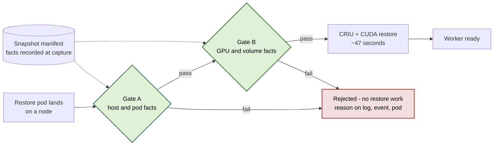
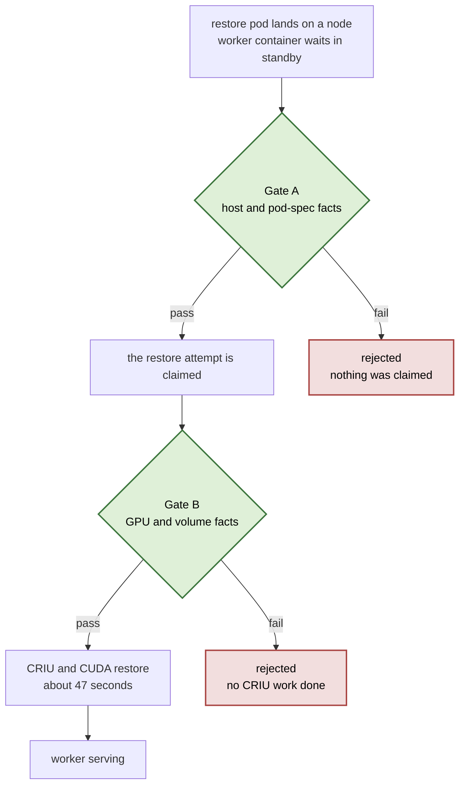
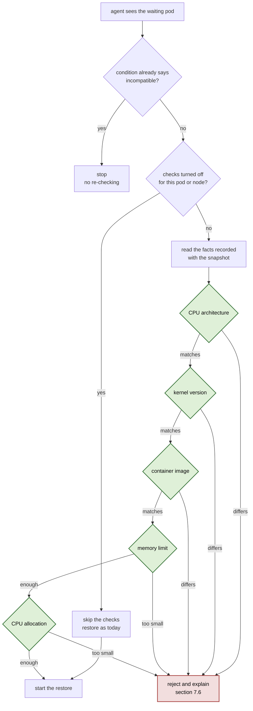
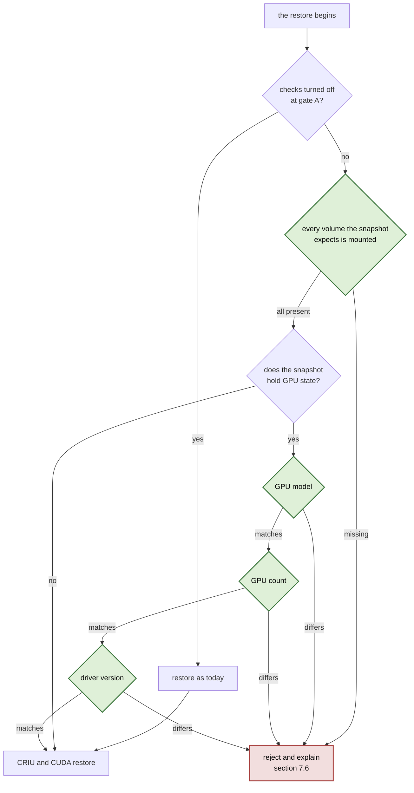
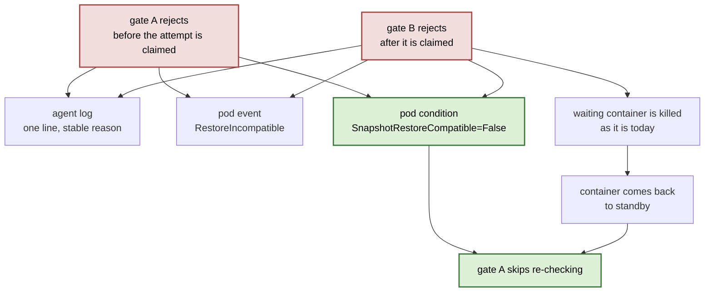

<!--
SPDX-FileCopyrightText: Copyright (c) 2026 NVIDIA CORPORATION & AFFILIATES. All rights reserved.
SPDX-License-Identifier: Apache-2.0
-->

# Restore compatibility checker - Design Doc

This document describes a proposed design. Except where a section explicitly describes the current
state, the behavior and API shapes below are not implemented yet.

## Metadata

| Field                          | Value |
| ------------------------------ | ----- |
| **Status**                     | Proposed design |
| **Author(s)**                  | @lirane |
| **Reviewers**                  | *Badger team - names TBD; include one snapshot-agent owner* |
| **Approver**                   | *TBD* |
| **Created**                    | 2026-08-12 |
| **Last updated**               | 2026-08-23 |
| **Target release / milestone** | *TBD* |
| **Affected services / repos**  | `ai-dynamo/snapshot`: node agent, shared API and protocol, operator, and snapshot Helm chart |
| **On-call / ownership**        | Badger team |

---

## 1. Summary / TL;DR

A snapshot lets a GPU worker skip its slow cold start: instead of loading the model again, the node
restores a frozen copy of a process that was already running. That only works if the machine it wakes
up on looks like the machine it was frozen on. Today nothing verifies that. If the restore lands
somewhere incompatible - a different GPU model, a newer driver, a missing volume - the node spends
about 47 seconds attempting the restore, fails deep inside CRIU, kills the container, and the kubelet
starts the same doomed attempt again. The pod never becomes ready, and the only explanation anyone
gets is a raw CRIU error string. This design adds a compatibility check that runs on the node before
any restore work starts. It compares nine facts recorded when the snapshot was taken against the same
nine facts on the machine about to use it, stops the restore when they do not match, and records a
plain reason on the pod. It also stops the retry loop, so an incompatible pod fails once and says why
instead of failing forever without saying anything.

---

## 2. Context and background

Dynamo can capture a running GPU worker - process memory, open files, and GPU state - into a
*snapshot*, and later bring a new pod up from that snapshot instead of starting the model from
scratch. Capture and restore both happen on the node, performed by a per-node agent that ships as a
DaemonSet. The heavy lifting is done by two upstream tools, CRIU for the process and
`cuda-checkpoint` for the GPU, and both of them have hard requirements about how similar the two
machines have to be.

Three things make mismatches reachable in normal use rather than only through misuse:

- **A snapshot is not pinned to one pod spec.** A restoring worker can be paired with a snapshot that
was captured from a different pod, and nothing on the way in compares the image, the resources or
the GPU. Reaching a mismatch does not take misuse - the supported, documented ways of asking for a
restore are enough.
- **A cluster is not uniform.** Nodes differ in GPU model, driver version, and kernel. A pod that is
perfectly schedulable can still be a machine the snapshot cannot run on.
- **The snapshot barely describes itself.** The metadata file written next to the artifact records
the source pod's IDs and its GPU UUIDs. It does not record the GPU model, the driver, the kernel,
the image, or the resources - so even if we wanted to compare, there is currently nothing to
compare against.

The result is a failure mode with a bad shape: expensive (a GPU sits idle through every attempt),
repeating (the kubelet keeps restarting the container), and unexplained (the error is a CRIU
internal). This design is the response to that.

---

## 3. Goals

1. **Stop an incompatible restore before the expensive work starts.** No CRIU or CUDA work is started
  when the check fails.
2. **Sit where every restore funnels through**, so no way of asking for a restore can get past the
  checks.
3. **Say why, in words.** A stable reason is visible in the agent log, in a pod event, and in a
  pod condition - distinguishable at a glance from a genuine CRIU failure.
4. **Fail once, not forever.** An incompatible pod must not re-enter the check-and-fail loop after
  the kubelet restarts its container.
5. **Cost as little as possible when it passes.** Reuse facts the capture and restore paths already
  collect, so a healthy restore pays for a manifest read and a handful of comparisons. Only the
  rejection path patches pod status.
6. **Be easy to revert.** The check can be turned off per restore request and per agent, without
  redeploying the workload or rolling the agent.

## 4. Non-Goals

- **Repairing an incompatibility.** The checker reports; it does not enable persistence mode, resize
a pod, or pick a different snapshot.
- **Falling back to a cold start.** When the check fails the pod behaves as it does today after a
restore failure. Changing that behaviour is deliberately out of scope for this change.
- **Checking every possible way a restore might fail.** These are compatibility gates, not an
exhaustive pre-flight: a restore that passes both can still fail inside CRIU or CUDA. The set is
deliberately limited to mismatches backed by documented or reproduced evidence; advanced checks are
deferred until we have the hardware or the evidence to justify them
([§13](#13-future-work)).
- **Comparing the application's command line and environment.** CRIU brings both back from the memory
image, and the restore pod runs a standby entrypoint by design, so editing either on the pod reaches
that container rather than the application - silent drift, not a crash. Neither is recorded today.
Deferred ([§13](#13-future-work)).

---

## 5. Glossary

| Term                      | Meaning |
| ------------------------- | ------- |
| **Snapshot / checkpoint** | The saved state of a running GPU worker: process memory, file descriptors, and GPU state, stored as an artifact plus a metadata file. |
| **Restore**               | Recreating that process inside a freshly started pod instead of starting the workload cold. |
| **CRIU**                  | *Checkpoint/Restore In Userspace* - the upstream Linux tool that freezes and thaws the process tree. |
| `**cuda-checkpoint**`     | NVIDIA's companion tool that does the same for GPU state. |
| **Node agent**            | The per-node DaemonSet (`agent`) that performs capture and restore. |
| **Manifest**              | The metadata file written beside a snapshot artifact. The only channel from capture to restore. |
| **Standby container**     | The restore target. It starts, sleeps, and waits for the agent to restore the real process into it. |
| **Gate A / Gate B**       | The two points in the agent where this design performs its checks ([§7](#7-proposed-design---high-level)). |

---

## 6. Current state

A restore today runs straight through. The agent notices a pod that is waiting for a snapshot, marks
the attempt in progress, resolves the target container, discovers the node's GPUs, and hands off to
CRIU. The only compatibility logic anywhere in that path is a single comparison of *how many* GPUs
each side has, in
`BuildDeviceMap` ([cuda.go:274](https://github.com/ai-dynamo/snapshot/blob/6157abe5cd0877a5f4a6794a53d4a7cda804d183/agent/internal/cuda/cuda.go#L274)),
where the source and target GPUs get paired up - the count guard is the
first check in it ([cuda.go:275](https://github.com/ai-dynamo/snapshot/blob/6157abe5cd0877a5f4a6794a53d4a7cda804d183/agent/internal/cuda/cuda.go#L275)).
Past that count, the pairing is positional
([cuda.go:298](https://github.com/ai-dynamo/snapshot/blob/6157abe5cd0877a5f4a6794a53d4a7cda804d183/agent/internal/cuda/cuda.go#L298)):
it will happily map a snapshot taken on one GPU model onto a completely different one.

The restore path can look well guarded - it is full of error returns - but they check whether the
agent has what it needs to *attempt* a restore, not whether this machine can *run* this snapshot: an
unreadable manifest
([restore.go:121](https://github.com/ai-dynamo/snapshot/blob/6157abe5cd0877a5f4a6794a53d4a7cda804d183/agent/internal/executor/restore.go#L121)),
a standby container that cannot be resolved to a PID
([restore.go:239](https://github.com/ai-dynamo/snapshot/blob/6157abe5cd0877a5f4a6794a53d4a7cda804d183/agent/internal/executor/restore.go#L239)),
a GPU UUID list missing on either side
([restore.go:257](https://github.com/ai-dynamo/snapshot/blob/6157abe5cd0877a5f4a6794a53d4a7cda804d183/agent/internal/executor/restore.go#L257)).
The one check that inspects the outcome runs *after* CRIU has finished
([restore.go:159](https://github.com/ai-dynamo/snapshot/blob/6157abe5cd0877a5f4a6794a53d4a7cda804d183/agent/internal/executor/restore.go#L159)),
so a restore onto the wrong GPU model, a newer driver, a different kernel, or a pod missing a volume
passes everything and proceeds to CRIU. When it then fails, the sequence is:

| What happens                                                   | Consequence |
| -------------------------------------------------------------- | ----------- |
| CRIU or CUDA fails, roughly 47 s in (measured on T4)           | A GPU has been held idle for the whole attempt |
| A warning event is emitted carrying the raw CRIU error         | Nobody can tell an incompatibility from a real bug |
| The standby container is killed                                | The pod is not ready |
| The kubelet restarts the container with a **new** container ID | The agent's "already tried this one" guard keys on the *old* ID, so it misses |
| The agent tries again                                          | An indefinite loop, roughly one minute per cycle |

That loop, and the missing explanation, are the two things this design has to fix.

---

## 7. Proposed design - high level

Record the facts at capture time; compare them at restore time; refuse early and say why.

**Record.** When a snapshot is taken, the agent writes into the manifest the handful of facts that
decide whether it can be reused: the GPU model, GPU count and driver version; the kernel version and
CPU architecture of the node; and the image, resources, and volume paths of the pod being captured.
The agent version is also recorded for the explicit format-compatibility mapping deferred to future
work, but this design does not compare it. Most of these values come from calls the capture path
already makes - it discovers the GPUs anyway, it already reads the pod - so this is mostly a matter
of keeping what is already in hand.

**Publish it.** The device information and node information are worth showing even when nothing fails -
a user preparing a restore pod cannot otherwise see which GPU model, driver, kernel or image the
snapshot came from. So `PodSnapshotContent` gains an optional `status.source` block, shown in
[§7.1](#71-the-new-status-block) - the one part of this work that changes a CRD. It lands as its own
change rather than with the checker.

**Compare.** On restore, the agent compares those recorded facts to the same facts on the machine it
is about to restore onto, in two places rather than one:

- **Gate A** runs as soon as the agent sees the waiting pod, before the attempt is marked as started.
It handles everything knowable at that moment: CPU architecture, kernel, image, and the pod's memory
and CPU. Because gate A runs before the attempt is claimed, it can stamp a clear status on the pod
without that status being confused with a restore failure.
- **Gate B** runs a moment later, at the start of the restore itself but still before any CRIU work.
It handles the four facts that only exist at that point: the GPU model, the GPU count, the driver
version, and whether every volume the snapshot expects is actually mounted.

Splitting them this way is what keeps the pass path free. Gate A's inputs are already in memory;
Gate B's inputs come from work the restore path already performs. Only rejection adds a pod-status
patch.

**Refuse and explain.** A failure at either gate stops the restore and writes the same reason to the
agent log, a warning Event named `RestoreIncompatible`, and a
`SnapshotRestoreCompatible=False` condition on the restore pod. Gate A reads that condition before
doing anything, which breaks the retry loop - a pod already marked incompatible is skipped rather
than re-checked.

**Turn it off.** Two switches, both effective without redeploying the workload: an annotation on a
single restore pod, and a field in the agent's existing ConfigMap for a whole node.

The object and signal used by each part are explicit:

| Part | Object and owner | Record or signal |
|---|---|---|
| **Record** | The node agent processes the cluster-scoped `PodSnapshotContent` capture work order and reads its source Pod | Source facts are written to `manifest.yaml` beside the artifact. Capture completion remains the `Ready=True`, `Reason=Captured` condition on `PodSnapshotContent`; no new Event is introduced |
| **Publish** | The node agent owns `PodSnapshotContent.status.source` | The manifest is projected into `status.source` in the same status update that marks the content Ready. The namespaced `PodSnapshot` continues to mirror only Ready or Failed state |
| **Compare** | The node agent reconciles the core `v1/Pod` requesting restore; no restore custom resource is involved | Both gates read `manifest.yaml`, never `status.source`. A rejection emits the `RestoreIncompatible` warning Event on the restore Pod and sets `SnapshotRestoreCompatible=False` on that Pod |

### 7.1 The new status block

The facts land on the `PodSnapshotContent` the agent already updates. The selected Option C shape
separates node and pod facts and keeps device facts behind a vendor selector:

```yaml
status:
  source:
    nodeInfo:
      name: gpu-node-3
      architecture: amd64              # gate A
      kernelVersion: 5.15.0-1071-aws   # gate A
      agentVersion: 1.4.2              # recorded for future format mapping
    podInfo:
      image: nvcr.io/nvidia/ai-dynamo/vllm-runtime:0.6.1
      imageDigest: sha256:9f2c...
      memoryLimit: 64Gi
      cpuLimit: "16"
      gpuCount: 2
    devices: Nvidia                    # which vendor's device facts follow
    nvidia:
      driverVersion: 580.82.07          # gate B
      devices:                          # gate B - one entry per GPU
        - productName: NVIDIA A100-SXM4-80GB
        - productName: NVIDIA A100-SXM4-80GB
```

`devices[].productName` and `driverVersion` are the names the NVIDIA DRA driver publishes for these
values on a `ResourceSlice`.

The `devices` selector replaces the earlier `type` key. It names the vendor whose device facts
follow, so only the matching payload is filled in and another vendor can record its own set without
disturbing this one. The agent writes the block on `PodSnapshotContent` when the checkpoint goes
ready. Every field is additive, optional, generated from the manifest, and never read back by the
checks.

### 7.2 Architecture diagram



### 7.3 Where the checks sit in a restore



### 7.4 What gate A checks



### 7.5 What gate B checks



### 7.6 What the user sees when a check fails



The same reason string is written to every surface, so it reads the same wherever the user looks. The
condition breaks the retry loop: a pod already marked incompatible is skipped rather than checked
again.

Four of the nine checks are documented upstream by NVIDIA or CRIU, four were verified by reproducing
the failure on our own stack, and one rests on a mechanism argument alone:

| Check                                        | Gate | Evidence |
| -------------------------------------------- | ---- | -------- |
| CPU architecture                             | A    | Documented upstream |
| Kernel version                               | A    | Documented upstream |
| Container image                              | A    | Argument alone |
| Memory limit                                 | A    | Verified on our stack |
| CPU allocation                               | A    | Verified on our stack |
| Every volume the snapshot expects is mounted | B    | Verified on our stack |
| GPU model                                    | B    | Documented upstream |
| GPU count                                    | B    | Documented upstream |
| Driver version                               | B    | Verified on our stack; floor documented |

---

## 8. Cross-cutting concerns

### 8.1 Security considerations

The failure condition requires `patch` or `update` access to the Pod status subresource. The agent's
RBAC gains `pods/status` only; it does not gain permission to modify Pod spec. The condition and Event
contain field names and compared values already visible to anyone who can inspect the Pod.

### 8.2 Privacy and data handling

N/A

### 8.3 Reliability and failure modes

| Scenario                          | Behaviour |
| --------------------------------- | --------- |
| Check fails                       | Restore stops before CRIU. What happens to the pod after that is unchanged - see [§4](#4-non-goals). |
| Manifest missing a new field      | Treated as unknown and skipped. The checker does not reject a snapshot only because an older manifest lacks a newly recorded fact. |
| Kill switch on                    | Both gates bypassed; the path reverts to today's behaviour exactly. |
| Repeat attempts after a rejection | Suppressed by the Pod condition read at gate A. This is the change that turns an indefinite loop into a single failure. |
| Agent restarts mid-check          | No state is held across the check; the Pod is re-reconciled and the condition decides. |

Blast radius: per node and per restore. A bug here can block restores on that node, but cannot affect
capture, the operator, or non-snapshot workloads.

### 8.4 Performance and scalability

Gate A compares values already in memory - the pod the agent is already watching, and the facts
recorded with the snapshot, which the restore reads anyway. Gate B rides along on the GPU query the
restore already runs, plus one existence check per volume. Expected added latency is sub-millisecond
against a ~47 s restore.

On the failure path the saving is the point: an incompatible restore currently burns roughly 47
GPU-seconds per attempt and repeats indefinitely. After this change it costs one manifest read.

### 8.5 Observability

- **Logs** - one structured line per rejection carrying a stable `reason`, the pod, the container,
and both compared values. Kill-switch skips log at the same level.
- **Events** - `RestoreIncompatible` on the pod, deliberately distinct from `RestoreFailed`.
- **Conditions** - `SnapshotRestoreCompatible=False` on the pod, with the check identifier in
`Reason` and both compared values in `Message`.
- **Metrics** - none added; the agent has no Prometheus surface today.
- **Triage** - `kubectl describe pod` shows the event and the condition, and the reason names the
two values that differ, so "bad node or bad snapshot?" is answered without agent logs.

---

## 9. Testing strategy

| Layer                | Coverage |
| -------------------- | -------- |
| **Unit**             | The comparison itself, table-driven over all nine checks and the missing-field case, plus a round-trip of the newly recorded facts. |
| **Gate A**           | The reject path, the pass path, both kill switches, and the skip that breaks the retry loop, on the existing fake-client harness. |
| **Gate B**           | The GPU checks against the stubbed GPU discovery the tests already use, and the volume check against a temporary root. |
| **Cluster / manual** | One scenario per check, each producing a real failure through the normal flow rather than a synthetic one, plus a probe that proves every new fact can be read on a real node before any of it is wired up. |

---

## 10. Rollout and migration plan

### 10.1 Feature enablement

The kill switch *is* the enablement control, and it defaults to **on** (checks enforced). Per node, an
admin edits the agent's existing ConfigMap, which takes effect without restarting anything. Per
restore, a user sets an annotation on the pod. Suggested rollout: enabled everywhere from the start,
with the ConfigMap as the escape hatch if a check proves over-strict.

### 10.2 Backwards compatibility

All new manifest fields are optional. A snapshot taken before this change lacks some comparison
inputs, so those individual checks are skipped instead of invalidating the snapshot. Agent-version
compatibility is deferred to the explicit mapping in [§13](#13-future-work).

### 10.3 Upgrade / downgrade procedure

Nothing separate - it ships as part of the agent version, through the usual `helm upgrade` of the
snapshot chart. Downgrade is the matching rollback.

---

## 11. Alternatives considered

**Where the check runs.** We looked at earlier places - blocking the pod as it is created, or
validating in the operator when it builds the restore pod - and at putting everything in a single
gate. We ended up with gates A and B because they are the points we own, they are on every path a
restore can take, and between them they already hold every fact the decision needs. Anywhere earlier
either misses some of the requests or has to guess at facts that only the node knows.

**Which checks to include.** A wider set was considered, but a few of them need hardware or an
environment we cannot get to today, so they cannot be written or proven now. Those are deferred
([§13](#13-future-work)) rather than shipped untested.

**How the failure is reported.** The options were to leave it as a normal restore failure, to report
it only in the agent's logs, or to put it on the pod. We chose the pod, because that is where the
person who asked for the restore is already looking.

---

## 12. Risks and mitigations

| Risk | Likelihood | Impact | Mitigation | Owner |
| ---- | ---------- | ------ | ---------- | ----- |
| A check is over-strict and blocks a restore that would have worked | Med | High - a working feature stops working | Per-pod and per-node kill switch ([§10.1](#101-feature-enablement)); every check is backed by documented or verified evidence, and any check that proves noisy can be dropped on its own | @lirane |
| The agent cannot patch the restore Pod condition | Low | High - the rejection cannot be made durable and may repeat | Add `pods/status` to the agent's RBAC and test the status patch before enabling the checker; the Event and log remain diagnostic fallbacks | Badger team |
| Another component starts depending on the facts, in the manifest or in `status.source` | Low | Med - the field names become a contract we can no longer change freely, and `status.source` is user-visible API | The new fields are additive and optional, and `status.source` is generated from the manifest rather than being a second source of truth | @lirane |
| GPU facts are unavailable on one of the two GPU-discovery paths | Low | Med - GPU checks silently skipped there | A fact that cannot be read is skipped, never a false mismatch; both paths are probed on a real node before the checks are wired up | @lirane |

---

## 13. Future work

The deferred checks: MIG restore targets, GPU SKU / PCI device identity, host OS equality, CRIU
CPU-feature comparison, and the application's command line and environment.

Snapshot-agent compatibility is also deferred. The follow-up replaces major/minor equality with an
explicit map of agent versions whose checkpoint-format changes invalidate snapshots from earlier
versions. Only releases that cross a mapped incompatibility boundary require re-capture; ordinary
minor or patch releases do not invalidate snapshots automatically.

---

## 14. References

- [CUDA driver API - checkpointing](https://docs.nvidia.com/cuda/cuda-driver-api/group__CUDA__CHECKPOINT.html)
- [cuda-checkpoint](https://github.com/NVIDIA/cuda-checkpoint) ·
[CRIU documentation](https://criu.org/Main_Page) ·
[CRIU image format](https://criu.org/Images)

---
