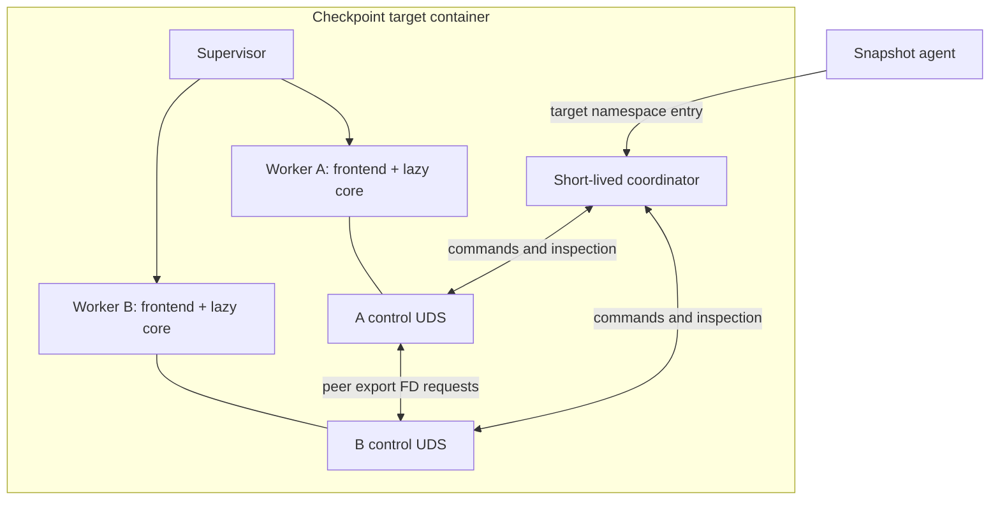
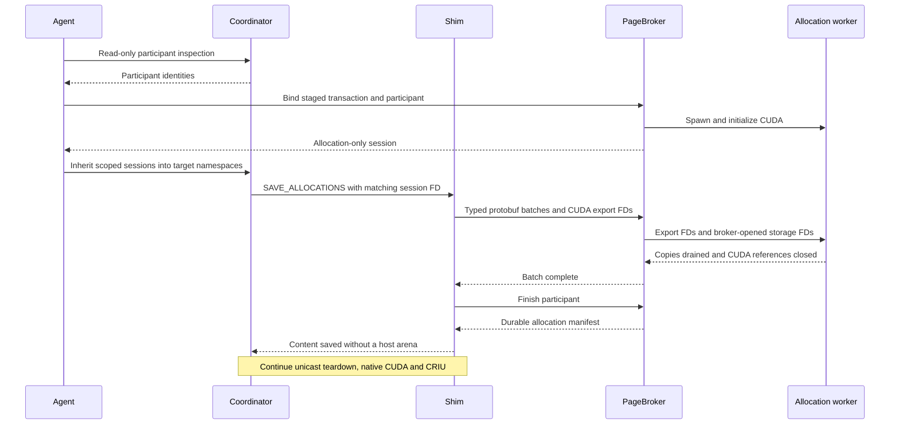
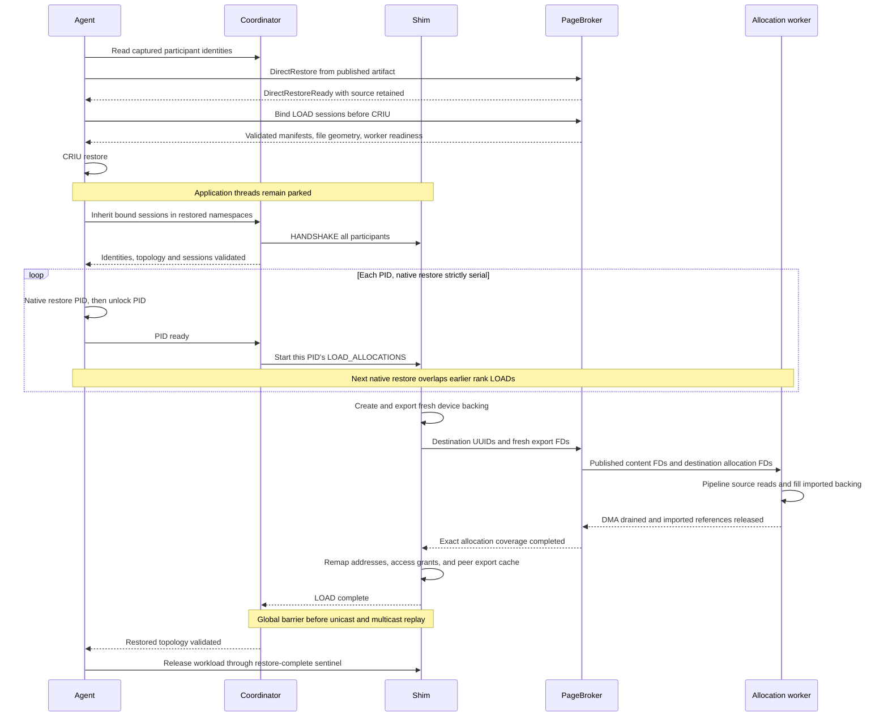

<!--
SPDX-FileCopyrightText: Copyright (c) 2026 NVIDIA CORPORATION & AFFILIATES.
SPDX-License-Identifier: Apache-2.0
-->

# Cuinterpose: shared CUDA memory with a C frontend and Rust core

Cuinterpose extends Snapshot's native CUDA/CRIU path to reconstruct same-node
CUDA VMM sharing and multicast. Native CUDA owns CUDA process state and memory
outside the selected VMM lifecycle; CRIU owns CPU state and host memory.
The default host-carrier mode removes and rebuilds shared tracked allocations.
PageBroker mode instead owns all supported device-pinned `cuMemCreate`
allocations, including application-private backing.

## Components and interception



The C frontend is an `LD_PRELOAD` library inside each worker, not a sidecar.
It intercepts direct CUDA symbols, `dlsym`, the
`cuGetProcAddress*` family, and runtime `cudaGetDriverEntryPoint*` lookups.
Explicit `dlvsym` lookups are not interposed.
Real resolvers run first. Successful supported lookups are replaced with
wrappers matching the actual returned symbol and ABI; absent APIs are not
invented. Provider references remain alive while cached addresses can be used.
Unknown tracked entry points fail closed rather than
guessing an ABI from a pointer or byte pattern.

Bootstrap calls `dlvsym(RTLD_NEXT, "dlsym", "GLIBC_2.34")` once to obtain
glibc's real resolver without recursing through the intercepted `dlsym`.
The frontend does not parse ELF images or traverse loaded objects. On first
relevant CUDA activity it opens
the adjacent core with `RTLD_LAZY | RTLD_LOCAL`, keeping its symbols out of
the global lookup scope. The frontend is linked with `-Bsymbolic-functions`
so its internal wrapper references cannot be preempted by another preload.
Initialization refuses reentrant incomplete state rather than waiting under
the dynamic loader's lock.

This intentionally follows the original glibc-based lookup contract rather
than implementing a general interposer-composition layer. Forwarded
`RTLD_NEXT` is relative to the frontend's call into glibc, not the original
application/interposer caller. Arbitrary `dlsym` replacements and caller-relative
interceptor chains are not supported. Explicit `dlvsym` calls bypass the shim.
Ordinary non-CUDA lookups delegate to glibc; CUDA objects in separate loader
namespaces are not interposed. The supported platform is Linux/amd64 with
glibc 2.34 or newer.

The core calls CUDA through a typed lazy driver inventory using the frontend's
`Host.resolve` callback. It does not link CUDA or introduce a second independent
driver loader. cudarc's generated CUDA 13.1 bindings supply constants, device and
handle types, allocation flags, and multicast properties. The ABI retains raw
integer fields for enum-bearing caller structures and driver errors: unknown
values must reach the driver without constructing invalid Rust enums. Compile-time
layout checks compare those structures with cudarc. Neither cudarc's loader nor
its context/buffer ownership wrappers participate in interception or restore.
The private version-6 C ABI carries borrowed pointers,
C-layout tables, and scalars only. Cbindgen generates the C callback table
from explicit Rust `repr(C)` declarations without expanding macros or parsing
CUDA dependencies. C and Rust forwarding functions are checked against that
table at compile time; an ABI test compares C sizes, alignments, and field
offsets with Rust's actual layouts. The generator is a build-only dependency,
not part of the preload libraries. Opaque CUDA property
pointers are forwarded without C-side dereferencing; independent test fixtures
check the public CUDA calling conventions without requiring SDK headers.
Rust retains ownership of its state and allocations. Panic containment in
the Rust backend prevents ordinary Rust unwinds from
crossing the ABI and poisons a failed generation; it cannot recover invalid
foreign pointers, foreign exceptions, allocator aborts, or partial CUDA work.

The core and coordinator use ordinary Rust ownership, enums, `Result`,
Serde, and rustix. Coordinator CLI parsing uses Clap and errors use anyhow;
its executable is static-musl. The frontend uses C11 atomics, pthread fork
callbacks, and glibc loader functions, rather than a Rust runtime or the
coordinator's dependencies. The C layer cannot catch foreign C++ exceptions.

## Identity, tickets, and checkpoint ownership

Every process generation has a participant ID, generated randomly unless
`CUINTERPOSE_PARTICIPANT_ID` is set validly. Its namespace PID locates
`/snapshot-control/cuinterpose-<pid>.sock`; `HANDSHAKE` identifies the
participant, so a PID is not treated as durable identity.

Supported allocations receive random allocation IDs and logical application
handles. The core records real driver handles, mappings, allocation offsets,
access grants, creator identity, and multicast membership. Access records
preserve grants for all locations. Ambiguous range changes are rejected;
unknown driver access state prevents checkpoint.

Export returns a sealed memfd ticket instead of a raw CUDA FD. The ticket
names the original creator endpoint, participant ID, allocation ID, and
resource kind. Import connects to that creator and receives a duplicate cached
CUDA FD through `SCM_RIGHTS`; re-export still names the original creator.
The export service does not need the main CUDA-state lock, so peers can obtain
descriptors while a worker is blocked in a driver collective.

| Allocation | Checkpoint owner |
| --- | --- |
| Non-exportable or never-shared supported VMM | Native CUDA by default; PageBroker in the opt-in mode |
| Successfully exported supported allocation | Cuinterpose creator carries canonical bytes |
| Ticket import | Cuinterpose reconnects it to the original creator |
| Tracked allocation bound into multicast | Cuinterpose, even without a unicast export |

Sharing is sticky, not a live peer count. Closing a ticket does not return
checkpoint ownership to native CUDA. Exactly POSIX-FD handle type is supported.
Successful FABRIC, mixed, or other unsupported exportable creation is allowed
at runtime but recorded for checkpoint refusal before destructive prepare.
A live raw import without a ticket similarly prevents capture.

Wire requests, replies, topology, and tickets use typed, bounded MessagePack
version 4. Coordinator reports use typed JSON lines. Allocation IDs are
resource identities, not an additional authorization packet field.

## Capture

The agent discovers all CUDA PIDs and requires socket coverage to agree with
the annotation. Partial or unexpected interposition is an error. The workload
must already be quiescent; coordinator barriers do not quiesce application
threads. Each phase below is dispatched to all participants and joined before
the next phase.

```mermaid
sequenceDiagram
    participant Agent
    participant Coord as Prepare coordinator
    participant Shims as All worker shims
    participant CUDA
    participant CRIU
    participant Artifact
    Agent->>Coord: Enter target namespaces with CUDA PID pairs
    Coord->>Shims: HANDSHAKE and INSPECT
    Shims-->>Coord: Identities and local topology
    Coord->>Coord: Validate creators, ranges, teams and supported resources
    Coord->>Shims: PREPARE_MULTICAST
    Shims->>CUDA: Drop exports, unmap, unbind, release multicast
    Shims-->>Coord: All participants complete
    Coord->>Shims: SAVE_ALLOCATIONS
    Shims->>CUDA: Stage shared creator allocations and copy D2H
    Shims-->>Coord: Canonical contents saved in host arenas
    Coord->>Shims: PREPARE_UNICAST
    Shims->>CUDA: Drain exports, unmap and release shared VMM
    Shims-->>Coord: All participants complete
    Coord->>Artifact: Atomically persist cuinterpose.state
    Coord-->>Agent: Prepared; exit
    Agent->>CUDA: Lock all processes, then native checkpoint
    Agent->>CRIU: Dump process tree and host memory
    CRIU->>Artifact: CPU images including host-carrier arenas
```

In the default host-carrier mode, the core selects shared, creator-owned, exportable pinned device allocations
and passes content plans to the host-carrier module. The module uses one
registered host arena per process and batches staging/copies by CUDA context.
A mapped shared creator with no remaining logical handle can recover a
temporary handle before saving. Never-shared allocations are excluded from both
handle recovery and teardown.

Multicast wraps unicast, so it is removed first. Export caches stop accepting
requests and drain in-flight descriptors before release. CPU records, logical
handles, identities, and carrier pointers remain for CRIU. State publication
uses a temporary file, fsync, rename, and directory fsync. There is no safe
rollback after destructive prepare; later failure must not resume the source.

## Restore

The agent recreates tool mounts and control-directory paths before CRIU,
removes stale socket entries, and rejects prepared artifacts missing state.
In host-carrier mode, native CUDA restore and unlock precede shim reconstruction.
In PageBroker mode, each rank starts loading after its own native restore and
unlock, overlapping the next rank's native restore. Application threads remain
parked behind the restore-complete sentinel in both modes. The diagram below
shows the host-carrier ordering; the PageBroker ordering is detailed later.

```mermaid
sequenceDiagram
    participant Agent
    participant CRIU
    participant CUDA
    participant Coord as Restore coordinator
    participant Shims as All worker shims
    participant App as Parked application
    Agent->>CRIU: Restore process tree, CPU records and host arenas
    Agent->>CUDA: Restore all CUDA processes, then unlock
    Agent->>Coord: Start in restored target namespaces
    Coord->>Shims: HANDSHAKE; require captured participant set
    Coord->>Shims: LOAD_ALLOCATIONS
    Shims->>CUDA: Create shared creator backing and copy H2D
    Shims->>CUDA: Restore creator mappings/access and export descriptors
    Shims-->>Coord: All creators ready
    Coord->>Shims: RESTORE_UNICAST
    Shims->>Shims: Fetch fresh creator descriptors over peer UDS
    Shims->>CUDA: Import, map and restore access
    Shims-->>Coord: All unicast ready
    Coord->>Shims: RESTORE_MULTICAST_CREATORS
    Shims-->>Coord: All creator descriptors published
    Coord->>Shims: RESTORE_MULTICAST_IMPORTERS
    Shims-->>Coord: All local multicast handles imported
    Coord->>Shims: RESTORE_MULTICAST_DEVICES
    Shims-->>Coord: Entire device team attached
    Coord->>Shims: RESTORE_MULTICAST_BINDINGS
    Shims-->>Coord: Bindings, mappings and access restored
    Coord->>Shims: INSPECT
    Coord->>Coord: Compare complete topology with captured state
    Coord-->>Agent: Restored; exit
    Agent->>App: Publish restore-complete
```

`RESTORE_MULTICAST` is one conceptual phase with four wire suboperations.
Creators publish descriptors before importers fetch them. All imports finish
before device attachment, avoiding peers stranded in collectives after an
import failure. The entire device team must attach before bindings can proceed.
Bindings replay `BindMem` or `BindAddr` with original ABI/device/offsets, then
mappings and access. These are genuine cross-process dependencies; capture can
perform local teardown in one multicast operation because references already
exist. Restore reverses dependency order, not RPC count.

Host arenas are released only after successful content reconstruction.
Uncertain asynchronous-copy completion is fail-stop without freeing memory
that DMA might still reference. Never-shared records are not replayed; their
physical backing and preserved handles remain native CUDA's responsibility.

## Opt-in PageBroker allocation contents

Host carriers remain the default. A workload can instead select external
allocation contents with both `nvidia.com/cuinterpose: enabled` and
`nvidia.com/cuinterpose-allocation-storage: pagebroker`. Capture also requires
`nvidia.com/snapshot-pagebroker: "true"` and an enabled PageBroker deployment.
This selects all supported creator-owned, device-pinned `cuMemCreate` allocations, whether or not the application exported them. Other allocator families, legacy IPC, and CUDA process state remain native-owned. Conditional `--launch-job` wrapping is unchanged; native CustomStorage is not used.

Pod shaping derives `CUINTERPOSE_ALLOCATION_STORAGE=pagebroker` from the annotation before the process starts. Allocation ownership cannot be switched by a capture command. For an application creation requesting handle type zero, the shim requests POSIX-FD backing internally. It preserves the original application properties, refuses application export of that private handle, and adjusts `cuMemGetAllocationGranularity` to the actual backing requirements. Property lookup and retained logical handles continue to advertise the original export permissions. A private allocation is never marked shared merely because PageBroker owns its contents.

Never-shared POSIX allocations need no creation-property substitution. Both they and internally exportable type-zero allocations participate in SAVE, handle recovery from surviving mappings, unicast teardown, LOAD, and creator remapping. Only genuinely shared objects populate the peer export cache. Successful unsupported FABRIC or mixed-handle creations still refuse checkpoint inspection; this path does not silently replace FABRIC. “All allocations” here means supported device-pinned VMM creations, not `cudaMalloc`, managed memory, arrays, or arbitrary library allocations.

The trusted agent obtains participant IDs from a read-only coordinator
inspection, binds one allocation-only broker connection per participant, and
passes those descriptors through namespace entry. The node-wide broker socket
is never mounted into the workload. The coordinator rechecks the participant
set before mutation, then transfers each capability to its matching shim with
`SAVE_ALLOCATIONS` or `LOAD_ALLOCATIONS`. Even participants with no owned content
complete an empty manifest. No session descriptor survives capture.



The shim exports the complete participant allocation set before submitting storage work, grouping by CUDA context and device to avoid repeated context entry and UUID lookup. The public `cuMemExportToShareableHandle` API still takes one handle per call; this does not use the driver's private checkpoint bulk-export interface. Export FDs remain scoped to the operation and travel in batches of at most 32, avoiding oversized `SCM_RIGHTS` messages. Rank-wide export requires enough process file descriptors for the allocation set; export failure stops the phase.

The PageBroker worker imports and maps a batch before running a bounded transfer ring across its allocation boundaries, grouped by device. Each worker retains one primary-context reference, stream, and four-slot pinned transfer ring per used GPU across batches. Participants run concurrently. The GPU transfer implementation and NIXL POSIX backend live under `agent/pagebroker`; only generic transfer configuration and cancellation contracts are shared with the helper. Storage requests operate on the worker's registered host buffers, not the shim's address space. Imported handles and mappings are released before each reply. SAVE acknowledges a batch after synchronizing its shared participant payload. There is no content hashing or checksum verification. This is NIXL POSIX I/O through pinned host buffers, not GPUDirect Storage, and does not settle the generic storage-engine/worker boundary.

The broker worker's `PAGEBROKER_ALLOCATION_DIRECT_IO=1` setting enables aligned `O_DIRECT` storage reads and writes, avoiding page-cache double buffering for large allocation files. It requires aligned ranges and filesystem support and fails rather than silently reverting to buffered I/O. The default is buffered. Both modes retain the batch durability barrier; this setting belongs to the broker, not the workload shim.

Publication moves staging to the partial publication name with a same-filesystem rename, then publishes it under the final name; cross-filesystem publication retains the copying path. A failed publication moves staged input back for retry or abort.

PageBroker allocation restore uses `DirectRestoreRequest`, not `StagedRestoreRequest`. The broker retains a read-only descriptor to the published source, and LOAD sessions open allocation manifests and content relative to it. `DirectRestoreReady` means the source is available for subsequent LOAD requests, not that CUDA memory is already restored. No allocation files are copied, cloned, or hard-linked into a restore directory. Commit, abort, and expiry release source references without deleting the artifact; the caller keeps the artifact available throughout the transaction.

CPU/native state uses the existing read-only artifact mount and CRIU's private replacement metadata and scratch directory. Large CRIU images are not staged merely because allocation content uses PageBroker. The separate staged-restore contract remains available for callers that require an independently writable copy. Direct restore avoids filesystem staging; the CUDA worker still transfers through bounded pinned buffers. This path does not require CRIU compression or native CUDA CustomStorage.

`manifest.yaml` records `cuinterpose.allocationStorage: pagebroker`; an absent
field means host-carrier, and unknown modes fail before restore. Files are
`allocations/<participant>/content.bin` with a version-2 `manifest.pb` recording
each allocation's identity, size, and broker-assigned payload offset. Earlier
allocation manifest versions are rejected. Before CRIU, the agent validates the participant directory set
against `cuinterpose.state`, and binding LOAD validates manifests/file geometry
and worker readiness. Restore obeys the captured mode, not a new Pod preference.

After each rank's native restore, `LOAD_ALLOCATIONS` creates fresh backing, exports its FDs
with the destination GPU UUID, and waits for the broker to fill it. Only after
all copies and worker-reference cleanup succeed does the shim remap addresses
and publish peer exports. The existing global LOAD barrier precedes unicast
imports and multicast reconstruction. File-size, range, and completion checks
remain, but same-size payload corruption is not detected; checkpoint storage is trusted.
Transfer failure keeps the workload parked and
never falls back to host carriers. Disconnect poisons the transaction, and abort
waits for worker admission to drain before removing files.

The coordinator handshakes with every restored process and validates captured
identities, topology, and session bindings before acknowledging a private readiness
socket inherited from nsrestore. Nsrestore restores and unlocks one PID at a time,
then sends that PID to the coordinator. The coordinator starts its LOAD without
waiting for earlier ranks' transfers. Native restores never overlap each other:
the CUDA launch-job file contains shared restore metadata. This mixed per-job
lifecycle is an optimization inferred from driver implementation, not a documented
cross-release CUDA guarantee; workloads must keep all application CUDA activity
parked until restore-complete.

EOF before every PID, an unknown/duplicate PID, or any failed LOAD prevents
topology replay. A failed LOAD shuts down readiness immediately, cancelling further
native work. The coordinator joins started exchanges before returning, and the
outer PageBroker transaction abort drains workers on failure. No rank is retried
independently. The `cuda_pipeline` timing is the combined wall time, not the sum
of overlapping native and LOAD durations; per-PID native and LOAD events retain
timestamps for measuring actual overlap.



Build the opt-in broker image from `agent/` with
`docker build -f pagebroker/Dockerfile.gpu -t <image> .` (or use
`make -C agent/pagebroker image-gpu GPU_IMAGE=<image>`). Configure
`pageBroker.image` to that image and set
`pageBroker.allocationWorker=/usr/local/bin/pagebroker-allocation-worker`.
This explicitly enables privileged node-wide GPU visibility for the trusted
broker. Leaving the worker setting empty preserves the CPU-only deployment.
The NVIDIA runtime supplies `libcuda.so.1`; the image contains only the worker
and ordinary protobuf/OpenSSL runtime dependencies.

## Isolation and fork limits

Snapshot delivers all three CUDA tools to every checkpoint target. Only
targets with more than one GPU, or unknown DRA claim size, are wrapped in
`cuda-checkpoint --launch-job`. The annotation only enables `LD_PRELOAD`.

The coordinator enters the target mount, UTS, IPC, network, and PID namespaces,
with the target root and working directory. User/cgroup namespaces remain in
the agent context. Trusted executable and checkpoint-directory descriptors
are opened before namespace entry; restore pins its coordinator executable
before CRIU.

Control sockets have mode 0600 on a Pod-local `emptyDir`, mounted through
`subPath=<container-name>`. Conflicting reserved mounts and variables are
rejected. Ordinary other Pods cannot access this filesystem path; intentionally
shared sidecars and same-credential processes remain in the workload trust
domain. This is not protection against node root or equivalent privilege.

Fork callbacks abandon the child's inherited shim generation, close inherited
shim-owned descriptors, and create a fresh identity on first CUDA activity.
They do not destroy inherited CUDA state or promise CUDA safety after arbitrary
multithreaded fork. Spawn/exec is preferred. The diagnostic ABI is retained for
startup, poison, and fork tests where a control endpoint cannot answer.

## Validation and scope

See the [build/test guide](../../agent/cmd/cuinterpose/rust/README.md).
Headless tests validate loader behavior and lifecycle invariants; physical-GPU
and cross-node workload tests must additionally verify device bytes, real
multicast collectives, native restore, and post-restore inference.

There is no C fallback or compatibility codec for earlier experimental state.
FABRIC sharing and non-VMM allocator ownership require separate
designs. The concrete host-carrier module
is the replacement boundary, not a speculative backend registry.
