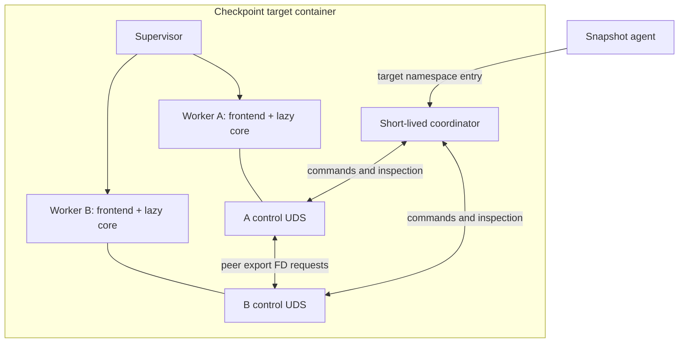

<!--
SPDX-FileCopyrightText: Copyright (c) 2026 NVIDIA CORPORATION & AFFILIATES.
SPDX-License-Identifier: Apache-2.0
-->

# Cuinterpose: shared CUDA memory with a C frontend and C++ core

Cuinterpose extends Snapshot's native CUDA/CRIU path to reconstruct same-node
CUDA VMM sharing and multicast. Native CUDA owns private allocations and CUDA
process state; CRIU owns CPU state and host memory. Cuinterpose temporarily
removes and rebuilds only tracked allocations that have become shared.

## Components and interception



The C frontend is an `LD_PRELOAD` library inside each worker, not a sidecar.
It intercepts direct CUDA symbols, `dlsym`, the
`cuGetProcAddress*` family, and runtime `cudaGetDriverEntryPoint*` lookups.
Explicit `dlvsym` lookups are not interposed.
Real resolvers run first. Successful supported lookups are replaced with
wrappers matching the actual returned symbol and ABI; absent APIs are not
invented. Provider references remain alive while cached addresses can be used.
Unknown tracked entry points fail closed rather than
guessing an ABI from a pointer or byte pattern.

Bootstrap calls `dlvsym(RTLD_NEXT, "dlsym", "GLIBC_2.34")` once to obtain
glibc's real resolver without recursing through the intercepted `dlsym`.
The frontend does not parse ELF images or traverse loaded objects. On first
relevant CUDA activity it opens
the adjacent core with `RTLD_LAZY | RTLD_LOCAL`, keeping its symbols out of
the global lookup scope. The frontend is linked with `-Bsymbolic-functions`
so its internal wrapper references cannot be preempted by another preload.
Initialization refuses reentrant incomplete state rather than waiting under
the dynamic loader's lock.

This intentionally follows the original glibc-based lookup contract rather
than implementing a general interposer-composition layer. Forwarded
`RTLD_NEXT` is relative to the frontend's call into glibc, not the original
application/interposer caller. Arbitrary `dlsym` replacements and caller-relative
interceptor chains are not supported. Explicit `dlvsym` calls bypass the shim.
Ordinary non-CUDA lookups delegate to glibc; CUDA objects in separate loader
namespaces are not interposed. The supported platform is Linux/amd64 with
glibc 2.34 or newer.

The core calls CUDA through a typed lazy driver inventory using the frontend's
`Host.resolve` callback. It does not link CUDA or introduce a second independent
driver loader. The private version-5 C ABI carries borrowed pointers,
C-layout tables, and scalars only. The shared `core_abi.h` inventory declares
callbacks and CUDA wrappers for both languages, with size and offset assertions.
Opaque CUDA property pointers are forwarded without frontend dereferencing;
independent fixtures check public calling conventions without requiring SDK
headers. CUDA handles are optional values internally: zero is a valid driver
handle, not an absence sentinel.

The C++20 core owns its records, containers, locks, and descriptors. Exceptions
are contained at every C ABI callback and worker-thread boundary. Normal CUDA
errors retain their result codes; allocation failures become out-of-memory
errors, and unexpected exceptions poison the generation. Catching an exception
does not roll back partial CUDA work or recover invalid foreign pointers.
Fallible, context-dependent CUDA cleanup remains explicit. RAII owns CPU
resources and locks; it must not free memory when DMA completion is unknown.

The core and coordinator use STL containers, enums, variants, and move-only
resource ownership. nlohmann/json provides MessagePack and JSON serialization;
typed adapters preserve the version-4 wire representation. Its SAX decoder
bounds container counts and nesting before constructing a document. CLI11
handles coordinator arguments. The Linux socket adapter retains `sendmsg`/
`recvmsg` for descriptor passing: a higher-level socket framework would not
remove this SCM_RIGHTS ownership or fork bookkeeping, and there is no event-loop
framework to configure. A separate peer listener and bounded lifecycle queue
keep exports independent of the CUDA-state lock. The coordinator dispatches
each participant concurrently and joins all replies at each global barrier.

The minimal frontend has no C++ dependency. The backend uses the workload's
ordinary shared `libstdc++.so.6` and `libgcc_s.so.1`; it does not embed a second
exception runtime, use `RTLD_DEEPBIND`, or create a loader namespace. Hidden
visibility and a linker export map expose only the private C entry point.
`RTLD_LOCAL` controls symbol scope, not runtime isolation. The artifact gate
requires glibc at most 2.34, GLIBCXX at most 3.4.30, and CXXABI at most 1.3.13.
An older application-provided C++ runtime is unsupported. Coexistence with the
actual PyTorch/vLLM runtime requires physical-GPU qualification.

The coordinator is fully static GNU C++, with no ELF interpreter or dynamic
dependencies, so it can run after namespace entry without workload libraries.
It only uses local sockets and numeric PIDs, not libc DNS/NSS services. The
builder pins Debian Bookworm, GCC 12, nlohmann/json 3.11.2, and CLI11 2.1.2.
Header sources and dependency license notices accompany the image.

## Identity, tickets, and checkpoint ownership

Every process generation has a participant ID, generated randomly unless
`CUINTERPOSE_PARTICIPANT_ID` is set validly. Its namespace PID locates
`/snapshot-control/cuinterpose-<pid>.sock`; `HANDSHAKE` identifies the
participant, so a PID is not treated as durable identity.

Supported allocations receive random allocation IDs and logical application
handles. The core records real driver handles, mappings, allocation offsets,
access grants, creator identity, and multicast membership. Access records
preserve grants for all locations. Ambiguous range changes are rejected;
unknown driver access state prevents checkpoint.

Export returns a sealed memfd ticket instead of a raw CUDA FD. The ticket
names the original creator endpoint, participant ID, allocation ID, and
resource kind. Import connects to that creator and receives a duplicate cached
CUDA FD through `SCM_RIGHTS`; re-export still names the original creator.
The export service does not need the main CUDA-state lock, so peers can obtain
descriptors while a worker is blocked in a driver collective.

| Allocation | Checkpoint owner |
| --- | --- |
| Non-exportable or never-shared supported VMM | Native CUDA |
| Successfully exported supported allocation | Cuinterpose creator carries canonical bytes |
| Ticket import | Cuinterpose reconnects it to the original creator |
| Tracked allocation bound into multicast | Cuinterpose, even without a unicast export |

Sharing is sticky, not a live peer count. Closing a ticket does not return
checkpoint ownership to native CUDA. Exactly POSIX-FD handle type is supported.
Successful FABRIC, mixed, or other unsupported exportable creation is allowed
at runtime but recorded for checkpoint refusal before destructive prepare.
A live raw import without a ticket similarly prevents capture.

Wire requests, replies, topology, and tickets use typed, bounded MessagePack
version 4. Coordinator reports use typed JSON lines. Allocation IDs are
resource identities, not an additional authorization packet field.

## Capture

The agent discovers all CUDA PIDs and requires socket coverage to agree with
the annotation. Partial or unexpected interposition is an error. The workload
must already be quiescent; coordinator barriers do not quiesce application
threads. Each phase below is dispatched to all participants and joined before
the next phase.

```mermaid
sequenceDiagram
    participant Agent
    participant Coord as Prepare coordinator
    participant Shims as All worker shims
    participant CUDA
    participant CRIU
    participant Artifact
    Agent->>Coord: Enter target namespaces with CUDA PID pairs
    Coord->>Shims: HANDSHAKE and INSPECT
    Shims-->>Coord: Identities and local topology
    Coord->>Coord: Validate creators, ranges, teams and supported resources
    Coord->>Shims: PREPARE_MULTICAST
    Shims->>CUDA: Drop exports, unmap, unbind, release multicast
    Shims-->>Coord: All participants complete
    Coord->>Shims: SAVE_ALLOCATIONS
    Shims->>CUDA: Stage shared creator allocations and copy D2H
    Shims-->>Coord: Canonical contents saved in host arenas
    Coord->>Shims: PREPARE_UNICAST
    Shims->>CUDA: Drain exports, unmap and release shared VMM
    Shims-->>Coord: All participants complete
    Coord->>Artifact: Atomically persist cuinterpose.state
    Coord-->>Agent: Prepared; exit
    Agent->>CUDA: Lock all processes, then native checkpoint
    Agent->>CRIU: Dump process tree and host memory
    CRIU->>Artifact: CPU images including host-carrier arenas
```

The core selects shared, creator-owned, exportable pinned device allocations
and passes content plans to the host-carrier module. The module uses one
anonymous host arena per process, prefaulted with `MAP_POPULATE` before CUDA
registration to avoid faulting pages on the driver's pinning path. It batches
staging/copies by CUDA context.
A mapped shared creator with no remaining logical handle can recover a
temporary handle before saving. Never-shared allocations are excluded from both
handle recovery and teardown.

Multicast wraps unicast, so it is removed first. Export caches stop accepting
requests and drain in-flight descriptors before release. CPU records, logical
handles, identities, and carrier pointers remain for CRIU. State publication
uses a temporary file, fsync, rename, and directory fsync. There is no safe
rollback after destructive prepare; later failure must not resume the source.

## Restore

The agent recreates tool mounts and control-directory paths before CRIU,
removes stale socket entries, and rejects prepared artifacts missing state.
Native CUDA restore and unlock precede shim reconstruction, but application
threads remain parked behind the restore-complete sentinel.

```mermaid
sequenceDiagram
    participant Agent
    participant CRIU
    participant CUDA
    participant Coord as Restore coordinator
    participant Shims as All worker shims
    participant App as Parked application
    Agent->>CRIU: Restore process tree, CPU records and host arenas
    Agent->>CUDA: Restore all CUDA processes, then unlock
    Agent->>Coord: Start in restored target namespaces
    Coord->>Shims: HANDSHAKE; require captured participant set
    Coord->>Shims: LOAD_ALLOCATIONS
    Shims->>CUDA: Create shared creator backing and copy H2D
    Shims->>CUDA: Restore creator mappings/access and export descriptors
    Shims-->>Coord: All creators ready
    Coord->>Shims: RESTORE_UNICAST
    Shims->>Shims: Fetch fresh creator descriptors over peer UDS
    Shims->>CUDA: Import, map and restore access
    Shims-->>Coord: All unicast ready
    Coord->>Shims: RESTORE_MULTICAST_CREATORS
    Shims-->>Coord: All creator descriptors published
    Coord->>Shims: RESTORE_MULTICAST_IMPORTERS
    Shims-->>Coord: All local multicast handles imported
    Coord->>Shims: RESTORE_MULTICAST_DEVICES
    Shims-->>Coord: Entire device team attached
    Coord->>Shims: RESTORE_MULTICAST_BINDINGS
    Shims-->>Coord: Bindings, mappings and access restored
    Coord->>Shims: INSPECT
    Coord->>Coord: Compare complete topology with captured state
    Coord-->>Agent: Restored; exit
    Agent->>App: Publish restore-complete
```

`RESTORE_MULTICAST` is one conceptual phase with four wire suboperations.
Creators publish descriptors before importers fetch them. All imports finish
before device attachment, avoiding peers stranded in collectives after an
import failure. The entire device team must attach before bindings can proceed.
Bindings replay `BindMem` or `BindAddr` with original ABI/device/offsets, then
mappings and access. These are genuine cross-process dependencies; capture can
perform local teardown in one multicast operation because references already
exist. Restore reverses dependency order, not RPC count.

Host arenas are released only after successful content reconstruction.
Uncertain asynchronous-copy completion is fail-stop without freeing memory
that DMA might still reference. Never-shared records are not replayed; their
physical backing and preserved handles remain native CUDA's responsibility.

## Isolation and fork limits

Snapshot delivers all three CUDA tools to every checkpoint target. Only
targets with more than one GPU, or unknown DRA claim size, are wrapped in
`cuda-checkpoint --launch-job`. The annotation only enables `LD_PRELOAD`.

The coordinator enters the target mount, UTS, IPC, network, and PID namespaces,
with the target root and working directory. User/cgroup namespaces remain in
the agent context. Trusted executable and checkpoint-directory descriptors
are opened before namespace entry; restore pins its coordinator executable
before CRIU.

Control sockets have mode 0600 on a Pod-local `emptyDir`, mounted through
`subPath=<container-name>`. Conflicting reserved mounts and variables are
rejected. Ordinary other Pods cannot access this filesystem path; intentionally
shared sidecars and same-credential processes remain in the workload trust
domain. This is not protection against node root or equivalent privilege.

Fork callbacks abandon the child's inherited shim generation, close inherited
shim-owned descriptors, and create a fresh identity on first CUDA activity.
They do not destroy inherited CUDA state or promise CUDA safety after arbitrary
multithreaded fork. Spawn/exec is preferred. The diagnostic ABI is retained for
startup, poison, and fork tests where a control endpoint cannot answer.

## Validation and scope

See the [build/test guide](../../agent/cmd/cuinterpose/README.md).
Headless tests validate loader behavior and lifecycle invariants; physical-GPU
and cross-node workload tests must additionally verify device bytes, real
multicast collectives, native restore, and post-restore inference.

There is no alternate backend or compatibility codec for earlier state formats.
PageBroker GPU content transport, FABRIC sharing, save-all mode, and selectable
content backends require separate designs. The concrete host-carrier module
is the replacement boundary, not a speculative backend registry.
