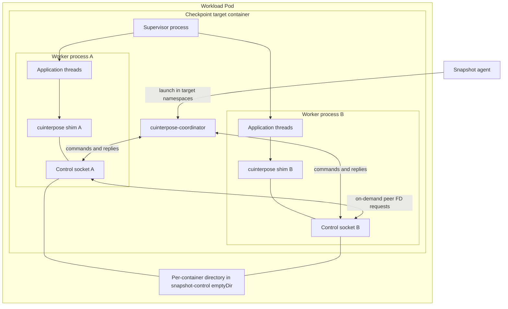
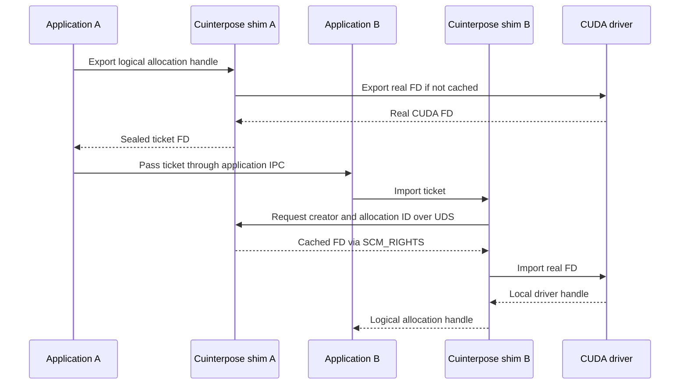
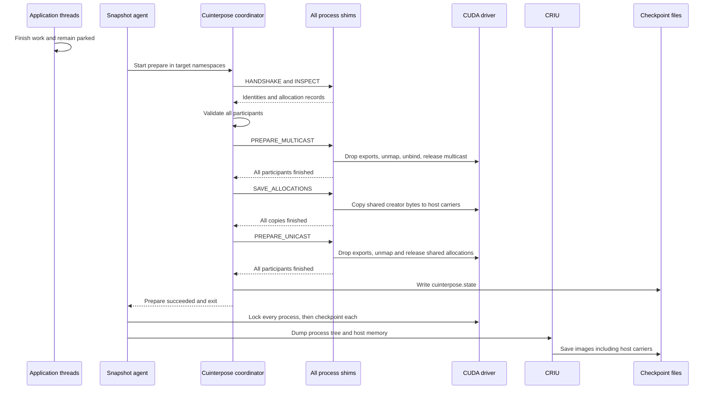
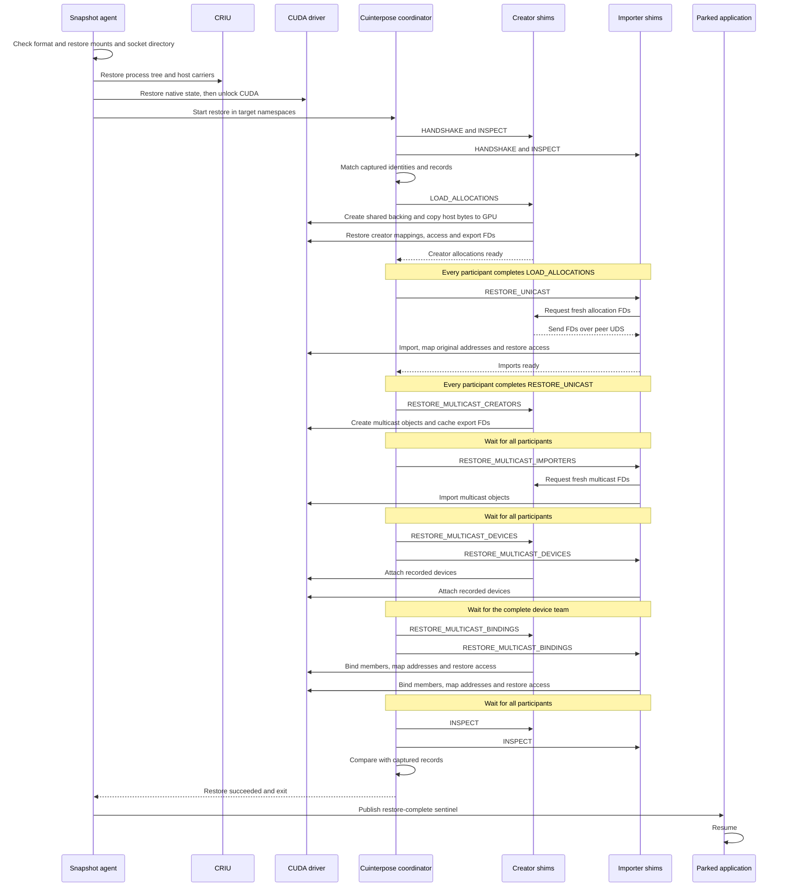

<!--
SPDX-FileCopyrightText: Copyright (c) 2026 NVIDIA CORPORATION & AFFILIATES.
SPDX-License-Identifier: Apache-2.0
-->

# Cuinterpose: checkpoint and restore of shared CUDA memory

Cuinterpose adds support for CUDA memory shared between processes on one node: POSIX-exported virtual memory allocations, supported legacy memory-IPC calls, and multicast objects. After restore, application pointers must still address the same bytes, and processes that shared an allocation must again refer to the same physical allocation.

Saving each process independently is not enough to reconstruct these relationships. A saved CUDA descriptor does not name a fresh allocation on the destination node. Multicast objects also depend on their member allocations and device attachments. Without support for those resources, native checkpoint can refuse the workload; merely restoring independent copies would not restore sharing.

Cuinterpose records the relationships while the application runs. Before native checkpoint, it copies shared allocation bytes to host memory and removes the corresponding CUDA mappings and handles. After native restore, it creates new shared allocations, restores their bytes, and reconnects the processes.

**Host carriers are the shim's only storage implementation.** A host carrier is a buffer inside the creator process containing its shared allocation bytes. CRIU saves that buffer with the process's other host memory. Never-shared allocations remain the native CUDA checkpoint implementation's responsibility. PageBroker and native CustomStorage are separate work: the shim has no PageBroker connection, storage selector, or allocation-session protocol.

## Components



### Cuinterpose shim

The shim is loaded inside each CUDA process, not run as a sidecar. Its C frontend, `libcuinterpose.so`, receives intercepted calls. Its Rust backend, `libcuinterpose_core.so`, owns allocation records, mapping records, cached export descriptors, and host carriers. CUDA calls execute inside the process that owns the CUDA contexts.

Each shim listens on `/snapshot-control/cuinterpose-<namespace-pid>.sock`. The same Unix socket accepts coordinator commands and peer requests for export descriptors. Peer connections are opened when needed; there is no permanent all-to-all connection set.

### Cuinterpose coordinator

The Rust `cuinterpose-coordinator` is a short-lived executable. One instance runs before native capture; another runs after native restore. It reads records from all shims, checks that creators and importers agree, and starts each capture or restore phase. It does not call CUDA or copy allocation bytes.

For each phase, it sends requests to the participants concurrently and waits for every reply before starting the next phase. This matters for multicast calls that need other ranks to make progress.

### Snapshot agent

The agent finds CUDA processes, verifies that shim sockets agree with the workload annotation, and launches the coordinator in the target namespaces. It then sequences native CUDA checkpoint/restore and CRIU. After restore, it releases the application's restore-complete wait only when native CUDA and cuinterpose reconstruction both succeed.

### Host-carrier module

The Rust `host_carrier` module copies shared creator allocations into one host arena per process and copies them back during restore. It registers the arena as pinned host memory, groups allocations by CUDA context, maps a temporary consecutive device-address range, and uses asynchronous copies on one stream per context. It waits for those copies before reporting completion. The temporary device mappings are not application mappings.

## How calls are intercepted

The frontend handles direct CUDA symbol calls, `dlsym`, `cuGetProcAddress*`, and the CUDA runtime's `cudaGetDriverEntryPoint*` queries. A resolver query calls the real resolver first. Only a successful lookup of a supported API is replaced, using the actual returned symbol to choose the correct calling convention.

The frontend obtains glibc's real `dlsym` with `dlvsym(RTLD_NEXT, "dlsym", "GLIBC_2.34")`. On first relevant CUDA activity it loads the adjacent Rust backend with `RTLD_LAZY | RTLD_LOCAL`. This is glibc-based lookup, not a custom ELF loader. The frontend's linker export list exposes only its intended CUDA/resolver functions; `-Bsymbolic-functions` keeps its own internal function references local.

The private C ABI contains `FrontendAbi` and `BackendAbi` tables. Cbindgen generates the table declarations, while NVIDIA's `cuda.h` supplies C CUDA types and cudarc supplies the corresponding Rust definitions. Backend driver calls use the frontend resolver; cudarc's loader and buffer/context wrappers are not used. Rust objects and ownership do not cross the ABI.

Ordinary Rust panics are caught at the backend entry points and converted into CUDA errors. A failed backend stops accepting further CUDA work rather than continuing with possibly inconsistent records. This does not make invalid application pointers, foreign C++ exceptions, or allocator aborts recoverable.

| Intercepted APIs | What the shim does |
| --- | --- |
| `cuInit` | Initializes the shim alongside CUDA. |
| `cuMemCreate`, `cuMemRelease`, `cuMemRetainAllocationHandle` | Tracks supported VMM allocations and translates application-visible logical handles to driver handles. |
| `cuMemMap`, `cuMemUnmap`, `cuMemSetAccess` | Records address ranges, allocation offsets, and access permissions. |
| `cuMemGetAllocationGranularity`, `cuMemGetAllocationPropertiesFromHandle` | Preserves CUDA queries while resolving tracked handles where required. |
| `cuMemExportToShareableHandle`, `cuMemImportFromShareableHandle` | Replaces raw export FDs with tickets and imports the creator's real allocation through a peer request. |
| `cuMemAlloc_v2`, `cuMemFree_v2`, `cuMemGetAddressRange_v2` | Implements synchronous device malloc with VMM backing, frees it, and reports the application's requested range. |
| `cuIpcGetMemHandle`, `cuIpcOpenMemHandle`, `cuIpcOpenMemHandle_v2`, `cuIpcCloseMemHandle` | Implements supported memory IPC using the same VMM records and peer export service, without native memory-IPC calls. |
| `cuMulticastCreate`, `cuMulticastAddDevice`, `cuMulticastBindMem*`, `cuMulticastBindAddr*`, `cuMulticastUnbind`, `cuMulticastGetGranularity` | Tracks multicast objects, device membership, bindings, and their reconstruction. |

Modern proc-address aliases for malloc/free/address-range queries are handled without treating historical 32-bit ELF entry points as modern APIs.

Explicit `dlvsym` calls and CUDA libraries loaded in separate linker namespaces bypass this interception. Arbitrary chains of other `dlsym` interposers are not supported: forwarded `RTLD_NEXT` lookup is relative to this frontend, not the original caller.

## Workload operation before capture

### Identities and allocation ownership

A namespace PID locates a socket. A random 128-bit participant ID identifies the shim process across capture and restore. A separate random allocation ID identifies each tracked allocation or multicast object. A valid `CUINTERPOSE_PARTICIPANT_ID` may supply the participant ID; it must be unique among participants.

The shim returns its participant ID during `HANDSHAKE`. The coordinator uses the captured participant set to verify restored processes. CRIU preserves participant IDs, allocation IDs, mapping records, logical handles, and ticket bytes in process memory.

For example, suppose A creates a 2 MiB allocation and B imports it:

| | Worker A | Worker B |
| --- | --- | --- |
| Namespace PID | `41` | `42` |
| Participant ID | `11111111111111111111111111111111` | `22222222222222222222222222222222` |
| Allocation ID | `aaaaaaaaaaaaaaaaaaaaaaaaaaaaaaaa` | The same ID |
| Role for this allocation | Creator | Importer |
| Application mapping | `0x700000000000` | `0x710000000000` |

The addresses can differ: each process has its own address space. The shared allocation ID says that both mappings refer to the same backing. After restore, those addresses and IDs stay the same, but the driver handles and export FDs are newly created.

An allocation is *exportable* when its creation properties allow a shareable handle. That does not mean it needs a host carrier. It becomes *shared* after a successful tracked export/import or a binding into tracked multicast. Once marked shared, closing a ticket or removing a binding does not change it back to private.

| Allocation state | Who saves and restores its bytes? |
| --- | --- |
| Ordinary nonexportable `cuMemCreate` | Native CUDA. |
| Tracked POSIX-capable allocation never shared | Native CUDA; cuinterpose leaves its driver handles and application mappings intact. |
| Shim-managed malloc never shared | Native CUDA, even though its backing can be exported. |
| Shared creator allocation | The creator shim's host carrier. |
| Imported shared allocation | No second content copy; the importer reconnects to the creator's restored allocation. |
| Tracked allocation used by multicast | The creator's host carrier, even if there was no unicast ticket export. |

Only pinned, device-located, supported exportable creator allocations marked shared enter the host carrier. A shared allocation whose application handles were released but whose mapping remains can recover a temporary driver handle before copying. Never-shared allocations are excluded from that recovery as well as from teardown.

### VMM export and import

For POSIX export, the shim caches a real CUDA export FD and returns a sealed memfd ticket instead. The application passes that FD through its existing communication mechanism. For the allocation above, the ticket contains the `CMVD` prefix followed by this MessagePack value:

```yaml
version: 5
body:
  creator: "11111111111111111111111111111111"
  allocation: "aaaaaaaaaaaaaaaaaaaaaaaaaaaaaaaa"
  endpoint: /snapshot-control/cuinterpose-41.sock
  resource:
    kind: unicast
```

This and the MessagePack examples below are **decoded views written as YAML for readability**, not files consumed by the implementation. IDs are shown as hex strings; the actual encoding uses 16-byte binary values.

On import, B connects to the ticket's endpoint and requests A's cached allocation FD:

```yaml
version: 5
body:
  kind: export
  participant: "11111111111111111111111111111111"
  resource: unicast
  allocation: "aaaaaaaaaaaaaaaaaaaaaaaaaaaaaaaa"
```

Here `participant` identifies the creator that must answer, not the requesting importer. A sends a duplicate of its cached FD using `SCM_RIGHTS`. B calls the real CUDA import and records the resulting local handle. Re-exporting B's import still names A. Neither the ticket nor the request contains a durable CUDA FD number.



A non-ticket POSIX import is allowed during execution but counted as a raw import. Capture refuses while such an import remains live: the shim does not know how to reconnect it.

### Memory IPC adapter

Synchronous `cuMemAlloc_v2` is implemented with POSIX-capable VMM backing from allocation time. The shim rounds the backing size to CUDA's required granularity, reserves and maps a virtual address, and records the requested size separately. It does not move a live native malloc allocation when the application later exports it.

`cuIpcGetMemHandle` returns a ticket inside CUDA's fixed 64-byte handle. Unlike the VMM ticket, this is a fixed-layout value, not MessagePack or an FD. For a malloc-backed allocation with the example's identities, its decoded fields would look like this:

| Field | Bytes | Example value |
| --- | --- | --- |
| `version` | 8 | ASCII `CUIPC001` |
| `creator` | 16 | `11111111111111111111111111111111` |
| `allocation` | 16 | `aaaaaaaaaaaaaaaaaaaaaaaaaaaaaaaa` |
| `pid` | 4 | `41` |
| `reserved` | 4 | All zero |
| `requested` | 8 | `2097152` |
| `extent` | 8 | `2097152` |

The numeric PID and sizes use little-endian encoding. This example assumes the request already meets the device's allocation granularity; otherwise `extent` is larger than `requested`. `cuIpcOpenMemHandle*` derives A's socket path from PID 41, uses the same peer FD service as VMM import, and maps the allocation in B.

Repeated opens in the supported context return the same address and increment a reference count. The final close removes the imported mapping. `cuMemFree_v2` synchronizes the owning context before removing a malloc mapping; a synchronization failure leaves that mapping intact. An imported pointer must be closed, not freed. Foreign native IPC handles are rejected.

The adapter never calls native CUDA memory-IPC functions. It therefore does not need a CUDA checkpoint jobfile to reconstruct this sharing.

### Threads and synchronization

Application CUDA wrappers run on the calling application thread. On shim initialization, two additional threads start in that process:

| Thread | Work |
| --- | --- |
| `cuinterpose-peer` | Accepts socket connections and classifies requests. Handles peer export requests using the descriptor cache without the main allocation-state lock or CUDA calls. |
| `cuinterpose-control` | Processes handshake, inspection, and lifecycle commands one at a time. It enters the recorded CUDA context when a lifecycle operation needs driver calls. |

The peer thread queues control commands; it does not wait for their CUDA operations. A bounded queue refuses excess control requests. This separation lets an importer obtain an FD even while the creator's control thread is busy reconstructing another object.

Allocation and mapping changes normally hold the shim's state mutex. Multicast calls that can block waiting for other devices release that mutex around the driver call, then recheck the object and phase before recording success. Export-cache users hold a descriptor lease; teardown waits for those users before closing cached descriptors.

These simplified paths show the main actions, not error cleanup:

```text
malloc(size):
    create supported VMM backing and a logical handle
    reserve and map a virtual address in the current context
    record requested size, backing size, context and mapping
    return the virtual address

export(allocation):
    lock allocation state
    create and cache a real export FD if needed
    create the application ticket and mark successful sharing
    unlock allocation state
    return the ticket

import(ticket):
    lock allocation state
    resolve the original creator and allocation
    request its cached FD through the peer socket
    import the FD, or reuse an existing local allocation record
    record the logical handle and successful sharing
    unlock allocation state
    return the logical handle, or map an address for memory IPC
```

Fork handlers lock metadata, close inherited shim descriptors in the child, and discard its inherited CUDA records. The child's next CUDA activity creates a new identity and listener. This does not make arbitrary CUDA use after a multithreaded fork safe; CUDA and shim activity must be quiescent at fork. Prefer spawn/exec.

## Capture

The application must first stop submitting work, finish outstanding GPU work, and arrange to stay parked through restore. The coordinator does not pause application threads. In particular, **shim preparation runs before native CUDA lock** because saving and removing shared allocations requires working CUDA calls.

The agent requires valid shim sockets for every discovered CUDA process in an opted-in workload. It starts the coordinator, which handshakes, inspects all records, and checks creators, ranges, access permissions, and complete multicast groups before changing driver state.



Each arrow to “All process shims” means concurrent requests followed by a wait for every participant. The diagram combines those requests to keep the ordering readable.

Capture removes the outer objects before their dependencies:

1. `PREPARE_MULTICAST` removes multicast exports, mappings, bindings, and handles.
2. `SAVE_ALLOCATIONS` saves the shared creator bytes while unicast allocations still exist.
3. `PREPARE_UNICAST` drains peer export requests, removes shared mappings, and releases shared driver handles.

Logical handles, mapping records, ticket identities, and carrier addresses remain in CPU memory for CRIU. Private allocations remain native CUDA state. If a destructive phase or later checkpoint step fails, the source must be terminated rather than resumed with sharing removed.

For the 2 MiB example, `SAVE_ALLOCATIONS` copies A's allocation into A's host arena. B saves no second copy. CRIU captures that arena as process memory; there is no separate `aaaaaaaa….bin` file. If A also has a never-shared allocation, that allocation stays on the native CUDA path instead of entering the arena.

## Restore

Before CRIU, the agent restores the tool paths and control directory, removes stale shim socket names, and validates the artifact format. CRIU recreates the process tree, namespace PIDs, shim records, and host carriers. Native CUDA restore reconstructs private memory and process state, then unlocks CUDA so the shims can make driver calls. The application remains parked until all shim reconstruction succeeds.



The creator/importer labels describe roles, not disjoint sets of processes: one process can own one allocation and import another. Every participant receives every lifecycle operation, even when it has no work in that operation.

`LOAD_ALLOCATIONS` creates new backing, copies host-carrier bytes back, restores creator mappings and permissions, and makes new export FDs available. After sending its successful LOAD reply, the shim releases the carrier arena. `RESTORE_UNICAST` reconnects importers to those new allocations at their original virtual addresses. Neither operation recreates never-shared allocations.

`RESTORE_MULTICAST` consists of four ordered wire operations:

| Operation | Work | Why wait before continuing? |
| --- | --- | --- |
| `RESTORE_MULTICAST_CREATORS` | Recreate objects from their recorded properties and publish export FDs. | Importers need the new creator FDs. |
| `RESTORE_MULTICAST_IMPORTERS` | Obtain those FDs and import the objects. | All participants need local handles before starting device attachment. |
| `RESTORE_MULTICAST_DEVICES` | Replay device attachments. | Bind operations can wait for the whole device team. |
| `RESTORE_MULTICAST_BINDINGS` | Replay `BindMem`/`BindAddr`, map the original addresses, and restore permissions. | The application must not resume with incomplete mappings. |

Capture and restore reverse the dependency order, not the number of messages. Capture can remove each process's existing multicast references in one operation. Restore needs creator-to-importer handoffs and whole-team device attachment before binding.

## Checkpoint files and compatibility

`cuinterpose.state` is a **binary, versioned MessagePack file**. Here is a shortened decoded view for the two-worker example. Allocation-property and handle-count fields are omitted; the names and nesting shown are the actual serialized fields:

```yaml
version: 5
body:
  - id: "11111111111111111111111111111111"
    records:
      - allocation:
          id: "aaaaaaaaaaaaaaaaaaaaaaaaaaaaaaaa"
          creator: true
          content: true
          size: 2097152
      - mapping:
          id: "aaaaaaaaaaaaaaaaaaaaaaaaaaaaaaaa"
          creator: true
          address: 0x700000000000
          size: 2097152
          offset: 0
          access:
            - {location_type: 1, location_id: 0, flags: 3}
  - id: "22222222222222222222222222222222"
    records:
      - allocation:
          id: "aaaaaaaaaaaaaaaaaaaaaaaaaaaaaaaa"
          creator: false
          content: false
          size: 2097152
      - mapping:
          id: "aaaaaaaaaaaaaaaaaaaaaaaaaaaaaaaa"
          creator: false
          address: 0x710000000000
          size: 2097152
          offset: 0
          access:
            - {location_type: 1, location_id: 1, flags: 3}
```

The outer `id` identifies the process; each record's `id` identifies the allocation. `content: true` means A owns the content copy, not that bytes appear in this file. `offset: 0` maps from the start of the allocation. In the access entries, location type `1` means a CUDA device and flags `3` mean read/write: A grants GPU 0 access, and B grants GPU 1 access. Addresses are shown in hex for readability; they are encoded as integers.

Multicast adds records to the same participant list. For example, this complete `multicast_binding` record says that GPU 0 binds the first 2 MiB of allocation `aaaaaaaa…` into the start of multicast object `bbbbbbbb…` using `BindMem`'s v1 ABI:

```yaml
multicast_binding:
  id: "bbbbbbbbbbbbbbbbbbbbbbbbbbbbbbbb"
  source:
    memory:
      allocation: "aaaaaaaaaaaaaaaaaaaaaaaaaaaaaaaa"
      offset: 0
  size: 2097152
  offset: 0
  flags: 0
  version: v1
  device: 0
```

The member offset is nested under `source`; the outer offset is into the multicast object. Separate `multicast`, `multicast_device`, and `multicast_mapping` records describe the object, attached devices, and virtual mappings. This binding alone is not a complete multicast checkpoint.

The coordinator sorts participants and records and publishes the state through a temporary file, file `fsync`, atomic rename, and directory `fsync`. On restore it checks the participant IDs, rebuilds sharing, then compares a fresh inspection against these records. Allocation bytes come from CRIU's host-carrier images, not this file.

The corresponding section of `manifest.yaml` is ordinary YAML:

```yaml
cuinterpose:
  requested: true
  prepared: true
  format: 1
```

`requested` records workload opt-in; `prepared` records successful coordinator preparation and state publication. `format: 1` identifies the agent's artifact contract, distinct from the MessagePack envelope's `version: 5`. A prepared checkpoint must also have CUDA process metadata and readable cuinterpose state. Missing or different formats and old `cuda-checkpoint-job` artifacts are rejected before CRIU.

The private frontend/backend ABI is version **7**. The MessagePack protocol and state envelope are version **5**. The inline memory-IPC ticket has its own fixed-size version marker. Older draft artifacts, including shim PageBroker artifacts, are not migrated or silently interpreted as host-carrier checkpoints.

The shim libraries themselves are part of the checkpointed process. Their files must be available at the original paths, and the coordinator must understand their protocol. Ship a matching frontend, backend, and coordinator set; the format checks are not permission to substitute arbitrary library builds.

## Installation, namespaces, and limits

A workload opts in with:

```yaml
metadata:
  annotations:
    nvidia.com/cuinterpose: enabled
```

Snapshot mounts `cuda-checkpoint`, `libcuinterpose.so`, and `libcuinterpose_core.so` at fixed paths under `/tmp/snapshot-cuda` in every checkpoint target. The annotation only adds the shim first in `LD_PRELOAD`. It does not replace the workload command. There is no `--launch-job` wrapper, jobfile staging, or GPU-count-based wrapping decision.

The coordinator joins the target's mount, UTS, IPC, network, and PID namespaces. It does not join the target's user or cgroup namespace. The agent opens trusted executable, namespace, and checkpoint-directory descriptors before entering the target, rather than looking up the coordinator binary through the workload's filesystem.

The control volume is a Pod-local `emptyDir`, with a separate `subPath` for each target container. Source and restore checks reserve the volume name, path, and environment settings. Socket files have mode `0600` and are not network listeners. An ordinary process in another Pod cannot reach them through its mounts. Processes intentionally given the same directory and filesystem credentials can; the workload container is not isolated from its own processes. Node root and privileged agents remain trusted.

Host-memory capacity must cover approximately one copy of each creator's shared bytes, plus bookkeeping and temporary mappings. CUDA rounds allocations to its required granularity, so backing size can exceed requested malloc size. Host carriers use pinned memory during copying and increase CRIU image size. Importers do not save another content copy.

The implementation targets Linux/amd64 and glibc 2.34 or newer for the preload libraries. The coordinator is statically linked with musl. CUDA entry points are resolved at runtime; the driver and GPUs must support the VMM and multicast APIs used by the workload. Snapshot's existing privilege, CRIU, device, and source/destination compatibility requirements still apply.

Supported memory IPC requires fully interposed peers and the documented single owning-context behavior. Event IPC, memory-pool IPC, managed/async/pitched allocation families, historical 32-bit allocation entry points, and general cross-context peer-access emulation are not supported by this adapter. Removing jobfile support does not make unannotated native-IPC workloads checkpointable.

Exactly POSIX-FD exportable VMM is tracked. A successful unsupported exportable creation, including FABRIC or a mixed handle type, is remembered and makes capture inspection fail before destructive preparation. Live raw VMM imports, incomplete multicast groups, unknown access permissions, missing participants, and failed copies also stop capture or restore rather than produce an apparently usable checkpoint.
