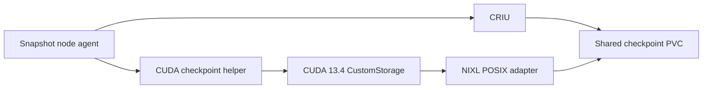

# Configure CUDA CustomStorage with NIXL POSIX

CUDA CustomStorage externalizes CUDA checkpoint state into Snapshot-managed files instead of relying on the CUDA driver's default checkpoint storage. Snapshot's `posix` mode moves those CUDA extents through its local NIXL POSIX adapter into the same checkpoint volume that stores the CRIU and root filesystem artifacts. CRIU remains the process-state checkpoint and restore engine in both storage modes; NIXL does not replace CRIU.



CustomStorage is configured for the Snapshot node agents through Helm. It is not a workload flag, pod annotation, or `PodSnapshot` field.

> [!IMPORTANT]
> CustomStorage is an explicit opt-in for new checkpoints. The default remains `legacy`. Enable `posix` only on a release that includes the CustomStorage helper and NIXL POSIX adapter. CUDA 13.4 is currently a Developer Preview; follow the upstream release restrictions for preview software.

## Prerequisites

In addition to Snapshot's normal [prerequisites](../../README.md#prerequisites), `posix` mode requires:

- A Linux NVIDIA driver that exports the CUDA 13.4 CustomStorage driver API, including `cuCheckpointOperationComplete`. CUDA 13.x minor-version compatibility alone does not make a new CUDA 13.4 API available. The CUDA 13.4 developer-preview release notes do not publish a numeric Linux driver floor for new 13.4 features, so the helper checks the capability at runtime. Use that result rather than only the installed toolkit or driver branch as the admission test. See the [CUDA 13.4 release notes](https://docs.nvidia.com/cuda/developer-preview/13.4/cuda-toolkit-release-notes/index.html#driver-compatibility).
- A Snapshot agent image built with the NIXL POSIX transfer adapter. A transfer-neutral helper build does not support `posix` mode.
- A shared RWX checkpoint PVC with enough capacity for the CRIU, root filesystem, and CUDA extent artifacts. Plan for approximately the checkpointed CUDA allocation bytes in addition to the existing process artifacts and temporary staging space.
- A one-GPU workload. The initial `posix` implementation supports one or more CUDA-owning processes on one GPU. Snapshot rejects multi-GPU CustomStorage checkpoint creation before locking a target.

The Snapshot agent image may be built against CUDA 13.0 headers because the helper dynamically resolves the public CUDA 13.4 entry point. The node driver, not the image's toolkit version, determines whether CustomStorage is available at runtime.

## Select the CustomStorage path

Set `config.cudaCheckpoint.storageMode` to `posix` in the Helm values used for the Snapshot release:

```yaml
config:
  cudaCheckpoint:
    storageMode: posix
```

Apply the values to the existing release:

```bash
helm upgrade snapshot oci://ghcr.io/ai-dynamo/snapshot/snapshot \
  --version <VERSION> \
  --namespace snapshot \
  --reuse-values \
  --values custom-storage-values.yaml
```

Wait for every node agent to use the new configuration before creating a `posix` checkpoint:

```bash
kubectl rollout status daemonset/snapshot-agent -n snapshot
```

The setting applies to every new CUDA checkpoint created by that agent deployment. There is no per-workload override in the initial release.

## Configuration values

| Value | Meaning | Default | Valid values |
|---|---|---:|---|
| `config.cudaCheckpoint.storageMode` | CUDA checkpoint storage mode for newly created checkpoints | `legacy` | `legacy`, `posix` |
| `config.cudaCheckpoint.transferBufferCount` | Pinned transfer slots per active CUDA device; this controls pipeline depth, not the number of worker threads | `4` | `1`-`8` |
| `config.cudaCheckpoint.transferChunkBytes` | Bytes in each pinned transfer slot | `67108864` (64 MiB) | 1-256 MiB, 4096-byte aligned |
| `config.cudaCheckpoint.daemon.maxOperationSeconds` | Maximum time allowed for one CUDA checkpoint or restore helper request; a CUDA driver call already in progress cannot be forcibly interrupted | `3600` | `1`-`3600` |
| `config.cudaCheckpoint.daemon.resources` | CPU and memory requests and limits for the helper container | See `values.yaml` | Kubernetes resource values |

Snapshot rejects a transfer configuration that allocates more than 1 GiB of pinned host memory per active CUDA device. The pinned allocation is:

```text
transferBufferCount * transferChunkBytes * active CUDA devices
```

The qualified initial configuration uses four 64 MiB buffers, or 256 MiB of pinned host memory for the supported one-GPU operation. The helper memory limit must also leave room for CUDA, NIXL, and process overhead. Increase it if you increase the buffer allocation.

`maxOperationSeconds` bounds one helper checkpoint or restore request through cooperative deadline checks. A CUDA driver call already in progress cannot be forcibly interrupted. Snapshot's general `config.restore.restoreTimeoutSeconds` setting must still leave enough time for CRIU, every CUDA-owning process, and the helper's response margin.

## Checkpoint and restore behavior

For a new checkpoint, Snapshot validates the one-GPU topology and the helper's CustomStorage capability before it locks or changes the CUDA target. `posix` is fail-closed: Snapshot does not silently fall back to `legacy` after an operator explicitly enables CustomStorage.

Snapshot records the selected CUDA storage mode in the checkpoint manifest. Restore always follows that manifest rather than the current Helm creation policy:

- A `legacy` checkpoint restores through the legacy driver-managed path, even when new checkpoint creation is configured for `posix`.
- A `posix` checkpoint requires a CustomStorage-capable helper during every restore, even if new checkpoint creation has since been changed back to `legacy`.
- Checkpoints created before the manifest recorded a storage mode are treated as `legacy` for compatibility.

During restore, Snapshot starts reading the CUDA extent files into the node page cache while CRIU restores the process. After the restored CUDA-owning PIDs are known, the helper performs the authoritative transfer into CUDA-registered host buffers and completes the CUDA restore operation.

## Verify the rollout

Check the helper startup event on each node-agent pod:

```bash
kubectl logs -n snapshot \
  -l app.kubernetes.io/instance=snapshot,app.kubernetes.io/component=snapshot-agent \
  -c cuda-checkpoint-helper --prefix=true --tail=-1 --max-log-requests=100 \
  | grep cuda_checkpoint_daemon_ready
```

A node that can create and restore `posix` artifacts reports all three capabilities as `true`:

```text
"custom_storage_driver_api_available":true
"custom_storage_transfer_backend_available":true
"custom_storage_available":true
```

After creating a checkpoint, check the agent log for the selected mode:

```bash
kubectl logs -n snapshot \
  -l app.kubernetes.io/instance=snapshot,app.kubernetes.io/component=snapshot-agent \
  -c agent --prefix=true --tail=-1 --max-log-requests=100 \
  | grep 'CUDA CustomStorage explicitly enabled'
```

The log entry includes `cuda_storage_mode=posix`. A successful transfer also emits a `cuda_custom_storage_transfer` event with its byte count, duration, pinned-memory allocation, and phase timings.

Run a complete checkpoint, restore, readiness, and inference smoke test before a wider rollout. Helper health proves capability, not workload correctness.

## Return new checkpoints to legacy mode

Set the creation policy back to `legacy` and roll out the agents:

```bash
helm upgrade snapshot oci://ghcr.io/ai-dynamo/snapshot/snapshot \
  --version <VERSION> \
  --namespace snapshot \
  --reuse-values \
  --set config.cudaCheckpoint.storageMode=legacy

kubectl rollout status daemonset/snapshot-agent -n snapshot
```

This affects only new checkpoints. Keep CustomStorage-capable agents available for as long as any retained `posix` checkpoint may be restored.

## Current limitations

- `posix` checkpoint creation is qualified only for one GPU. A container may have more than one CUDA-owning process on that GPU.
- The NIXL POSIX adapter uses the Snapshot checkpoint PVC. PageBroker and other external data planes are separate integrations.
- Only one CUDA checkpoint or restore sequence runs at a time within one Snapshot agent. Multiple Snapshot agent DaemonSets on the same node are not coordinated and are unsupported.
- An interrupted or timed-out CUDA driver call can leave the target outcome unknown. Snapshot does not automatically replay an operation that may have reached the driver.

See [Troubleshooting](../operations/troubleshooting.md#cuda-customstorage) for common validation and runtime errors.
