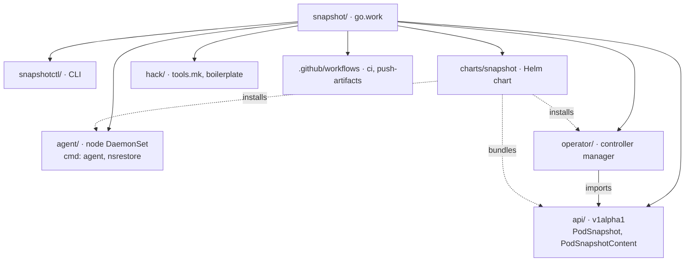

# Repository layout

Each directory under the root is its own Go module, coordinated by `go.work`. `operator` is
the only module that imports `api`; `agent` and `snapshotctl` are standalone. The Helm chart
deploys the operator and agent and ships the CRDs generated from `api`.
