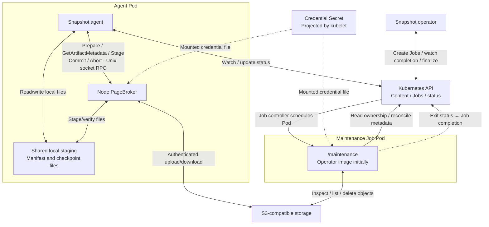

<!--
SPDX-FileCopyrightText: Copyright (c) 2026 NVIDIA CORPORATION & AFFILIATES. All rights reserved.
SPDX-License-Identifier: Apache-2.0
-->

# SNEP-1: S3 checkpoint storage — compact design

**Status:** Draft; proposed APIs and behavior.

<!-- toc -->
- [Summary](#summary)
- [Motivation](#motivation)
  - [Goals](#goals)
  - [Non-Goals](#non-goals)
- [Proposal](#proposal)
  - [Limitations, Risks, and Mitigations](#limitations-risks-and-mitigations)
- [Design Details](#design-details)
  - [API](#api)
    - [Kubernetes API and operator](#kubernetes-api-and-operator)
    - [Maintenance Jobs](#maintenance-jobs)
    - [Snapshot agent](#snapshot-agent)
    - [PageBroker: internal API](#pagebroker-internal-api)
  - [Security](#security)
  - [Configuration](#configuration)
  - [Storage and lifecycle](#storage-and-lifecycle)
    - [Publication and artifact format](#publication-and-artifact-format)
    - [Communication and flows](#communication-and-flows)
  - [Performance and Scalability](#performance-and-scalability)
  - [Monitoring](#monitoring)
  - [Dependencies](#dependencies)
  - [Test Plan](#test-plan)
  - [Graduation Criteria](#graduation-criteria)
- [Alternatives](#alternatives)
<!-- /toc -->

## Summary

Allow Snapshot to save checkpoint artifacts to S3 and restore workloads from them.
PVC remains the default. Stage 1 uses one store per installation, selected at
Helm install/upgrade.

## Motivation

S3 provides checkpoint storage without a shared checkpoint PVC. It is the first
additional backend; stable artifact references and separate backend adapters let
future stores be added with minimal changes to workload APIs.

### Goals

- Add S3 checkpoint/restore through PageBroker and cleanup through maintenance.
- Use the same maintenance Job model for PVC, S3 and future backends.
- Preserve artifact identity and verify publication, restore and deletion across
  retries, restarts and storage configuration changes.
- Keep storage credentials outside workload APIs and the agent/operator processes.

### Non-Goals

- Storage classes, simultaneous stores, automatic fallback or artifact migration.
- Direct streaming, new feature-discovery APIs or workload-identity implementation.
- Moving CRIU/process orchestration into PageBroker or redesigning CUDA execution.

## Proposal

PageBroker already handles checkpoint/restore through local staging; this design
adds its S3 backend. Content is bound to its store before capture and becomes
Ready only after confirmed publication. Restore validates compatibility and stages
the complete bundle before CRIU/CUDA execution.

The operator dispatches maintenance Jobs for content deletion, scheduled sweeps
and metadata recovery. Jobs access PVC or S3 through their own backend adapters.

### Limitations, Risks, and Mitigations

- **Changed store:** reject mismatched bindings before storage I/O or workload
  mutation. Drain work before switching; old artifacts require their original store.
- **Credentials or S3 outage:** check destination access before capture and source
  access before restore; bound retries/timeouts. Preflight cannot guarantee later
  access. Access denial never proves that an artifact is missing.
- **Uncertain publication:** publish the index last; retry lost Commit replies with
  the same transaction. After restart, recover metadata through maintenance. Resume
  uploads only from complete staging; never replay successful or uncertain CUDA/CRIU.
- **Cleanup races:** retain finalizers on failed, partial or unknown deletion.
  Coordinate readers/publishers with maintenance and fence stale writers. Job
  success must mean complete scoped cleanup.
- **Metadata loss:** back up Kubernetes content metadata separately. During ownership
  recovery, pause capture, restore and orphan deletion across restarts until
  administrator resume.
- **Resource pressure:** full staging and per-operation Pods add memory, latency
  and scheduling costs. Bound staging, transfers, Job concurrency and sweep batches.

## Design Details

### API

#### Kubernetes API and operator

Extend the existing `PodSnapshotContent`; proposed fields below are additions only:

```yaml
spec:
  storage:                               # Store binding fixed before capture
    storeID: store-v1-<digest>            # Prevent access through another configured store
status:
  storage:                               # Results confirmed by checkpoint Commit
    artifacts:                           # One descriptor per captured container
      - containerName: main              # Associate the publication with its container
        artifactHandle: <opaque-handle>   # Locate the publication inside its bound store
        artifactFormatVersion: snapshot.pagebroker/v1  # Select that backend's reader
```

The operator sets `spec.storage.storeID`. Compute it as
`store-v1-` + SHA-256 of a canonical storage identity: backend, endpoint/bucket/prefix
for S3; backend, namespace/claim/base path for PVC. Credentials and access options
are excluded. Operator, PageBroker and maintenance must produce identical digests.

`PodSnapshot` and `SnapshotJob` retain their current workload request APIs. Later
storage-class selection can bind the same content fields without changing restore
references. Legacy content without a binding is accepted only in PVC mode.

#### Maintenance Jobs

The operator owns scheduling and retention. Built-in `batch/v1` Jobs run
independently of the capture node, one per deleting content or scheduled sweep.

- **Packaging:** `operator/maintenance/main.go` builds `/maintenance` into the
  operator image. Job Pods use that image/version with `command: ["/maintenance"]`.
  A dedicated maintenance image can replace it later without changing Job semantics.
- **Implementation:** `operator/internal/maintenance/` owns a common cleanup
  workflow and backend implementations for PVC, then S3 and future stores. They
  access storage directly; maintenance does not call PageBroker.
- **Inputs:** mode (`delete-content`, `sweep` or `recover-metadata`), expected store ID and configuration;
  deletion also names the content and its UID. These identify authorized scope,
  not an arbitrary path. Each deletion includes every container and unfinished attempt.
- **Results:** deletion exits successfully only after confirmed cleanup; operator
  observes Job `Complete` before removing the finalizer. Denied, partial or unknown
  cleanup keeps it. A sweep processes bounded batches after fresh ownership checks.
- **Recovery:** an inspection-only maintenance run may repair missing publication
  descriptors in content status using optimistic updates. Preserve terminal failure
  and reject conflicting results; readiness requires all required publications.
- **Job lifecycle:** use stable operation identity and validate owned Job inputs/UID
  before adoption. Jobs may retry or duplicate execution: cleanup must be idempotent
  and coordinated with active readers/publishers. Bound concurrency; avoid overlapping
  scheduled runs. Retain Job evidence until the operator consumes the result, then
  enable TTL cleanup. Missing or failed Jobs never imply successful storage deletion.

Maintenance and PageBroker share the store-ID, artifact format and durable
publication/read/delete coordination contracts, with Go/C++ compatibility fixtures.
PVC paths and manifests stay unchanged; its cleanup execution moves into Jobs.

#### Snapshot agent

- Pass logical artifact identity and the expected store to checkpoint preparation.
- Persist committed descriptors in content status; set Ready only after all required
  containers have confirmed publications. The operator projects content readiness.
- Obtain S3 metadata through `GetArtifactMetadata`, then run existing Snapshot
  compatibility checks. Storage checks remain mandatory when compatibility is bypassed.
- Read `manifest_directory` through the volume shared with node PageBroker.
  Close each inspection transaction with `Abort` on every exit, including requeues.
- Restore from verified staging; finish CRIU/CUDA consumers and unmount before cleanup.

Extend the concrete Go `pagebroker.Client` used by the agent. Snapshot retains
Kubernetes authorization, CRIU, canonical manifest creation and process orchestration.

#### PageBroker: internal API

Extend [pagebroker.proto](../../../agent/pagebroker/v1/pagebroker.proto), using the
existing local Unix socket. These are proposed additions; wire numbers must be
reconciled with the separate CUDA integration. Only new fields are shown.

```protobuf
// Identity before an artifact has been published.
message ArtifactIdentity {
  string artifact_uid = 1;      // Owning PodSnapshotContent UID.
  string container_name = 2;    // Captured container within that content.
}

// Binds a logical artifact to its store before a publication handle is known.
message ArtifactTarget {
  string store_id = 1;           // Require the configured destination store.
  ArtifactIdentity artifact = 2; // Logical checkpoint destination.
}

// Confirmed publication, persisted by Snapshot for later operations.
message PublishedArtifact {
  string store_id = 1;                 // Require the original configured store.
  string artifact_handle = 2;          // Opaque locator within that store.
  string artifact_format_version = 3;  // Backend reader version, not CRIU version.
}

message PrepareStagedCheckpointRequest {
  ArtifactTarget target = 3; // Logical destination instead of a caller's path.
}

message StagedRestoreRequest {
  PublishedArtifact artifact = 3; // Exact committed source to download and verify.
}

message CommitComplete {
  PublishedArtifact published_artifact = 1; // Checkpoint result; absent for restore Commit.
}

message GetArtifactMetadataRequest {
  PublishedArtifact artifact = 1; // Exact committed publication whose metadata is needed.
}

// Success result; errors use the existing Failure message.
message GetArtifactMetadataComplete {
  string manifest_directory = 1; // Shared local directory with verified manifest.yaml.
}
```

PageBroker resolves the backend from configuration. Reject conflicting artifact
and legacy filesystem selectors; retain existing wire numbers and legacy PVC reads.

**One new operation**, `GetArtifactMetadata`, extends `Request.command` /
`Response.result`. Its logical signature is:

```text
GetArtifactMetadata(
  request_id: string,       // Existing envelope: correlate the reply.
  transaction_id: string,   // Existing envelope: own the temporary metadata directory.
  artifact: PublishedArtifact
) -> GetArtifactMetadataComplete | Failure
```

PageBroker verifies the store binding, committed publication, supported format,
metadata access and integrity, then returns a temporary local directory containing
`manifest.yaml` for the exact requested publication. A mismatch returns `Failure`;
PageBroker never substitutes another publication. Snapshot decides how to use this
metadata; restore compatibility checks are one caller flow. Full payload verification
belongs to `StagedRestore`.

The directory remains valid until the transaction is closed with `Abort` or expires.
The caller releases it after reading, on every exit path. Cleanup removes temporary
metadata, never the publication. Checkpoint publication recovery belongs to the
maintenance `recover-metadata` Job.

Artifact deletion and orphan listing belong to maintenance backends, not the
PageBroker RPC. PageBroker still releases its own transaction resources through
`Abort` and restore `Commit`; these never delete retained checkpoints.

Extend `Failure.code` with `STORE_MISMATCH`, `ACCESS_DENIED`, `STORAGE_UNAVAILABLE`,
`ARTIFACT_NOT_FOUND`, `ARTIFACT_CORRUPT`, `UNSUPPORTED_ARTIFACT` and `OUTCOME_UNKNOWN`.
An access error never proves absence. Use existing conditions with storage-specific
reasons. Keep errors bounded and credential-free.

Reuse request/transaction IDs and the 64 KiB message limit. Bound transfers through
broker timeouts and SDK retries. Extend `Abort` to stop transfers before cleanup;
it cannot undo committed data or CUDA/CRIU. Restore `Commit` cleans local staging.

### Security

Helm values contain Secret references only. Kubelet mounts the selected credential
file into node PageBroker and S3 maintenance containers. The agent and operator
manager receive no credential file; workload requests and RPCs carry references.

An external manager or administrator rotates the Secret. PageBroker reloads the
projected file without restart; long-running Jobs must tolerate updates. Use a
projection that supports updates, without a fixed `subPath`. Storage clients do
not need Kubernetes Secret-read permissions.

Use verified TLS and an optional custom CA. Scope storage permissions to the
configured store, restrict local sockets/staging, and exclude secrets from logs
and status. Maintenance checks UID, store binding and fresh ownership before
deletion; protect against arbitrary paths and symlinks. Give Jobs only the
Kubernetes permissions needed for ownership checks and metadata repair, without
GPU or host-process access.

### Configuration

PVC remains the default. For S3, add these Helm install/upgrade values:

```yaml
storage:
  type: s3
  s3:
    bucket: checkpoint-bucket
    prefix: snapshots
    region: us-east-1
    endpoint: ""                 # Default endpoint; HTTPS override for other providers
    auth:
      mode: secret              # Stage 1; workloadIdentity may be added later
      credentialsSecretRef:
        name: snapshot-s3-credentials
        key: credentials
    tls:
      caBundleConfigMapRef: ""   # Optional custom CA
```

- Render non-secret settings into the existing configuration ConfigMap.
- In S3 mode, omit checkpoint PVC mounts; preserve node staging. In PVC mode,
  maintenance Jobs mount the shared claim; the operator manager no longer needs it.
- Give the operator permission to create/watch maintenance Jobs. Configure their
  image, service account, mounts, resources, bounded retries and execution deadline.
- Match Snapshot/PageBroker image versions. PageBroker reads mounted configuration
  and has no Kubernetes client.

### Storage and lifecycle

#### Publication and artifact format

Store the existing per-container bundle under
`<store-prefix>/artifacts/<artifactUID>/containers/<name>/`; the store prefix includes
the configured prefix and installation/store identifiers. Upload immutable payloads,
then publish the index last. The index binds store/content/container and format
version, and lists file/directory paths, permissions, sizes and file SHA-256 digests.
Reject unsafe paths, unsupported formats, missing files and checksum mismatches.

Example publication descriptors; digest values are placeholders:

```protobuf
// PVC
store_id: "store-v1-<pvc-digest>"
artifact_handle: "artifacts/<artifactUID>/containers/main"
artifact_format_version: "snapshot.pagebroker/v1"
```

```protobuf
// S3
store_id: "store-v1-<s3-digest>"
artifact_handle: "artifacts/<artifactUID>/containers/main/publications/p-01/index.json"
artifact_format_version: "snapshot.pagebroker/v1"
```

Reader selection uses **backend + version**. PVC keeps its directory representation;
S3 reconstructs the same logical bundle from index-listed objects at
`<publication>/data/<relative-file-path>`. CRIU/CUDA retain their producer formats.

#### Communication and flows



**Checkpoint:** agent → prepare/validate destination → CUDA then CRIU/filesystem
capture into staging → PageBroker Commit/upload/publication → agent persists Ready.

**Restore:** agent → GetArtifactMetadata → Snapshot compatibility gates → StagedRestore
downloads/verifies the full bundle → CRIU/CUDA restore → unmount → Commit cleanup.
The later executor compatibility gate still runs before process restore.

**Cleanup:** operator → Kubernetes Job → maintenance backend → storage. Confirmed
deletion allows finalizer removal; scheduled Jobs scan for eligible orphans.

**Recovery:** operator → `recover-metadata` Job → locate confirmed publication by
store/content/container → repair missing descriptors without deleting data.

After all restore consumers finish, unmount staging before Commit cleanup.
Once fully staged, restore needs no further S3 reads. Keep cleanup failures
separate from process success; never rerun a restore to retry cleanup.

### Performance and Scalability

Bound transfers separately from CUDA admission. Size memory-backed staging against
both containers' limits; reject insufficient capacity before capture. Cap active
Jobs and sweep batches. Measure throughput, peak memory and latency before setting
defaults.

### Monitoring

Use existing conditions with storage-specific reasons and rate-limited updates.
Measure phase duration, transfer bytes/retries, credential failures, staging
pressure and cleanup backlog. Correlate logs with content, transaction and Job;
report cleanup separately and preserve historical success.

### Dependencies

- Always-running PageBroker, shared local staging and its separate image.
- Separate CUDA CustomStorage integration and existing Snapshot compatibility checks.
- S3-compatible service plus C++ PageBroker and Go maintenance SDKs/adapters.
- Shared store-ID, artifact-format and publication/read/delete contracts.

Before coding, finalize the credentials-file format and SDKs, canonical store-ID
encoding, protobuf tags, durable publication/deletion coordination, recovery-mode
control and numeric resource/time limits. Build PVC maintenance before adding S3.

### Test Plan

Tracking and test issues are not yet assigned. Cover unit/configuration checks,
backend integration with a disposable S3-compatible service, and GPU end-to-end tests.

- **API/configuration:** immutable store bindings, unique container descriptors,
  identical Go/C++ store-ID results, credential rotation/restart stability and legacy PVC.
- **Helm/security:** S3 installation without checkpoint PVC; credentials only in
  PageBroker/maintenance; matching images, dedicated Job RBAC and Jobs without GPU/host mounts.
- **PVC-first maintenance:** per-content deletion and scheduled Jobs using the
  operator image; legacy layout, UID checks, symlink refusal and finalizer completion.
- **Job lifecycle:** duplicate reconciles/Pods, operator restart, Job failure/deadline,
  result retention before TTL, same-name foreign Jobs and overlapping scheduled runs.
- **Storage/RPC:** disposable S3-compatible service; upload/index publication,
  format/path/digest rejection, bounded messages, maintenance pagination, Abort and inspection expiry.
- **Failure/recovery:** invalid credentials before capture, outage during transfer,
  lost replies/restarts, descriptor repair conflicts and no CUDA/CRIU replay.
- **Lifecycle/concurrency:** inspection cleanup on success/refusal/requeue/cancellation;
  delete during downloads, stale publishers, incomplete attempts and capture-node loss.
- **End to end:** cross-node capture/restore/delete; recovered workload state and
  inference; restore after S3 loss following staging; PVC↔S3-A↔S3-B mismatch refusal.
- **Operations:** Secret rotation, denied decryption/deletion, supported provider
  versioning/retention, metadata recovery pause/restart/resume and PVC cleanup parity.

Qualify the real CUDA path, multi-rank and partial-destination failures, and vLLM,
SGLang and TensorRT-LLM workloads. Run the same lifecycle on an external S3 endpoint;
an emulator or mocked CUDA path alone does not qualify provider/GPU support.

### Graduation Criteria

- **Alpha:** demonstrate S3 capture/restore/delete without a checkpoint PVC,
  PVC compatibility, Secret rotation and core publication/recovery failures.
- **Beta:** qualify advertised providers and GPU workloads, sustained load,
  concurrent cleanup and recovery across component restarts.
- **GA:** document support, upgrades/rollback and recovery; demonstrate artifact/API
  compatibility. Multi-store support is not required for Stage 1.

## Alternatives

- **Maintenance sidecar:** avoids per-Job startup and isolates credentials from
  the manager, but needs dispatch/result handling and shares the operator Pod lifecycle.
- **Operator workqueue with bounded workers:** low overhead, deduplication and retry
  scheduling; direct execution gives the operator storage credentials and shares its
  failure boundary. Rebuild pending work after restart.
- **Goroutine per task:** simple dispatch; adds no durable completion, concurrency
  control or isolation. Prefer a workqueue if executing inside the operator.
- **Workqueue dispatching Jobs:** compatible with this proposal; controls dispatch
  and retries while retaining Job isolation. Explicitly cap active Jobs separately.
- **Streaming restore or storage classes now:** useful later, but expand Stage 1
  lifetimes and selection semantics; retain full staging and one bound store.
