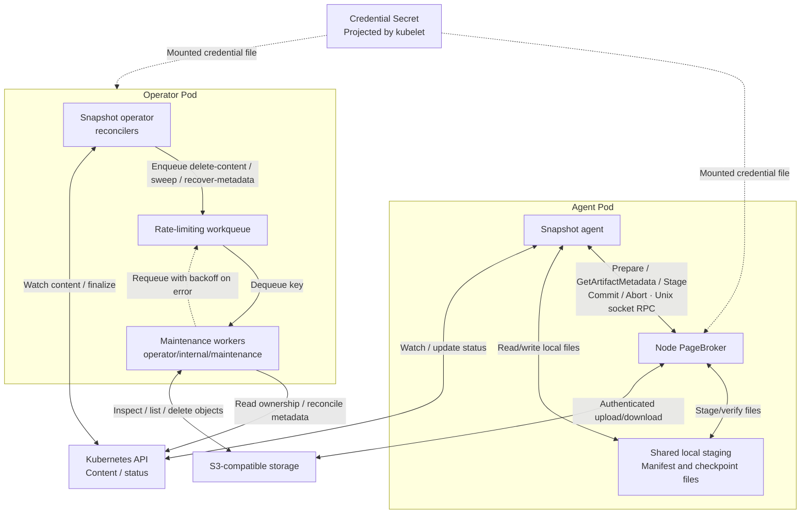

<!--
SPDX-FileCopyrightText: Copyright (c) 2026 NVIDIA CORPORATION & AFFILIATES. All rights reserved.
SPDX-License-Identifier: Apache-2.0
-->

# SNEP-237: S3 checkpoint storage

**Status:** Draft; proposed APIs and behavior.

<!-- toc -->
- [Summary](#summary)
- [Motivation](#motivation)
  - [Goals](#goals)
  - [Non-Goals](#non-goals)
- [Proposal](#proposal)
  - [Limitations, Risks, and Mitigations](#limitations-risks-and-mitigations)
- [Design Details](#design-details)
  - [API](#api)
    - [Kubernetes API and operator](#kubernetes-api-and-operator)
    - [Maintenance workqueue](#maintenance-workqueue)
    - [Snapshot agent](#snapshot-agent)
    - [PageBroker: internal API](#pagebroker-internal-api)
  - [Security](#security)
  - [Configuration](#configuration)
  - [Storage and lifecycle](#storage-and-lifecycle)
    - [Publication and artifact format](#publication-and-artifact-format)
    - [Communication and flows](#communication-and-flows)
  - [Performance and Scalability](#performance-and-scalability)
  - [Monitoring](#monitoring)
  - [Dependencies](#dependencies)
  - [Test Plan](#test-plan)
  - [Graduation Criteria](#graduation-criteria)
- [Alternatives](#alternatives)
<!-- /toc -->

## Summary

Allow Snapshot to save checkpoint artifacts to S3 and restore workloads from them.
PVC remains the default. Stage 1 uses one store per installation, selected at
Helm install/upgrade, and a bounded quiescence period before deletion. Stage 2
adds explicit coordination between active storage operations and maintenance.

## Motivation

S3 provides checkpoint storage without a shared checkpoint PVC. It is the first
additional backend; stable artifact references and separate backend adapters let
future stores be added with minimal changes to workload APIs.

### Goals

- Add S3 checkpoint/restore through PageBroker and cleanup through maintenance.
- Use the same in-process maintenance workqueue model for PVC, S3 and future backends.
- Preserve artifact identity and verify publication, restore and deletion across
  retries, restarts and storage configuration changes.
- Reject new operations after deletion begins. Stage 1 drains admitted operations
  through bounded transaction lifetimes; Stage 2 adds active-operation fencing.
- Keep storage credentials outside workload APIs and the agent process. The
  operator manager is the one exception: since maintenance runs in-process, it
  carries storage credentials, scoped to maintenance operations only.

### Non-Goals

- Storage classes, simultaneous stores, automatic fallback or artifact migration.
- Direct streaming, new feature-discovery APIs or workload-identity implementation.
- Moving CRIU/process orchestration into PageBroker or redesigning CUDA execution.
- Cross-component operation leases and generation fencing in Stage 1; those are
  deferred to Stage 2 after the conservative deletion contract is qualified.

## Proposal

PageBroker already handles checkpoint/restore through local staging; this design
adds its S3 backend. Content is bound to its store before capture and becomes
Ready only after confirmed publication. Restore validates compatibility and stages
the complete bundle before CRIU/CUDA execution.

The operator runs maintenance in-process: a `client-go`-style rate-limiting
workqueue schedules content deletion, scheduled sweeps and metadata recovery onto
a bounded pool of worker goroutines inside the operator container. Workers access
PVC or S3 through their own backend adapters.

### Limitations, Risks, and Mitigations

- **Changed store:** reject mismatched bindings before storage I/O or workload
  mutation. Drain work before switching; old artifacts require their original store.
- **Credentials or S3 outage:** check destination access before capture and source
  access before restore; bound retries/timeouts. Preflight cannot guarantee later
  access. Access denial never proves that an artifact is missing.
- **Uncertain publication:** publish the index last, tagged with the deterministic
  `commitID` derived from store, artifact and container identity; retry lost Commit
  replies idempotently against that same `commitID`. Recovery derives the expected
  value and never chooses by object timestamp. Resume uploads only from complete
  staging; never replay successful or uncertain CUDA/CRIU.
- **Cleanup races:** existing agent admission checks reject new checkpoint and
  restore operations after the content receives a deletion timestamp. In Stage 1,
  each agent performs an uncached content read and must start its PageBroker
  transaction within a bounded admission window or reread. Maintenance retains the
  finalizer until that window plus the maximum PageBroker transaction lifetime and
  clock-skew allowance has elapsed from the deletion timestamp. PageBroker expires
  every admitted transaction within that bound and checks expiry immediately before
  publishing an index or issuing another storage read. Failed, partial, unknown or
  premature cleanup retains the finalizer. Stage 2 replaces the conservative wait
  with explicit active-operation tracking and generation fencing.
- **Metadata loss:** back up Kubernetes content metadata separately. During ownership
  recovery, pause capture, restore and orphan deletion across restarts until
  administrator resume.
- **Operator process risk:** maintenance now shares the operator's process, restart
  cadence and failure domain — a maintenance panic or leak can affect reconciliation,
  and losing operator leadership drops in-flight work. Isolate worker panics per
  task, bound worker pool size and staging/transfer concurrency, and rebuild pending
  work from cluster state after every restart or leadership change instead of
  relying on in-memory queue survival.

## Design Details

### API

#### Kubernetes API and operator

Extend the existing `PodSnapshotContent`; proposed fields below are additions only:

```yaml
spec:
  storage:                               # Store binding fixed before capture
    storeID: store-v1-<digest>            # Prevent access through another configured store
status:
  storage:                               # Results confirmed by checkpoint Commit
    artifacts:                           # One descriptor per captured container
      - containerName: main              # Associate the publication with its container
        artifactHandle: <opaque-handle>   # Locate the publication inside its bound store
        artifactFormatVersion: snapshot.pagebroker/v1  # Select that backend's reader
```

The operator sets immutable `spec.storage.storeID` before capture. A
`PodSnapshotContent` represents one capture attempt, so its immutable UID already
distinguishes a new attempt from a retry of the same attempt. Derive each container's
`commitID` as `commit-v1-` + SHA-256 of a versioned, fixed-field encoding of
`storeID`, `artifactUID` and `containerName`. Operator, agent, PageBroker and
maintenance use the same derivation and shared Go/C++ fixtures; no additional
Kubernetes API field is needed.

Compute `storeID` as `store-v1-` + SHA-256 of a versioned, fixed-field canonical
storage identity. For S3, encode backend, resolved endpoint, region, bucket,
normalized prefix and addressing mode. Normalize the endpoint to lowercase scheme
and DNS host, omit the scheme's default port, retain a non-default port and remove
only a root trailing slash. Reject user information, query strings, fragments and
non-root endpoint paths. Resolve an empty/default endpoint to an explicit provider
endpoint before hashing. Normalize the prefix by removing leading/trailing slashes.
For PVC, encode backend, namespace, claim and normalized base path. Credentials and
access options are excluded.

These fields are raw identity inputs. The S3 store prefix used in artifact keys
additionally appends installation/store identifiers derived from Helm; those values
are not fed back into the SHA-256. Operator, PageBroker and maintenance share one
Go/C++ fixture set covering default and non-default ports, rejected paths, regions,
addressing modes and prefixes, and must produce identical digests and effective
artifact prefixes.

`PodSnapshot` and `SnapshotJob` retain their current workload request APIs. Later
storage-class selection can bind the same content fields without changing restore
references. Legacy content without a binding is accepted only in PVC mode.

#### Maintenance workqueue

The operator owns scheduling and retention. The operator manager enqueues a work
item onto an in-process `client-go` `workqueue.TypedRateLimitingInterface`, and a
bounded pool of worker goroutines drains it, calling directly into
`operator/internal/maintenance/`.

- **Packaging:** `operator/internal/maintenance/` owns a common cleanup workflow
  and backend implementations for PVC, then S3 and future stores, called in-process
  by workers. They access storage directly; maintenance does not call PageBroker.
- **Work item keys:** a typed key carries mode (`delete-content`, `sweep` or
  `recover-metadata`), the expected store ID and configuration; deletion also
  names the content and its artifact UID. These identify authorized scope, not
  an arbitrary path.
  Each deletion covers every container and unfinished attempt for that content.
- **Enqueue sources:** the content reconciler enqueues `delete-content` on a
  deletion timestamp, a periodic ticker enqueues `sweep`, and the reconciler
  enqueues `recover-metadata` when it detects a confirmed-but-unrecorded
  publication. On operator start (and on gaining leadership), re-list content and
  re-enqueue outstanding work instead of trusting queue state to have survived.
- **Retry and backoff:** on a transient error, a worker calls
  `queue.AddRateLimited(key)`, which re-delivers the same key after an increasing
  backoff (exponential by default), naturally throttling a workload that keeps
  failing without a fixed poll interval. On success, the worker calls
  `queue.Forget(key)` before `queue.Done(key)`. The workqueue coalesces duplicate
  enqueues of the same key while it is already queued or being processed, so a
  content object that changes twice in quick succession still yields one work item.
- **Exhaustion:** cap retries with `queue.NumRequeues(key)`; past the cap, `Forget`
  the key, surface a storage-specific failure condition on the content, and rely on
  the next sweep or an explicit re-enqueue (from a subsequent reconcile) rather than
  requeuing forever.
- **Results:** deletion is confirmed successful only after the worker itself
  verifies that the Stage 1 quiescence deadline has elapsed and confirms scoped
  cleanup against the backend. The deadline is the content deletion timestamp plus
  the maximum admission window, PageBroker transaction lifetime and clock-skew
  allowance. The operator removes the finalizer directly, from the same goroutine,
  once cleanup is confirmed. Denied, partial, premature or unknown cleanup requeues
  through `AddRateLimited` and keeps the finalizer. A sweep processes bounded
  batches after fresh ownership checks.
- **Recovery:** an inspection-only work item may repair missing publication
  descriptors in content status using optimistic updates. It derives the expected
  `commitID` from `(storeID, artifactUID, containerName)` and accepts only a
  confirmed index with that value. Multiple matches or another confirmed
  `commitID` is a conflict, not a timestamp-selection problem. Preserve terminal
  failure and reject conflicting results; readiness requires all required
  publications.
- **Concurrency:** size the worker pool explicitly with bounded parallel
  `processNextWorkItem` goroutines. Every maintenance mode acquires a shared keyed
  lock on `(storeID, artifactUID)` before backend access and holds it through the
  ownership recheck, storage operation and related status or finalizer update. A
  sweep resolves one candidate, acquires the same lock and rereads ownership before
  acting. The mode remains part of the work-item key for retry behavior only;
  workqueue in-flight tracking does not replace the shared artifact lock.
- **Shutdown and leadership:** on graceful process shutdown, call
  `queue.ShutDownWithDrain()` so in-flight workers finish their current item. On
  unexpected leadership loss, cancel the leader-scoped worker context and shut down
  without draining. Backend calls accept that context; workers check cancellation
  before storage mutations and Kubernetes writes, and status/finalizer updates use
  resource-version preconditions. The new leader rebuilds pending work from cluster
  state. Backend operations remain idempotent because an already-issued request may
  finish after cancellation.

Maintenance and PageBroker share the store-ID, artifact format and Stage 1
transaction/quiescence contracts, with Go/C++ compatibility fixtures. Stage 2 adds
the cross-component active-operation and generation-fencing contract.

#### Snapshot agent

- Reject new checkpoint and restore admission after `PodSnapshotContent` receives a
  deletion timestamp; this preserves the existing behavior. Use an uncached API
  read and start the PageBroker transaction within the configured admission window;
  if the window expires first, reread the content before proceeding.
- Pass logical artifact identity and the expected store to checkpoint preparation;
  all components derive the same `commitID` from those values.
- Persist committed descriptors in content status; set Ready only after all required
  containers have confirmed publications. The operator projects content readiness.
- Obtain S3 metadata through `GetArtifactMetadata`, then run existing Snapshot
  compatibility checks. Storage checks remain mandatory when compatibility is bypassed.
- Read `manifest_directory` through the volume shared with node PageBroker.
  Close each inspection transaction with `Abort` on every exit, including requeues.
- Restore from verified staging; finish CRIU/CUDA consumers and unmount before cleanup.

Extend the concrete Go `pagebroker.Client` used by the agent. Snapshot retains
Kubernetes authorization, CRIU, canonical manifest creation and process orchestration.

#### PageBroker: internal API

Extend [pagebroker.proto](../../../agent/pagebroker/v1/pagebroker.proto), using the
existing local Unix socket. These are proposed additions; wire numbers must be
reconciled with the separate CUDA integration. Only new fields are shown.

```protobuf
// Identity before an artifact has been published.
message ArtifactIdentity {
  string artifact_uid = 1;      // Stable artifact UID for the owning PodSnapshotContent.
  string container_name = 2;    // Captured container within that content.
}

// Binds a logical artifact to its store before a publication handle is known.
message ArtifactTarget {
  string store_id = 1;           // Require the configured destination store.
  ArtifactIdentity artifact = 2; // Logical checkpoint destination.
}

// Confirmed publication, persisted by Snapshot for later operations.
message PublishedArtifact {
  string store_id = 1;                 // Require the original configured store.
  string artifact_handle = 2;          // Opaque locator within that store.
  string artifact_format_version = 3;  // Backend reader version, not CRIU version.
}

message PrepareStagedCheckpointRequest {
  ArtifactTarget target = 3; // Logical destination instead of a caller's path.
}

message StagedRestoreRequest {
  PublishedArtifact artifact = 3; // Exact committed source to download and verify.
}

message CommitComplete {
  PublishedArtifact published_artifact = 1; // Checkpoint result; absent for restore Commit.
}

message GetArtifactMetadataRequest {
  PublishedArtifact artifact = 1; // Exact committed publication whose metadata is needed.
}

// Success result; errors use the existing Failure message.
message GetArtifactMetadataComplete {
  string manifest_directory = 1; // Shared local directory with verified manifest.yaml.
}
```

PageBroker resolves the backend from configuration. Reject conflicting artifact
and legacy filesystem selectors; retain existing wire numbers and legacy PVC reads.

**One new operation**, `GetArtifactMetadata`, extends `Request.command` /
`Response.result`. Its logical signature is:

```text
GetArtifactMetadata(
  request_id: string,       // Existing envelope: correlate the reply.
  transaction_id: string,   // Existing envelope: own the temporary metadata directory.
  artifact: PublishedArtifact
) -> GetArtifactMetadataComplete | Failure
```

PageBroker verifies the store binding, committed publication, supported format,
metadata access and integrity, then returns a temporary local directory containing
`manifest.yaml` for the exact requested publication. A mismatch returns `Failure`;
PageBroker never substitutes another publication. Snapshot decides how to use this
metadata; restore compatibility checks are one caller flow. Full payload verification
belongs to `StagedRestore`.

The directory remains valid until the transaction is closed with `Abort` or expires.
The caller releases it after reading, on every exit path. Cleanup removes temporary
metadata, never the publication. Checkpoint publication recovery belongs to the
maintenance `recover-metadata` work item.

Artifact deletion and orphan listing belong to maintenance backends, not the
PageBroker RPC. PageBroker still releases its own transaction resources through
`Abort` and restore `Commit`; these never delete retained checkpoints.

Extend `Failure.code` with `STORE_MISMATCH`, `ACCESS_DENIED`, `STORAGE_UNAVAILABLE`,
`ARTIFACT_NOT_FOUND`, `ARTIFACT_CORRUPT`, `UNSUPPORTED_ARTIFACT`,
`TRANSACTION_EXPIRED` and `OUTCOME_UNKNOWN`. An access error never proves absence.
Use existing conditions with storage-specific reasons. Keep errors bounded and
credential-free.

Reuse request/transaction IDs and the 64 KiB message limit. A transaction's maximum
lifetime starts at successful Prepare and retries never extend it. PageBroker checks
expiry before every new storage operation and immediately before publishing the
checkpoint index; expiry returns `TRANSACTION_EXPIRED` and leaves unconfirmed data
for sweeping. Every SDK request uses a deadline no later than the transaction expiry,
so an already-issued transfer cannot outlive the quiescence bound. Bound individual
transfers through broker timeouts and SDK retries. Extend `Abort` to stop transfers
before cleanup; it cannot undo committed data or CUDA/CRIU. Restore `Commit` cleans
local staging.

### Security

Helm values contain Secret references only. Kubelet projects the selected credential
Secret to a fixed path, `/etc/snapshot/s3-credentials/credentials`, in both node
PageBroker and the operator manager container, using the provider SDK's native
credentials-file format (e.g. the AWS shared-credentials-file syntax). This
path and format are part of the wire contract, not implementation-defined per
component. The agent receives no credential file; workload requests and RPCs
carry references.

The operator manager is an S3-credentialed component, not just a Kubernetes-API
client: a process compromise exposes storage credentials, and a maintenance-path
bug (an unbounded retry loop or a memory leak in a storage SDK) can affect the
reconcile loop that owns every other content object. Mitigate with panic recovery
per work item, resource limits sized for the combined workload, and keeping the
storage SDKs on the same audited dependency set PageBroker uses.

An external manager or administrator rotates the Secret. Use a projection that
supports updates, without a fixed `subPath`. Both PageBroker and the operator
manager use refreshable credential providers. If an SDK cannot reload the projected
file, the component observes the projection directory and atomically replaces its
storage client after parsing a valid update. New operations use the replacement;
in-flight operations retain the old client only for their bounded lifetime. An
invalid update fails new operations closed and surfaces a credential condition.
Neither component requires Kubernetes Secret-read permission or a Pod restart.

Use verified TLS and an optional custom CA. Scope storage permissions to the
configured store, restrict local sockets/staging, and exclude secrets from logs
and status. Maintenance checks artifact UID, store binding and fresh ownership
before deletion; protect against arbitrary paths and symlinks. Grant the
operator's service account only the storage permissions needed for cleanup and
metadata repair, without GPU or host-process access.

Require encryption at rest for every checkpoint artifact — SSE-S3, SSE-KMS or
an equivalent provider guarantee. Installation fails validation if the
configured provider/bucket cannot demonstrate it. TLS covers transit only; this
is a separate, mandatory requirement before S3 is enabled.

### Configuration

PVC remains the default. For S3, add these Helm install/upgrade values:

```yaml
storage:
  type: s3
  s3:
    bucket: checkpoint-bucket
    prefix: snapshots
    region: us-east-1
    endpoint: ""                 # Default endpoint; HTTPS override for other providers
    auth:
      mode: secret              # Stage 1; workloadIdentity may be added later
      credentialsSecretRef:
        name: snapshot-s3-credentials
        key: credentials
    tls:
      caBundleConfigMapRef: ""   # Optional custom CA
```

- Render non-secret settings into the existing configuration ConfigMap, mounted
  into both node PageBroker and the operator manager.
- In S3 mode, omit checkpoint PVC mounts on the agent; preserve node staging. In
  PVC mode, the operator manager mounts the shared claim directly.
- Configure the maintenance worker pool size, per-task timeout and retry backoff on
  the operator manager itself.
- Configure a maximum agent admission window, PageBroker transaction lifetime and
  clock-skew allowance in every participating component. Helm rejects zero or
  unbounded values and validates that the operator's Stage 1 deletion delay is at
  least their sum.
- Match Snapshot/PageBroker image versions. PageBroker reads mounted configuration
  and has no Kubernetes client.

### Storage and lifecycle

#### Publication and artifact format

Store the existing per-container bundle under
`<store-prefix>/artifacts/<artifactUID>/containers/<name>/`; the store prefix includes
the configured prefix and installation/store identifiers. Upload immutable payloads,
then publish the index last. The index binds store/artifact/container and format
version, and lists file/directory paths, permissions, sizes and file SHA-256 digests.
Reject unsafe paths, unsupported formats, missing files and checksum mismatches.

Each index also carries the deterministic `commitID` derived from `storeID`,
`artifactUID` and container name. Since a new capture attempt receives a new
`artifactUID`, retries and restarts of one attempt derive the same value while a new
attempt cannot adopt its publication. `Commit` publishes under
`publications/<commitID>/` and is idempotent for that exact path.
`recover-metadata` derives the expected value and accepts only a confirmed index
with the same identity fields and `commitID`. It never selects by object write time.
Multiple matching indexes or a confirmed different ID is a conflict that requires
explicit repair.

Example publication descriptors; digest values are placeholders:

```protobuf
// PVC
store_id: "store-v1-<pvc-digest>"
artifact_handle: "artifacts/<artifactUID>/containers/main"
artifact_format_version: "snapshot.pagebroker/v1"
```

```protobuf
// S3
store_id: "store-v1-<s3-digest>"
artifact_handle: "artifacts/<artifactUID>/containers/main/publications/<commitID>/index.json"
artifact_format_version: "snapshot.pagebroker/v1"
```

Reader selection uses **backend + version**. PVC keeps its directory representation;
S3 reconstructs the same logical bundle from index-listed objects at
`<publication>/data/<relative-file-path>`. CRIU/CUDA retain their producer formats.

#### Communication and flows



**Checkpoint:** agent → prepare/validate destination → CUDA then CRIU/filesystem
capture into staging → PageBroker derives `commitID` and commits the matching
publication → agent persists the descriptor and Ready.

**Restore:** agent → GetArtifactMetadata → Snapshot compatibility gates → StagedRestore
downloads/verifies the full bundle → CRIU/CUDA restore → unmount → Commit cleanup.
The later executor compatibility gate still runs before process restore.

**Cleanup:** the deletion timestamp blocks new checkpoint and restore admission.
The reconciler enqueues a `delete-content` key (or a `sweep` key on a periodic
tick). In Stage 1, the worker waits until the deletion timestamp plus maximum
admission window, transaction lifetime and clock-skew allowance, then acquires the
artifact lock, rereads ownership and talks to the backend directly. Confirmed scoped
deletion lets the same goroutine remove the finalizer; premature, partial or unknown
deletion is requeued with backoff. Stage 2 replaces the fixed quiescence period with
explicit active-operation tracking and a generation fence shared by agents,
PageBroker and maintenance; the coordination location and protocol are a Stage 2
design decision.

**Recovery:** reconciler enqueues `recover-metadata` on detecting a
confirmed-but-unrecorded publication → a worker locates the exact expected
store/artifact/container/`commitID` → repairs missing descriptors without deleting
data. Conflicts fail closed rather than choosing the newest object.

After all restore consumers finish, unmount staging before Commit cleanup.
Once fully staged, restore needs no further S3 reads. Keep cleanup failures
separate from process success; never rerun a restore to retry cleanup.

### Performance and Scalability

Bound transfers separately from CUDA admission. Size memory-backed staging against
both containers' limits; reject insufficient capacity before capture. Cap the
maintenance worker pool size and sweep batch size explicitly — worker concurrency
adds directly to the operator process's own resource footprint. Measure throughput,
peak memory and latency before setting defaults.

### Monitoring

Use existing conditions with storage-specific reasons and rate-limited updates.
Measure phase duration, transfer bytes/retries, credential failures, staging
pressure and cleanup backlog. Expose workqueue depth, per-key retry counts and
worker utilization as operator metrics. Count transaction expiry, credential reload
success/failure and cleanup deferrals; expose remaining Stage 1 quiescence time.
Correlate logs with content, transaction and work-item key. Report cleanup separately
and preserve historical success.

### Dependencies

- Always-running PageBroker, shared local staging and its separate image.
- Separate CUDA CustomStorage integration and existing Snapshot compatibility checks.
- S3-compatible service plus C++ PageBroker and Go maintenance SDKs/adapters.
- Shared store-ID, artifact-format and publication/read/delete contracts.

Before coding, finalize the credentials-file format and SDKs, canonical store-ID
encoding, protobuf tags, Stage 1 maximum transaction lifetime and deletion delay,
admission window, recovery-mode control and numeric resource/time limits. Build PVC
maintenance before adding S3. Finalize the active-operation and generation-fencing
protocol before enabling Stage 2 concurrent deletion.

### Test Plan

Tracking and test issues are not yet assigned. Cover unit/configuration checks,
backend integration with a disposable S3-compatible service, and GPU end-to-end tests.

- **API/configuration:** immutable store bindings, unique container descriptors,
  identical Go/C++ `commitID` derivation, exact recovery matching, identical Go/C++
  store-ID results for endpoint/region/addressing variants, and legacy PVC.
- **Helm/security:** S3 installation without checkpoint PVC; credentials only in
  PageBroker/operator manager; matching images and an operator service account
  without GPU/host mounts. Rotate and revoke credentials while already-running Go
  and C++ clients prove that subsequent operations use the replacement without a
  Pod restart.
- **PVC-first maintenance:** per-content deletion and scheduled sweeps through the
  in-process worker pool; legacy layout, artifact UID checks, symlink refusal and
  finalizer completion.
- **Workqueue lifecycle:** duplicate enqueues coalescing to one key, operator
  restart/leadership change rebuilding pending work, retry backoff and exhaustion
  (cap then surface a condition), graceful `ShutDownWithDrain` under SIGTERM,
  immediate cancellation on leadership loss, and every maintenance mode using the
  same `(storeID, artifactUID)` lock, including candidates resolved by a sweep.
- **Storage/RPC:** disposable S3-compatible service; upload/index publication,
  format/path/digest rejection, fixed transaction expiry across retries, rejection
  immediately before a late index publication, bounded messages, maintenance
  pagination, Abort and inspection expiry.
- **Failure/recovery:** invalid credentials before capture, outage during transfer,
  lost replies/restarts, exact `commitID` repair, missing/duplicate/conflicting
  publications and no CUDA/CRIU replay.
- **Lifecycle/concurrency:** inspection cleanup on success/refusal/requeue/cancellation;
  uncached deletion checks and admission-window expiry; deletion waiting the complete
  Stage 1 quiescence bound; expiration during upload/download; stale publishers,
  incomplete attempts and capture-node loss. Stage 2 adds concurrent
  delete/read/publish races, operation expiry and stale-generation rejection.
- **End to end:** cross-node capture/restore/delete; recovered workload state and
  inference; restore after S3 loss following staging; PVC↔S3-A↔S3-B mismatch refusal.
- **Operations:** denied decryption/deletion, supported provider versioning/retention,
  metadata recovery pause/restart/resume and PVC cleanup parity.

Qualify the real CUDA path, multi-rank and partial-destination failures, and vLLM,
SGLang and TensorRT-LLM workloads. Run the same lifecycle on an external S3 endpoint;
an emulator or mocked CUDA path alone does not qualify provider/GPU support.

### Graduation Criteria

- **Alpha (Stage 1):** demonstrate S3 capture/restore without a checkpoint PVC and
  deletion after the bounded quiescence period; prove admission-window and
  transaction expiry, exact `commitID` recovery, PVC compatibility, credential
  rotation and core failure paths.
- **Beta (Stage 2):** qualify advertised providers and GPU workloads under sustained
  load; add explicit active-operation tracking and generation fencing, then prove
  concurrent cleanup/read/publication safety across component and leader restarts.
- **GA:** document support, upgrades/rollback and recovery; demonstrate artifact/API
  compatibility and supported versioning/retention behavior. Multi-store support is
  not required.

## Alternatives

- **Maintenance Jobs (`batch/v1`), one per task:** isolates storage credentials
  and failures from the operator manager, and reuses Kubernetes for scheduling,
  retries (`backoffLimit`) and completion tracking (Job `Complete`/TTL). Rejected
  as the primary design for Stage 1 because per-task Pod startup adds latency and
  scheduling load at sweep scale, and because it needs a second image/binary
  (`operator/maintenance/main.go`) and its own RBAC surface. Revisit if the
  in-process worker pool's shared failure/credential boundary with the operator
  manager proves too costly in practice.
- **Maintenance sidecar:** avoids per-task Pod startup and isolates credentials from
  the manager container, but needs its own dispatch/result handling between manager
  and sidecar, and still shares the operator Pod's lifecycle and restart cadence,
  without cleanly separating RBAC. A middle ground between the in-process workqueue
  and full Job isolation, not chosen for the added dispatch protocol.
- **Goroutine per task, no workqueue:** simplest dispatch; adds no durable
  completion tracking, no built-in backoff/retry, no deduplication and no
  concurrency control. The workqueue is preferred specifically because it gives
  these for free when maintenance already runs inside the operator.
- **Workqueue dispatching Jobs:** compatible with this proposal as a future
  refinement — a workqueue controls enqueue/retry/backoff decisions while still
  dispatching a `batch/v1` Job per task for credential/failure isolation. Not chosen
  for Stage 1 because it combines the workqueue's implementation cost with the
  Job model's per-task Pod overhead instead of removing it.
- **Stage 2 fencing authority:** Kubernetes operation leases let the operator and
  agents coordinate through the existing API but require PageBroker cancellation
  to be authoritative; storage-resident epochs let every PageBroker enforce a fence
  directly but require conditional-write and consistency guarantees from every
  supported provider. Stage 2 selects one protocol after Stage 1 concurrency and
  failure testing; Stage 1 does not claim either mechanism.
- **Streaming restore or storage classes now:** useful later, but expand Stage 1
  lifetimes and selection semantics; retain full staging and one bound store.
