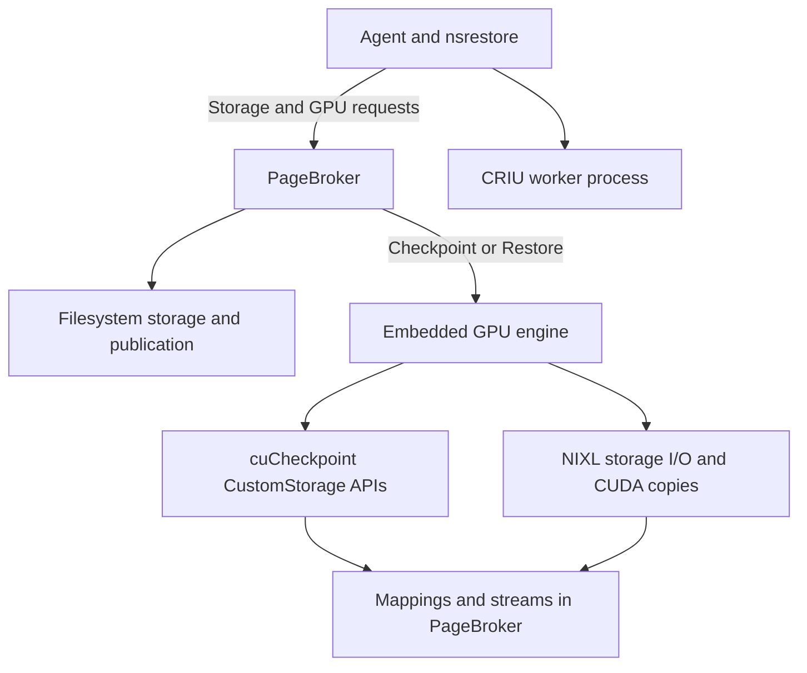
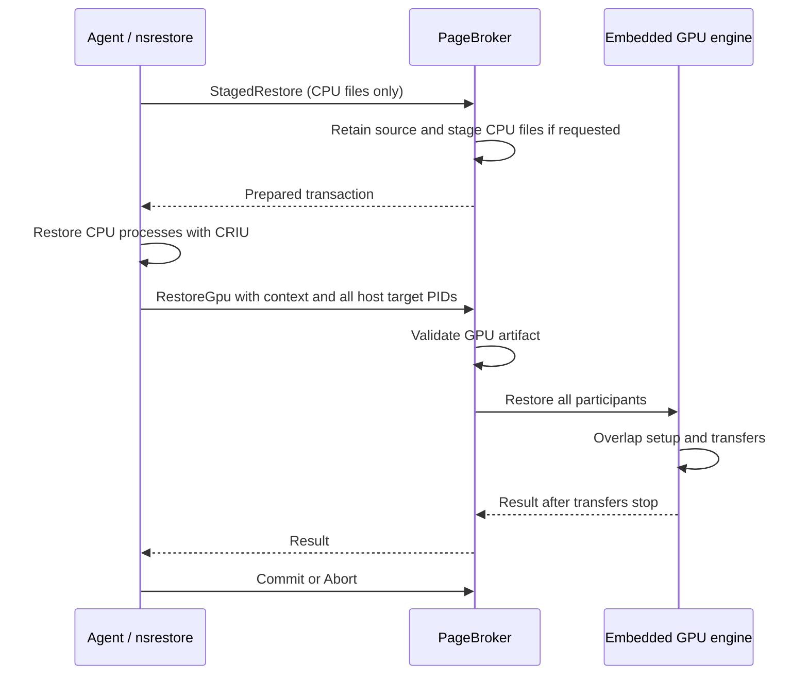
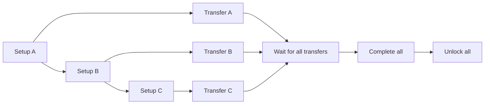

<!--
SPDX-FileCopyrightText: Copyright (c) 2026 NVIDIA CORPORATION & AFFILIATES. All rights reserved.
SPDX-License-Identifier: Apache-2.0
-->

# SNEP-238: Embedded PageBroker GPU engine

Tracking issue: [#238](https://github.com/ai-dynamo/snapshot/issues/238).

<!-- toc -->
- [Summary](#summary)
- [Motivation](#motivation)
  - [Goals](#goals)
  - [Non-Goals](#non-goals)
- [Proposal](#proposal)
  - [Limitations, Risks, and Mitigations](#limitations-risks-and-mitigations)
- [Design Details](#design-details)
  - [API](#api)
  - [Security](#security)
  - [Configuration](#configuration)
  - [Performance and Scalability](#performance-and-scalability)
  - [Monitoring](#monitoring)
  - [Dependencies](#dependencies)
  - [Test Plan](#test-plan)
  - [Graduation Criteria](#graduation-criteria)
- [Implementation History](#implementation-history)
- [Alternatives](#alternatives)
- [Appendix](#appendix)
<!-- /toc -->

## Summary

PageBroker performs CustomStorage GPU checkpoint and restore in one persistent
process. It reuses GPU transfer resources, transfers data while CUDA prepares
other participants, and serves other pods after recoverable failures or
cancellation. The agent uses CustomStorage for pods that opt into CPU staging
when the driver supports it. Other captures use driver-managed checkpointing.

## Motivation

CustomStorage returns mappings and streams to the process that calls the CUDA
checkpoint APIs. That process must transfer the data and release the mappings.
Keeping these steps in PageBroker gives one component control of the complete
operation. It can schedule setup and transfers together and keep storage available
until all work stops.

### Goals

- Keep CustomStorage mappings, contexts, buffers, transfers, and completion in
  the PageBroker process.
- Checkpoint or restore all participating CUDA processes and GPUs in one operation.
- Transfer each participant's data while CUDA prepares later participants.
- Reuse resources after recoverable failures and cancellation.
- Check artifact structure when GPU execution starts. Publish a checkpoint after both CPU and
  GPU capture succeed.
- Transfer GPU payloads without generating or verifying checksums.

### Non-Goals

- Embed CRIU or move CPU process restoration into PageBroker.
- Change public Snapshot CRDs or enable CPU staging for every pod.
- Use a subprocess to isolate fatal CUDA errors.
- Add a generic transfer framework, expose individual GPU phases to callers, or
  transfer GPU payloads over the control socket.

## Proposal

PageBroker is enabled by default. At startup, it checks for CustomStorage support
and allocates transfer resources when supported. If the driver does not support
CustomStorage, the agent can use driver-managed capture. Initialization and runtime
errors do not change the selected format. Restore uses the format saved in the
checkpoint. CustomStorage capture and restore require the existing CPU staging
`nvidia.com/snapshot-pagebroker: "true"` pod annotation. Direct restore support
is outside this implementation.

The agent manages the overall operation, including CRIU. PageBroker prepares
storage, runs the GPU operation, and handles publication and cancellation. Its GPU
engine checkpoints or restores every participant in the transaction. The existing
pod annotation controls CPU staging.

### Limitations, Risks, and Mitigations

| Risk | Treatment |
| --- | --- |
| A fatal CUDA error affects PageBroker | Stop the daemon when cleanup cannot confirm that GPU resources can be reused. The supervisor restarts it. |
| Transfer rings need substantial pinned memory | Use 32 slots of 128 MiB per visible GPU. Provide a total memory limit and check allocation before reporting readiness. |
| Artifacts can be malformed or incomplete | Check manifests, device mappings, file types, and exact extent lengths before CUDA work. Compare returned CUDA mappings with the prepared metadata. |
| Cancellation can occur during DMA | Wait for storage and CUDA work to stop before reusing buffers. Retain files until the caller confirms CRIU no longer uses them. |
| Nested namespaces can have ambiguous PIDs | Use explicit captured-to-namespace PID mappings. The current manifest and resolver do not support arbitrary nested trees or duplicate innermost captured PIDs. |
| Protocol or manifest versions can differ | Run the agent and PageBroker at the same version. Removed helper daemon sessions and payload digest files are not supported. |
| Restored workloads may depend on PageBroker's CUDA contexts | B200 tests with driver 615.71.09 passed 30 kernel and copy checks after the engine exited. Test each supported driver and fatal-error recovery separately. |

GPU payloads have no cryptographic integrity check. Structure and length checks
detect incompatible layouts and truncated data. They cannot detect corruption
that leaves the payload length unchanged.

## Design Details

| Source | Responsibility |
| --- | --- |
| `broker.*`, `transaction.*` | Storage preparation, cancellation, and publication |
| `daemon.*`, `v1/pagebroker.proto` | Control connections, message framing, and client cancellation |
| `posix_copy_engine.*`, transaction descriptors | Filesystem staging, direct access, and publication |
| `gpu/engine.*` | Checkpoint or restore all participants and release operation resources |
| `gpu/checkpoint.*`, `gpu/cuda_driver.cpp` | Load the driver and call the cuCheckpoint APIs |
| `gpu/transfer.*` | Reusable GPU rings, NIXL I/O, CUDA copies, and transfer cleanup |
| `gpu/storage_manifest.*` | GPU artifact format and validation |

### API

The public CRDs do not change. This implementation uses the existing
`StagedRestore`, `PrepareStagedCheckpoint`, `Commit`, and `Abort` operations.
The existing `DirectRestore` protocol declaration remains unimplemented in this
stack. Its implementation is in standalone draft [#468](https://github.com/ai-dynamo/snapshot/pull/468).
`PrepareDirectCheckpoint` creates private output beside the destination without
using staging tmpfs. Commit publishes the completed output.

`CheckpointGpu` and `RestoreGpu` run the complete GPU operation against a storage
transaction. Each request supplies captured participant IDs, host target PIDs
resolved by the agent, visible GPUs, and the restore device mapping.
Storage requests have no GPU fields. A process can use multiple GPUs, and multiple
processes can share a GPU. The engine receives all participants in either case.

Control messages use length-prefixed protobuf over Unix stream sockets. They
carry no file descriptors. Checkpoint uses the host PIDs already collected by the
agent. For restore, `nsrestore` inherits handles to the control socket directory
and host `/proc`. After CRIU returns, it resolves restored PIDs to host PIDs in
its own namespace and sends the GPU request. PageBroker does no PID namespace
lookup. No idle broker connection is needed during CRIU. GPU payloads do not
pass through this connection. The daemon owns request connections and sends all
responses. It gives the broker a request and a cancellation token, then waits for
the result. GPU requests have separate daemon handlers so control requests can
still run. Agent exit, connection loss, or daemon shutdown signals cancellation.
The broker also cancels GPU work on Abort and waits for transfers to drain.

Each transaction runs one GPU operation. An identical completed request for that transaction
returns the saved result. Target contention returns `TRANSACTION_CONFLICT` before
CUDA work starts and permits retry with the same artifact. It does not repeat CUDA calls.
Losing that connection cancels work. The client does not reconnect or retry
automatically.

`Commit` publishes or releases storage after GPU work finishes. `Abort` cancels
work, waits for storage and CUDA transfers to stop, and then removes owned output.
Expiry cancels active GPU work and waits for its transfers to stop before deleting
transaction files. CPU staging, publication, expiry, and startup cleanup retain
the existing PageBroker behavior. This proposal adds no storage leases, durable
transaction recovery, or recovery CLI.

After publication succeeds, Commit is final. File cleanup failures are logged
and cannot make publication retryable. Malformed GPU target sets return
`INVALID_REQUEST` before changing execution state.

GPU requests use the existing error codes. Unsupported or invalid requests return
`INVALID_REQUEST`. Operation failures, including cancellation, return
`INTERNAL_ERROR` with a specific message. `Capabilities` reports CustomStorage
support.

The C++ GPU operation methods are `GpuEngine::Checkpoint` and
`GpuEngine::Restore`. An `Artifact` checks metadata when GPU execution starts. The engine
uses host target PIDs and checks returned CUDA mappings when execution starts.
CUDA handles, streams, and individual participant phases stay inside the engine.

A device-only caller can omit CRIU and supply existing compatible checkpointed
processes. This implementation still requires StagedRestore before RestoreGpu.

Checkpoint preparation creates private output. `CheckpointGpu` captures GPU state,
and CRIU captures CPU state into the same artifact. `Commit` publishes it after
both parts succeed. `Abort` discards unpublished output after cleanup.

### Security

The control socket is restricted to privileged Snapshot components on the node
that share its control directory. The GPU engine needs host driver access and
permission to operate on workload processes. The chart runs PageBroker privileged
in the agent pod's host PID namespace. This change adds no network service or
credential.

The trusted agent resolves targets to host PIDs. Restore resolution checks PID
namespace membership so equal PIDs in different pods cannot select each other.
PageBroker opens pidfds and checks target exit before CUDA calls. Inherited
control-directory and host-proc handles are closed on exec by `nsrestore` so
CRIU children do not inherit them.
Storage access stays within the configured root. Paths and file types are checked,
and handles stay open until work stops.

Artifacts contain workload memory and use the checkpoint store's access controls.
Their contents must not appear in logs or control messages. The trusted store
must protect GPU data from corruption and tampering. Length and schema checks do
not authenticate data.

Control message sizes, participant counts, concurrent requests, and pinned memory
have limits. Invalid requests are rejected before target changes. Cleanup acts
only on that operation's tracked targets and owned output.

### Configuration

| Helm value | Default | Meaning |
| --- | --- | --- |
| `pageBroker.enabled` | `true` | Deploy and use PageBroker |
| `pageBroker.maxConcurrentRequests` | `16` | Maximum concurrent control requests |
| `pageBroker.transferBufferCount` | `32` | Slots in each GPU's reusable transfer ring |
| `pageBroker.transferChunkBytes` | `134217728` | Bytes per slot before allocation rounding |
| `pageBroker.maxPinnedBytes` | `0` | Total pinned memory limit. Zero sets no limit |

The default reserves 4 GiB per GPU, or 32 GiB for eight GPUs, plus overhead.
The chart requests 32 GiB for PageBroker regardless of GPU count. A node needs
that much free allocatable memory plus the agent request. Operators can override
`pageBroker.resources` for their node profiles. A smaller request does not reduce
pinned allocation. The
PageBroker container memory limit must cover the configured pool and working
memory. There is no capture-format override or payload checksum setting.

### Performance and Scalability

Restore setup calls run in sequence. When one call returns, its transfer starts
while CUDA prepares the next participant. All transfers must succeed before CUDA
completion. All completions must succeed before targets are unlocked.

Each GPU has a reusable transfer ring. Participants sharing a GPU can wait for
its ring. Artifact checks run when the GPU request arrives. GPU execution does not hold broker
transaction locks, so abort can signal cancellation while work runs.

After a recoverable failure, the engine stops transfers and releases operation
resources. During cleanup, it completes every participant before terminating any
target. Killing a namespace's PID 1 first would also kill children that still
need CUDA cleanup. A failed completion or transfer cleanup can leave mappings in
use. In that case, PageBroker retains the resources and stops the daemon.

### Monitoring

NVTX ranges mark CUDA setup, participant transfers, storage setup and requests,
completion, waits, and file sync. Nsight Systems shows these alongside CUDA
activity so setup/transfer overlap can be inspected without adding
synchronization. Storage request ranges remain open until PageBroker consumes
the result. Their duration includes time a completed request waits for the
worker. It is not storage service time.

GPU responses and participant logs report the captured PID and byte count.
Existing agent operation durations remain available without a profiler.
Cancellation deadlines and I/O timeouts use the steady clock.

`Capabilities` reports CustomStorage support. Daemon flags and chart values
specify pinned memory settings. No new controller condition or dashboard is
required.

### Dependencies

Production builds need CUDA headers with CustomStorage declarations, the host
NVIDIA driver, the pinned NIXL POSIX backend, and NVTX headers. PageBroker loads the driver at
runtime. Its filesystem operations remain available without CustomStorage.
`cuda-checkpoint-helper` handles driver-managed operations and state queries. It
does not initialize or own CustomStorage contexts.

### Test Plan

The PageBroker image build runs `make test` for CPU storage transactions and
artifact validation. Broker tests link the real GPU engine. Go tests cover
format selection, host PID resolution, and CRIU handoff. Chart tests cover
deployment defaults, GPU visibility, and memory settings.

`make test-gpu` runs two test binaries with real CUDA and NIXL. Transfer tests
check saved and restored bytes across ring reuse and partial final chunks,
recovery after storage errors, cancellation before transfer, and expired
deadlines. They do not inject driver failures.

The checkpoint test checks API round trips, then runs checkpoint and restore
through the broker with the embedded engine. It covers duplicate requests, a
cancelled restore, Commit rejection after failure, source retention on Abort,
CPU staging without GPU payloads, and subsequent operations on another target.
It verifies workload bytes after engine destruction. GPU CI requires one visible
GPU and a CustomStorage-capable driver. The image build compiles both binaries
without running them.

On 2026-10-06, the checkpoint API test passed on one B200 GPU with driver
615.71.09. It saved and restored a child process's 4 MiB allocation twice and
verified every byte. This is a correctness test, not a restore-time benchmark.

Real GPU tests must cover:

1. Restore A, fail or cancel B, then restore C in the same PageBroker process.
   A and C continue to produce correct results.
2. Repeat failures during setup, transfer, and completion. Check for leaked
   resources and reuse of buffers before work stops.
3. Measure setup/transfer overlap and compare GPU restore times with the helper
   under matched conditions. Measure the full CRIU workflow separately.
4. Exercise multiple GPUs per process, multiple participants, device remapping,
   cancellation, client loss, and repeated restores.
5. Stop PageBroker after a successful restore and verify that the workload keeps
   working. Record any restart constraints.

Tests of source `bac70ee2` on 2026-10-05 used `schwinns-vcluster`, B200 GPUs,
driver 615.71.09, and the VAST NFS checkpoint volume. Two-GPU recovery passed with 2 slots of 8 MiB and the
default 32 slots of 128 MiB per GPU. Tests covered multiple participants and GPUs
per process, a truncated extent after artifact validation, cancellation in
RESTORING, and later restores in the same engine process. Unaffected and later
restored targets passed 30 kernel and copy checks after the engine exited.
Adjacent setup/transfer overlap was 218.8 ms with small rings and 173.4 ms with
default rings. Observing RESTORING does not prove that DMA had started.

The earlier protocol implementation also passed GPU tests: capability discovery,
direct checkpoint preparation, namespace and execution descriptor transfer,
`CheckpointGpu`, `Commit`, `DirectRestore`, `RestoreGpu`, and `Commit`. It allocated
default rings on eight visible GPUs and restored a 16 MiB patterned allocation
on one GPU. Data checks passed before shutdown and for ten kernel and copy rounds
after the daemon exited normally.

Large-model tests also measured the full executor, including CRIU and cuinterpose,
and verified fresh inference after restore. These timings exclude controller and
scheduler latency. Driver setup and completion fault injection, device remapping,
client loss, and controller and scheduler latency remain separate requirements.
Mocks cover the corresponding control and cleanup paths.

### Graduation Criteria

The implementation is ready for review when protocol, Go, chart, C++ mock, image
build, and repository checks pass. Obsolete helper daemon and payload digest paths
must be removed. Production qualification also needs the GPU scenarios above,
matched performance measurements, and a restart policy based on workload behavior
after PageBroker exits. This proposal sets no release or maturity date.

## Implementation History

- 2026-10-04: Selected separate GPU operations, an embedded engine, removal of
  payload digests, and the 32-slot, 128 MiB default ring. Authorized implementation.
- 2026-10-05: Implemented the engine, protocol, agent handoff, and default
  deployment. Cluster builds passed repository and image checks. Initial GPU
  recovery tests and workload checks after engine exit passed.

## Alternatives

- A persistent GPU subprocess could isolate some fatal CUDA errors. Embedding
  keeps storage and GPU execution in one process without another protocol.
- Adding GPU execution to `DirectRestore` would combine storage preparation with
  execution, although target PIDs arrive after CRIU. Separate GPU APIs keep the
  device phase independent of CRIU and support device-only operations.
- Exposing bind, setup, transfer, and completion calls would make callers manage
  scheduling and recovery. Complete-operation methods keep that work in the engine.
- Preparing every participant before starting transfers would remove the required
  setup/transfer overlap.

## Appendix

- [CUDA Driver API: Checkpoint](https://docs.nvidia.com/cuda/cuda-driver-api/cuda_driver_api/group__CUDA__CHECKPOINT.html)
- [Build and test targets](../../development/build-from-source.md#development-workflow)
- [Storage configuration](../../operations/storage.md)
