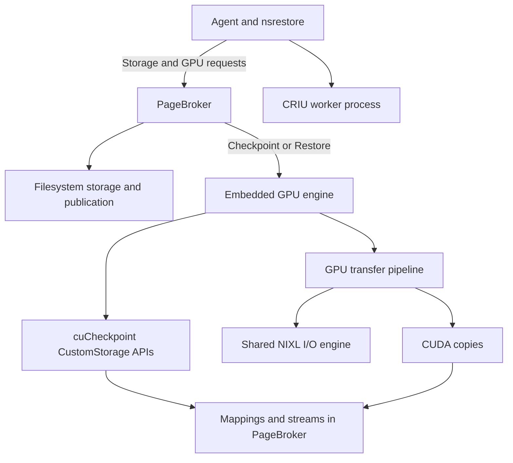
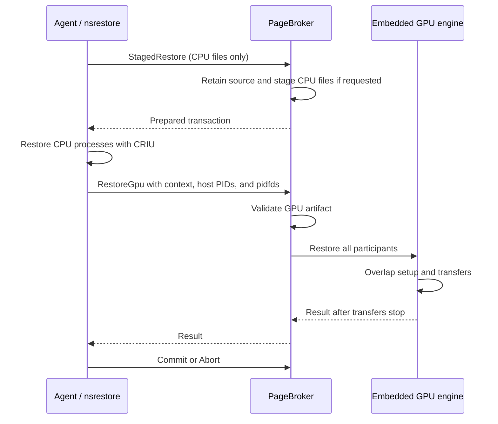
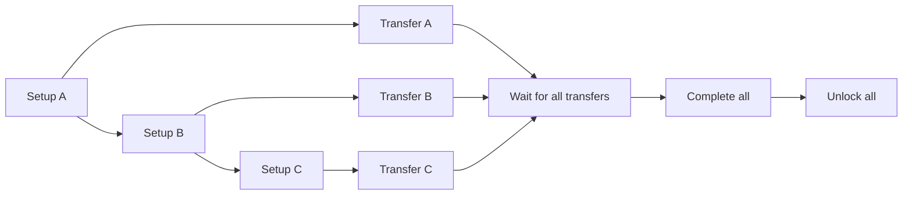

<!--
SPDX-FileCopyrightText: Copyright (c) 2026 NVIDIA CORPORATION & AFFILIATES. All rights reserved.
SPDX-License-Identifier: Apache-2.0
-->

# SNEP-238: Embedded PageBroker GPU engine

Tracking issue: [#238](https://github.com/ai-dynamo/snapshot/issues/238).

<!-- toc -->
- [Summary](#summary)
- [Motivation](#motivation)
  - [Goals](#goals)
  - [Non-Goals](#non-goals)
- [Proposal](#proposal)
  - [Limitations, Risks, and Mitigations](#limitations-risks-and-mitigations)
- [Design Details](#design-details)
  - [API](#api)
  - [Security](#security)
  - [Configuration](#configuration)
  - [Performance and Scalability](#performance-and-scalability)
  - [Monitoring](#monitoring)
  - [Dependencies](#dependencies)
  - [Test Plan](#test-plan)
  - [Graduation Criteria](#graduation-criteria)
- [Implementation History](#implementation-history)
- [Alternatives](#alternatives)
- [Appendix](#appendix)
<!-- /toc -->

## Summary

PageBroker performs CustomStorage GPU checkpoint and restore in one persistent
process. It reuses GPU transfer resources, transfers data while CUDA prepares
other participants, and serves other pods after recoverable failures or
cancellation. The agent uses CustomStorage for pods that opt into PageBroker
when the driver supports it. Other captures use driver-managed checkpointing.

## Motivation

CustomStorage returns mappings and streams to the process that calls the CUDA
checkpoint APIs. That process must transfer the data and release the mappings.
Keeping these steps in PageBroker gives one component control of the complete
operation. It can schedule setup and transfers together and keep storage available
until all work stops.

### Goals

- Keep CustomStorage mappings, contexts, buffers, transfers, and completion in
  the PageBroker process.
- Checkpoint or restore all participating CUDA processes and GPUs in one operation.
- Transfer each participant's data while CUDA prepares later participants.
- Reuse resources after recoverable failures and cancellation.
- Check artifact structure when GPU execution starts. Publish a checkpoint after both CPU and
  GPU capture succeed.
- Transfer GPU payloads without generating or verifying checksums.

### Non-Goals

- Embed CRIU or move CPU process restoration into PageBroker.
- Change public Snapshot CRDs or enable CPU staging for every pod.
- Use a subprocess to isolate fatal CUDA errors.
- Add a generic transfer framework, expose individual GPU phases to callers, or
  transfer GPU payloads over the control socket.

## Proposal

PageBroker is enabled by default. At startup, it checks for CustomStorage support
and allocates transfer resources when supported. If the driver does not support
CustomStorage, the agent can use driver-managed capture. Initialization and runtime
errors do not change the selected format. Restore uses the format saved in the
checkpoint. PageBroker handles every pod unless it sets
`nvidia.com/snapshot-pagebroker: "false"`, which opts out of CustomStorage capture.
A CustomStorage artifact always restores through PageBroker. CPU restore reads the
original artifact by default, or copies CPU images to tmpfs when configured for
staged restore. GPU payloads always come from the original artifact.

The agent manages the overall operation, including CRIU. PageBroker prepares
storage, runs the GPU operation, and handles publication and cancellation. Its GPU
engine checkpoints or restores every participant in the transaction. The existing
pod annotation opts into PageBroker, while `pageBroker.restoreMode` selects
staged or direct CPU restore.

### Limitations, Risks, and Mitigations

| Risk | Treatment |
| --- | --- |
| A fatal CUDA error affects PageBroker | Stop the daemon when cleanup cannot confirm that GPU resources can be reused. The supervisor restarts it. |
| Transfer rings need substantial pinned memory | Use 32 slots of 128 MiB per visible GPU. Provide a total memory limit and check allocation before reporting readiness. |
| Artifacts can be malformed or incomplete | Check manifests, device mappings, file types, and exact extent lengths before CUDA work. Compare returned CUDA mappings with the prepared metadata. |
| Cancellation can occur during DMA | Wait for storage and CUDA work to stop before reusing buffers. Retain files until the caller confirms CRIU no longer uses them. |
| PIDs can repeat in different namespaces | Reuse the existing restored-subtree mapper, then match each process's PID namespace and innermost PID in the host process table. Capture still requires the host/container PID pair. CRIU's restored namespace can be below the placeholder namespace. |
| A target can exit during PID lookup or handoff | Acquire a pidfd before host PID lookup and pass it with the request. Check liveness after lookup and before CUDA calls. CUDA still accepts a numeric PID, so a target can exit between the final check and a CUDA call. |
| A GPU reply or cleanup confirmation can be lost | The execution owner retains resources until Abort confirms transaction cleanup or the original broker exits. There is no hard cleanup deadline or durable recovery after agent restart. |
| Protocol or manifest versions can differ | Run the agent and PageBroker at the same version. Removed helper daemon sessions and payload digest files are not supported. |
| Restored workloads may depend on PageBroker's CUDA contexts | B200 tests with driver 615.71.09 passed 30 kernel and copy checks after the engine exited. Test each supported driver and fatal-error recovery separately. |

GPU payloads have no cryptographic integrity check. Structure and length checks
detect incompatible layouts and truncated data. They cannot detect corruption
that leaves the payload length unchanged.

## Design Details

| Source | Responsibility |
| --- | --- |
| `broker.*`, `transaction.*` | Storage preparation, cancellation, and publication |
| `daemon.*`, `v1/pagebroker.proto` | Control connections, message framing, and client cancellation |
| `posix_copy_engine.*`, transaction descriptors | Filesystem staging, direct access, and publication |
| `gpu/engine.*` | Checkpoint or restore all participants and release operation resources |
| `gpu/checkpoint.*`, `gpu/cuda_driver.cpp` | Load the driver and call the cuCheckpoint APIs |
| `gpu/transfer.*` | Reusable GPU rings, CUDA copies, and transfer cleanup |
| `transfer_engine.*`, `io_engine.*` | Shared transfer interface and NIXL buffer registration, storage requests, and draining |
| `fatal_cleanup.hpp` | Retain unsafe resources and bound daemon shutdown |
| `gpu/storage_manifest.*` | GPU artifact format and validation |

The engine owns persistent primary CUDA contexts and transfer buffers. One
private batch owns the participant operations, workers, cancellation, first
failure, and cleanup. Checkpoint and restore have separate execution sequences.
The broker owns transaction state and saved results. It does not manage CUDA
cleanup phases. Context references are released after transfer resources, both
on normal destruction and when initialization fails.

`NixlTransferEngine` derives from `TransferEngine` and reports `IoEngine::NIXL`.
The interface supports directory staging and registered-buffer I/O. Each backend
rejects the operation family it does not implement. The NIXL engine has no CUDA
dependency. It registers caller-owned host buffers
and provides `Open`, `Submit`, `Wait`, and `Close`. GPU transfer buffers expose
`Checkpoint` and `Restore`, with separate scheduling and shared cleanup. Each GPU
ring keeps its own I/O engine so transfers remain independent. CPU staging still uses the existing
POSIX copy engine. Using NIXL for CPU staging is separate work.

### API

The public CRDs do not change. This implementation uses the existing
`StagedRestore`, `PrepareStagedCheckpoint`, `Commit`, and `Abort` operations.
`DirectRestore` retains the original artifact without copying CPU images.
`PrepareDirectCheckpoint` creates private output beside the destination without
using staging tmpfs. The checkpoint descriptor records whether output is staged
or direct. Commit copies staged output to a partial directory before publication,
while direct output is promoted by rename with no copy fallback. Both paths
preserve the previous checkpoint if replacement fails. Failed direct promotion
retains its output until Abort removes it.

`CheckpointGpu` and `RestoreGpu` run the complete GPU operation against a storage
transaction. Each request supplies captured participant IDs, host target PIDs
resolved by the agent, visible GPUs, and the restore device mapping.
Storage requests have no GPU fields. A process can use multiple GPUs, and multiple
processes can share a GPU. The engine receives all participants in either case.

Control messages use length-prefixed protobuf over Unix stream sockets. GPU
requests attach one pidfd per target to the existing length header with
`SCM_RIGHTS`. Descriptor order matches target order. CPU requests carry no
descriptors. Checkpoint uses the host PIDs already collected by the agent.
For restore, the agent creates an unconnected execution socket and retains it
while `nsrestore` runs. The child inherits four descriptors:

| Flag | Descriptor |
| --- | --- |
| `--pagebroker-socket-directory-fd` | Control socket directory |
| `--host-proc-fd` | Host `/proc` directory |
| `--pagebroker-execution-fd` | Shared execution socket |
| `--cancel-fd` | Cancellation pipe read end |

After CRIU returns, `nsrestore` opens pidfds for namespace-local restored PIDs,
resolves their host PIDs, and checks that the handles are still live. It connects
the shared socket and sends the GPU request. PageBroker checks each descriptor
against its host PID and retains it for execution and result replay. Host lookup
matches each restored process's namespace. PageBroker does no namespace lookup.
GPU payloads do not pass through the control connection.

The shared socket lets the parent identify the same broker process even if the
child exits. `SO_PEERPIDFD` supplies that identity without reopening a numeric
PID. No connection is kept open during CRIU. The daemon owns request handlers and
responses. GPU requests have separate handlers so control requests can still
run. Connection shutdown or daemon shutdown requests GPU cancellation.

The agent cancels `nsrestore` by closing the pipe writer. EOF cancels the child's
context without killing it before GPU cleanup. This also reaches the child
through `nsenter`, which does not forward cancellation signals. The parent waits
for the child while retaining its mounts and the shared socket.

Each transaction runs one GPU operation. A completed request with the same
live target processes and GPU mapping returns the saved result, regardless of
list order. Once an original target exits, the broker rejects replay instead of
accepting a reused numeric PID.
Target contention returns `TRANSACTION_CONFLICT` before
CUDA work starts and permits retry with the same artifact. It does not repeat CUDA calls.
The client does not reconnect or replay GPU execution automatically. Cleanup
can retry Abort without repeating the GPU operation.

`Commit` publishes or releases storage after GPU work finishes. `Abort` cancels
work, waits for storage and CUDA transfers to stop, and then removes owned output.
The agent and broker each wait up to 30 seconds for one Abort attempt. If GPU
cleanup is still active, the broker leaves the transaction in `ABORTING` and
retains its resources.

`CustomStorageExecution` owns the client cleanup wait. After a failed or lost GPU
reply, it shuts down the execution socket and retries Abort until cleanup is
confirmed for the transaction or the original broker exits. Caller cancellation
does not shorten this wait. A lost Abort reply, closed connection, or
`TRANSACTION_NOT_FOUND` does not prove drain. The client never creates or replays
the transaction on a replacement broker. A confirmed successful GPU result ends
the drain wait, leaving only bounded storage cleanup.

`nsrestore` retains its CRIU and GPU mount cleanup until that wait finishes. If
the child exits unexpectedly, the parent uses the shared socket to drain the same
execution before terminating the failed restore and releasing outer mounts.
Parent exit closes the cancellation pipe, allowing a surviving child to request
cleanup. This is not durable recovery. Agent restart cannot reconstruct the
in-memory cleanup owners, and simultaneous parent and child loss has no recovery
path in this design.

Ordinary cancellation has no hard deadline for releasing active GPU resources.
If the broker stays alive with stuck work, the client keeps waiting and logging.
A 30-second Abort attempt timeout does not permit releasing active resources.
After an unsafe cleanup failure, the fatal coordinator cancels other work and
exits the process after a bounded cleanup window without unwinding unsafe owners.
A fatal participant does not skip completion cleanup for the others, but no
target is terminated while any participant retains unsafe CUDA mappings. CPU-only Abort retains its existing bounded behavior. Expiry
cancels active GPU work and retries file cleanup after work stops. CPU staging,
publication, and startup cleanup retain their existing behavior. This proposal
adds no storage leases, durable transaction recovery, or recovery CLI.

After publication succeeds, Commit is final. File cleanup failures are logged
and cannot make publication retryable. Malformed GPU target sets return
`INVALID_REQUEST` before changing execution state.

Unsupported or invalid GPU requests return `INVALID_REQUEST`. Operation
failures, including cancellation, return `INTERNAL_ERROR` with a specific
message. Shutdown and a full GPU handler budget reject admission with
`UNAVAILABLE` before execution starts. `Capabilities` reports CustomStorage
support. The agent queries it once at startup and caches the result. When
PageBroker is enabled, a failed query prevents agent startup.

The C++ GPU operation methods are `GpuEngine::Checkpoint` and
`GpuEngine::Restore`. An `Artifact` checks metadata when GPU execution starts. The engine
uses host target PIDs with caller-supplied pidfds and checks returned CUDA
mappings when execution starts.
CUDA handles, streams, and individual participant phases stay inside the engine.
GPU participant files are stored under `gpu/<captured-pid>/`. Checkpoints using
the earlier experimental directory layout must be recreated.

A device-only caller can omit CRIU and supply existing compatible checkpointed
processes. This implementation still requires StagedRestore before RestoreGpu.

Checkpoint preparation creates private output. `CheckpointGpu` captures GPU state,
and CRIU captures CPU state into the same artifact. `Commit` publishes it after
both parts succeed. `Abort` discards unpublished output after cleanup.

### Security

The control socket is restricted to privileged Snapshot components on the node
that share its control directory. The GPU engine needs host driver access and
permission to operate on workload processes. The chart runs PageBroker privileged
in the agent pod's host PID namespace. This change adds no network service or
credential.

The trusted agent resolves targets to host PIDs. Restore resolution checks PID
namespace membership so equal PIDs in different pods cannot select each other.
The sender acquires pidfds in the target's visible PID namespace. PageBroker
validates the received descriptors and checks target exit before CUDA calls.
The driver wrapper duplicates the supplied handle instead of reopening a PID.
These handles preserve process identity across the handoff. They do not reserve
numeric PIDs after exit, and the CUDA APIs still take numeric PIDs.
`nsrestore` validates the inherited directories, execution socket, and pipe
before CRIU runs. It marks all four descriptors close-on-exec so CRIU children do
not inherit them.
Storage access stays within the configured root. Paths and file types are checked,
and handles stay open until work stops.

Artifacts contain workload memory and use the checkpoint store's access controls.
Their contents must not appear in logs or control messages. The trusted store
must protect GPU data from corruption and tampering. Length and schema checks do
not authenticate data.

Control message sizes, participant counts, concurrent requests, and pinned memory
have limits. Invalid requests are rejected before target changes. Cleanup acts
only on that operation's tracked targets and owned output.

### Configuration

| Helm value | Default | Meaning |
| --- | --- | --- |
| `pageBroker.enabled` | `true` | Deploy and use PageBroker |
| `pageBroker.maxConcurrentRequests` | `16` | Maximum concurrent control requests |
| `pageBroker.transferBufferCount` | `32` | Slots in each GPU's reusable transfer ring |
| `pageBroker.transferChunkBytes` | `134217728` | Bytes per slot before allocation rounding |
| `pageBroker.maxPinnedBytes` | `0` | Total pinned memory limit. Zero sets no limit |

The default reserves 4 GiB per GPU, or 32 GiB for eight GPUs, plus overhead.
The chart requests 32 GiB for PageBroker regardless of GPU count. A node needs
that much free allocatable memory plus the agent request. Operators can override
`pageBroker.resources` for their node profiles. A smaller request does not reduce
pinned allocation. The
PageBroker container memory limit must cover the configured pool and working
memory. There is no capture-format override or payload checksum setting.
Helm rejects non-integer or out-of-range settings. Chunk sizes must be positive
multiples of 4096 bytes. The daemon uses `--custom-storage-buffer-count`,
`--custom-storage-chunk-bytes`, and `--custom-storage-max-pinned-bytes`.
`--custom-storage-engine off` disables GPU engine initialization.

### Performance and Scalability

Restore setup calls run in sequence. When one call returns, its transfer starts
while CUDA prepares the next participant. All transfers must succeed before CUDA
completion. All completions must succeed before targets are unlocked.
Unlock is a separate call for each process. If a later unlock fails, earlier
processes may have run briefly. The engine fails the restore and terminates
the batch targets. It does not provide atomic application-wide resume.

Each GPU has a reusable transfer ring. Participants sharing a GPU can wait for
its ring. Artifact checks run when the GPU request arrives. GPU execution does not hold broker
transaction locks, so abort can signal cancellation while work runs.

After a recoverable failure, the engine stops transfers and releases operation
resources. During cleanup, it completes prepared participants before terminating
targets. Killing a namespace's PID 1 first would also kill children that still
need CUDA cleanup. A checkpoint target that was locked but never prepared is
unlocked. Failed locking does not cause termination of an unchanged target.

An ordinary engine return or exception means its work has drained. If cleanup
cannot establish that resources are safe to release, the failing thread reports
the error and stops without unwinding its owners. Cancellation tokens stop other
GPU operations. The daemon stops accepting requests, allows a 30-second cleanup
window, and exits through an independent watchdog even if a worker or destructor
is blocked. CUDA cleanup checks each release and stops on failure, so a failed
unmap cannot proceed to address or allocation release. The broker does not
attempt to repair partial CUDA state.

### Monitoring

NVTX ranges mark CUDA setup, participant transfers, storage setup and requests,
completion, waits, and file sync. Nsight Systems shows these alongside CUDA
activity so setup/transfer overlap can be inspected without adding
synchronization. Storage request ranges remain open until PageBroker consumes
the result. Their duration includes time a completed request waits for the
worker. It is not storage service time.

GPU responses and participant logs report the captured PID and byte count.
Existing agent operation durations remain available without a profiler.
Cancellation deadlines and I/O timeouts use the steady clock. The caller token
is checked between operations and after checkpoint file sync. It cannot interrupt
NIXL waits, CUDA synchronization, or `fsync`. Each NIXL request has its own
240-second timeout. CUDA waits and `fsync` have no separate host deadline, so the
full transfer can outlast both the caller deadline and one 30-second Abort
attempt. The execution owner keeps waiting while active resources remain owned.
Ordinary daemon shutdown also waits for those copies. The 30-second fatal
shutdown watchdog starts only after a fatal cleanup failure is reported.

`Capabilities` reports CustomStorage support. Daemon flags and chart values
specify pinned memory settings. No new controller condition or dashboard is
required.

### Dependencies

Production builds need CUDA headers with CustomStorage declarations, the host
NVIDIA driver, the pinned NIXL POSIX backend, and NVTX headers. PageBroker loads the driver at
runtime. Its filesystem operations remain available without CustomStorage.
`cuda-checkpoint-helper` handles driver-managed operations and state queries. It
does not initialize or own CustomStorage contexts.

The CustomStorage agent path requires `SO_PEERPIDFD`, available in Linux 6.5 and
later. It checks socket-option support before GPU work and rejects unsupported
kernels. The option binds cleanup to the process that owns the execution
connection. See the [kernel pidfd API history](https://lpc.events/event/18/contributions/1691/attachments/1499/3166/-LPC-2024-%20PID%20FDs-%20where%20we%20were%2C%20where%20we%20are%20and%20were%20we%20would%20like%20to%20go.pdf).

### Test Plan

The PageBroker image build runs `make test` for CPU storage transactions and
artifact validation. Broker tests link the real GPU engine. Go tests cover
format selection, host PID resolution, and child descriptor handoff. Chart tests cover
deployment defaults, GPU visibility, and memory settings.
The engine also has a CPU test target for participant validation and artifact
construction rollback. This compiles and links the engine without initializing
CUDA. Chart tests reject invalid memory settings before deployment.

CPU tests exercise real contended-mutex cancellation, fragmented Unix socket
headers, late and truncated descriptor delivery, descriptor cleanup, and shutdown
admission. Filesystem tests verify that direct publication preserves inode identity,
staged publication copies, and failed promotion retains output until Abort.
NIXL tests repeat real submission failures beyond a small pool's capacity and
verify a subsequent byte-checked transfer.

Go socket tests retain resources across a lost Abort reply and a delayed retry.
Child-process tests cover descriptor inheritance, cancellation-pipe EOF, and the
parent's original broker identity after child exit. A replacement broker's
transaction-not-found response does not authorize cleanup. These tests do not run
CRIU or CUDA. Preparation tests run the `Checkpoint` orchestration body with
supplied inspection data and controlled socket replies. They check rejected
preparation and lost replies, confirmed and unconfirmed Abort outcomes, joined
errors, and absence of checkpoint files. Preparation errors must not request
source termination. These tests do not run container runtime inspection or GPU
cleanup.

`make test-gpu` runs two test binaries with real CUDA and NIXL. Transfer tests
check saved and restored bytes across ring reuse and partial final chunks,
recovery after storage errors, cancellation before transfer, and expired
deadlines. They do not inject driver failures.

The checkpoint test checks API round trips, then runs checkpoint and restore
through the broker with the embedded engine. It covers a two-participant batch,
duplicate requests with reordered participants, Commit rejection after failure,
source retention on Abort, and CPU staging without GPU payloads. Test-only CUDA
wrappers forward calls to the real driver and control two timing boundaries:

- Hold a submitted CUDA copy pending after its NIXL read completes. Abort must
  return after its 30-second drain wait while retaining the target and files.
  Expiry must also retain them until the copy drains. Releasing the pause permits
  cleanup, and a later two-participant restore verifies reuse of the same engine.
- Hold the return from a successful CUDA unlock while the transaction expires.
  The late successful restore result must not permit Commit. Reaping the drained
  transaction must remove its staging files and preserve the checkpoint source.

The tests check pending stream work explicitly. They do not claim that DMA has
started or that NIXL I/O is still pending at cancellation. They verify workload
bytes after engine destruction. In a manual run on 2026-10-07, the checkpoint
test passed on a B200 with driver 615.71.09 in 45.8 seconds, including the
30-second Abort wait. All five transfer tests also passed on that GPU.

The image build compiles both GPU binaries. The GPU results above are from
manual runs. Existing Go and CPU CI remains in place. GPU CI wiring is proposed
in draft [#482](https://github.com/ai-dynamo/snapshot/pull/482) for team review.
A prior revision passed its GPU workflow. Changes to the stack require fresh
validation and do not inherit that result.
Full agent, CRIU, nsrestore, and PageBroker CustomStorage end-to-end coverage
remains deferred pending team discussion of the scope and test infrastructure.

The end-to-end test goals include a real CustomStorage checkpoint and restore,
failure or cancellation cleanup, and a later successful restore in the same
PageBroker process. Focused protocol and GPU tests do not replace that coverage.

On 2026-10-06, the checkpoint API test passed on one B200 GPU with driver
615.71.09. It saved and restored a child process's 4 MiB allocation twice and
verified every byte. This is a correctness test, not a restore-time benchmark.

Real GPU tests must cover:

1. Restore A, fail or cancel B, then restore C in the same PageBroker process.
   A and C continue to produce correct results.
2. Repeat failures during setup, transfer, and completion. Check for leaked
   resources and reuse of buffers before work stops.
3. Measure setup/transfer overlap and compare GPU restore times with the helper
   under matched conditions. Measure the full CRIU workflow separately. Compare
   the current restore copy wait with copies queued across different ring slots,
   waiting before each slot is reused. No controlled comparison of those two
   schedules has been run.
4. Exercise multiple GPUs per process, multiple participants, device remapping,
   cancellation, client loss, and repeated restores.
5. Stop PageBroker after a successful restore and verify that the workload keeps
   working. Record any restart constraints.

Tests of source `bac70ee2` on 2026-10-05 used `schwinns-vcluster`, B200 GPUs,
driver 615.71.09, and the VAST NFS checkpoint volume. Two-GPU recovery passed with 2 slots of 8 MiB and the
default 32 slots of 128 MiB per GPU. Tests covered multiple participants and GPUs
per process, a truncated extent after artifact validation, cancellation in
RESTORING, and later restores in the same engine process. Unaffected and later
restored targets passed 30 kernel and copy checks after the engine exited.
Adjacent setup/transfer overlap was 218.8 ms with small rings and 173.4 ms with
default rings. Observing RESTORING does not prove that DMA had started.

The earlier protocol implementation also passed GPU tests: capability discovery,
direct checkpoint preparation, namespace and execution descriptor transfer,
`CheckpointGpu`, `Commit`, `DirectRestore`, `RestoreGpu`, and `Commit`. It allocated
default rings on eight visible GPUs and restored a 16 MiB patterned allocation
on one GPU. Data checks passed before shutdown and for ten kernel and copy rounds
after the daemon exited normally.

Large-model tests also measured the full executor, including CRIU and cuinterpose,
and verified fresh inference after restore. These timings exclude controller and
scheduler latency. Driver setup and completion fault injection, device remapping,
client loss, and controller and scheduler latency remain separate requirements.
Go socket fixtures cover control and cleanup ordering. They do not replace the
real GPU or full agent-to-CRIU-to-PageBroker tests above.

### Graduation Criteria

The implementation is ready for review when protocol, Go, chart, C++ CPU, image
build, and repository checks pass. Obsolete helper daemon and payload digest paths
must be removed. Production qualification also needs the GPU scenarios above,
matched performance measurements, and a restart policy based on workload behavior
after PageBroker exits. This proposal sets no release or maturity date.

## Implementation History

- 2026-10-04: Selected separate GPU operations, an embedded engine, removal of
  payload digests, and the 32-slot, 128 MiB default ring. Authorized implementation.
- 2026-10-05: Implemented the engine, protocol, agent handoff, and default
  deployment. Cluster builds passed repository and image checks. Initial GPU
  recovery tests and workload checks after engine exit passed.

## Alternatives

- A persistent GPU subprocess could isolate some fatal CUDA errors. Embedding
  keeps storage and GPU execution in one process without another protocol.
- Adding GPU execution to `DirectRestore` would combine storage preparation with
  execution, although target PIDs arrive after CRIU. Separate GPU APIs keep the
  device phase independent of CRIU and support device-only operations.
- Exposing bind, setup, transfer, and completion calls would make callers manage
  scheduling and recovery. Complete-operation methods keep that work in the engine.
- Preparing every participant before starting transfers would remove the required
  setup/transfer overlap.

## Appendix

- [CUDA Driver API: Checkpoint](https://docs.nvidia.com/cuda/cuda-driver-api/cuda_driver_api/group__CUDA__CHECKPOINT.html)
- [Build and test targets](../../development/build-from-source.md#development-workflow)
- [Storage configuration](../../operations/storage.md)
