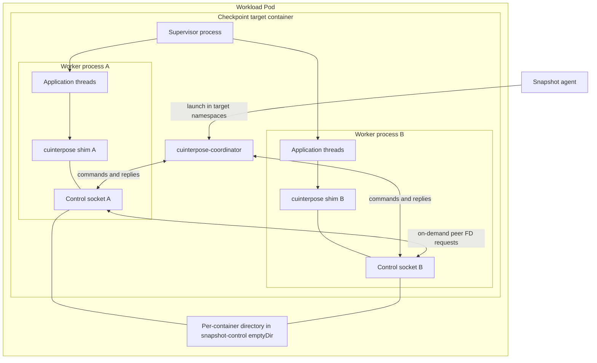
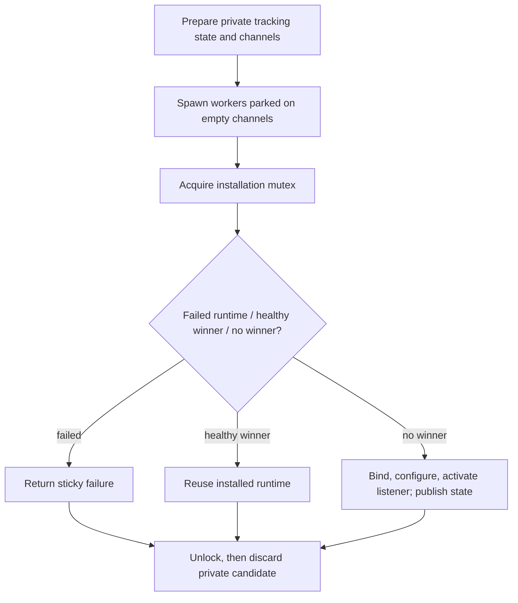
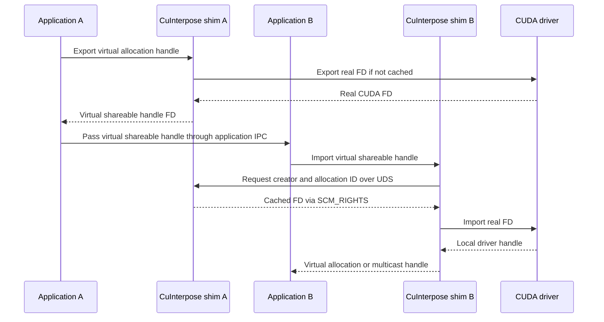
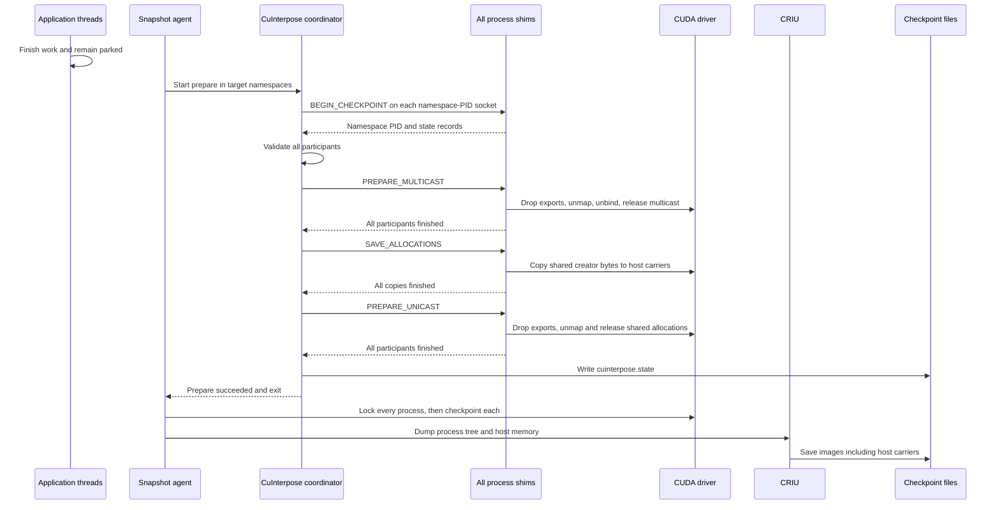
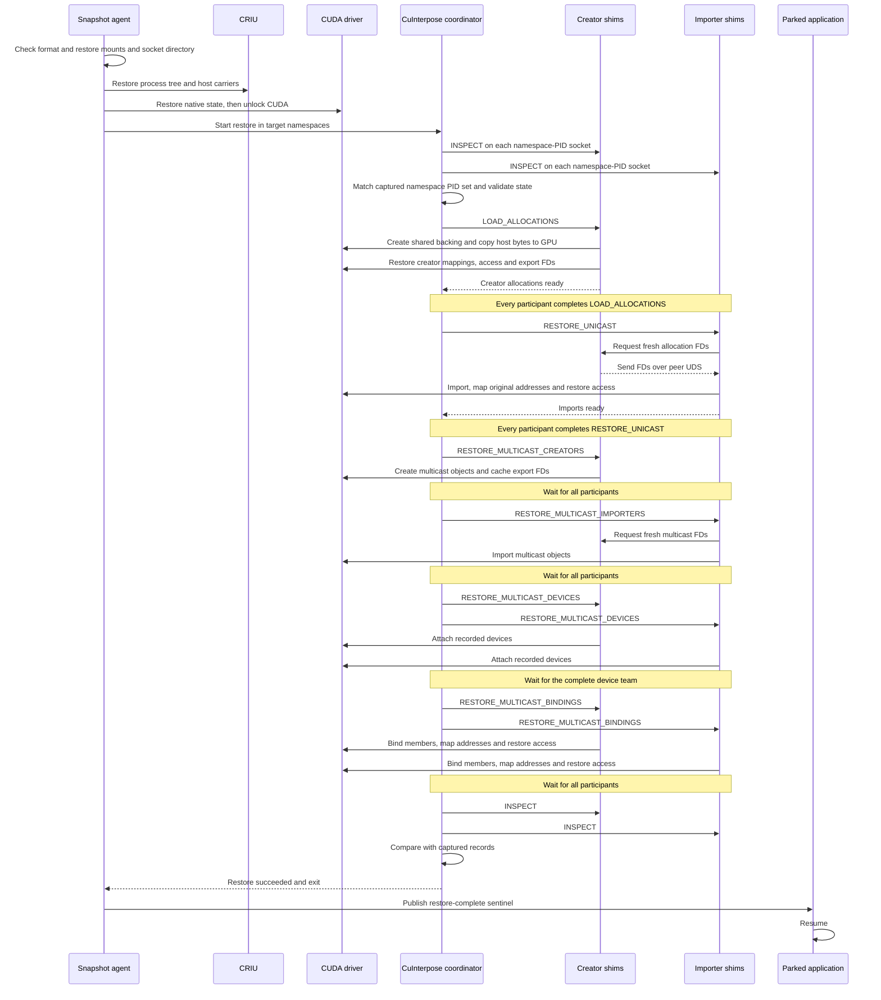

<!--
SPDX-FileCopyrightText: Copyright (c) 2026 NVIDIA CORPORATION & AFFILIATES. All rights reserved.
SPDX-License-Identifier: Apache-2.0
-->

# SNEP-295: Checkpoint and restore of shared CUDA memory

<!-- toc -->
- [Summary](#summary)
- [Motivation](#motivation)
  - [Goals](#goals)
  - [Non-Goals](#non-goals)
- [Proposal](#proposal)
  - [Limitations, Risks, and Mitigations](#limitations-risks-and-mitigations)
- [Design Details](#design-details)
  - [API](#api)
  - [Components](#components)
    - [CuInterpose shim](#cuinterpose-shim)
    - [CuInterpose coordinator](#cuinterpose-coordinator)
    - [Snapshot agent](#snapshot-agent)
    - [Host-carrier module](#host-carrier-module)
  - [How calls are intercepted](#how-calls-are-intercepted)
    - [Backend runtime installation](#backend-runtime-installation)
  - [Workload operation before capture](#workload-operation-before-capture)
    - [Process identity and allocation ownership](#process-identity-and-allocation-ownership)
    - [VMM export and import](#vmm-export-and-import)
    - [Memory IPC adapter](#memory-ipc-adapter)
    - [Threads and synchronization](#threads-and-synchronization)
  - [Capture](#capture)
  - [Restore](#restore)
  - [Checkpoint files and compatibility](#checkpoint-files-and-compatibility)
  - [Security](#security)
  - [Configuration](#configuration)
  - [Monitoring](#monitoring)
  - [Test Plan](#test-plan)
  - [Graduation Criteria](#graduation-criteria)
- [Implementation History](#implementation-history)
- [Alternatives](#alternatives)
- [Appendix](#appendix)
<!-- /toc -->

Tracking issue: [#295](https://github.com/ai-dynamo/snapshot/issues/295).
This proposal describes the implementation in the open cuinterpose PR stack;
it does not claim that the feature is merged or GPU-qualified.

## Summary

Add opt-in checkpoint and restore of CUDA memory shared between processes on
one node. Supported POSIX-exported CUDA virtual memory allocations (VMM),
synchronous memory IPC, and multicast objects retain their contents, application
virtual addresses, and sharing relationships after restore on a compatible node.

## Motivation

Saving each CUDA process independently does not reconstruct shared memory. A
saved CUDA descriptor cannot identify a newly created allocation on another
node, and separately restored copies would no longer represent shared backing.
Multicast additionally depends on member allocations, device attachments, and
bindings. Native checkpoint can refuse a workload with these resources.

Snapshot needs to preserve these relationships while leaving private CUDA state
on the native checkpoint path. This enables cooperating multi-process GPU
workloads to resume with their existing pointers and sharing semantics.

### Goals

- Preserve allocation identity, virtual addresses, contents, access permissions,
  and supported unicast and multicast sharing across checkpoint and restore.
- Save exactly one content copy per shared creator allocation in host memory
  captured by CRIU; leave never-shared allocations to native CUDA checkpoint.
- Validate the complete participant topology before destructive preparation;
  reconstruct creators before importers and verify topology before resuming.
- Install and preload the shim through the Pod contract without changing
  workload commands. Preserve native CUDA jobfile behavior when a file exists.
- Define application quiescence, failure, and artifact compatibility contracts
  that match the implementation.

### Non-Goals

- Cross-node live sharing, cross-Pod coordination, or changing Snapshot's native
  CUDA checkpoint implementation.
- PageBroker or CustomStorage inside the shim, storage selection, and saving all
  private allocations through the shim. Native storage integration is separate.
- Event IPC, memory-pool IPC, managed/async/pitched allocation families, foreign
  native memory-IPC handles, historical 32-bit allocation entry points, or
  general cross-context peer-access emulation.
- Automatically draining application work, supporting a changing participant
  group, or retrying, rolling back, or resuming a failed lifecycle operation.

## Proposal

An opted-in workload loads a shim in every participating CUDA process. The shim
records supported allocation ownership and sharing as the application runs. A
short-lived coordinator validates the entire group and orders preparation and
reconstruction around Snapshot's existing native CUDA and CRIU operations.

The application must finish all CUDA calls and GPU work, then remain parked
through capture and restore. All sharing peers must be interposed and included
in a fixed checkpoint group, with creators still available. The shim does not
pause application threads or make an uncooperative application checkpointable.

Before native CUDA lock, the shims save shared creator bytes into host carriers
and remove shared CUDA resources. CRIU captures those carriers as process memory.
After native CUDA restore and unlock, the shims recreate shared backing, restore
contents, and rebuild importers and multicast dependencies. Snapshot releases the
application only after the coordinator verifies the restored topology.

Unsupported exportable creates and foreign imports fail at the intercepted API,
before acquiring CUDA backing. Missing participants, missing creators, and
incomplete multicast groups fail validation before destructive preparation.
Failures or ambiguous replies during the lifecycle invalidate the attempt; the
workload must not resume with partially removed or reconstructed sharing.

### Limitations, Risks, and Mitigations

Exactly POSIX-FD exportable VMM and multicast objects are supported. FABRIC,
mixed exportable handle types, and non-POSIX multicast (including handle type
zero) are rejected before CUDA allocation or import. Private unicast VMM remains
native-owned. Memory IPC requires fully interposed peers and the adapter's single
owning-context behavior. CUDA allocation granularity can make backing larger
than the requested malloc size.

| Constraint or risk | Contract or mitigation |
| --- | --- |
| Concurrent application activity | Applications finish all CUDA calls and GPU work before entry and stay parked. Checkpoint entry closes tracked memory mutation and rejects outstanding unlocked driver calls; it does not drain work. |
| Partial capture or restore | Run each lifecycle operation once with global barriers. Terminate an unsafe workload; do not retry a lost reply or roll back partial driver mutation. |
| Host-memory pressure | Budget approximately one host copy of shared creator backing plus metadata and temporary mappings. Carriers use pinned memory during transfers and enlarge CRIU images. Importers do not save duplicate bytes. |
| Platform and CUDA compatibility | Require Linux/amd64, glibc 2.34 or newer for the preload libraries, compatible GPUs/drivers, and the VMM/multicast APIs the workload uses. Existing Snapshot/CRIU privilege and compatibility requirements still apply. |
| Fork and loader behavior | Lookup starts no runtime. Fork before CUDA initialization allows child initialization; children forked after initialization must exec or exit. Fork during initialization and long-lived fork children during checkpoint are unsupported. |
| Checkpoint/artifact mismatch | Ship matching frontend, backend, and coordinator artifacts at capture-time library paths. Reject older formats and recreate old draft checkpoints. |
| Incomplete qualification | The stack reports headless and repository checks, but its current revision has not been qualified on physical GPUs or across nodes. Those remain validation work, not established support evidence. |

## Design Details

### API

There are no new CRDs or CRD fields. The workload Pod template opts in with:

```yaml
metadata:
  annotations:
    nvidia.com/cuinterpose-enabled: "true"
```

The annotation is parsed as a trimmed boolean; absent or invalid values disable
cuinterpose. SnapshotJob applies library installation and preload immediately
before Job creation, retaining its existing builder and adoption checks.
The installer copies `libcuinterpose.so` and `libcuinterpose_core.so` from the
agent image into an `emptyDir` mounted read-only at `/tmp/snapshot-cuda` in target
containers. It prepends the frontend to `LD_PRELOAD` and preserves existing
entries and workload commands. A duplicate `LD_PRELOAD` variable or one supplied
through `valueFrom` is rejected because the installer cannot safely prepend it.

The coordinator's internal CLI takes `--prepare` or `--restore`,
`--checkpoint-dir`, `--control-dir`, and a repeated `--process` namespace PID.
The agent supplies this participant list; the coordinator does not discover
participants through a rendezvous protocol.

Native CUDA jobfiles remain supported: existing files are staged, refreshed after
checkpoint, and restored through the native helper. Opt-in only permits an
absent jobfile; it does not bypass validation of an existing file. Unannotated
multi-GPU workloads keep the native jobfile requirement. SnapshotJob keeps
command wrapping disabled; the optional `snapshotctl --cuda-checkpoint-wrap`
path remains available. [#362](https://github.com/ai-dynamo/snapshot/issues/362)
tracks native multi-GPU launch setup separately.

### Components



#### CuInterpose shim

The shim is loaded inside each CUDA process, not run as a sidecar. Its C frontend, `libcuinterpose.so`, receives intercepted calls. Its Rust backend, `libcuinterpose_core.so`, owns allocation state, mappings, cached export descriptors, and host carriers. CUDA calls execute inside the process that owns the CUDA contexts.

Each shim listens on `/snapshot-control/cuinterpose-<namespace-pid>.sock`. The same Unix socket accepts coordinator commands and peer requests for export descriptors. Peer connections are opened when needed; there is no permanent all-to-all connection set.

The backend separates CUDA API policy from resource ownership:

| Module | Responsibility |
| --- | --- |
| `handlers.rs` | Argument validation, native versus tracked decisions, and API-level orchestration. |
| `driver.rs` | Real CUDA calls and temporary context switching. |
| `runtime/` | Runtime installation, process ownership, sticky failure, and control workers. |
| `memory/mod.rs` | The resource registry, virtual handle ownership, and tracked address ranges. |
| `memory/vmm.rs` | Unicast backing adoption, retain/map bookkeeping, and access permissions. |
| `memory/sharing.rs` | Shareable-handle encoding, exact-PID peer requests, cached exports, and imports. |
| `memory/ipc.rs` | Malloc reservations, IPC-handle encoding, repeated opens, and synchronized release. |
| `memory/multicast.rs` | Multicast lifetime, unlocked collective calls, bindings, and reconstruction. |
| `memory/checkpoint.rs` | Inspection, local phase validation, checkpoint mutation, and completion. |
| `memory/host_carrier.rs` | Saving and loading shared allocation bytes. |

Handlers do not call other CUDA handlers. They share memory operations that own
their bookkeeping. Operations that release the registry lock for a
blocking CUDA call use one process-wide `unlocked_driver_calls` counter. Peer FD service
uses only the export cache lock, never the registry lock.

The control worker routes requests and sends replies; checkpoint code owns phase
transitions and fail-stop decisions. After sending a successful LOAD reply, the
worker reports completion to checkpoint code so it can release the host carrier.

#### CuInterpose coordinator

The Rust `cuinterpose-coordinator` is a short-lived executable statically linked with musl. One instance runs before native capture; another runs after native restore. It reads state entries from all shims, checks that creators and importers agree, and starts each capture or restore phase. It does not call CUDA or copy allocation bytes.

Checkpoint entry and inspection visit participants sequentially. Each mutating lifecycle operation is dispatched concurrently to all participants, and the coordinator waits for every reply before advancing. This matters for multicast calls that need other ranks to make progress.

There are no identity or rendezvous messages. Preparation sends four coordinator
requests to each process: `BEGIN_CHECKPOINT`, `PREPARE_MULTICAST`, `SAVE_ALLOCATIONS`,
and `PREPARE_UNICAST`. Restore sends eight: an initial `INSPECT`,
`LOAD_ALLOCATIONS`, `RESTORE_UNICAST`, the four ordered multicast operations,
and a final `INSPECT`. Restoring an imported allocation or multicast object also
causes one peer export request to its creator; that data-dependent traffic is
the actual FD handoff, not discovery.

#### Snapshot agent

For an opted-in workload, the agent finds CUDA processes and launches the coordinator in the target namespaces. The coordinator connects to every participant; a missing or failing shim aborts capture. The agent sequences native CUDA checkpoint/restore and CRIU. After restore, it releases the application's restore-complete wait only when native CUDA and cuinterpose reconstruction both succeed.

#### Host-carrier module

The Rust `host_carrier` module copies shared creator allocations into one host arena per process and copies them back during restore. It registers the arena as pinned host memory, groups allocations by CUDA context, maps a temporary consecutive device-address range, and uses asynchronous copies on one stream per context. It waits for those copies before reporting completion. The temporary device mappings are not application mappings.

### How calls are intercepted

The frontend handles direct CUDA symbol calls, `dlsym`, `cuGetProcAddress*`, and the CUDA runtime's `cudaGetDriverEntryPoint*` queries. A resolver query calls the real resolver first. Only a successful lookup of a supported API is replaced, using the actual returned symbol to choose the correct calling convention.

The frontend obtains glibc's real `dlsym` with `dlvsym(RTLD_NEXT, "dlsym", "GLIBC_2.34")`. On first relevant CUDA activity it loads the adjacent Rust backend with `RTLD_LAZY | RTLD_LOCAL`. This is glibc-based lookup, not a custom ELF loader. The frontend's linker export list exposes only its intended CUDA/resolver functions; `-Bsymbolic-functions` keeps its own internal function references local.

The private C ABI contains `FrontendAbi` and `BackendAbi` tables. Cbindgen generates the table declarations, while NVIDIA's `cuda.h` supplies C CUDA types and cudarc supplies the corresponding Rust definitions. Runtime preparation resolves the backend's driver function table through the frontend before acquiring the installation or process-state mutex. It publishes the completed table without running loader calls inside a `OnceLock` initializer. Backend driver calls then use cached pointers, including context and cleanup calls; missing optional symbols fail only when used. CUDA providers remain loaded for the process lifetime. Cudarc's loader and buffer/context wrappers are not used. Rust objects and ownership do not cross the ABI.

Loading the backend and starting its runtime are separate operations:

| Operation | Concurrency and lifetime |
| --- | --- |
| ABI registration (`cuinterpose_core_init`) | Copies the frontend table and returns an immutable backend table. Repeated or concurrent registrations must agree on the resolver. It starts no workers and makes no frontend callbacks. |
| Frontend publication | Concurrent callers may each `dlopen` the backend; glibc serializes its construction. Atomic publication retains one process-lifetime library reference and closes redundant references. Same-thread constructor reentry returns `CUDA_ERROR_NOT_INITIALIZED` without poisoning a later call. |
| Runtime startup | Only successful intercepted `cuInit` calls `ensure_cuinterpose_initialized`, which prepares private candidates and installs one process runtime, control socket, and worker pair. Concurrent callers reuse the installed runtime; same-thread preparation reentry returns `CUDA_ERROR_NOT_INITIALIZED` without poisoning it. |

There is no frontend-wide loading lock. The backend's installation lock remains
necessary for unique runtime resources. A `OnceLock` publishes the completed
runtime; its initializer never performs loader-sensitive startup.
Obtaining the ABI table alone does not mean runtime services are ready.

#### Backend runtime installation



Thread creation can register Rust TLS destructors with glibc's loader. A CUDA
caller in a DSO constructor already holds that loader lock. Preparation therefore
owns no installation mutex: that caller can prepare its own candidate instead
of waiting for another thread blocked in loader-sensitive startup. Installation
never waits for a worker-running acknowledgment. Readiness means successful
thread creation, not proof that a worker has already been scheduled.

Only the installer binds the canonical endpoint. One nonblocking listener
handoff activates the peer worker, which owns the control queue's only sender.
Discarding a candidate disconnects that chain so both workers eventually exit;
callers never join them. Cleanup, unlinking, logging, and candidate destruction
happen outside the installation mutex. There can temporarily be two private
workers per contender, but only one installed pair.

Installed failure is checked before installed state. A failed private candidate
may reuse an already-installed healthy winner; it never waits for an unfinished
candidate. Without a winner, a real preparation or installation error remains
sticky. Memory calls require a ready runtime owned by the calling PID; they never start
it themselves. Function lookup remains independent of runtime readiness.

The bounded commit path is audited for the pinned Rust/Linux/glibc implementation:

- Backend ELF eager binding prevents first-use PLT lookup while holding the mutex.
- The preparation guard initializes non-destructible backend TLS before commit.
  Rust futex mutexes and panic-count TLS do not register loader destructors.
- The capacity-one activation channel is preallocated. `try_send` never enters
  blocking-send context initialization; wakeups use non-Drop TLS and futex
  unparking. Receiver context setup happens before its waker lock is held.
- Bind/listen, nonblocking setup, and chmod make no frontend callbacks or
  formatted/logging calls. Arbitrary allocator/libc interposers that call the
  loader are outside this assumption.

Lookup alone starts no workers and creates no endpoint. Fork before CUDA
initialization permits independent initialization in each child. Once CUDA is
initialized, fork children must exec or exit; they cannot restart the shim.
Fork during initialization and long-lived fork children during checkpoint are
outside this contract.

The Rust workspace uses `panic = "abort"` in debug and release builds. A panic
in any shim thread, including background workers, terminates the process
without stack unwinding or destructor cleanup. No catch-and-abort wrapper is
needed at the C ABI. Cargo unit tests still use unwinding; their panic behavior
does not qualify the shipped libraries. The shim cannot continue after a panic
that may have interrupted a state-changing operation. This does not make invalid
application pointers, foreign C++ exceptions, or allocator aborts recoverable.

| Intercepted APIs | What the shim does |
| --- | --- |
| `cuInit` | Initializes the shim alongside CUDA. |
| `cuMemCreate`, `cuMemRelease`, `cuMemRetainAllocationHandle` | Tracks supported VMM allocations and translates application-visible virtual allocation handles to the CUDA driver handle. |
| `cuMemMap`, `cuMemUnmap`, `cuMemSetAccess` | Records address ranges, allocation offsets, and access permissions. |
| `cuMemGetAllocationPropertiesFromHandle` | Resolves virtual handles and preserves application-visible allocation properties. |
| `cuMemExportToShareableHandle`, `cuMemImportFromShareableHandle` | Replaces raw export FDs with virtual shareable handles and imports the creator's real allocation through a peer request. |
| `cuMemAlloc_v2`, `cuMemFree_v2`, `cuMemGetAddressRange_v2` | Implements synchronous device malloc with VMM backing, frees it, and reports the application's requested range. |
| `cuIpcGetMemHandle`, `cuIpcOpenMemHandle`, `cuIpcOpenMemHandle_v2`, `cuIpcCloseMemHandle` | Implements supported memory IPC using the same VMM records and peer export service, without native memory-IPC calls. |
| `cuMulticastCreate`, `cuMulticastAddDevice`, `cuMulticastBindMem*`, `cuMulticastBindAddr*`, `cuMulticastUnbind` | Tracks multicast objects, device membership, bindings, and their reconstruction. |

Property-only queries such as `cuMemGetAllocationGranularity` and `cuMulticastGetGranularity` go directly to CUDA.

Modern proc-address aliases for malloc/free/address-range queries are handled without treating historical 32-bit ELF entry points as modern APIs.

Explicit `dlvsym` calls and CUDA libraries loaded in separate linker namespaces bypass this interception. Arbitrary chains of other `dlsym` interposers are not supported: forwarded `RTLD_NEXT` lookup is relative to this frontend, not the original caller.

### Workload operation before capture

#### Process identity and allocation ownership

The namespace PID is the shim process identity and directly determines its
socket name: `/snapshot-control/cuinterpose-<namespace-pid>.sock`. A separate
random 128-bit allocation ID identifies each tracked allocation or multicast
object. Together, the creator namespace PID and allocation ID identify an
allocation across processes.

The agent supplies one `--process <namespace-pid>` argument for every expected
CUDA process. Because the coordinator runs inside the target PID and mount
namespaces, it can connect to each exact socket without scanning the control
directory or asking shims to identify themselves. Its first capture request is
`BEGIN_CHECKPOINT`; restore also requires the supplied namespace PID set to match the
keys saved in `cuinterpose.state`.

CRIU preserves namespace PIDs, allocation IDs, state records, virtual allocation
handles, and virtual handle bytes in process memory. Restore recreates the
captured namespace PID, so the runtime ownership check continues to match.
A child forked before CUDA initialization gets its own runtime on successful
`cuInit`.

For example, suppose A creates a 2 MiB allocation and B imports it:

| | Worker A | Worker B |
| --- | --- | --- |
| Namespace PID | `41` | `42` |
| Allocation ID | `aaaaaaaaaaaaaaaaaaaaaaaaaaaaaaaa` | The same ID |
| Role for this allocation | Creator | Importer |
| Application mapping | `0x700000000000` | `0x710000000000` |

The addresses can differ: each process has its own address space. The shared allocation ID says that both mappings refer to the same backing. After restore, those addresses and IDs stay the same, but the driver handles and export FDs are newly created.

An allocation is *exportable* when its creation properties allow a shareable handle. That does not mean it needs a host carrier. It becomes *shared* after a successful tracked export/import or a binding into tracked multicast. Once marked shared, closing a virtual shareable handle or removing a binding does not change it back to private.

| Allocation state | Who saves and restores its bytes? |
| --- | --- |
| Ordinary nonexportable `cuMemCreate` | Native CUDA. |
| Tracked POSIX-capable allocation never shared | Native CUDA; cuinterpose leaves its driver handles and application mappings intact. |
| Shim-managed malloc never shared | Native CUDA, even though its backing can be exported. |
| Shared creator allocation | The creator shim's host carrier. |
| Imported shared allocation | No second content copy; the importer reconnects to the creator's restored allocation. |
| Tracked allocation used by multicast | The creator's host carrier, even if there was no unicast virtual shareable handle export. |

Only pinned, device-located, supported exportable creator allocations marked shared enter the host carrier. A shared allocation whose application handles were released but whose mapping remains can recover a temporary driver handle before copying. Never-shared allocations are excluded from that recovery as well as from teardown.

#### VMM export and import

For POSIX export, the shim caches a real CUDA export FD and returns a memfd
virtual shareable handle instead. The application passes that FD through
its existing communication mechanism. The virtual shareable handle has one
fixed 24-byte layout:

| Bytes | Value |
| --- | --- |
| 4 | `CUI\x03` |
| 4 | Creator namespace PID, little-endian |
| 16 | Allocation ID |

The last two fields form an `AllocationReference`. A virtual shareable handle
contains neither a socket path nor a unicast/multicast discriminator. The
importing shim derives the creator's exact socket path from its namespace PID.

On import, B sends A the allocation reference:

```yaml
version: 3
body:
  kind: export
  allocation:
    id: "aaaaaaaaaaaaaaaaaaaaaaaaaaaaaaaa"
    creator_pid: 41
```

A sends a duplicate of its cached FD using `SCM_RIGHTS` and replies with either
`unicast_export` or `multicast_export`. Only the multicast reply includes
`CUmulticastObjectProp`: CUDA exposes no equivalent query after multicast
import. A unicast importer obtains the authoritative `CUmemAllocationProp`
directly from CUDA after importing the FD. B records the resulting local
handle. Re-exporting B's import still names A. Neither the virtual shareable
handle nor the request contains a durable CUDA FD number.



A POSIX import whose FD is not a virtual shareable handle returns `CUDA_ERROR_NOT_SUPPORTED` before calling CUDA. Non-POSIX imports and unsupported exportable creates are also rejected before acquiring backing. The shim never records unsupported resources for a later checkpoint refusal.

#### Memory IPC adapter

Synchronous `cuMemAlloc_v2` is implemented with POSIX-capable VMM backing from allocation time. The shim rounds the backing size to CUDA's required granularity, reserves and maps a virtual address, and records the requested size separately. It does not move a live native malloc allocation when the application later exports it.

`cuIpcGetMemHandle` returns a virtual IPC memory handle in CUDA's fixed 64-byte value. Unlike a virtual shareable handle, it is not an FD. For a malloc-backed allocation with the example's identities, its decoded fields would look like this:

| Field | Bytes | Example value |
| --- | --- | --- |
| `version` | 8 | ASCII `CUIPC003` |
| `creator_pid` | 4 | `41` |
| `allocation` | 16 | `aaaaaaaaaaaaaaaaaaaaaaaaaaaaaaaa` |
| `reserved` | 20 | All zero |
| `requested` | 8 | `2097152` |
| `extent` | 8 | `2097152` |

The integer fields use little-endian encoding. This example assumes the request already meets the device's allocation granularity; otherwise `extent` is larger than `requested`. `cuIpcOpenMemHandle*` derives A's socket from the creator namespace PID, uses the same peer FD service as VMM import, and maps the allocation in B.

Repeated opens in the supported context return the same address and increment a reference count. The final close removes the imported mapping. `cuMemFree_v2` synchronizes the owning context before removing a malloc mapping; a synchronization failure leaves that mapping intact. An imported pointer must be closed, not freed. Foreign native IPC handles are rejected.

The adapter never calls native CUDA memory-IPC functions. It therefore does not need a CUDA checkpoint jobfile to reconstruct this sharing.

#### Threads and synchronization

Application CUDA wrappers run on the calling application thread. On runtime startup (not ABI registration), two additional threads start in that process:

| Thread | Work |
| --- | --- |
| `cuinterpose-peer` | Accepts socket connections and classifies requests. Handles peer export requests using the descriptor cache without the main allocation-state lock or CUDA calls. |
| `cuinterpose-control` | Processes inspection and lifecycle commands one at a time. It enters the recorded CUDA context when a lifecycle operation needs driver calls. |

The peer thread queues control commands; it does not wait for their CUDA operations. A bounded queue refuses excess control requests. This separation lets an importer obtain an FD even while the creator's control thread is busy reconstructing another object.

Allocation and mapping changes normally hold the shim's state mutex. Application multicast calls that can block waiting for other devices, and IPC synchronization, release that mutex around the driver call. One `unlocked_driver_calls` counter prevents checkpoint entry until they have returned and recorded their results. The application must synchronize object destruction against calls using that object; the shim has no per-object pins or busy counts. During restore the application stays parked, so reconstruction holds the state mutex and updates records directly. The peer listener holds the export-cache mutex through each socket send. Cache removal and checkpoint teardown take the same mutex, so they wait for that send to finish. Sends use the socket timeout; a slow receiver can delay cache mutations until the send finishes or fails.

`ProcessState` owns one memblock registry keyed by allocation ID. Each `Memblock`
is either a unicast `Allocation` or a `MulticastObject`; virtual handles and
address mappings refer to that same registry. Export publication, handle release,
and existing-memblock imports share the registry's lifetime bookkeeping.
`MallocRegion` additionally tracks malloc/IPC reservations, requested sizes, and
open counts. A reservation's lifetime is distinct from its current mapping.
Mappings preserve the application handle used to create them. Retaining a mapped
allocation returns that same handle and increments its application reference count,
including after an earlier release or checkpoint/restore.

CUDA validates application arguments; the shim records successful calls and
propagates ordinary driver errors. Failed malloc/IPC setup releases its unpublished
resources before returning the original error. Context-query errors propagate;
a successful query with no current context is the only case represented by zero.
Failed cleanup and irreversible checkpoint mutations remain fail-stop.

The export cache stores an FD and its reply metadata under each allocation ID.
Multicast replies include the creation properties needed by importers to record
and reconstruct the object. This copy lets peer service run without taking the
CUDA state mutex, including while another thread holds that mutex during import.

Inspection projects live memblocks into serializable `Record` values. The
checkpoint manifest maps each namespace PID directly to its records; live CUDA
handles and transient lifecycle bookkeeping remain inside the shim.

These simplified paths show the main actions, not error cleanup:

```text
malloc(size):
    create supported VMM backing and a virtual allocation handle
    reserve and map a virtual address in the current context
    record requested size, backing size, context and mapping
    return the virtual address

export(allocation):
    lock allocation state
    create and cache a real export FD if needed
    create the virtual shareable handle and mark successful sharing
    unlock allocation state
    return the virtual shareable handle

import(virtual_shareable_handle):
    lock allocation state
    resolve the original creator and allocation
    request its cached FD through the peer socket
    import the FD, or reuse an existing local allocation record
    record the virtual allocation or multicast handle and successful sharing
    for memory IPC, map the address while still holding allocation state
    unlock allocation state
    return the virtual handle or mapped address
```

The runtime records its creating PID and rejects inherited state before taking
any mutex. There are no at-fork handlers or child-runtime resets. Real `cuInit`
errors propagate unchanged; memory wrappers return `CUDA_ERROR_NOT_INITIALIZED`
when no current-process runtime exists. Shim-owned sockets and cached export FDs
are close-on-exec. They remain inherited until exec or exit; the shim does not
support checkpointing a long-lived child forked after CUDA initialization.

### Capture

The application must first stop submitting work, finish outstanding GPU work, and arrange to stay parked through restore. The coordinator does not pause application threads. In particular, **shim preparation runs before native CUDA lock** because saving and removing shared allocations requires working CUDA calls.

The agent requires the exact namespace-PID socket for every discovered CUDA
process in an opted-in workload. It starts the coordinator with those namespace
PIDs. The coordinator sends `BEGIN_CHECKPOINT` to each shim and checks creators,
ranges, access permissions, and complete multicast groups before changing driver
state. Under the process mutex, checkpoint entry requires `Active` and zero
unlocked driver calls, returns the inspection records, and changes the phase to
`Checkpointing`. Application memory APIs then refuse mutation. `INSPECT` remains
a read-only query; it does not authorize destructive preparation.

Every application CUDA call must have returned, outstanding GPU work must have
completed, and the participant set must remain fixed before checkpoint entry.
All sharing peers must be interposed and included in the checkpoint group;
creators must remain available. Neither the counter nor checkpoint entry parks
application threads or drains GPU work.

One coordinator issues each phase once, in order. There are no lifecycle retries,
rollback, or reconnect-and-resume semantics. A lost reply or timeout makes the
attempt unusable; the agent terminates the affected workload. A driver error
before an ordinary application operation changes tracked state can be returned
to the caller. Failure after a state-changing operation, or during destructive
capture/restore, terminates the process.

The process phase and stable ownership determine each phase's complete work.
Allocations, mappings, multicast objects, and bindings carry no per-object
checkpoint progress flags. Shared creator allocations own host-carrier contents;
importers reconnect to their creator. A failed phase never resumes halfway.



The `BEGIN_CHECKPOINT` requests visit participants sequentially; destructive work starts only after all returned records pass topology validation. Each subsequent lifecycle operation runs concurrently across participants, followed by a barrier before the next operation.

Capture removes the outer objects before their dependencies:

1. `PREPARE_MULTICAST` removes multicast exports, mappings, bindings, and handles.
2. `SAVE_ALLOCATIONS` saves the shared creator bytes while unicast allocations still exist.
3. `PREPARE_UNICAST` drains peer export requests, removes shared mappings, and releases shared driver handles.

Virtual allocation handles, including virtual multicast handles, remain in CPU memory for CRIU alongside mappings, allocation references, and carrier addresses. Private allocations remain native CUDA state. If a destructive phase or later checkpoint step fails, the source must be terminated rather than resumed with sharing removed.

For the 2 MiB example, `SAVE_ALLOCATIONS` copies A's allocation into A's host arena. B saves no second copy. CRIU captures that arena as process memory; there is no separate `aaaaaaaa….bin` file. If A also has a never-shared allocation, that allocation stays on the native CUDA path instead of entering the arena.

### Restore

Before CRIU, the agent restores the tool paths and control directory and removes
the exact socket names for the namespace PIDs in the manifest. CRIU recreates
the process tree, namespace PIDs, shim records, and host carriers. Native CUDA restore reconstructs private memory and
process state, then unlocks CUDA so the shims can make driver calls. The
application remains parked until all shim reconstruction succeeds.



The creator/importer labels describe roles, not disjoint sets of processes: one process can own one allocation and import another. Every participant receives every lifecycle operation, even when it has no work in that operation.

`LOAD_ALLOCATIONS` creates new backing, copies host-carrier bytes back, restores creator mappings and permissions, and makes new export FDs available. After sending its successful LOAD reply, the shim releases the carrier arena. `RESTORE_UNICAST` reconnects importers to those new allocations at their original virtual addresses. Neither operation recreates never-shared allocations.

`RESTORE_MULTICAST` consists of four ordered wire operations:

| Operation | Work | Why wait before continuing? |
| --- | --- | --- |
| `RESTORE_MULTICAST_CREATORS` | Recreate objects from their recorded properties and publish export FDs. | Importers need the new creator FDs. |
| `RESTORE_MULTICAST_IMPORTERS` | Obtain those FDs and import the objects. | All participants need local handles before starting device attachment. |
| `RESTORE_MULTICAST_DEVICES` | Replay device attachments. | Bind operations can wait for the whole device team. |
| `RESTORE_MULTICAST_BINDINGS` | Replay `BindMem`/`BindAddr`, map the original addresses, and restore permissions. | The application must not resume with incomplete mappings. |

Capture and restore reverse the dependency order, not the number of messages. Capture can remove each process's existing multicast references in one operation. Restore needs creator-to-importer handoffs and whole-team device attachment before binding.

### Checkpoint files and compatibility

`cuinterpose.state` is a **binary, versioned MessagePack file**. Its body is a
map from namespace PID directly to that process's records. Socket paths are derived
from those keys and are not persisted. Control messages and `cuinterpose.state` are limited to 32
MiB to bound allocations from socket frame prefixes and checkpoint files; they
contain metadata, never allocation contents. Here is a shortened decoded view
for the two-worker example.
Allocation-property and handle-count fields are omitted, and binary allocation
IDs are shown as hex strings. Field names and nesting match the serialized data:

```yaml
version: 3
body:
  41:
    - allocation:
        allocation:
          id: "aaaaaaaaaaaaaaaaaaaaaaaaaaaaaaaa"
          creator_pid: 41
        content: true
        size: 2097152
    - mapping:
        allocation:
          id: "aaaaaaaaaaaaaaaaaaaaaaaaaaaaaaaa"
          creator_pid: 41
        address: 0x700000000000
        size: 2097152
        offset: 0
        access:
        - [1, 0, 3]
  42:
    - allocation:
        allocation:
          id: "aaaaaaaaaaaaaaaaaaaaaaaaaaaaaaaa"
          creator_pid: 41
        content: false
        size: 2097152
    - mapping:
        allocation:
          id: "aaaaaaaaaaaaaaaaaaaaaaaaaaaaaaaa"
          creator_pid: 41
        address: 0x710000000000
        size: 2097152
        offset: 0
        access:
        - [1, 1, 3]
```

The outer namespace-PID key identifies the process. The repeated allocation reference
identifies both the allocation and its creator without a separate `creator:
true/false` field. `content: true` means A owns the content copy, not that bytes
appear in this file. `offset: 0` maps from the start of the allocation. In the
access tuples `(location type, location ID, flags)`, type `1` means a CUDA device and flags `3` mean
read/write: A grants GPU 0 access, and B grants GPU 1 access. Addresses are
shown in hex for readability; they are encoded as integers.

Multicast adds records to the same process state. For example, this complete
`multicast_binding` record says that GPU 0 binds the first 2 MiB of allocation
`aaaaaaaa…` into the start of multicast object `bbbbbbbb…` using `BindMem`'s v1
ABI:

```yaml
multicast_binding:
  allocation:
    id: "bbbbbbbbbbbbbbbbbbbbbbbbbbbbbbbb"
    creator_pid: 41
  source:
    memory:
      allocation:
        id: "aaaaaaaaaaaaaaaaaaaaaaaaaaaaaaaa"
        creator_pid: 41
      offset: 0
  size: 2097152
  offset: 0
  flags: 0
  version: v1
  device: 0
```

The member offset is nested under `source`; the outer offset is into the
multicast object. Separate `multicast`, `multicast_device`, and
`multicast_mapping` records describe the object, attached devices, and virtual
mappings. This binding alone is not a complete multicast checkpoint.

The coordinator sorts records and publishes the state through a temporary file,
file `fsync`, atomic rename, and directory `fsync`. On restore it checks the
namespace PID set, derives the exact socket paths, rebuilds sharing, then
compares a fresh inspection against the captured records. Allocation bytes come
from CRIU's host-carrier images, not this file.

The corresponding section of `manifest.yaml` is ordinary YAML:

```yaml
cuinterpose: true
```

`cuinterpose` records source opt-in. When CUDA processes are present, capture must complete coordinator preparation before publishing the checkpoint, and restore must run the coordinator before releasing the workload. With no CUDA processes, restore only needs the library mount. The coordinator reads and validates its state; missing or invalid state fails restore.

The private frontend/backend ABI is version **3**. The MessagePack protocol and state envelope, virtual shareable handle, and virtual IPC memory handle are version **3**. Older draft artifacts, including shim PageBroker artifacts, are not migrated or silently interpreted as host-carrier checkpoints.

The shim libraries themselves are part of the checkpointed process. Their files must be available at the original paths, and the coordinator must understand their protocol. Ship a matching frontend, backend, and coordinator set; the format checks are not permission to substitute arbitrary library builds.

### Security

The control volume is a Pod-local `emptyDir` with a separate `subPath` for each
target container. Unix socket files have mode `0600`; there is no network
listener or new service credential. Socket access relies on filesystem
credentials and mount isolation, not an independent authentication protocol.
Processes given the same directory and credentials can request descriptors or
lifecycle operations. The workload container is a trust boundary, not an
isolation boundary between its own processes; node root and privileged agents
remain trusted.

The coordinator joins the target mount, UTS, IPC, network, and PID namespaces,
but not its user or cgroup namespace. The agent opens trusted executable,
namespace, and checkpoint-directory descriptors before entry, so it does not
resolve the coordinator executable through the workload filesystem. Restore
removes only the expected stale participant socket paths.

Host carriers contain workload GPU data in the CRIU images. They require the
same checkpoint storage access controls as other captured process memory; this
proposal adds no encryption or separate credential mechanism. Version checks,
32 MiB message/state limits, socket timeouts, and bounded control queues limit
malformed input and stalled peers. They do not make untrusted checkpoint images
safe to restore. The library installer drops capabilities, disallows privilege
escalation, and uses a read-only root filesystem.

### Configuration

Helm passes the agent image and pull policy to the operator for library
installation. Image pulls use the workload Pod's or ServiceAccount's credentials;
no registry credentials are embedded in the shim.

The shim reads `SNAPSHOT_CONTROL_DIR`, defaulting to `/snapshot-control`; Snapshot
uses its canonical control mount for coordinator commands. The protocol reads
`SNAPSHOT_CONTROL_TIMEOUT_SECONDS` (default 10 seconds) and
`SNAPSHOT_CARRIER_TIMEOUT_SECONDS` (default 3600 seconds for save/load).
Each process reads its own environment; these are internal process settings,
not new CRD fields or a storage selector.

### Monitoring

The coordinator reports failures with the participant endpoint and operation
where available, and exits unsuccessfully. The agent propagates coordinator
errors through existing checkpoint/restore error handling. Transfer byte counts
are correctness checks, not throughput metrics. This stack adds no dedicated
cuinterpose metrics, phase reports, or dashboard.

### Test Plan

Validation belongs to the assembled stack in
[#338](https://github.com/ai-dynamo/snapshot/pull/338); intermediate PRs are source
layers and are not all independently buildable backends.

| Layer | Coverage and expected outcome |
| --- | --- |
| Rust unit/protocol and C/Rust ABI checks | Validate framing, versions, handle layouts, topology, ownership, lifecycle ordering, and ABI size/offset compatibility. |
| Packaged headless probes | Exercise forwarding, lookup without startup, initialization and loader reentry, sticky failures, fork/exec ownership, and incompatible artifacts without a GPU. |
| Scripted coordinator exchanges | Verify barriers, preflight refusal, transfer-size checks, lost replies without retry, and failed state publication or missing/corrupt restore state. |
| Go and Helm integration | Verify opt-in, library/preload delivery, unchanged commands, namespace execution, inherited descriptors, stale-socket cleanup, restore mounts, error propagation, and jobfiles that are present, absent, or invalid. |
| Physical-GPU suite | Verify shared and private bytes, importer reconstruction, multicast collectives/graph replay, and foreign-import refusal using the real driver. Require zero skips on suitable hardware. |
| Cross-node Snapshot E2E | Capture and restore on compatible distinct nodes, then verify workload inference and sharing. The native GPU suite alone does not cover Go namespace orchestration. [#294](https://github.com/ai-dynamo/snapshot/issues/294) tracks opt-in 8-GPU cross-node coverage. |

As reported by #338, `make -C agent cuinterpose-test`, `make check`, `make test`,
`make build`, 14 Helm unit tests, and Python syntax/GPU staging checks pass.
Optional CUDA helper C++ tests were skipped for missing local development
dependencies. Physical-GPU and cross-node tests were not run for that revision;
earlier results do not qualify the current implementation.

### Graduation Criteria

The stack is under review. No beta/GA designation or release date is proposed.
Before treating it as qualified, record passing assembled-artifact checks,
physical-GPU tests without skips, and full cross-node Snapshot capture/restore
with post-restore workload verification. Document the tested GPU, driver,
workload, and artifact versions and retain the explicit operating limits above.
Protocol compatibility beyond the matching version-3 artifacts is not promised.

## Implementation History

As of September 22, 2026, the implementation remains an open PR stack.
Its dependency order is:

| PR | Responsibility |
| --- | --- |
| [#326](https://github.com/ai-dynamo/snapshot/pull/326) | C preload frontend and private ABI |
| [#327](https://github.com/ai-dynamo/snapshot/pull/327) | Versioned checkpoint and sharing protocol |
| [#328](https://github.com/ai-dynamo/snapshot/pull/328) | Control requests and independent peer exports |
| [#360](https://github.com/ai-dynamo/snapshot/pull/360) | CUDA process runtime initialization and ownership |
| [#329](https://github.com/ai-dynamo/snapshot/pull/329) | VMM ownership, mappings, and checkpoint lifecycle |
| [#342](https://github.com/ai-dynamo/snapshot/pull/342) | Synchronous memory IPC over tracked VMM |
| [#330](https://github.com/ai-dynamo/snapshot/pull/330) | Host-carrier storage for shared bytes |
| [#331](https://github.com/ai-dynamo/snapshot/pull/331) | Multicast tracking and reconstruction |
| [#332](https://github.com/ai-dynamo/snapshot/pull/332) | Cross-process coordinator and state publication |
| [#333](https://github.com/ai-dynamo/snapshot/pull/333) | Artifact builds and packaging |
| [#336](https://github.com/ai-dynamo/snapshot/pull/336) | Pod contract, agent, operator, and Helm integration |
| [#337](https://github.com/ai-dynamo/snapshot/pull/337) | Design proposal and documentation |
| [#338](https://github.com/ai-dynamo/snapshot/pull/338) | Assembled-stack coverage |

#336 consolidates the closed [#334](https://github.com/ai-dynamo/snapshot/pull/334)
and [#335](https://github.com/ai-dynamo/snapshot/pull/335); their review discussions
remain available. The runtime slice #360 and memory-IPC slice #342 are part of
the dependency chain, not follow-up work.

## Alternatives

- **Checkpoint each CUDA process independently:** cannot reconstruct shared
  backing and multicast dependencies, even if private state restores correctly.
- **Native memory IPC for shim-managed malloc:** the adapter instead allocates
  tracked VMM backing from the start so exports, ownership, and reconstruction
  use the same model as VMM sharing.
- **PageBroker storage inside the shim:** host carriers keep the shim independent
  of native storage protocols; CRIU already captures the owning process's bytes.
- **Per-object progress and lifecycle retry:** the implementation uses one process
  phase and stable ownership, with fail-stop behavior after destructive errors.
  A lost reply cannot establish whether a mutation completed safely.

## Appendix

- [CuInterpose overview](../../development/cuinterpose.md)
- [Artifact build and test instructions](../../../agent/cmd/cuinterpose/rust/README.md)
- [Restore Pod contract](../../reference/restore-pod-contract.md)
- [SNEP process](../README.md)
