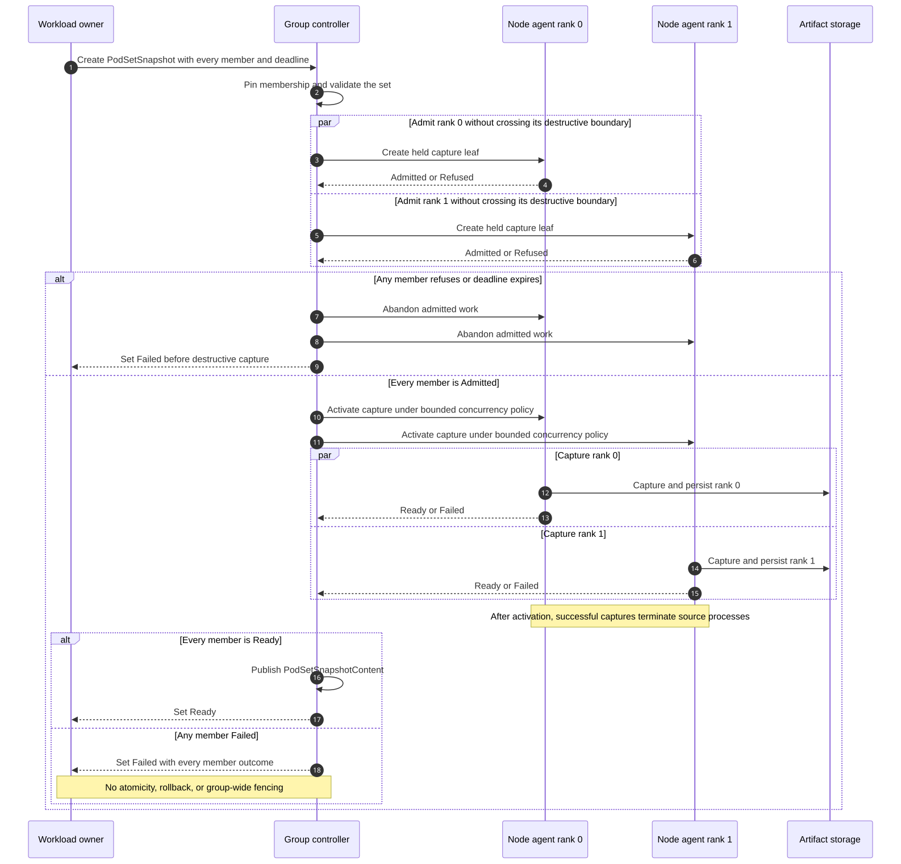
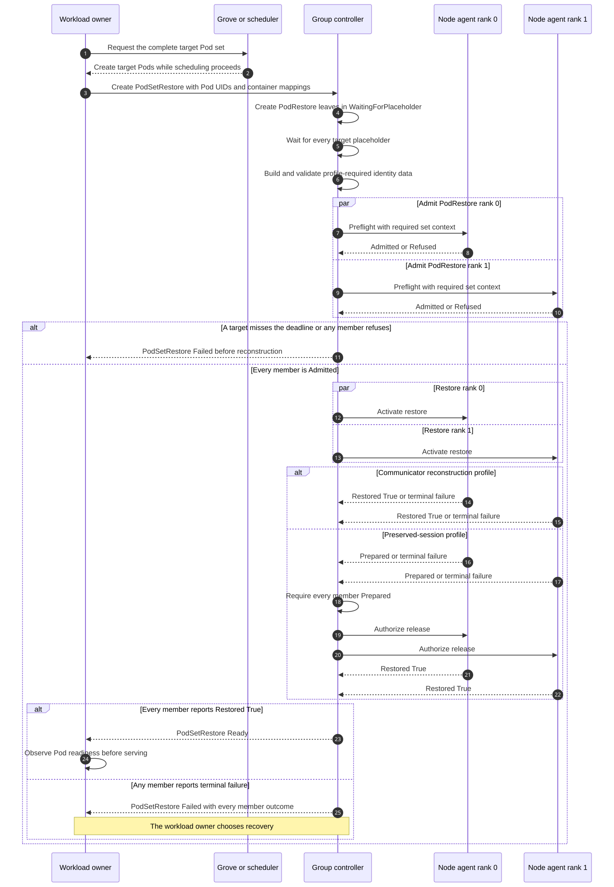

<!--
SPDX-FileCopyrightText: Copyright (c) 2026 NVIDIA CORPORATION & AFFILIATES. All rights reserved.
SPDX-License-Identifier: Apache-2.0
-->

# SNEP-324: Coordinated Multi-Pod Snapshot and Restore

<!-- toc -->
- [Summary](#summary)
- [Motivation](#motivation)
  - [Goals](#goals)
  - [Non-Goals](#non-goals)
- [Proposal](#proposal)
  - [User Stories](#user-stories)
    - [Checkpoint a Multi-Node Replica](#checkpoint-a-multi-node-replica)
    - [Restore a Multi-Node Replica](#restore-a-multi-node-replica)
  - [Limitations, Risks, and Mitigations](#limitations-risks-and-mitigations)
- [Design Details](#design-details)
  - [API](#api)
    - [<code>PodSetSnapshot</code>](#podsetsnapshot)
    - [<code>PodSetSnapshotContent</code>](#podsetsnapshotcontent)
    - [<code>PodSetRestore</code>](#podsetrestore)
    - [<code>PodRestore</code>](#podrestore)
  - [Group Identity and Leaf Reuse](#group-identity-and-leaf-reuse)
  - [Security](#security)
  - [Checkpoint Flow](#checkpoint-flow)
  - [Restore Flow](#restore-flow)
  - [Network Identity and Socket Restore](#network-identity-and-socket-restore)
  - [Failure and Recovery](#failure-and-recovery)
  - [Ownership and Scheduling](#ownership-and-scheduling)
  - [Initial Qualification Target](#initial-qualification-target)
  - [Open Design Decisions](#open-design-decisions)
  - [Normative Requirements](#normative-requirements)
  - [Configuration](#configuration)
  - [Performance and Scalability](#performance-and-scalability)
  - [Monitoring](#monitoring)
  - [Dependencies](#dependencies)
  - [Test Plan](#test-plan)
  - [Graduation Criteria](#graduation-criteria)
- [Implementation History](#implementation-history)
- [Alternatives](#alternatives)
  - [Restore Every Pod Independently](#restore-every-pod-independently)
  - [Preserve the Original Pod IP Addresses](#preserve-the-original-pod-ip-addresses)
  - [Put the Protocol in a Workload Scheduler](#put-the-protocol-in-a-workload-scheduler)
  - [Let Each Inference Backend Coordinate Kubernetes Restore](#let-each-inference-backend-coordinate-kubernetes-restore)
  - [Coordinate the Group Only in Dynamo](#coordinate-the-group-only-in-dynamo)
  - [Extend <code>SnapshotJob</code> to Multiple Pods](#extend-snapshotjob-to-multiple-pods)
- [Appendix](#appendix)
  - [References](#references)
<!-- /toc -->

## Summary

This SNEP defines a Kubernetes protocol for checkpointing and restoring a fixed
set of mutually dependent Pods as one Snapshot operation. The protocol freezes
membership, assigns stable logical member identities, admits every leaf before
any leaf crosses its declared destructive boundary, coordinates bounded
execution of the existing per-Pod checkpoint and restore paths, supplies every
member with the network identity data required by its qualified profile, and
reports one aggregate result. It does not make distributed checkpoint or
restore atomic.

## Motivation

Snapshot currently treats each Pod as an independent checkpoint and restore
target. That is insufficient for multi-node workloads whose restored process
state contains connections and identities belonging to other members of the
group, including MPI sockets, NCCL bootstrap connections, peer address tables,
and engine rank metadata.

A controlled two-node TensorRT-LLM TP=2 experiment exposed the first concrete
failure:

1. Both ranks completed NCCL checkpoint preparation and capture.
2. Restore failed during CRIU socket reconstruction, before CUDA or NCCL
   restore.
3. Each restore received only its local old-to-new Pod IP mapping, while the
   restored process state also referenced its peer's old IP.

The existing CRIU remap plugin accepts multiple address mappings, but the
current Snapshot restore path constructs only the local Pod mapping. The
observed preserved-session path therefore needs the complete group-level
mapping at every member. Whether a communicator-reconstruction profile also
needs peer mappings depends on whether its disconnect path clears stale peer
addresses before reconstruction; that remains an explicit qualification
question.

That mapping is necessary but not sufficient. The standalone restore path
currently converts an established TCP socket whose reciprocal endpoint is
outside the local checkpoint image into an unconnected socket. A group restore
that preserves member-to-member TCP sessions must identify in-group peers,
retain those sockets, apply the complete map, and coordinate reconstruction of
both endpoints. A backend that instead rebuilds its communicator must declare
and validate that lifecycle explicitly.

Independent per-Pod execution also provides no group identity or aggregate
result. A partial capture may appear usable, and callers cannot tell whether
every member of one logical checkpoint or restore attempt succeeded. Snapshot
needs a durable group coordinator above its existing per-Pod execution paths,
while preserving the failure semantics of those paths.

The group protocol does not by itself make every communication stack
checkpoint-safe. Inference engines and communication libraries remain
responsible for the lifecycle of persistent communication resources they own.

### Goals

- Represent one immutable group checkpoint separately from any particular
  restore attempt.
- Reuse the existing per-Pod capture and restore machinery as subordinate leaf
  operations.
- Validate and admit every member before any member crosses its declared
  destructive boundary.
- Execute member work with capability-aware, bounded concurrency and explicit
  synchronization points.
- Publish group success only when every member operation succeeds.
- Deliver the validated source-to-target network identity data required by each
  qualified restore profile.
- Preserve existing per-Pod checkpoint, restore, and failure semantics.
- Make group publication, failure aggregation, retry, cancellation, and cleanup
  durable and idempotent.
- Compose with Grove or another scheduler without moving gang or topology-aware
  scheduling into Snapshot.
- Qualify an initial two-node TensorRT-LLM TP=2 workload using NCCL Socket.

### Non-Goals

- Automatic workload or group-member discovery.
- A mandatory dependency on Grove or any other workload manager.
- Cross-namespace or cross-cluster restore.
- Elastic membership or topology changes during restore.
- In-flight request migration.
- Atomic all-or-nothing checkpoint or restore, rollback to the pre-operation
  workload state, or a guarantee that the source workload remains operational
  after capture starts.
- Automatic termination or fencing of members that completed normally solely
  because another member failed.
- Determining whether a restored workload is healthy or ready to serve.
- RDMA reconstruction.
- NVSHMEM, MNNVL, NVLS, FlashInfer multi-node collectives, MoE, or
  expert-parallel qualification.
- Transparent support for an unqualified inference backend, transport, or
  communication-resource lifecycle.

## Proposal

Snapshot adds a set-level API above the current `PodSnapshot`,
`PodSnapshotContent`, and restore-Pod contracts. A set checkpoint has one
immutable member list and becomes Ready only when every member artifact is
durable. Each restore attempt maps every logical member to exactly one existing
target Pod and destination container. A new `PodRestore` leaf makes target
identity, container mapping, set ownership, profile-required identity data, and
per-member outcome durable. The set becomes Ready only when every leaf reports
successful restoration.

The API is additive. Existing standalone APIs preserve their current
cardinality and behavior, including standalone one-to-many restore. V1 set
operations support exactly one source container and one destination container
per logical member. Set-created leaf objects are owned by the set operation and
cannot be activated independently because they do not contain enough context to
restore a rank safely.

The workload owner remains responsible for creating source and target Pods and
for their scheduling constraints. Grove may continue to create the Pods and
provide gang scheduling, topology-aware placement, and workload membership.
Snapshot pins those Pods by UID, provides group checkpoint and restore
coordination, and aggregates the existing per-Pod outcomes.



### User Stories

#### Checkpoint a Multi-Node Replica

As a workload controller, I can identify the complete set of Pods and target
containers for one distributed replica and create one `PodSetSnapshot`.
Snapshot admits the complete set before starting destructive per-Pod capture
and publishes one reusable set checkpoint only if every member succeeds.

#### Restore a Multi-Node Replica

As a workload controller, I can gang-schedule one replacement Pod per logical
member and create a `PodSetRestore` that maps the checkpoint's members to
those existing Pods by name and UID. Snapshot creates one durable `PodRestore`
per member, admits the complete target set and the profile-required identity
data before starting process reconstruction, then reports success only if every
target reports successful restoration.

### Limitations, Risks, and Mitigations

| Risk or limitation | Mitigation |
| --- | --- |
| Capture is destructive and one member may fail after another was captured. | Admit every member before releasing any member across its declared destructive boundary, never publish a partial set checkpoint as Ready, expose every member outcome, and leave workload recovery to its owner. Atomicity and rollback are explicitly not guaranteed. |
| A complete IP map does not by itself preserve established cross-Pod sockets. | Each supported profile declares whether its backend reconstructs the communicator or Snapshot preserves sessions. Preservation additionally requires coordinated network/session handling and a restore release barrier. |
| One target may restore while another fails. | Fail the aggregate set attempt, expose every member outcome, and apply the failure disposition declared by the selected profile. The disposition for an already-prepared sibling remains an open V1 decision. |
| A controller or node agent can restart during fan-out. | Persist operation identity, member identity, observed generation, leaf references, and per-member outcomes. Make reconciliation idempotent. |
| Grove `startsAfter` currently waits for Kubernetes Pod Ready and can prevent all restore placeholders from existing. | Omit or rewrite inter-member `startsAfter` dependencies for restore-shaped Pods, or add a Grove milestone that distinguishes placeholder availability from workload readiness. |
| Successful process restore does not imply serving readiness. | Complete `PodSetRestore` from the existing `nvidia.com/Restored` conditions. The workload owner separately observes Pod readiness and controls serving registration. |
| Backend or transport state may not survive checkpoint and restore. | Publish an explicit capability profile and qualify backend/transport combinations separately. |
| A pinned target may disappear or remain unschedulable indefinitely. | Fail immediately if the pinned UID disappears. Otherwise report a recoverable waiting condition and fail with a stable reason when the operation deadline expires. |
| Source Pods may restart or be replaced while a destructive set capture is in progress. | Require the workload owner to hold the exact source UIDs until the operation terminates. The enforcement mechanism must be selected before alpha qualification. |

## Design Details

### API

The API adds four resources in `nvidia.com/v1alpha1`. The field names below
are the proposed contract; implementation review may refine individual names
without collapsing the separation between checkpoint artifact and restore
attempt.

#### `PodSetSnapshot`

`PodSetSnapshot` is a namespaced capture request and binding. Its immutable
specification contains the complete source set and one operation deadline:

```yaml
apiVersion: nvidia.com/v1alpha1
kind: PodSetSnapshot
metadata:
  name: trtllm-replica-a
spec:
  deadlineSeconds: 1800
  members:
    - id: rank-0
      source:
        podRef:
          name: trtllm-rank-0
          uid: "<source-pod-uid>"
          containers: [engine]
    - id: rank-1
      source:
        podRef:
          name: trtllm-rank-1
          uid: "<source-pod-uid>"
          containers: [engine]
```

Its status contains:

- one subordinate `PodSnapshot` reference and local phase per logical member;
- member-scoped errors with stable reason codes;
- the bound `PodSetSnapshotContent` name; and
- group-level `Ready` and `Failed` conditions.

The source Pod UID is frozen before preparation so a same-named replacement
cannot be captured accidentally. V1 requires `containers` to contain exactly
one entry for every member. Supporting multi-container capture is separate
work and does not change existing standalone behavior.

#### `PodSetSnapshotContent`

`PodSetSnapshotContent` is the cluster-scoped, immutable artifact of record.
It contains:

- a namespace, name, and UID back-reference to its `PodSetSnapshot`;
- the immutable logical member list;
- each member's source network identity data required by the declared profile;
- one subordinate `PodSnapshotContent` reference per member; and
- artifact, protocol, and capability versions required for restore.

The content becomes Ready through one root publication point only after every
leaf artifact is durable. Atomic publication does not require all
artifacts to be stored in one file or storage transaction.

#### `PodSetRestore`

`PodSetRestore` is a namespaced restore attempt. It references one immutable
set checkpoint and maps every logical member to exactly one target Pod and
destination container:

```yaml
apiVersion: nvidia.com/v1alpha1
kind: PodSetRestore
metadata:
  name: trtllm-replica-a-restore-1
spec:
  deadlineSeconds: 1800
  snapshotRef:
    name: trtllm-replica-a
    uid: "<group-snapshot-uid>"
  targets:
    - id: rank-0
      podRef:
        name: trtllm-rank-0-restored
        uid: "<target-pod-uid>"
      containerMapping:
        source: engine
        destination: engine
    - id: rank-1
      podRef:
        name: trtllm-rank-1-restored
        uid: "<target-pod-uid>"
      containerMapping:
        source: engine
        destination: engine
```

The workload owner creates and schedules every target Pod before creating the
`PodSetRestore`. The caller supplies each existing target Pod's name and UID.
The controller validates and pins those identities, then derives their network
identities; the caller does not author an unvalidated CRIU remap table.

Every source member and every target appears exactly once. V1 has no optional
members. The controller copies each validated container mapping into the
member's `PodRestore`; it does not rely on a same-name-container default.

Status contains the canonical profile-required target identity data, or a
durable reference to it; one `PodRestore` reference and durable phase per
member; and set-level `Ready` and `Failed` conditions. Deadline expiry is
reported as `Failed=True` with reason `DeadlineExceeded`. `Ready` means every
member reports `nvidia.com/Restored=True`; it does not mean every Pod is
Kubernetes Ready or that the workload is ready to serve. Checkpoint artifacts
and restore attempts have separate identities so one checkpoint can be
restored repeatedly.

#### `PodRestore`

`PodRestore` is the namespaced, durable per-member restore work object. The set
controller creates and owns it; callers continue to use the existing
annotation-driven contract for standalone restore. A set-owned `PodSnapshot`
cannot be named by that standalone annotation. The controller also rejects
standalone activation when the referenced `PodSnapshot` resolves to a set-owned
`PodSnapshotContent`.

Each `PodRestore` contains:

- the owning `PodSetRestore` name and exact UID;
- the logical member ID;
- the exact subordinate `PodSnapshotContent` name and UID;
- the target Pod name and UID;
- the explicit source-to-destination container mapping;
- the validated profile-required network identity data or a durable reference
  to it;
- the selected backend/session capability profile; and
- any durable hold and release input required by that profile.

Its status contains stable per-member reasons and enough phase information to
distinguish waiting for a placeholder, admitted, restoring, prepared and held,
released, restored, failed, and deadline exceeded. Profiles that reconstruct
their communicator may move from local restore directly to Restored. A profile
that preserves established sessions must expose a prepared-and-held state and
must not become Restored until the set controller authorizes release.

The controller and admission layer validate the exact owning set UID and reject
activation outside that context. A reference field alone is not treated as an
authorization boundary.

The set capture path also needs additive ownership plus held-admission and
activation state on a set-owned `PodSnapshot` or an equivalent durable leaf
work record. The exact encoding is part of the open leaf coordination contract;
standalone `PodSnapshot` behavior remains unchanged.

### Group Identity and Leaf Reuse

Every member has a stable logical ID independent of Pod name, UID, IP address,
node, or creation order. A workload controller may use an opaque ID or a stable
component, replica, role, and rank tuple. The complete member list is resolved
before the operation starts; Snapshot V1 does not discover members by
understanding every possible workload-controller API.

Existing `PodSnapshot` and `PodSnapshotContent` mechanisms remain the per-Pod
capture path. `PodRestore` makes the existing restore-Pod execution path durable
for a set-owned member. Their artifacts are subordinate to the set checkpoint
and are not independently advertised as usable workload checkpoints.

Set-created leaf objects carry the set UID and logical member ID. Standalone
restore of a set-owned leaf artifact is rejected unless an authorized
`PodSetRestore` supplies the complete set context.

`SnapshotJob` remains a single-Pod, capture-only convenience API that creates
and owns a Kubernetes Job. It does not become the group coordinator because
the workload owner, including Dynamo or Grove, owns creation of multi-node
source and target Pods.

### Security

This proposal does not reduce the privileges required by Snapshot. Node agents
still perform privileged CRIU, container-runtime, mount, and CUDA operations,
and checkpoint artifacts can contain process memory, credentials, and other
workload secrets. Deployment policies and existing mechanisms for artifact
encryption, access control, retention, and node isolation continue to apply to
every subordinate artifact and to the group manifest.

The set APIs add several authorization and isolation requirements:

- V1 accepts source and target Pods only from the namespaced set object's
  namespace. A caller cannot use a set operation to capture or restore a Pod
  in another namespace.
- Every Pod, group checkpoint, restore attempt, and subordinate artifact
  reference includes a UID where applicable. Reconcilers reject a same-named
  object recreated with a different UID.
- Creating a `PodSetRestore` does not grant access to its referenced
  `PodSetSnapshotContent` or leaf artifacts. The controller and node agents
  enforce the same RBAC and storage authorization as standalone restore.
- Set-owned leaf artifacts reject standalone restore so a caller cannot bypass
  the set mapping or compatibility checks.
- The controller validates membership cardinality, uniqueness, and supported
  size before dispatching node work to limit resource-exhaustion and oversized
  API-object attacks.

Group status exposes member identity, Pod references, failure reasons, and any
profile-required network identity data or a reference to it. RBAC must treat
these fields as workload metadata and restrict them consistently with existing
Snapshot resources. Logs and metrics must not expose checkpoint contents,
credentials, or unbounded identity values.

### Checkpoint Flow

A set checkpoint proceeds as follows:

1. The caller supplies the complete source member list. Every member is
   required in V1.
2. Snapshot freezes membership and validates every controller-observable,
   non-destructive condition for the complete set, including Pod identity,
   readiness, node-agent availability, artifact storage, and declared
   capabilities.
3. Snapshot creates set-owned per-Pod snapshot leaves in a held admission mode.
   Each leaf performs its node-local preflight and reports Admitted or Refused
   without crossing its declared destructive boundary.
4. Snapshot waits for every leaf to report Admitted. If any leaf refuses or the
   deadline expires, Snapshot abandons work that has not crossed a destructive
   boundary, marks the set Failed, and does not start capture.
5. After every leaf is admitted, Snapshot releases capture work with
   capability-aware bounded concurrency and any synchronization required by
   the selected profile. Each leaf declares the point after which it cannot be
   abandoned without changing the source workload. This point may precede CRIU
   dump-and-kill when a CUDA interposition shim is involved.
6. Snapshot waits for every leaf artifact. If every leaf succeeds, Snapshot
   publishes `PodSetSnapshotContent` as Ready. If any leaf fails, Snapshot marks
   the set Failed and does not publish a usable set checkpoint.

The held admission mode is additive to the set-owned capture path. Creating a
standalone `PodSnapshotContent` retains its existing self-starting behavior.
The leaf contract must make the Admitted state durable and restart-safe before
the group controller relies on it.

The workload must complete any collective application quiescence or
communicator preparation before its Pods become snapshot-ready. Snapshot's
group validation reduces predictable partial failure but cannot prove that
every CRIU or CUDA capture will succeed.

Checkpoint capture is destructive: Snapshot terminates the captured source
process. Current standalone capture does not define a `snapshot-complete`
sentinel. Set publication controls artifact visibility, not source-process
lifetime. Once a released leaf crosses its declared destructive boundary, some
source processes may be terminated even when the set fails; Snapshot does not
roll them back.

From the start of admission until the set operation terminates, the workload
owner must keep the exact source Pod UIDs from restarting, being replaced, or
resuming normal workload execution. A finalizer preserves an API record, not a
process, and scheduling does not prevent kubelet restart. The enforcement
mechanism is therefore an explicit open decision between a workload-owner or
Grove hold contract and a snapshot-aware container wrapper. A workload-owner or
Grove hold can observe set-level status. A wrapper running inside the Pod cannot
and therefore requires a local terminal signal that distinguishes successful
capture from failure. Choosing the wrapper also chooses that additional local
protocol requirement.



### Restore Flow

A set restore proceeds as follows:

1. Snapshot loads the complete set checkpoint record.
2. The workload owner asks Grove or another workload manager to create and
   schedule one restore-shaped target Pod for every logical member.
3. After every target Pod exists, the caller creates `PodSetRestore` with the
   exact Pod names, UIDs, and container mappings.
4. Snapshot validates the pinned target identities and creates one `PodRestore`
   per member with exact set ownership, target identity, container mapping, and
   capability profile. Each leaf enters WaitingForPlaceholder until its target
   is scheduled and its placeholder is available. An unscheduled or temporarily
   unavailable target remains visible through its leaf while it may recover and
   becomes terminal when the operation deadline expires. If the pinned target
   UID disappears, that leaf fails immediately with a stable terminal reason
   because the same identity cannot return.
5. After every placeholder is available, Snapshot determines and validates the
   identity data required by the selected profile and stores it in the leaves.
   Every leaf then performs compatibility and node-local preflight and reports
   Admitted or Refused before any leaf starts process reconstruction.
6. After every leaf is admitted, Snapshot activates restore work with
   capability-aware bounded concurrency and the selected profile's required
   synchronization.
7. A communicator-reconstruction profile completes each member through the
   existing local restore path. A preserved-session profile instead holds each
   member in Prepared after local reconstruction; only after every member is
   Prepared may the set controller authorize release.
8. If every target reports `nvidia.com/Restored=True`, Snapshot marks
   `PodSetRestore` Ready. If any target reports a terminal restore failure or
   the deadline expires, Snapshot marks the set Failed and retains every member
   outcome.
9. The workload owner separately observes Kubernetes Pod readiness and decides
   when the restored group may receive serving traffic.



The durable `PodRestore` member phases are profile-dependent:

```text
Pending -> WaitingForPlaceholder -> Admitting -> Admitted -> Restoring
  communicator reconstruction: -> Restored
  preserved sessions:           -> Prepared -> Released -> Restored
```



Set restore retains the standalone meaning of completion: the restored process
has completed the selected local restore contract. For communicator
reconstruction, the node agent writes `restore-complete` and reports
`nvidia.com/Restored=True` when that local contract succeeds. For a
preserved-session profile, local reconstruction ends in Prepared, not Restored;
no agent may write `restore-complete` or report `nvidia.com/Restored=True` until
every member is Prepared and release is authorized. Agents observe release
asynchronously, so simultaneous Pod readiness is neither promised nor required.
`PodSetRestore` does not wait for Kubernetes Pod Ready or serving readiness.

### Network Identity and Socket Restore

Identity-map scope is profile-dependent. A session-preservation profile receives
the complete map of every changed source Pod IPv4 address to its corresponding
target Pod IPv4 address so both local and peer endpoints can be rewritten.

For a communicator-reconstruction profile, the required scope is not yet
confirmed. Qualification must determine whether the disconnect path clears all
stale peer-address state before reconstruction. Until that is demonstrated, a
reconstruction profile cannot assume that local-only mapping is sufficient.

Every qualified backend profile declares exactly one session policy:

- **Communicator reconstruction:** established communication sessions need not
  survive, and the backend reconstructs and validates its communicator before
  local restore completes.
- **Session preservation:** the restore path does not apply the standalone
  external-peer disconnection behavior to a qualified in-set connection. It
  retains and remaps both endpoints, performs coordinated network/session
  handling, and holds every member at a release barrier.

Session preservation fails closed when a peer cannot be resolved uniquely to a
member. Successful qualification of one policy does not imply qualification of
the other.

The immutable set checkpoint records each source identity. The profile-required
target identity data is a restore work order and belongs to `PodSetRestore` and
its `PodRestore` leaves. Pod annotations are not the source of truth for the
mapping, ownership, activation, or aggregate member state.

Missing, duplicate, ambiguous, or unsupported mappings required by the selected
profile fail restore before process reconstruction begins.

### Failure and Recovery

A failure in any member fails the set operation; V1 has no optional members.

If any checkpoint leaf refuses admission, no member may cross its destructive
boundary. After the controller releases admitted leaves, the operation is
non-atomic. A failed set may contain both a member whose source process was
terminated and a member whose source remains running. Snapshot publishes no
Ready set checkpoint, exposes every leaf outcome, and does not promise rollback
or group-wide fencing. The workload owner decides how to recover or recreate
the source workload.

For restore, an incompatible target leaves its placeholder running and reports
`RestoreIncompatible`. An execution failure follows the node agent's fail-closed
behavior and reports `RestoreFailed`. Under communicator reconstruction, a
successfully restored sibling retains the standalone outcome. Under session
preservation, a sibling already in Prepared must not be released after another
member fails; whether it remains parked or is terminated is an open V1 decision
that the chosen profile must make explicit. `PodSetRestore` reports Failed with
every member outcome, and the workload owner decides how to repair or recreate
the distributed replica.

Group operation state survives controller restart. Reconciliation does not
duplicate leaf creation or already completed per-Pod work. Operation identity,
member identity, observed generation, leaf references, and durable per-member
outcomes fence repeated work. Every wait is bounded by the object's operation
deadline. A target that remains unscheduled or cannot reach its placeholder
before that deadline produces a terminal `DeadlineExceeded` result. A pinned
target UID that disappears fails immediately because that identity cannot
return.

Deletion and cancellation have distinct semantics. Deleting a
`PodSetSnapshot` or `PodSetRestore` stops creation or activation of new leaf
work, but cannot undo work past a destructive boundary. A controller-managed
finalizer orders cleanup; Kubernetes finalizer ordering is not relied upon.
Deletion of a set snapshot rejects new restore attempts and waits for existing
referencing restores to terminate. It then removes its set-owned namespaced
leaves, the cluster-scoped content record, subordinate content, and managed
artifacts before the finalizer is removed. V1 does not provide a `Retain`
policy. Deletion of a set restore removes its `PodRestore` leaves but never
deletes caller-owned target Pods. While cleanup is incomplete the object remains
Terminating and exposes the remaining cleanup through conditions and Events;
after deletion, absence of the object is the caller-visible outcome.

A durable user-requested cancellation API is still open. It may be terminal
cancellation recorded on a surviving object or reversible suspension, but it
must not be described as a durable outcome on an object whose deletion removes
that status.

### Ownership and Scheduling

The workload owner or caller owns:

- source and target Pod creation;
- group membership and logical role or rank assignment;
- placement and scheduling requirements;
- holding exact source Pod UIDs against restart, replacement, and normal
  workload execution while a set capture is active; and
- observing Pod readiness, recovering failed workloads, and deciding when a
  restored group may receive serving traffic.

Snapshot owns:

- frozen operation membership and identity;
- the group checkpoint and restore-attempt identities;
- profile-required network identity handling;
- leaf admission, activation, bounded execution, aggregate publication,
  failure reporting, and artifact cleanup; and
- the final group result.

Node agents and leaf execution paths own node-local runtime interaction, CRIU
and CUDA execution, and per-member status and artifacts. Inference engines and
communication libraries own application quiescence, persistent
communication-resource lifecycle, local checkpoint and restore ordering, and
post-restore communicator validation.

Grove or another workload manager creates the source and target Pods and owns
their gang scheduling and topology-aware placement. The caller creates
`PodSetRestore` only after every target Pod exists, including its UID.
Snapshot does not duplicate those responsibilities. Restore adds one
constraint: every target container must reach placeholder-available
state before Snapshot admits or activates set-owned per-Pod restore work. The
`PodRestore` leaf may already exist in WaitingForPlaceholder.

Grove `startsAfter` currently waits for the prerequisite clique's Pods to
become Kubernetes Ready. This can create a cycle when a dependent rank is not
created until another clique becomes Ready, while that clique cannot restore
through the group path until every target placeholder exists. For V1, the
workload owner may omit or rewrite inter-member
`startsAfter` dependencies for restore-shaped Pods while preserving gang and
topology constraints. Alternatively, Grove may add a restore-aware milestone
that distinguishes placeholder availability from workload readiness.



No Grove API change is required for membership, gang scheduling, or topology
placement. A Grove enhancement is required only if its existing API cannot
express the placeholder-availability behavior needed before group restore
activation.

### Initial Qualification Target

The first qualification target is:

- one TensorRT-LLM replica;
- dense TP=2;
- two Pods on two nodes;
- one GPU per Pod;
- one Kubernetes namespace and cluster;
- no in-flight requests;
- checkpoint after engine initialization and before serving registration;
- NCCL Socket transport;
- a readiness probe that validates TensorRT-LLM and communicator health;
- artifact storage accessible from all source and target nodes; and
- restore may relocate either member and assign new Pod IPs.

This target is not a supported profile until the experiment demonstrates either
communicator reconstruction or session preservation and the SNEP records that
choice. If it requires session preservation, the `PodRestore` prepared state,
release input, restart recovery, and failed-sibling disposition are V1
requirements. If TensorRT-LLM reconstructs and validates its communicator, that
profile does not require a set release barrier. The same qualification must
determine whether its disconnect and reconstruction path requires complete peer
identity mappings or only local remapping.

CUDA graphs are disabled unless the backend demonstrates that every
graph-visible communicator and allocation remains valid across the selected
checkpoint and restore lifecycle. Enabling CUDA graphs is a separate
qualification dimension, not an implied property of NCCL Socket support.

Passing this profile does not imply support for other NCCL transports or
communication-resource paths.

### Open Design Decisions

The following decisions remain open and keep this SNEP in draft:

1. **Initial session policy.** The TensorRT-LLM TP=2 experiment must determine
   whether the initial NCCL Socket profile reconstructs its communicator or
   requires preservation of established cross-Pod sessions.
2. **Leaf coordination contract.** The Snapshot leaf must expose side-effect-safe
   refusal, a declared destructive boundary, durable admission or preparation,
   and restart-safe activation. A preserved-session profile additionally needs
   a durable external release input. This contract is being aligned with
   SNEP-295 rather than inferred from its current implementation.
3. **Prepared-sibling failure.** For session preservation, the proposal must
   choose whether a prepared sibling remains parked or is terminated when
   another member fails before release.
4. **Source hold enforcement.** The proposal must choose a workload-owner or
   Grove hold contract, or a snapshot-aware container wrapper. Finalizers and
   scheduling alone do not keep a source process alive or prevent restart. A
   wrapper also requires a local terminal capture signal because it cannot
   observe set-level status directly.
5. **Cancellation model.** The proposal must choose terminal cancellation or
   reversible suspension and define its durable outcome independently of
   deletion.
6. **Identity-map scope.** The proposal must determine whether communicator
   reconstruction still requires complete peer mappings or whether its
   disconnect path clears stale peer-address state before reconstruction. Each
   qualified profile must declare its required mapping scope.

### Normative Requirements

The key words **MUST**, **MUST NOT**, **SHOULD**, **SHOULD NOT**, and **MAY**
are interpreted as described in [RFC 2119].

1. A multi-Pod checkpoint **MUST** have one set operation identity and one
   durable set checkpoint identity.
2. The complete member list **MUST** be resolved and frozen before admission.
   Every member is required in V1.
3. Every member **MUST** have a stable logical identity independent of Pod name,
   UID, IP address, node, and creation order.
4. Source and target Pods **MUST** map one-to-one through logical member
   identity. V1 **MUST** map exactly one source container to exactly one
   destination container per member.
5. Set checkpoint publication **MUST** require every member and artifact.
   Per-member success **MUST NOT** be exposed as set success.
6. Every leaf **MUST** complete its admission checks before any leaf crosses its
   declared destructive boundary.
7. A leaf **MUST** declare the point after which it cannot be abandoned without
   changing the source or target workload. The group controller **MUST NOT**
   assume that this boundary is CRIU dump-and-kill.
8. Snapshot **MUST** use capability-aware bounded concurrency and honor the
   synchronization points declared by the selected profile.
9. Snapshot **MUST NOT** claim atomic checkpoint, atomic restore, or rollback
   of work that has crossed a leaf's destructive boundary.
10. Every restore **MUST** receive the validated source-to-target identity data
    required by its qualified profile. A session-preservation profile **MUST**
    receive the complete set mapping. Missing, duplicate, ambiguous, or
    unsupported required mappings **MUST** fail before process reconstruction.
11. A member failure **MUST** fail the set operation. A profile **MUST** define
    the disposition of a sibling that has already reached a non-resumable or
    prepared state.
12. Set and leaf state **MUST** survive controller and agent restart, remain
    idempotent, and **MUST NOT** duplicate completed per-Pod work.
13. Every set operation **MUST** have a deadline. A target that cannot reach
    placeholder-available state before that deadline **MUST** terminate with a
    stable reason. A pinned target UID that disappears **MUST** fail immediately
    with a distinct terminal reason.
14. Deletion **MUST** stop work that has not been activated, order cleanup
    through controller logic, preserve caller-owned Pods, and **MUST NOT** claim
    to roll back completed leaf work.
15. Any cancellation API **MUST** expose a durable outcome independently of
    deletion and **MUST** state whether cancellation is terminal or reversible.
16. The protocol **MUST NOT** depend on a particular workload controller or
    scheduler. Gang and topology-aware scheduling **MUST NOT** be reimplemented
    by Snapshot.
17. V1 **MUST** remain within one Kubernetes namespace and cluster.
18. Backend, transport, topology, and session policy combinations **MUST** be
    qualified separately before being advertised.
19. Checkpoint artifacts and restore attempts **MUST** have separate identities
    so one checkpoint can be restored repeatedly.
20. A set-owned leaf artifact **MUST NOT** be restored outside the exact
    authorized `PodSetRestore` UID and member context.
21. Snapshot **MUST** expose additive durable APIs for the set checkpoint,
    immutable set content, set restore attempt, and per-member `PodRestore`.
22. The set restore API **MUST** reference one immutable set checkpoint and map
    every logical member to exactly one pinned target Pod UID and container.
23. Existing standalone `PodSnapshot`, `SnapshotJob`, and annotation-driven
    restore cardinality and behavior **MUST NOT** be changed by a set operation.
24. Every target placeholder **MUST** be available, and all identity data
    required by the selected profile **MUST** be valid, before Snapshot
    activates any set-owned restore leaf.
25. A communicator-reconstruction profile **MUST** reconstruct and validate the
    communicator before reporting the member Restored.
26. A preserved-session profile **MUST** distinguish in-set peers from external
    peers, **MUST NOT** apply the standalone external-peer disconnection policy
    to a qualified in-set connection, and **MUST** hold every member until all
    members are Prepared and release is authorized.
27. For a preserved-session profile, an agent **MUST NOT** write
    `restore-complete` or report `nvidia.com/Restored=True` before release.
28. `PodSetRestore` **MUST** become Ready only from successful `PodRestore`
    outcomes and **MUST NOT** depend on Kubernetes Pod Ready or serving
    readiness.
29. The workload owner **MUST** keep exact source Pod UIDs from restarting,
    being replaced, or resuming normal execution from admission until the set
    capture terminates. The selected integration **MUST** enforce this contract.

### Configuration

This proposal introduces no feature-gate framework. The four additive CRDs are
installed and upgraded through Snapshot's existing CRD installation path.
Creating no set resource leaves standalone `PodSnapshot`, `SnapshotJob`, and
annotation-driven restore behavior unchanged. Operation deadlines and
capability profiles are fields of the set API rather than out-of-band feature
flags.

The initial qualification target uses the existing Snapshot artifact-storage,
CRIU, CUDA checkpoint, and restore compatibility configuration. Backend and
transport and session-policy capability are recorded in the checkpoint rather
than selected by an out-of-band annotation. The initial qualification covers
exactly two members; a general maximum set size remains an implementation
decision informed by the scalability tests below.

### Performance and Scalability

Set validation, admission, capture, and restore use bounded concurrency. A
profile may require all members to run a phase concurrently or may permit a
smaller controller-selected bound; the protocol does not impose unconditional
fan-out. Completion time is dominated by the slowest member and by explicit
barriers, while artifact bytes remain the sum of the existing per-Pod artifacts
plus a small set manifest.

API object size and controller work grow linearly with member count. When a
profile requires a complete network identity map, that map has linear size and
is delivered to every member, producing quadratic aggregate distribution work.
The initial two-member profile does not establish a general scale limit. Tests
must measure reconciliation latency, API-object size, controller memory,
identity-data distribution, and cleanup time at increasing set sizes before
beta limits are selected.

The implementation must avoid unbounded fan-out that can starve unrelated
standalone or set operations. The selected concurrency bound must not violate a
profile's collective timing requirements. Metrics and logs avoid member
identity labels whose cardinality grows with set size.

### Monitoring

The set resources and `PodRestore` leaves expose Kubernetes conditions and
member status sufficient to answer which phase is active, which leaf is still
pending or held, whether every leaf is admitted or prepared, whether release is
authorized, whether a failure is terminal, when the deadline expires, and what
cleanup remains. Conditions use stable reason codes and include observed
generation and transition time.

The operator emits Kubernetes Events for set acceptance, validation failure,
leaf admission or refusal, activation, checkpoint publication, restore
preparation and release, completion, deadline expiry, set failure, deletion or
cancellation, and cleanup failure.

Metrics cover operation count, duration, and failure count by operation type,
phase, result, and stable reason. Member IDs, Pod names, UIDs, IP addresses, and
artifact paths are excluded from metric labels to avoid unbounded cardinality.
Logs carry the set UID, restore-attempt UID, member ID, and leaf operation UID
as structured correlation fields.

### Dependencies

- Existing Snapshot `PodSnapshot`, `PodSnapshotContent`, restore-Pod, CRIU,
  CUDA checkpoint, compatibility-preflight, and artifact-storage paths, extended
  with the durable leaf admission contract required by this SNEP.
- The local admission, prepared/held, release, and restart contract being
  aligned with SNEP-295.
- A backend and communicator lifecycle qualified for checkpoint and restore,
  including an explicit communicator-reconstruction or session-preservation
  policy.
- A workload owner capable of creating the complete source and target Pod set.
- A workload-owner integration capable of enforcing the source hold contract.
- A scheduler or workload manager capable of placing the target set. Grove is
  optional.
- A placeholder-startup policy that does not wait for restored workload
  readiness before all required targets exist.

### Test Plan

Unit tests cover API validation, immutable required membership, the
one-container-per-member limit, explicit source-to-destination container
mapping, exact UID ownership, deadlines, phase transitions, idempotent leaf
creation, ordered cleanup, and profile-dependent identity-data construction.

Controller integration tests cover:

- admission refusal before any leaf crosses its destructive boundary;
- failure after one admitted leaf crosses its destructive boundary;
- one incompatible target while every sibling remains admitted but inactive;
- communicator-reconstruction and session-preservation state paths;
- one prepared member followed by sibling failure, using the selected
  disposition;
- controller restart during admission, activation, prepared hold, release, and
  result aggregation;
- node-agent retry without duplicate capture or restore;
- rejection of standalone restore from a set-owned leaf and of a mismatched set
  UID;
- missing, deleted, and unschedulable targets before and at the operation
  deadline;
- mapping-scope validation for communicator reconstruction and session
  preservation;
- cancellation and deletion during each nonterminal phase; and
- source restart and replacement attempts while the source hold is active.

End-to-end qualification uses the initial qualification target and verifies:

1. cold initialization and inference;
2. checkpoint of both members;
3. restore onto newly scheduled Pods;
4. both-changed, one-changed, and unchanged Pod-IP cases;
5. delivery of the mapping scope declared by the selected profile, including
   complete peer mappings for session preservation;
6. the selected communicator-reconstruction or session-preservation policy;
7. for session preservation, no completion sentinel before every member is
   Prepared and release is authorized;
8. successful process, CUDA, and communicator restoration;
9. correct post-restore inference;
10. repeated restore from the same checkpoint;
11. injected single-member failure, exact per-member status, and workload-owner
    recovery; and
12. a Grove-managed restore with placeholder-safe `startsAfter` handling.

### Graduation Criteria

Alpha requires the four resources in `v1alpha1`; resolution of every open design
decision in this SNEP; the initial qualified profile; controller and node-agent
restart coverage; deadline, deletion, and failure-injection coverage; and
end-to-end evidence for repeated restore and Pod-IP relocation. Documentation
must state the exact qualified backend, transport, session policy, CUDA-graph,
namespace, and cluster boundaries.

Beta requires operational evidence for the declared supported profiles,
upgrade and downgrade behavior, published metrics and runbooks, and no known
path that exposes a partial group as Ready.

GA requires a stable API version, documented compatibility and storage
policies, scale and longevity testing, conformance coverage for supported
profiles, and a migration plan from the alpha and beta APIs.

## Implementation History

- 2026-09: Initial SNEP drafted from the multi-node Snapshot investigation.

## Alternatives

### Restore Every Pod Independently

Independent restore cannot construct profile-required peer identity mappings
when they are needed or provide one durable group result. A partial group may
appear successful even though a required member failed.

### Preserve the Original Pod IP Addresses

Preserving IPs constrains scheduling and relies on networking behavior that
Kubernetes does not generally guarantee. It also does not address group
publication, cleanup, or non-network peer identities.

### Put the Protocol in a Workload Scheduler

A scheduler such as Grove can provide membership and placement, but it should
not own CRIU and CUDA ordering, backend lifecycle, artifact publication, or
Snapshot cleanup policy.

### Let Each Inference Backend Coordinate Kubernetes Restore

This duplicates Kubernetes orchestration, identity, failure semantics, and
cleanup across TensorRT-LLM, vLLM, and SGLang. Backends should own their
communication-resource lifecycle while Snapshot owns the outer Kubernetes
operation.

### Coordinate the Group Only in Dynamo

Dynamo could aggregate multiple leaf snapshots for an integration-specific
prototype. That leaves Snapshot unable to represent the real artifact
boundary, requires callers to reproduce result aggregation and cleanup
semantics, and makes complete remap delivery an out-of-band contract. The
generic group mechanics belong in Snapshot while Dynamo remains a
workload-specific caller.

### Extend `SnapshotJob` to Multiple Pods

`SnapshotJob` owns creation of one capture Job and is intentionally
capture-only. Extending it to own a multi-Pod workload conflicts with Dynamo or
Grove ownership of membership, rank assignment, gang scheduling, and topology
placement. The group API instead composes caller-owned Pods and existing
per-Pod artifacts.

## Appendix

### References

- [RFC 2119]
- [Dynamo DEP #13220: Composable container checkpoint/restore and CUDA data
  plane](https://github.com/ai-dynamo/dynamo/issues/13220)
- [Dynamo PR #12961: Stable CUDA launch-job
  identity](https://github.com/ai-dynamo/dynamo/pull/12961)
- [Dynamo PR #2269: Grove multi-node
  support](https://github.com/ai-dynamo/dynamo/pull/2269)
- [Dynamo PR #2405: Grove deployment type
  integration](https://github.com/ai-dynamo/dynamo/pull/2405)
- [Snapshot API types](https://github.com/ai-dynamo/snapshot/tree/main/api/v1alpha1)
- [Snapshot workload
  contract](https://github.com/ai-dynamo/snapshot/blob/main/docs/reference/workload-contract.md)
- [Snapshot restore-Pod
  contract](https://github.com/ai-dynamo/snapshot/blob/main/docs/reference/restore-pod-contract.md)
- [Snapshot per-Pod INET
  remap](https://github.com/ai-dynamo/snapshot/blob/main/agent/internal/criu/inet_remap.go)
- [Snapshot CRIU INET remap
  plugin](https://github.com/ai-dynamo/snapshot/blob/main/agent/plugins/inet-remap/snapshot_inet_remap.c)
- [Snapshot socket restore
  handling](https://github.com/ai-dynamo/snapshot/blob/main/agent/internal/criu/restore_images.go)
- [Snapshot PR #140: Restore compatibility
  checks](https://github.com/ai-dynamo/snapshot/pull/140)
- [Snapshot issue #295: Checkpointing same-node CUDA peer
  mappings](https://github.com/ai-dynamo/snapshot/issues/295)
- [Snapshot issue #294: Cross-node relocation coverage for one multi-GPU
  Pod](https://github.com/ai-dynamo/snapshot/issues/294)
- [Grove `startsAfter`
  API](https://github.com/ai-dynamo/grove/blob/main/operator/api/core/v1alpha1/podclique.go)
- [Grove `startsAfter` readiness
  implementation](https://github.com/ai-dynamo/grove/blob/main/operator/initc/internal/wait.go)
- [Grove](https://github.com/ai-dynamo/grove)

[RFC 2119]: https://www.rfc-editor.org/rfc/rfc2119
