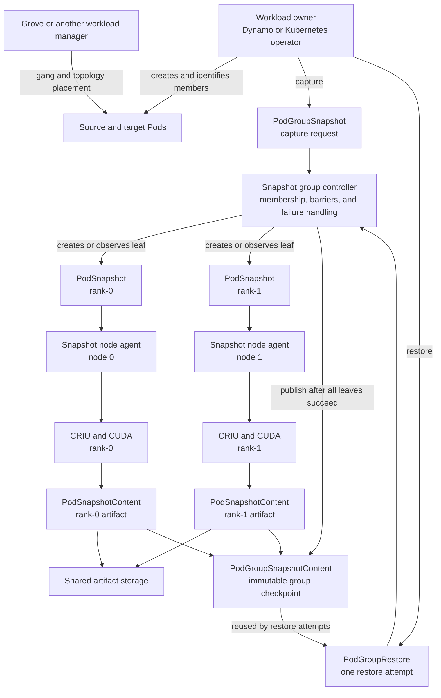
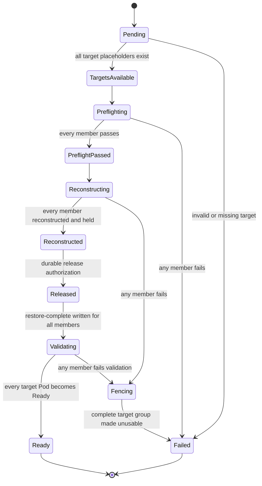

<!--
SPDX-FileCopyrightText: Copyright (c) 2026 NVIDIA CORPORATION & AFFILIATES. All rights reserved.
SPDX-License-Identifier: Apache-2.0
-->

# SNEP-324: Coordinated Multi-Pod Snapshot and Restore

<!-- toc -->
- [Summary](#summary)
- [Motivation](#motivation)
  - [Goals](#goals)
  - [Non-Goals](#non-goals)
- [Proposal](#proposal)
  - [User Stories](#user-stories)
    - [Checkpoint a Multi-Node Replica](#checkpoint-a-multi-node-replica)
    - [Restore a Multi-Node Replica](#restore-a-multi-node-replica)
  - [Limitations, Risks, and Mitigations](#limitations-risks-and-mitigations)
- [Design Details](#design-details)
  - [API](#api)
    - [<code>PodGroupSnapshot</code>](#podgroupsnapshot)
    - [<code>PodGroupSnapshotContent</code>](#podgroupsnapshotcontent)
    - [<code>PodGroupRestore</code>](#podgrouprestore)
  - [Group Identity and Leaf Reuse](#group-identity-and-leaf-reuse)
  - [Security](#security)
  - [Checkpoint Flow](#checkpoint-flow)
  - [Restore Flow](#restore-flow)
  - [Network Identity and Socket Restore](#network-identity-and-socket-restore)
  - [Failure and Recovery](#failure-and-recovery)
  - [Ownership and Scheduling](#ownership-and-scheduling)
  - [Initial Supported Profile](#initial-supported-profile)
  - [Normative Requirements](#normative-requirements)
  - [Configuration](#configuration)
  - [Performance and Scalability](#performance-and-scalability)
  - [Monitoring](#monitoring)
  - [Dependencies](#dependencies)
  - [Test Plan](#test-plan)
  - [Graduation Criteria](#graduation-criteria)
- [Implementation History](#implementation-history)
- [Alternatives](#alternatives)
  - [Restore Every Pod Independently](#restore-every-pod-independently)
  - [Preserve the Original Pod IP Addresses](#preserve-the-original-pod-ip-addresses)
  - [Put the Protocol in a Workload Scheduler](#put-the-protocol-in-a-workload-scheduler)
  - [Let Each Inference Backend Coordinate Kubernetes Restore](#let-each-inference-backend-coordinate-kubernetes-restore)
  - [Coordinate the Group Only in Dynamo](#coordinate-the-group-only-in-dynamo)
  - [Extend <code>SnapshotJob</code> to Multiple Pods](#extend-snapshotjob-to-multiple-pods)
- [Appendix](#appendix)
  - [References](#references)
<!-- /toc -->

## Summary

This SNEP defines a Kubernetes protocol for checkpointing and restoring a fixed
group of mutually dependent Pods as one Snapshot operation. The protocol
freezes group membership, assigns stable logical member identities, coordinates
checkpoint and restore barriers, supplies every member with the complete
source-to-target network identity map, and publishes or fails the group
checkpoint atomically.

## Motivation

Snapshot currently treats each Pod as an independent checkpoint and restore
target. That is insufficient for multi-node workloads whose restored process
state contains connections and identities belonging to other members of the
group, including MPI sockets, NCCL bootstrap connections, peer address tables,
and engine rank metadata.

A controlled two-node TensorRT-LLM TP=2 experiment exposed the first concrete
failure:

1. Both ranks completed NCCL checkpoint preparation and capture.
2. Restore failed during CRIU socket reconstruction, before CUDA or NCCL
   restore.
3. Each restore received only its local old-to-new Pod IP mapping, while the
   restored process state also referenced its peer's old IP.

The existing CRIU remap plugin accepts multiple address mappings, but the
current Snapshot restore path constructs only the local Pod mapping. A
multi-node restore therefore needs the complete group-level mapping at every
member.

That mapping is necessary but not sufficient. The standalone restore path
currently converts an established TCP socket whose reciprocal endpoint is
outside the local checkpoint image into an unconnected socket. A group restore
that preserves member-to-member TCP sessions must identify in-group peers,
retain those sockets, apply the complete map, and coordinate reconstruction of
both endpoints. A backend that instead rebuilds its communicator must declare
and validate that lifecycle explicitly.

Independent per-Pod execution also provides no group barrier or atomic result.
One rank may resume while another remains a placeholder, a partial capture may
appear usable, and a failed restore may leave only part of the workload
running. Snapshot needs a durable group coordinator above its existing
per-Pod execution paths.

The group protocol does not by itself make every communication stack
checkpoint-safe. Inference engines and communication libraries remain
responsible for the lifecycle of persistent communication resources they own.

### Goals

- Represent one immutable group checkpoint separately from any particular
  restore attempt.
- Reuse the existing per-Pod capture and restore machinery as subordinate leaf
  operations.
- Prevent destructive capture until every member passes preparation and
  preflight.
- Prevent any restored member from running until every member reconstructs
  successfully.
- Deliver the complete validated source-to-target network identity map to every
  applicable restore.
- Make group publication, failure propagation, retry, cancellation, and cleanup
  durable and idempotent.
- Compose with Grove or another scheduler without moving gang or topology-aware
  scheduling into Snapshot.
- Qualify an initial two-node TensorRT-LLM TP=2 workload using NCCL Socket.

### Non-Goals

- Automatic workload or group-member discovery.
- A mandatory dependency on Grove or any other workload manager.
- Cross-namespace or cross-cluster restore.
- Elastic membership or topology changes during restore.
- In-flight request migration.
- RDMA reconstruction.
- NVSHMEM, MNNVL, NVLS, FlashInfer multi-node collectives, MoE, or
  expert-parallel qualification.
- Transparent support for an unqualified inference backend, transport, or
  communication-resource lifecycle.

## Proposal

Snapshot adds a group-level API above the current `PodSnapshot`,
`PodSnapshotContent`, and restore-Pod contracts. A group checkpoint has one
immutable member list and becomes Ready only when all mandatory member
artifacts are durable. Each restore attempt maps every logical member to a new
target Pod, performs group-wide preflight, reconstructs every member behind a
release barrier, and releases the group only after all reconstruction succeeds.

The API is additive. Existing standalone APIs preserve their current
cardinality and behavior. Group-created leaf objects are owned by the group and
cannot be restored independently because they do not contain enough context to
restore a rank safely.

The workload owner remains responsible for creating source and target Pods and
for their scheduling constraints. Snapshot owns the checkpoint and restore
consistency boundary. Grove may continue to provide gang scheduling,
topology-aware placement, and workload membership.



### User Stories

#### Checkpoint a Multi-Node Replica

As a workload controller, I can identify the complete set of Pods and target
containers for one distributed replica and create one `PodGroupSnapshot`.
Snapshot prepares every member, captures them only after all preflight checks
pass, and publishes one reusable group checkpoint only if every member
succeeds.

#### Restore a Multi-Node Replica

As a workload controller, I can gang-schedule one replacement Pod per logical
member and create a `PodGroupRestore` that maps the checkpoint's members to
those Pods. Snapshot validates the complete target group before reconstructing
any process, holds every reconstructed member, releases the group together,
and reports whether post-release validation succeeded.

### Limitations, Risks, and Mitigations

| Risk or limitation | Mitigation |
| --- | --- |
| Capture is destructive and one member may fail after another was captured. | Preflight the complete group before capture. After the destructive boundary, treat every source member as consumed or unsafe and never publish a partial checkpoint. |
| A complete IP map does not by itself preserve established cross-Pod sockets. | Distinguish in-group from external peers, retain qualified in-group connections, remap both endpoints, and fail closed when membership is ambiguous. |
| One target may be compatible while another is not. | Aggregate all existing restore compatibility checks before any member enters CRIU or CUDA reconstruction. |
| A controller or node agent can restart at a barrier. | Persist operation identity, member identity, observed generation, per-member phase, and release authorization. Make reconciliation idempotent. |
| Grove `startsAfter` currently waits for Kubernetes Pod Ready and can prevent all restore placeholders from existing. | Omit or rewrite inter-member `startsAfter` dependencies for restore-shaped Pods, or add a Grove milestone that distinguishes placeholder availability from workload readiness. |
| Releasing processes is not equivalent to serving readiness. | Keep group release and post-release validation as separate phases. The workload owner withholds serving registration until validation completes. |
| Backend or transport state may not survive checkpoint and restore. | Publish an explicit capability profile and qualify backend/transport combinations separately. |

## Design Details

### API

The API adds three resources in `nvidia.com/v1alpha1`. The field names below
are the proposed contract; implementation review may refine individual names
without collapsing the separation between checkpoint artifact and restore
attempt.

#### `PodGroupSnapshot`

`PodGroupSnapshot` is a namespaced capture request and binding. Its immutable
specification contains the complete source group:

```yaml
apiVersion: nvidia.com/v1alpha1
kind: PodGroupSnapshot
metadata:
  name: trtllm-replica-a
spec:
  members:
    - id: rank-0
      source:
        podRef:
          name: trtllm-rank-0
          uid: "<source-pod-uid>"
          containers: [engine]
    - id: rank-1
      source:
        podRef:
          name: trtllm-rank-1
          uid: "<source-pod-uid>"
          containers: [engine]
```

Its status contains:

- one subordinate `PodSnapshot` reference and local phase per logical member;
- member-scoped errors with stable reason codes;
- the bound `PodGroupSnapshotContent` name; and
- group-level `Ready` and `Failed` conditions.

The source Pod UID is frozen before preparation so a same-named replacement
cannot be captured accidentally.

#### `PodGroupSnapshotContent`

`PodGroupSnapshotContent` is the cluster-scoped, immutable artifact of record.
It contains:

- a namespace, name, and UID back-reference to its `PodGroupSnapshot`;
- the immutable logical member list;
- each member's source network identity;
- one subordinate `PodSnapshotContent` reference per member; and
- artifact, protocol, and capability versions required for restore.

The content becomes Ready through one root publication point only after every
mandatory leaf artifact is durable. Atomic publication does not require all
artifacts to be stored in one file or storage transaction.

#### `PodGroupRestore`

`PodGroupRestore` is a namespaced restore attempt. It references one immutable
group checkpoint and maps every logical member to exactly one target Pod:

```yaml
apiVersion: nvidia.com/v1alpha1
kind: PodGroupRestore
metadata:
  name: trtllm-replica-a-restore-1
spec:
  snapshotRef:
    name: trtllm-replica-a
    uid: "<group-snapshot-uid>"
  targets:
    - id: rank-0
      podRef:
        name: trtllm-rank-0-restored
        uid: "<target-pod-uid>"
    - id: rank-1
      podRef:
        name: trtllm-rank-1-restored
        uid: "<target-pod-uid>"
```

The controller freezes target Pod UIDs and derives target network identities
when it accepts the restore. The caller supplies logical membership and target
Pods but does not author an unvalidated CRIU remap table.

Status contains the canonical target-specific identity map, or a durable
reference to it; durable per-member preflight, reconstruction, release,
validation, and error state; and group-level `Ready` and `Failed` conditions.
Checkpoint artifacts and restore attempts have separate identities so one
checkpoint can be restored repeatedly.

### Group Identity and Leaf Reuse

Every member has a stable logical ID independent of Pod name, UID, IP address,
node, or creation order. A workload controller may use an opaque ID or a stable
component, replica, role, and rank tuple. The complete member list is resolved
before the operation starts; Snapshot V1 does not discover members by
understanding every possible workload-controller API.

Existing `PodSnapshot`, `PodSnapshotContent`, and restore-Pod mechanisms remain
the per-Pod execution path. Their artifacts are subordinate to the group
checkpoint and are not independently advertised as usable workload
checkpoints.

Group-created leaf objects carry the group UID and logical member ID.
Standalone restore of a group-owned leaf artifact is rejected unless an
authorized group restore supplies the complete group context.

`SnapshotJob` remains a single-Pod, capture-only convenience API that creates
and owns a Kubernetes Job. It does not become the group coordinator because
the workload owner, including Dynamo or Grove, owns creation of multi-node
source and target Pods.

### Security

This proposal does not reduce the privileges required by Snapshot. Node agents
still perform privileged CRIU, container-runtime, mount, and CUDA operations,
and checkpoint artifacts can contain process memory, credentials, and other
workload secrets. Deployment policies and existing mechanisms for artifact
encryption, access control, retention, and node isolation continue to apply to
every subordinate artifact and to the group manifest.

The group APIs add several authorization and isolation requirements:

- V1 accepts source and target Pods only from the namespaced group object's
  namespace. A caller cannot use a group operation to capture or restore a Pod
  in another namespace.
- Every Pod, group checkpoint, restore attempt, and subordinate artifact
  reference includes a UID where applicable. Reconcilers reject a same-named
  object recreated with a different UID.
- Creating a `PodGroupRestore` does not grant access to its referenced
  `PodGroupSnapshotContent` or leaf artifacts. The controller and node agents
  enforce the same RBAC and storage authorization as standalone restore.
- Group-owned leaf artifacts reject standalone restore so a caller cannot
  bypass the group mapping, compatibility checks, or release barrier.
- The controller validates membership cardinality, uniqueness, and supported
  size before dispatching node work to limit resource-exhaustion and oversized
  API-object attacks.

Group status exposes member identity, Pod references, failure reasons, and the
network remap or a reference to it. RBAC must treat these fields as workload
metadata and restrict them consistently with existing Snapshot resources.
Logs and metrics must not expose checkpoint contents, credentials, or
unbounded identity values.

### Checkpoint Flow

A group checkpoint proceeds as follows:

1. The caller supplies the complete source member list.
2. Snapshot validates member identity, node agents, artifact storage, declared
   topology, and required backend capabilities.
3. Snapshot freezes membership and dispatches checkpoint preparation to every
   member.
4. Snapshot waits for every mandatory member to pass preparation and preflight.
5. Snapshot crosses the destructive boundary and dispatches the required
   per-member CRIU and CUDA capture paths.
6. Snapshot waits for every mandatory member and artifact to succeed.
7. Snapshot atomically publishes the group checkpoint record.
8. Snapshot records the source group as consumed. A source restart or
   replacement remains fenced until the workload owner completes recovery.

Preparation may include application quiescence, communicator preparation,
release of checkpoint-unsafe resources, CUDA locking, and storage preparation.
Some hooks are collective. Snapshot dispatches a collective phase to every
applicable member before waiting for any individual member to complete.

Checkpoint capture is destructive: Snapshot terminates the captured source
process and does not publish a `snapshot-complete` sentinel. Group publication
controls artifact visibility, not source-process release. If a member fails
after the destructive boundary, Snapshot does not publish the group checkpoint
and treats the entire source group as unsafe.

```mermaid
sequenceDiagram
    autonumber
    participant O as Workload owner
    participant G as Snapshot group controller
    participant A0 as Node agent: rank-0
    participant A1 as Node agent: rank-1
    participant S as Artifact storage

    O->>G: Create PodGroupSnapshot with all members
    G->>G: Freeze IDs, Pod UIDs, and containers
    G->>G: Validate agents, storage, topology, and capabilities

    par Prepare rank-0
        G->>A0: Prepare and run non-destructive preflight
        A0-->>G: PreflightPassed
    and Prepare rank-1
        G->>A1: Prepare and run non-destructive preflight
        A1-->>G: PreflightPassed
    end

    alt Any member fails preflight
        G->>A0: Abort reversible preparation
        G->>A1: Abort reversible preparation
        G-->>O: Failed; no destructive capture started
    else Every member passes preflight
        Note over G,A1: Cross the destructive boundary
        par Capture rank-0
            G->>A0: Capture CRIU and CUDA state
            A0->>S: Persist rank-0 artifact
            A0-->>G: Capture succeeded
        and Capture rank-1
            G->>A1: Capture CRIU and CUDA state
            A1->>S: Persist rank-1 artifact
            A1-->>G: Capture succeeded
        end
        Note over A0,A1: Captured source processes are terminated
        alt Every mandatory artifact succeeds
            G->>G: Publish PodGroupSnapshotContent atomically
            G-->>O: Group checkpoint Ready
        else Any capture or artifact fails
            G->>G: Mark the complete source group unsafe
            G->>A0: Keep source fenced
            G->>A1: Keep source fenced
            G-->>O: Failed; no group checkpoint published
        end
    end
```

### Restore Flow

A group restore proceeds as follows:

1. Snapshot loads the complete group checkpoint record.
2. The caller supplies one target Pod for every logical member.
3. Snapshot waits until all targets are scheduled, their placeholders are
   available, and their nodes can access the required artifacts.
4. Snapshot validates the one-to-one member mapping and constructs the complete
   source-to-target network identity map.
5. Snapshot dispatches non-destructive restore preflight to every member,
   including existing image, runtime, CPU, memory, mount, GPU, driver, and
   other compatibility checks.
6. Snapshot waits for every mandatory member to reach `PreflightPassed`. A
   failure prevents every member from starting process reconstruction.
7. Snapshot dispatches process, CRIU, CUDA, socket, and backend reconstruction
   with workload release held.
8. Snapshot waits for every mandatory member to reach `Reconstructed`, meaning
   local reconstruction succeeded while the workload remains behind the group
   release barrier.
9. Snapshot durably authorizes group release. Node agents then write
   `restore-complete` for their members.
10. Released workloads reconstruct or validate communicators, perform required
    collective and backend health checks, and report post-release validation.
11. Snapshot marks the group restore Ready only after every mandatory member
    passes validation. The workload owner may then allow serving registration.

```mermaid
sequenceDiagram
    autonumber
    participant O as Workload owner
    participant W as Grove or scheduler
    participant G as Snapshot group controller
    participant A0 as Node agent: rank-0
    participant A1 as Node agent: rank-1
    participant P0 as Restored rank-0 Pod
    participant P1 as Restored rank-1 Pod

    O->>W: Create the complete target Pod group
    W-->>O: Gang-schedule with topology constraints
    O->>G: Create PodGroupRestore
    G->>G: Freeze target UIDs and wait for every placeholder
    G->>G: Build the complete source-to-target identity map

    par Preflight rank-0
        G->>A0: Validate target and complete identity map
        A0-->>G: PreflightPassed
    and Preflight rank-1
        G->>A1: Validate target and complete identity map
        A1-->>G: PreflightPassed
    end

    alt Any target fails preflight
        G-->>O: Failed; no member enters reconstruction
    else Every target passes preflight
        par Reconstruct rank-0
            G->>A0: Reconstruct and hold release
            A0-->>G: Reconstructed
        and Reconstruct rank-1
            G->>A1: Reconstruct and hold release
            A1-->>G: Reconstructed
        end
        alt Any reconstruction fails
            G->>A0: Fence or terminate partial restore
            G->>A1: Fence or terminate partial restore
            G-->>O: Restore Failed
        else Every member is reconstructed
            G->>G: Persist group release authorization
            par Release rank-0
                G->>A0: Release authorized
                A0->>P0: Write restore-complete
            and Release rank-1
                G->>A1: Release authorized
                A1->>P1: Write restore-complete
            end
            P0->>P0: Validate communicator and backend
            P1->>P1: Validate communicator and backend
            P0-->>G: Kubernetes Pod Ready
            P1-->>G: Kubernetes Pod Ready
            G-->>O: PodGroupRestore Ready
            O->>O: Permit serving registration
        end
    end
```

The durable member phases are:

```text
PreflightPassed -> Reconstructed -> Released -> Validated
```



`Reconstructed` is a group-protocol state and is not reported as the existing
Pod-level `nvidia.com/Restored=True` condition. In the current per-Pod contract,
writing `restore-complete` releases the application. For a group-owned restore,
the node agent holds that write until it observes durable group release
authorization.

Group release and serving readiness are separate barriers. Release permits the
processes to execute the code needed to rebuild or validate communication. It
does not permit the workload to receive serving traffic.

For V1, a member reaches `Validated` when its target Pod reports Kubernetes
Ready after group release. Qualified target Pods therefore provide a readiness
probe that covers backend and communicator health, not merely process liveness.
The group controller observes this condition; the node agent does not assert
application validation. A future API revision may add other explicit
validation providers without changing the release barrier.

### Network Identity and Socket Restore

For the initial established-TCP implementation, the identity map contains
every changed source Pod IPv4 address and its corresponding target Pod IPv4
address. Every applicable CRIU restore receives the same complete map so both
local and peer endpoints can be rewritten.

The preserved-session path does not apply the standalone external-peer
disconnection behavior to an established socket whose remote endpoint belongs
to the same group. Socket retention and remapping fail closed when the peer
cannot be resolved uniquely to a member. If a backend chooses communicator
reconstruction instead, the checkpoint records that capability and the path is
qualified independently.

The immutable group checkpoint records each source identity. The complete
target-specific map is a restore work order and belongs to
`PodGroupRestore`, or to a durable leaf work object derived from it. Pod
annotations are not the source of truth for the map, barrier state, or release
authorization.

Missing, duplicate, ambiguous, or unsupported mappings fail restore before
process reconstruction begins.

### Failure and Recovery

A failure in any mandatory member fails the group operation.

Before destructive checkpoint capture, no group checkpoint is published;
reversibly prepared members are aborted safely; source members remain fenced
until their state is known; and incomplete artifacts are recorded for cleanup.

After destructive capture starts, no group checkpoint is published; every
source member is considered consumed or unsafe, including a member whose local
capture succeeded; source restarts or replacements remain fenced until
explicit workload-owner recovery; and incomplete artifacts remain visible for
cleanup.

On restore failure, the group is not advertised as ready. Partial restored
members are terminated, fenced, or otherwise made unusable, and cleanup
failures remain visible in group status. If failure occurs after group release,
every member is considered unsafe even when its local validation succeeded.

Group operation state survives controller restart. Reconciliation does not
duplicate capture, reconstruction, or release work. Operation identity, member
identity, observed generation, and durable per-member phase fence repeated
work. Cancellation or deletion initiates group abort and cleanup, and a
finalizer protects the operation until members are terminal or outstanding
cleanup is recorded durably.

### Ownership and Scheduling

The workload owner or caller owns:

- source and target Pod creation;
- group membership and logical role or rank assignment;
- placement and scheduling requirements; and
- withholding serving registration until restore validation succeeds.

Snapshot owns:

- frozen operation membership and identity;
- the group checkpoint and restore-attempt identities;
- cross-member barriers;
- network identity remapping;
- group publication, failure propagation, and cleanup; and
- the final group result.

Node agents and leaf execution paths own node-local runtime interaction, CRIU
and CUDA execution, and per-member status and artifacts. Inference engines and
communication libraries own application quiescence, persistent
communication-resource lifecycle, local checkpoint and restore ordering, and
post-restore communicator validation.

Grove gang scheduling and topology-aware placement continue to apply to source
and target Pods. Snapshot does not duplicate those responsibilities. Restore
adds one constraint: every mandatory target container must reach
placeholder-available state before any member is released.

Grove `startsAfter` currently waits for the prerequisite clique's Pods to
become Kubernetes Ready. This can create a cycle when a dependent rank is not
created until another clique becomes Ready, that clique cannot become Ready
until group release, and group release waits for the dependent rank's
placeholder. For V1, the workload owner may omit or rewrite inter-member
`startsAfter` dependencies for restore-shaped Pods while preserving gang and
topology constraints. Alternatively, Grove may add a restore-aware milestone
that distinguishes placeholder availability from workload readiness.

```mermaid
flowchart TB
    subgraph Unsafe["Inter-member startsAfter can deadlock restore"]
        U1["Group restore waits for<br/>rank-1 placeholder"]
        U2["Rank-1 creation waits for<br/>rank-0 Pod Ready"]
        U3["Rank-0 cannot become Ready<br/>before group release"]
        U4["Group release waits for<br/>rank-1 reconstruction"]
        U1 --> U2 --> U3 --> U4 --> U1
    end

    subgraph Safe["Restore-safe scheduling"]
        S1["Gang-schedule all target Pods"]
        S2["All placeholders available"]
        S3["Group-wide preflight"]
        S4["All members reconstructed and held"]
        S5["Durable group release"]
        S6["Readiness validation"]
        S7["Serving allowed"]
        S1 --> S2 --> S3 --> S4 --> S5 --> S6 --> S7
    end
```



No Grove API change is required for membership, gang scheduling, or topology
placement. A Grove enhancement is required only if its existing API cannot
express the placeholder-availability behavior needed by a restored group.

### Initial Supported Profile

The first qualified profile is:

- one TensorRT-LLM replica;
- dense TP=2;
- two Pods on two nodes;
- one GPU per Pod;
- one Kubernetes namespace and cluster;
- no in-flight requests;
- checkpoint after engine initialization and before serving registration;
- NCCL Socket transport;
- a readiness probe that validates TensorRT-LLM and communicator health;
- artifact storage accessible from all source and target nodes; and
- restore may relocate either member and assign new Pod IPs.

CUDA graphs are disabled unless the backend demonstrates that every
graph-visible communicator and allocation remains valid across the selected
checkpoint and restore lifecycle. Enabling CUDA graphs is a separate
qualification dimension, not an implied property of NCCL Socket support.

Passing this profile does not imply support for other NCCL transports or
communication-resource paths.

### Normative Requirements

The key words **MUST**, **MUST NOT**, **SHOULD**, **SHOULD NOT**, and **MAY**
are interpreted as described in [RFC 2119].

1. A multi-Pod checkpoint **MUST** have one group operation identity and one
   durable group checkpoint identity.
2. The complete member list **MUST** be resolved and frozen before
   state-changing preparation begins.
3. Every member **MUST** have a stable logical identity independent of Pod name,
   UID, IP address, node, and creation order.
4. Source and target Pods **MUST** map one-to-one through logical member
   identity.
5. Group checkpoint publication **MUST** require every mandatory member and
   artifact.
6. Per-member success **MUST NOT** be exposed as group success.
7. Snapshot **MUST** dispatch collective lifecycle phases to all applicable
   members before waiting for an individual member.
8. Snapshot **MUST** enforce every required cross-member barrier.
9. Every applicable CRIU restore **MUST** receive the complete source-to-target
   network identity map.
10. Missing or unsupported identity mappings **MUST** fail before process
    reconstruction.
11. Required node-agent, storage, backend, transport, and restore compatibility
    checks **MUST** be validated for every member before state-changing work.
12. A mandatory member failure **MUST** fail the group operation.
13. Snapshot **MUST** terminate, fence, or otherwise make unusable every unsafe
    partial restore.
14. Group state and reconciliation **MUST** survive controller restart and
    remain idempotent.
15. Cancellation or deletion **MUST** initiate group abort and cleanup.
16. The protocol **MUST NOT** depend on a particular workload controller or
    scheduler.
17. V1 **MUST** remain within one Kubernetes namespace and cluster.
18. Broader transport and topology support **MUST** be qualified separately
    before being advertised.
19. Checkpoint artifacts and restore attempts **MUST** have separate identities
    so one checkpoint can be restored repeatedly.
20. A group-owned leaf artifact **MUST NOT** be restored outside an authorized
    group restore context.
21. Snapshot **MUST NOT** begin destructive member capture until every
    mandatory member has passed group preparation and preflight.
22. Local reconstruction **MUST NOT** write `restore-complete`, report
    `nvidia.com/Restored=True`, make a member Ready, or permit serving before
    durable group release authorization.
23. Restore target startup dependencies **MUST** allow every mandatory target
    container to reach placeholder-available state before group release.
24. Gang and topology-aware scheduling **MAY** be provided by Grove or another
    workload manager and **MUST NOT** be reimplemented by Snapshot.
25. The complete target-specific identity map and release authorization
    **MUST** be represented by durable Snapshot state.
26. Repeated reconciliation **MUST NOT** duplicate capture, reconstruction, or
    release work.
27. Snapshot **MUST** expose an additive durable API for the group checkpoint
    artifact and each restore attempt.
28. The group restore API **MUST** reference one immutable group checkpoint and
    map every logical member to exactly one target Pod.
29. The group API **MUST NOT** change `PodSnapshot` or `SnapshotJob` into
    multi-Pod workload owners.
30. Every mandatory member **MUST** reach `PreflightPassed` before any member
    starts CRIU or CUDA reconstruction.
31. A preserved-session restore **MUST** distinguish in-group TCP peers from
    external peers and **MUST NOT** apply the standalone external-peer
    disconnection policy to a qualified in-group connection.
32. Group release and serving readiness **MUST** remain separate durable
    phases.

### Configuration

The alpha implementation is disabled by default behind a
`MultiPodSnapshotRestore` feature gate on the operator and node agent. Enabling
the gate enables reconciliation and group-owned leaf work; it does not change
standalone `PodSnapshot` or `SnapshotJob` behavior. Deployment packaging may
install the group CRDs independently of whether the gate is enabled.

The initial supported profile uses the existing Snapshot artifact-storage,
CRIU, CUDA checkpoint, and restore compatibility configuration. Backend and
transport capability are recorded in the checkpoint rather than selected by an
out-of-band annotation. Implementations define an admission-time maximum group
size and reject larger groups before preparation begins; changing that limit
does not expand the set of qualified workload profiles.

Disabling the feature gate prevents new group operations. It must not silently
orphan nonterminal operations or remove CRDs that still contain group
checkpoints. Upgrade, disablement, and deletion behavior must be documented
before beta.

### Performance and Scalability

Preparation, capture, preflight, and reconstruction fan out across members and
must not be serialized by the group controller. Barrier latency is therefore
bounded primarily by the slowest mandatory member, while artifact bytes remain
the sum of the existing per-Pod artifacts plus a small group manifest.

API object size and controller work grow linearly with member count. A complete
network identity map has linear size and is delivered to every applicable
member, producing quadratic aggregate distribution work if every member needs
every mapping. The initial two-member profile does not establish a general
scale limit. Tests must measure reconciliation latency, API-object size,
controller memory, identity-map distribution, and cleanup time at increasing
group sizes before beta limits are selected.

Controllers use bounded concurrency for node work so one large group cannot
starve unrelated standalone or group operations. Metrics and logs avoid member
identity labels whose cardinality grows with group size.

### Monitoring

The group resources expose Kubernetes conditions and member status sufficient
to answer which barrier is active, which member is blocking it, whether a
failure is terminal, and what cleanup remains. Conditions use stable reason
codes and include observed generation and transition time.

The operator emits Kubernetes Events for group acceptance, preflight failure,
the destructive checkpoint boundary, checkpoint publication, reconstruction,
release, validation, abort, and cleanup failure.

Metrics cover operation count, duration, and failure count by operation type,
phase, result, and stable reason. Member IDs, Pod names, UIDs, IP addresses, and
artifact paths are excluded from metric labels to avoid unbounded cardinality.
Logs carry the group UID, restore-attempt UID, member ID, and leaf operation UID
as structured correlation fields.

### Dependencies

- Existing Snapshot `PodSnapshot`, `PodSnapshotContent`, restore-Pod, CRIU,
  CUDA checkpoint, compatibility-preflight, and artifact-storage paths.
- Backend hooks that can prepare and validate the qualified communicator
  lifecycle.
- A workload owner capable of creating the complete source and target Pod set.
- A scheduler or workload manager capable of placing the target group. Grove is
  optional.
- A placeholder-startup policy that does not wait for restored workload
  readiness before all required targets exist.

### Test Plan

Unit tests cover API validation, immutable membership, one-to-one target
mapping, leaf ownership, phase transitions, retry fencing, release
authorization, cleanup, and source-to-target identity-map construction.

Controller integration tests cover:

- failure before and after the destructive checkpoint boundary;
- one incompatible target causing group preflight rejection before any CRIU or
  CUDA reconstruction;
- one member reconstructing before another fails;
- controller restart at every cross-member barrier;
- node-agent retry without duplicate capture, reconstruction, or release;
- rejection of standalone restore from a group-owned leaf;
- cancellation and deletion during each nonterminal phase; and
- failure after release causing the complete target group to be fenced.

End-to-end qualification uses the initial supported profile and verifies:

1. cold initialization and inference;
2. checkpoint of both members;
3. restore onto newly scheduled Pods;
4. both-changed, one-changed, and unchanged Pod-IP cases;
5. delivery of the complete identity map to both members;
6. preservation of qualified in-group TCP sessions without standalone
   external-peer disconnection;
7. successful process, CUDA, and communicator restoration;
8. correct post-restore inference;
9. repeated restore from the same checkpoint;
10. injected single-member failure and safe cleanup; and
11. a Grove-managed restore with placeholder-safe `startsAfter` handling.

### Graduation Criteria

Alpha requires the three group resources in `v1alpha1`, the initial supported
profile behind an explicit feature gate, controller and node-agent restart
coverage, failure-injection coverage, and end-to-end evidence for repeated
restore and Pod-IP relocation. Documentation must state the exact qualified
backend, transport, CUDA-graph, namespace, and cluster boundaries.

Beta requires operational evidence beyond the initial two-member profile,
qualification of at least one additional backend or communicator lifecycle,
upgrade and downgrade behavior, published metrics and runbooks, and no known
path that exposes a partial group as Ready.

GA requires a stable API version, documented compatibility and storage
policies, scale and longevity testing, conformance coverage for supported
profiles, and a migration plan from the alpha and beta APIs.

## Implementation History

- 2026-09: Initial SNEP drafted from the multi-node Snapshot investigation.

## Alternatives

### Restore Every Pod Independently

Independent restore cannot construct a complete peer identity map or provide
atomic barriers and failure handling. A partial group may appear successful or
resume unsafely.

### Preserve the Original Pod IP Addresses

Preserving IPs constrains scheduling and relies on networking behavior that
Kubernetes does not generally guarantee. It also does not address barriers,
publication, cleanup, or non-network peer identities.

### Put the Protocol in a Workload Scheduler

A scheduler such as Grove can provide membership and placement, but it should
not own CRIU and CUDA ordering, backend lifecycle, artifact publication, or
Snapshot cleanup policy.

### Let Each Inference Backend Coordinate Kubernetes Restore

This duplicates Kubernetes orchestration, identity, failure semantics, and
cleanup across TensorRT-LLM, vLLM, and SGLang. Backends should own their
communication-resource lifecycle while Snapshot owns the outer Kubernetes
operation.

### Coordinate the Group Only in Dynamo

Dynamo could aggregate multiple leaf snapshots for an integration-specific
prototype. That leaves Snapshot unable to represent the real artifact
consistency boundary, requires callers to reproduce node-agent release and
cleanup semantics, and makes complete remap delivery an out-of-band contract.
The generic group mechanics belong in Snapshot while Dynamo remains a
workload-specific caller.

### Extend `SnapshotJob` to Multiple Pods

`SnapshotJob` owns creation of one capture Job and is intentionally
capture-only. Extending it to own a multi-Pod workload conflicts with Dynamo or
Grove ownership of membership, rank assignment, gang scheduling, and topology
placement. The group API instead composes caller-owned Pods and existing
per-Pod artifacts.

## Appendix

### References

- [RFC 2119]
- [Dynamo DEP #13220: Composable container checkpoint/restore and CUDA data
  plane](https://github.com/ai-dynamo/dynamo/issues/13220)
- [Dynamo PR #12961: Stable CUDA launch-job
  identity](https://github.com/ai-dynamo/dynamo/pull/12961)
- [Dynamo PR #2269: Grove multi-node
  support](https://github.com/ai-dynamo/dynamo/pull/2269)
- [Dynamo PR #2405: Grove deployment type
  integration](https://github.com/ai-dynamo/dynamo/pull/2405)
- [Snapshot API types](https://github.com/ai-dynamo/snapshot/tree/main/api/v1alpha1)
- [Snapshot workload
  contract](https://github.com/ai-dynamo/snapshot/blob/main/docs/reference/workload-contract.md)
- [Snapshot restore-Pod
  contract](https://github.com/ai-dynamo/snapshot/blob/main/docs/reference/restore-pod-contract.md)
- [Snapshot per-Pod INET
  remap](https://github.com/ai-dynamo/snapshot/blob/main/agent/internal/criu/inet_remap.go)
- [Snapshot CRIU INET remap
  plugin](https://github.com/ai-dynamo/snapshot/blob/main/agent/plugins/inet-remap/snapshot_inet_remap.c)
- [Snapshot socket restore
  handling](https://github.com/ai-dynamo/snapshot/blob/main/agent/internal/criu/restore_images.go)
- [Snapshot PR #140: Restore compatibility
  checks](https://github.com/ai-dynamo/snapshot/pull/140)
- [Snapshot issue #295: Checkpointing same-node CUDA peer
  mappings](https://github.com/ai-dynamo/snapshot/issues/295)
- [Snapshot issue #294: Cross-node relocation coverage for one multi-GPU
  Pod](https://github.com/ai-dynamo/snapshot/issues/294)
- [Grove `startsAfter`
  API](https://github.com/ai-dynamo/grove/blob/main/operator/api/core/v1alpha1/podclique.go)
- [Grove `startsAfter` readiness
  implementation](https://github.com/ai-dynamo/grove/blob/main/operator/initc/internal/wait.go)
- [Grove](https://github.com/ai-dynamo/grove)

[RFC 2119]: https://www.rfc-editor.org/rfc/rfc2119
