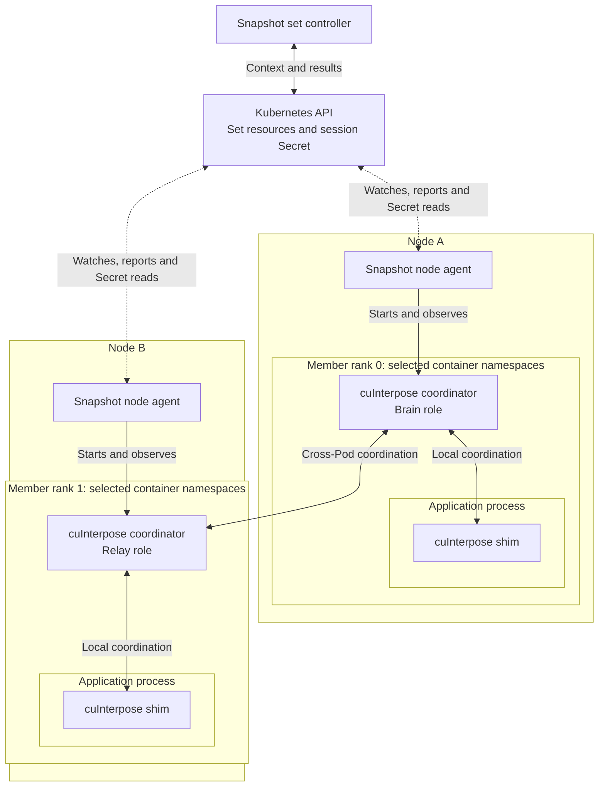
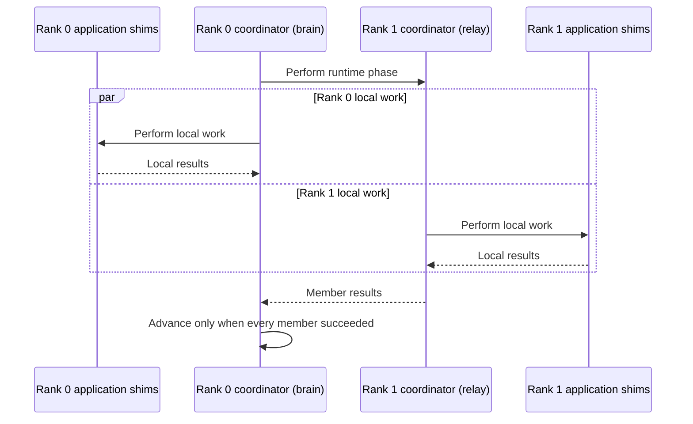
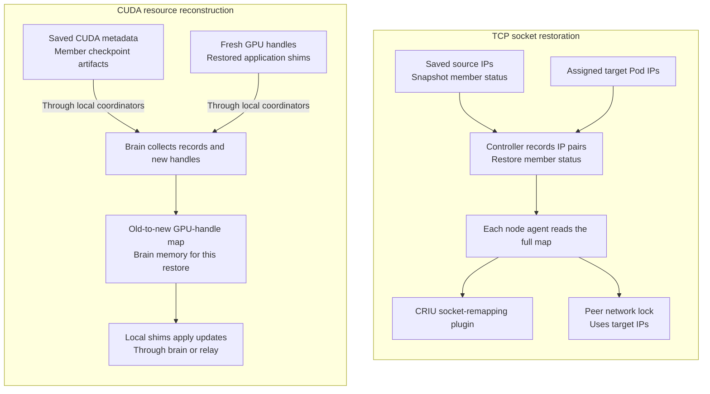
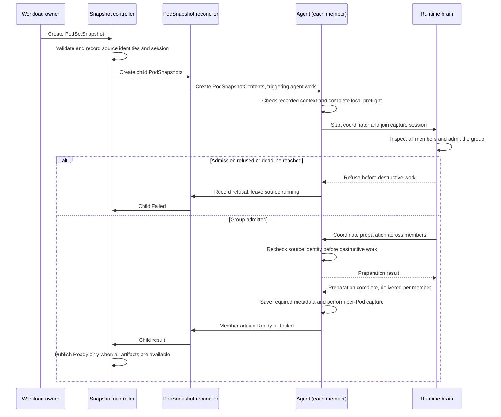
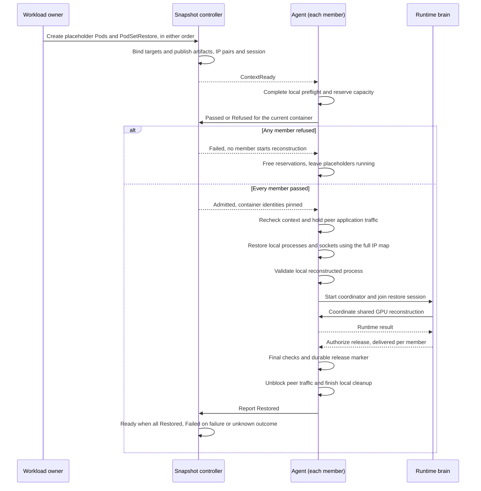

<!--
SPDX-FileCopyrightText: Copyright (c) 2026 NVIDIA CORPORATION & AFFILIATES. All rights reserved.
SPDX-License-Identifier: Apache-2.0
-->

# SNEP-324: Coordinated Multi-Pod Checkpoint and Restore

Tracking issue: [snapshot#324](https://github.com/ai-dynamo/snapshot/issues/324)

Status: Draft

<!-- toc -->
- [Summary](#summary)
- [Motivation](#motivation)
  - [Goals](#goals)
  - [Non-Goals](#non-goals)
- [Proposal](#proposal)
  - [User Stories](#user-stories)
    - [Restore an Aggregated Inference Replica](#restore-an-aggregated-inference-replica)
    - [Restore a Prefill or Decode Replica](#restore-a-prefill-or-decode-replica)
    - [Recover from a Partial Restore](#recover-from-a-partial-restore)
  - [Limitations, Risks, and Mitigations](#limitations-risks-and-mitigations)
- [Design Details](#design-details)
  - [Architecture](#architecture)
    - [Components and Communication](#components-and-communication)
    - [Data and Storage](#data-and-storage)
    - [Runtime Session](#runtime-session)
    - [Coordination Rules](#coordination-rules)
  - [API](#api)
    - [Resource Definitions](#resource-definitions)
    - [Validation and Binding](#validation-and-binding)
    - [Conditions and Outcomes](#conditions-and-outcomes)
    - [Examples](#examples)
    - [Per-Pod API Reuse](#per-pod-api-reuse)
    - [Checkpoint Availability](#checkpoint-availability)
  - [Checkpoint Flow](#checkpoint-flow)
  - [Restore Flow](#restore-flow)
  - [Startup Gate and Deadline](#startup-gate-and-deadline)
  - [Network Identity and Release](#network-identity-and-release)
  - [Journal and Restart Recovery](#journal-and-restart-recovery)
  - [Failure, Cancellation, and Cleanup](#failure-cancellation-and-cleanup)
  - [Workload Ownership and Source Lifetime](#workload-ownership-and-source-lifetime)
  - [Security](#security)
  - [Configuration](#configuration)
  - [Performance and Scalability](#performance-and-scalability)
  - [Monitoring](#monitoring)
  - [Dependencies](#dependencies)
  - [Test Plan](#test-plan)
    - [Unit and Controller Tests](#unit-and-controller-tests)
    - [Agent and Failure Tests](#agent-and-failure-tests)
    - [End-to-End Qualification](#end-to-end-qualification)
  - [Graduation Criteria](#graduation-criteria)
<!-- /toc -->

## Summary

Add a Kubernetes API to checkpoint and restore a fixed set of cooperating Pods,
including Pods on different nodes. A set checkpoint is reusable, and each restore
is a separate attempt with an explicit target Pod for every member. Snapshot
checks the complete set before starting destructive work, coordinates the members
through a shared runtime session, and reports both the overall result and each
member's result. Capture and restore are not atomic, and neither supports rollback.

## Motivation

A distributed inference replica can span several Pods. Restoring it requires more
than restoring each process separately:

- Every member needs all peers' replacement IPs, not just its own.
- No member can send application traffic to its peers until every peer has rebuilt
  its sockets. Sending too early can reset a connection that is still being restored.
- Shared GPU resources need ordered reconstruction and handle exchange between
  processes, including processes on different nodes.

The workload owner needs one operation to coordinate these steps and observe their
result. It must be able to tell whether the checkpoint is complete and which
members were released if a restore fails partway through.

### Goals

- Checkpoint a fixed set of Pods and publish a reusable checkpoint only when
  every member succeeds.
- Restore that checkpoint into explicitly named target Pods, including on
  different nodes and with different Pod IPs.
- Complete all required admission checks before destructive work starts.
- Preserve established TCP connections between members and coordinate the GPU
  reconstruction steps required by the workload.
- Report partial failure accurately, bound every operation by a deadline, and
  recover safely from controller and agent restarts.
- Reuse the per-Pod capture and restore paths without changing standalone APIs.
- Work with any workload controller. Pod creation and placement remain outside
  Snapshot.

### Non-Goals

- Discovering members, creating target Pods, or choosing their placement.
- Changing membership, process ranks, or the workload's logical topology during
  restore.
- Atomic checkpoint or restore, rollback, or keeping the source workload running
  after destructive capture begins.
- Automatically restarting the whole workload after a failed attempt.
- Declaring application health, serving readiness, or in-flight request safety.
- Cross-namespace or cross-cluster restore, artifact retention after set deletion,
  or a hierarchy of sets.
- Supporting an engine, transport, or GPU topology without qualification.

## Proposal

Snapshot adds two namespaced resources:

- `PodSetSnapshot` identifies the source Pods and containers. It creates one
  `PodSnapshot` per member and becomes Ready only when all member artifacts are
  ready. Its member list and completed artifact references are immutable.
- `PodSetRestore` identifies a ready set checkpoint and one target Pod and
  container per member. Each object is one restore attempt. The same checkpoint
  can be used for multiple attempts.

The workload owner creates the target Pods with Snapshot's inert placeholder
contract. A placeholder keeps the destination container running but does not
start the application. All placeholders must be able to start without waiting
for another member's application readiness.

Snapshot divides the work between two layers. The Kubernetes controller records
identities, provides the restore context, admits the target set, and aggregates
results. Node agents execute the per-Pod work and start cuInterpose coordinators
to run the cross-Pod runtime phases. The Architecture section below defines the
components, their placement, and their communication paths.

Capture is destructive. A successful member capture ends its source process.
If another member fails, Snapshot does not undo the completed capture. During
restore, members stay behind their placeholders until the runtime session
authorizes release. Release is asynchronous: a failure can leave some members
released and others not. A group failure does not overwrite the results of
individual members.

`Restored` means that reconstruction completed and Snapshot released the member.
It does not mean that the application is healthy or that the Pod is Ready. The
workload owner handles those checks and any workload-level recovery.

### User Stories

#### Restore an Aggregated Inference Replica

A workload controller checkpoints the Pods that jointly run one inference
replica. Later, it places replacement Pods, supplies the member-to-target mapping,
and requests a restore. It registers the replica for traffic only after Snapshot
reports success and the application's own readiness checks pass.

#### Restore a Prefill or Decode Replica

A disaggregated deployment checkpoints a distributed prefill replica or decode
replica as its own set. The workload controller restores that replica without
including unrelated replicas in the operation. Connections outside the set follow
the standalone restore behavior; this proposal does not preserve the entire
deployment's communication state automatically.

#### Recover from a Partial Restore

A restore fails after one member has been released. The controller reports a
failed attempt without rewriting that member's `Restored` outcome. The workload
owner can inspect the results, retire the attempt's Pods, and retry with fresh
targets and the same set checkpoint.

### Limitations, Risks, and Mitigations

| Risk | Handling |
| --- | --- |
| Capture fails after a member has crossed its destructive boundary. | Do not publish the set as Ready. Keep the member results and leave workload recovery to the owner. There is no rollback. |
| Release reaches only some members. | Keep released members `Restored`. Stop and tear down unreleased members when failure is observed. Fail the attempt. |
| An agent crashes after releasing a member but before removing its network lock. | Recovery treats release evidence as authoritative and finishes cleanup without killing or replaying the workload. Peer traffic can remain blocked until the agent recovers. |
| A target disappears after admission and its result cannot be established. | Report `Unknown` with reason `TargetGone`, fail the attempt, and accept later agent evidence without reopening the attempt. |
| A target cannot be scheduled or an agent cannot join. | Expose the waiting reason and enforce the operation deadline. |
| A placeholder has too little startup-gate time left. | Refuse the attempt during preflight, before any member starts CRIU. |
| A recorded Pod IP changes before execution. | Refuse before the member's destructive boundary. Never rebuild the attempt's map with a replacement IP. |
| A member artifact is deleted after publication. | Mark the checkpoint unavailable, retain its original references, and refuse further restores. |
| A source finishes capture before its peers and then restarts or loses its network identity. | Qualify this case before claiming support for normal source lifecycle behavior. Source identity protection remains an open question. |
| A backend or transport cannot restore its communication state. | Qualify each supported combination. The API does not make an unsupported runtime checkpoint-safe. |

## Design Details

### Architecture

#### Components and Communication

A **member** is one Pod and its selected workload container. Its member ID is
stable; its **rank** is its position in the checkpoint's member list. A member
can contain several application processes. A **participant** is an application
process with the cuInterpose shim loaded.

Each node agent starts one temporary cuInterpose coordinator process per member.
Rank 0's coordinator is the **brain**; every other member's coordinator is a
**relay**. They are separate from the application processes and their shims,
not additional Kubernetes containers or a controller-hosted service.

Coordinators run inside the selected member container's namespaces, including
the Pod's network namespace. During capture they run in the source member;
during restore they run in the target member, after local process and native
CUDA reconstruction. The agent owns their lifecycle.

| Component | Where it runs | Responsibility |
| --- | --- | --- |
| Workload owner | Outside Snapshot; usually a workload controller | Create and place source or placeholder Pods, request set operations, and handle application readiness and recovery. |
| Snapshot set controller | Snapshot's Kubernetes controller | Validate and bind the set, publish context and credentials, admit restores, and aggregate member results. It does not run CUDA coordination rounds. |
| Snapshot node agent | One agent per node | Watch assigned work, perform preflight, run CRIU and native CUDA checkpoint/restore, start and observe coordinators, and manage local journals, network locks, and release markers. One agent can handle several members. |
| Brain | Rank 0's coordinator, inside the selected member container's namespaces | Collect the group, validate runtime compatibility, coordinate phases and handle exchange, and authorize completion. It drives its own local participants directly. |
| Relay | Each other member's coordinator, inside the selected member container's namespaces | Drive that member's local participants and report their results to the brain. It carries coordination messages, not application traffic. |
| Application shim | A cuInterpose library inside each participating application process | Intercept CUDA calls, track that process's resources, and perform the local preparation and reconstruction requested by its coordinator. |

The diagram shows two members on different nodes. Each application process
contains its shim; the coordinator is a separate process. Additional members use
the same relay pattern, and several members can share one node. Controller-agent
communication goes through the Kubernetes API, not a direct controller-to-agent
RPC.


```mermaid
flowchart TB
    C["Snapshot set controller"] <-->|"Context and results"| K["Kubernetes API<br/>Set resources and session Secret"]
    K <-.->|"Watches, reports and Secret reads"| A0
    K <-.->|"Watches, reports and Secret reads"| A1
    subgraph N0["Node A"]
        A0["Snapshot node agent"]
        subgraph P0["Member rank 0: selected container namespaces"]
            B["cuInterpose coordinator<br/>Brain role"]
            subgraph APP0["Application process"]
                S0["cuInterpose shim"]
            end
            B <-->|"Local coordination"| S0
        end
        A0 -->|"Starts and observes"| B
    end
    subgraph N1["Node B"]
        A1["Snapshot node agent"]
        subgraph P1["Member rank 1: selected container namespaces"]
            R["cuInterpose coordinator<br/>Relay role"]
            subgraph APP1["Application process"]
                S1["cuInterpose shim"]
            end
            R <-->|"Local coordination"| S1
        end
        A1 -->|"Starts and observes"| R
    end
    B <-->|"Cross-Pod coordination"| R
```

The next diagram shows one runtime round. The brain sends a command to remote
relays and executes it locally. Each relay drives its own shims and returns
their results. The brain proceeds only after all members succeed.
Rank 0 does not connect to itself through a relay.


```mermaid
sequenceDiagram
    participant S0 as Rank 0 application shims
    participant B as Rank 0 coordinator (brain)
    participant R as Rank 1 coordinator (relay)
    participant S1 as Rank 1 application shims
    B->>R: Perform runtime phase
    par Rank 0 local work
        B->>S0: Perform local work
        S0-->>B: Local results
    and Rank 1 local work
        R->>S1: Perform local work
        S1-->>R: Local results
    end
    R-->>B: Member results
    B->>B: Advance only when every member succeeded
```

#### Data and Storage

The table identifies who produces each kind of data, where it belongs, and who
uses it. Agents read the operation's recorded inputs before execution;
coordinators do not discover a different group or choose replacement Pods.

| Data | Produced by | Stored in | Used by |
| --- | --- | --- | --- |
| Members, ranks, and target Pod names | Caller supplies membership and targets; controller validates them | `PodSetSnapshot.spec.members` and `PodSetRestore.spec.targets`, matched by member ID | Controller and agents; agents pass rank and group size to coordinators |
| Session endpoint and Secret reference | Controller | The operation's `status.session`, immutable once published | Agents starting the brain and relays |
| Session credential | Controller | A per-operation Secret in Snapshot's namespace | Brain and relays, supplied by their agents |
| Source Pod IPs | Controller records the source Pods' assigned IPs before capture | `PodSetSnapshot.status.members[].sourcePodIP` | Capture identity checks and the controller building each restore's IP pairs |
| Source-to-target IP pairs | Controller matches saved source IPs with bound target Pod IPs by member ID | `PodSetRestore.status.members[].sourcePodIP` and `.targetPodIP` | Every agent supplies the full map to CRIU and uses peer target IPs for its network lock |
| Member checkpoint artifact | Node agent, through the existing per-Pod capture path | Artifact storage and its `PodSnapshotContent`, whose exact name and UID are recorded in `PodSetSnapshot.status.members[].content` | Restoring agents |
| Checkpointed CUDA metadata (cuInterpose members) | Each coordinator collects its local shims' records | That member's checkpoint artifact: rank, group size, and participant/resource records | Restore coordinators; relays send their saved records to the brain |
| Old-to-new GPU-handle map and current round state | Brain collects member results and newly exported GPU handles | Coordinator memory for this session; no shared database | Brain, relays, and local shims during reconstruction |
| Release marker | Node agent | `restore-complete` in the placeholder's control volume, containing the attempt UID and admitted container ID | Placeholder startup gate and agent recovery |
| Restore member report | Node agent | `PodSetRestore.status.members[].report` | Controller validating preflight and execution results |
| Restore member outcome | Controller, from validated reports and observations | `PodSetRestore.status.members[].outcome` | Workload owner and controller aggregating the attempt's result |
| Peer network lock | Node agent | Target Pod's network namespace; cleanup ownership recorded in the journal | Agent holding peer traffic until release and cleaning up after restart |
| Execution and cleanup records | Node agent | Durable, agent-owned node journal, outside the workload's control volume | Agent recovery after restart |

The **IP map** and **GPU-handle map** are separate. The IP map repairs application
TCP sockets; the GPU-handle map reconnects shared CUDA resources.

The controller copies each saved source IP into the restore member entry and
records that member's bound target IP beside it. These entries are the durable
IP map; no additional shared store is needed. Each agent uses the same complete
map for CRIU socket remapping and the peer target IPs for its network lock.
The brain hosts the session endpoint; it does not use the socket-remapping map.

For CUDA reconstruction, each coordinator loads its member's saved metadata.
The brain combines those records with freshly exported handles and builds the
GPU-handle map in memory. It sends the required updates through relays or its
own local participant path. This map is rebuilt for each restore, not stored in
Kubernetes or carried over from the capture session.

The diagram follows these two data paths. Arrows show data movement, not the
order of runtime commands; the runtime-round sequence above shows that order.


```mermaid
flowchart TB
    subgraph TCP["TCP socket restoration"]
        direction TB
        OLD["Saved source IPs<br/>Snapshot member status"] --> PAIRS["Controller records IP pairs<br/>Restore member status"]
        TARGET["Assigned target Pod IPs"] --> PAIRS
        PAIRS --> AGENT["Each node agent reads the full map"]
        AGENT --> CRIU["CRIU socket-remapping plugin"]
        AGENT --> LOCK["Peer network lock<br/>Uses target IPs"]
    end
    subgraph CUDA["CUDA resource reconstruction"]
        direction TB
        SAVED["Saved CUDA metadata<br/>Member checkpoint artifacts"] -->|"Through local coordinators"| BRAIN["Brain collects records and new handles"]
        EXPORTS["Fresh GPU handles<br/>Restored application shims"] -->|"Through local coordinators"| BRAIN
        BRAIN --> HANDLES["Old-to-new GPU-handle map<br/>Brain memory for this restore"]
        HANDLES --> SHIMS["Local shims apply updates<br/>Through brain or relay"]
    end
```

#### Runtime Session

A **runtime session** is the temporary coordination group formed by these
coordinator processes for one capture or restore operation. It is not another
CRD or a reusable part of the checkpoint. Each restore attempt starts a new
session, even when it uses the same checkpoint.

The session identity is the operation object's UID: `PodSetSnapshot` for capture
or `PodSetRestore` for restore. Member ranks and group size come from the
checkpoint's member list. Rank 0 hosts the TCP endpoint in its source Pod's
network namespace during capture, or its target Pod's network namespace during
restore.

The controller publishes the immutable `status.session` descriptor and creates
the referenced Secret. Agents supply this context to their coordinators. The
credential authenticates membership in this attempt and excludes unrelated or
stale relays; it does not encrypt session traffic or checkpoint data. Empty or
mismatched credentials are refused. Credentials must not appear in status, Pod
annotations, command arguments, or logs. The controller cleans up the Secret
after session work stops or the cleanup grace period ends.

Agents start their coordinators independently; rank 0 need not start first.
Relays wait and retry joining until the brain is available, bounded by the
operation deadline. The endpoint exists only for this session, not as a
long-lived service. Unexpected loss of an established session fails the
operation; this design does not promise session replay or rejoining after failure.

Live session state stays in coordinator memory, as listed in Data and Storage.
The agent journal supports execution and cleanup recovery; it does not allow the
brain to resume a lost round. Saved CUDA metadata remains in the member artifacts
for future restores, but session connections and credentials are not reused.

At capture, coordinators connect before group inspection and disconnect before
the CRIU dump. At restore, they connect after local CRIU and native CUDA restore.
The session connection is therefore not part of the application's checkpointed
connections. All join and round waits obey the operation's absolute deadline:
`metadata.creationTimestamp + spec.deadlineSeconds`.

Restore coordination traffic must remain possible while application peer traffic
is held. [Network Identity and Release](#network-identity-and-release) defines
that separation and the reserved session port.

A standalone cuInterpose-enabled Pod uses the same coordinator locally, as a
group of one, without a cross-Pod TCP session. Standalone capture without
cuInterpose uses the native CUDA/CRIU path and needs no cuInterpose coordinator.
A set member without cuInterpose still joins the session as a barrier member,
but has no local shims to drive.

#### Coordination Rules

The controller owns restore admission; the runtime session owns capture
admission and the runtime rounds. The controller does not add another brain.
The session must:

- Collect every capture member, inspect local capabilities, and validate the
  group before any member starts destructive preparation.
- Recheck each cuInterpose member's recorded source identity and sandbox IP
  immediately before its first destructive preparation step. The relay performs
  this check for remote members; the brain's local path does it for rank 0. A
  mismatch refuses local preparation rather than changing the context.
- Support safe capture refusal before destructive work. A coordinator reports a
  refused result only when nothing destructive ran locally and the source can
  continue running.
- Include members with no cuInterpose participants in the group barriers.
- Coordinate cuInterpose preparation and reconstruction rounds across Pods.
- Authorize restore release only after every member completes its required
  reconstruction and verification. Each agent validates its local
  reconstructed process before joining the restore session.
- Fail on a lost participant or failed round. Completion and release authorization
  reach members asynchronously, not as an atomic broadcast.

All members, including those sharing a node, must be able to execute concurrently.
The capture and restore flows below describe when agents start coordinators and
how runtime results become Kubernetes status.

### API

The two resources use `nvidia.com/v1alpha1` and are namespaced. All source Pods,
target Pods, child `PodSnapshot`s, and the referenced `PodSetSnapshot` belong to
the operation's namespace. A `PodSnapshotContent` remains a cluster-scoped artifact
for **one member**; it does not represent the whole set.

V1 supports one source container and one destination container per member, and
IPv4. Each member must refer to a distinct Pod. Member IDs are unique and stable.
Their order in `PodSetSnapshot.spec.members` defines ranks and does not change
across restores. The order of `PodSetRestore.spec.targets` does not define ranks.

V1 caps a set at 256 members because the
[TCP-remapping plugin](https://github.com/ai-dynamo/snapshot/blob/fc349012c44e6e6a3afa82685112d746cd6c28a9/agent/plugins/inet-remap/snapshot_inet_remap.c#L16)
currently accepts at most 256 address mappings. A restore where every member's
IP changes needs one mapping per member. This is an implementation limit, not a
Kubernetes or GPU-topology limit. Supporting larger fully relocated sets requires
increasing the plugin capacity and revalidating the bounded CRD schemas.

The structs below define every new public type. `PodSnapshotSource`, reused from
the [per-Pod API](https://github.com/ai-dynamo/snapshot/blob/main/api/v1alpha1/podsnapshot_types.go),
contains `podRef.name`, optional `podRef.uid`, and a one-element
`podRef.containers` list. Standalone `PodSnapshot` keeps that optional UID. Set
capture requires a source UID so the request identifies an exact source Pod.

#### Resource Definitions

```go
package v1alpha1

import (
	corev1 "k8s.io/api/core/v1"
	metav1 "k8s.io/apimachinery/pkg/apis/meta/v1"
	"k8s.io/apimachinery/pkg/types"
)

const (
	PodSetConditionContextReady = "ContextReady"
	PodSetConditionAdmitted     = "Admitted"
	PodSetConditionReady        = "Ready"
	PodSetConditionFailed       = "Failed"
)

// ObjectIdentity identifies an exact object. Its namespace is implicit.
type ObjectIdentity struct {
	// +kubebuilder:validation:MinLength=1
	// +kubebuilder:validation:MaxLength=253
	Name string `json:"name"`
	// +kubebuilder:validation:Type=string
	// +kubebuilder:validation:MinLength=1
	// +kubebuilder:validation:MaxLength=128
	UID types.UID `json:"uid"`
}

// TargetPodReference allows a target to be named before it is created.
type TargetPodReference struct {
	// +kubebuilder:validation:MinLength=1
	// +kubebuilder:validation:MaxLength=253
	Name string `json:"name"`
	// +optional
	// +kubebuilder:validation:Type=string
	// +kubebuilder:validation:MinLength=1
	// +kubebuilder:validation:MaxLength=128
	UID types.UID `json:"uid,omitempty"`
}

// RuntimeSession identifies the brain and its per-attempt credential.
type RuntimeSession struct {
	// Endpoint is the address relays dial. In V1 it is rank 0's Pod IP and port.
	// Workload callers treat it as opaque.
	Endpoint string `json:"endpoint"`
	// SecretRef points into Snapshot's namespace, not the workload namespace.
	SecretRef corev1.SecretReference `json:"secretRef"`
}

// +kubebuilder:validation:Enum=Pending;Capturing;Captured;Failed
type CapturePhase string

const (
	CapturePending   CapturePhase = "Pending"
	CaptureCapturing CapturePhase = "Capturing"
	CaptureCaptured  CapturePhase = "Captured"
	CaptureFailed    CapturePhase = "Failed"
)

type PodSetSnapshotMember struct {
	// +kubebuilder:validation:MinLength=1
	// +kubebuilder:validation:MaxLength=63
	// +kubebuilder:validation:Pattern=`^[a-z0-9]([-a-z0-9]*[a-z0-9])?$`
	ID string `json:"id"`
	// Reuses the source shape of PodSnapshot. A set source must have a UID.
	// +kubebuilder:validation:XValidation:rule="has(self.podRef.uid) && size(self.podRef.uid) > 0",message="set sources require a Pod UID"
	Source PodSnapshotSource `json:"source"`
}

// +kubebuilder:validation:XValidation:rule="self.members.all(m, self.members.filter(n, n.id == m.id).size() == 1)",message="member IDs must be unique"
type PodSetSnapshotSpec struct {
	// Seconds from this object's creation. Required; there is no infinite wait.
	// +kubebuilder:validation:Minimum=1
	DeadlineSeconds int64 `json:"deadlineSeconds"`
	// Order is rank. Do not treat this list as an unordered map.
	// +kubebuilder:validation:MinItems=1
	// +kubebuilder:validation:MaxItems=256
	// +listType=atomic
	Members []PodSetSnapshotMember `json:"members"`
}

// +kubebuilder:validation:XValidation:rule="!has(oldSelf.podSnapshot) || (has(self.podSnapshot) && self.podSnapshot == oldSelf.podSnapshot)",message="child snapshot identity is immutable"
// +kubebuilder:validation:XValidation:rule="!has(oldSelf.content) || (has(self.content) && self.content == oldSelf.content)",message="content identity is immutable"
// +kubebuilder:validation:XValidation:rule="!has(oldSelf.nodeName) || (has(self.nodeName) && self.nodeName == oldSelf.nodeName)",message="source node is immutable"
// +kubebuilder:validation:XValidation:rule="!has(oldSelf.sourcePodIP) || (has(self.sourcePodIP) && self.sourcePodIP == oldSelf.sourcePodIP)",message="source Pod IP is immutable"
type PodSetSnapshotMemberStatus struct {
	// +kubebuilder:validation:MinLength=1
	// +kubebuilder:validation:MaxLength=63
	ID string `json:"id"`
	// +optional
	// +kubebuilder:validation:MinLength=1
	// +kubebuilder:validation:MaxLength=253
	NodeName string `json:"nodeName,omitempty"`
	// SourcePodIP is recorded before capture and retained for every restore.
	// +optional
	// +kubebuilder:validation:Format=ipv4
	// +kubebuilder:validation:MaxLength=15
	SourcePodIP string `json:"sourcePodIP,omitempty"`
	// +optional
	PodSnapshot *ObjectIdentity `json:"podSnapshot,omitempty"`
	// Content is immutable once the completed set is published.
	// +optional
	Content *ObjectIdentity `json:"content,omitempty"`
	// Derived from the child PodSnapshot's conditions.
	// +kubebuilder:default=Pending
	Phase CapturePhase `json:"phase"`
	// +optional
	Reason string `json:"reason,omitempty"`
	// +optional
	Message string `json:"message,omitempty"`
}

// +kubebuilder:validation:XValidation:rule="!has(oldSelf.session) || (has(self.session) && self.session == oldSelf.session)",message="runtime session is immutable"
type PodSetSnapshotStatus struct {
	// +optional
	Session *RuntimeSession `json:"session,omitempty"`
	// Controller-owned; child PodSnapshot status is the agent's capture report.
	// +optional
	// +kubebuilder:validation:MinItems=1
	// +kubebuilder:validation:MaxItems=256
	// +kubebuilder:validation:XValidation:rule="oldSelf.all(o, self.exists(n, n.id == o.id))",message="member status entries cannot be removed"
	// +listType=map
	// +listMapKey=id
	Members []PodSetSnapshotMemberStatus `json:"members,omitempty"`
	// +optional
	// +listType=map
	// +listMapKey=type
	Conditions []metav1.Condition `json:"conditions,omitempty"`
}

// +genclient
// +kubebuilder:object:root=true
// +kubebuilder:subresource:status
// +kubebuilder:resource:scope=Namespaced
// +kubebuilder:validation:XValidation:rule="!has(oldSelf.status) || !has(oldSelf.status.members) || (has(self.status) && has(self.status.members))",message="member status cannot be cleared"
// +kubebuilder:validation:XValidation:rule="!has(oldSelf.status) || !has(oldSelf.status.session) || (has(self.status) && has(self.status.session))",message="runtime session cannot be cleared"
// +kubebuilder:validation:XValidation:rule="!has(self.status) || !has(self.status.members) || self.status.members.all(m, self.spec.members.exists(s, s.id == m.id))",message="status must refer to declared members"
type PodSetSnapshot struct {
	metav1.TypeMeta   `json:",inline"`
	metav1.ObjectMeta `json:"metadata,omitempty"`
	// +kubebuilder:validation:XValidation:rule="self == oldSelf",message="spec is immutable"
	Spec PodSetSnapshotSpec `json:"spec"`
	// +optional
	Status PodSetSnapshotStatus `json:"status,omitempty"`
}

// +kubebuilder:object:root=true
type PodSetSnapshotList struct {
	metav1.TypeMeta `json:",inline"`
	metav1.ListMeta `json:"metadata,omitempty"`
	Items           []PodSetSnapshot `json:"items"`
}

type ContainerMapping struct {
	// Name of the container captured for this member.
	// +kubebuilder:validation:MinLength=1
	// +kubebuilder:validation:MaxLength=63
	// +kubebuilder:validation:Pattern=`^[a-z0-9]([-a-z0-9]*[a-z0-9])?$`
	Source string `json:"source"`
	// Name of the placeholder container to receive the restored processes.
	// +kubebuilder:validation:MinLength=1
	// +kubebuilder:validation:MaxLength=63
	// +kubebuilder:validation:Pattern=`^[a-z0-9]([-a-z0-9]*[a-z0-9])?$`
	Destination string `json:"destination"`
}

type PodSetRestoreTarget struct {
	// Must match exactly one member ID in the referenced checkpoint.
	// +kubebuilder:validation:MinLength=1
	// +kubebuilder:validation:MaxLength=63
	// +kubebuilder:validation:Pattern=`^[a-z0-9]([-a-z0-9]*[a-z0-9])?$`
	ID               string             `json:"id"`
	PodRef           TargetPodReference `json:"podRef"`
	ContainerMapping ContainerMapping   `json:"containerMapping"`
}

// +kubebuilder:validation:XValidation:rule="self.targets.all(t, self.targets.filter(n, n.podRef.name == t.podRef.name).size() == 1)",message="target Pods must be distinct"
type PodSetRestoreSpec struct {
	SnapshotRef ObjectIdentity `json:"snapshotRef"`
	// +kubebuilder:validation:Minimum=1
	DeadlineSeconds int64 `json:"deadlineSeconds"`
	// +kubebuilder:validation:MinItems=1
	// +kubebuilder:validation:MaxItems=256
	// +listType=map
	// +listMapKey=id
	Targets []PodSetRestoreTarget `json:"targets"`
}

// +kubebuilder:validation:Enum=Pending;Restored;Failed;Cancelled;Unknown
type RestoreOutcome string

const (
	RestorePending   RestoreOutcome = "Pending"
	RestoreRestored  RestoreOutcome = "Restored"
	RestoreFailed    RestoreOutcome = "Failed"
	RestoreCancelled RestoreOutcome = "Cancelled"
	RestoreUnknown   RestoreOutcome = "Unknown"
)

// +kubebuilder:validation:Enum=Passed;Refused
type PreflightResult string

const (
	PreflightPassed  PreflightResult = "Passed"
	PreflightRefused PreflightResult = "Refused"
)

// +kubebuilder:validation:Enum=Restoring;Restored;Failed;Cancelled;Unknown
type RestoreReportPhase string

const (
	RestoreReportRestoring RestoreReportPhase = "Restoring"
	RestoreReportRestored  RestoreReportPhase = "Restored"
	RestoreReportFailed    RestoreReportPhase = "Failed"
	RestoreReportCancelled RestoreReportPhase = "Cancelled"
	RestoreReportUnknown   RestoreReportPhase = "Unknown"
)

// RestoreMemberReport is the node agent's report for this member.
type RestoreMemberReport struct {
	// +kubebuilder:validation:MinLength=1
	// +kubebuilder:validation:MaxLength=1024
	ContainerID string `json:"containerID"`
	// +optional
	Preflight PreflightResult `json:"preflight,omitempty"`
	// +optional
	Phase RestoreReportPhase `json:"phase,omitempty"`
	// +optional
	Reason string `json:"reason,omitempty"`
	// +optional
	Message    string      `json:"message,omitempty"`
	ObservedAt metav1.Time `json:"observedAt"`
}

// +kubebuilder:validation:XValidation:rule="!has(oldSelf.pod) || (has(self.pod) && self.pod == oldSelf.pod)",message="target Pod identity is immutable"
// +kubebuilder:validation:XValidation:rule="!has(oldSelf.content) || (has(self.content) && self.content == oldSelf.content)",message="content identity is immutable"
// +kubebuilder:validation:XValidation:rule="!has(oldSelf.admittedContainerID) || (has(self.admittedContainerID) && self.admittedContainerID == oldSelf.admittedContainerID)",message="admitted container ID is immutable"
// +kubebuilder:validation:XValidation:rule="!has(oldSelf.nodeName) || (has(self.nodeName) && self.nodeName == oldSelf.nodeName)",message="target node is immutable"
// +kubebuilder:validation:XValidation:rule="!has(oldSelf.sourcePodIP) || (has(self.sourcePodIP) && self.sourcePodIP == oldSelf.sourcePodIP)",message="source Pod IP is immutable"
// +kubebuilder:validation:XValidation:rule="!has(oldSelf.targetPodIP) || (has(self.targetPodIP) && self.targetPodIP == oldSelf.targetPodIP)",message="target Pod IP is immutable"
// +kubebuilder:validation:XValidation:rule="!(oldSelf.outcome in ['Restored', 'Failed', 'Cancelled']) || self.outcome == oldSelf.outcome",message="final member outcomes are immutable"
// +kubebuilder:validation:XValidation:rule="oldSelf.outcome != 'Unknown' || self.outcome in ['Unknown', 'Restored', 'Failed', 'Cancelled']",message="Unknown can only remain Unknown or become final"
type PodSetRestoreMemberStatus struct {
	// +kubebuilder:validation:MinLength=1
	// +kubebuilder:validation:MaxLength=63
	ID string `json:"id"`
	// Everything except Report is controller-owned.
	// +optional
	Pod *ObjectIdentity `json:"pod,omitempty"`
	// +optional
	// +kubebuilder:validation:MinLength=1
	// +kubebuilder:validation:MaxLength=253
	NodeName string `json:"nodeName,omitempty"`
	// +optional
	Content *ObjectIdentity `json:"content,omitempty"`
	// +optional
	// +kubebuilder:validation:Format=ipv4
	// +kubebuilder:validation:MaxLength=15
	SourcePodIP string `json:"sourcePodIP,omitempty"`
	// +optional
	// +kubebuilder:validation:Format=ipv4
	// +kubebuilder:validation:MaxLength=15
	TargetPodIP string `json:"targetPodIP,omitempty"`
	// Pinned when Admitted=True, and never replaced with a later container ID.
	// +optional
	// +kubebuilder:validation:MinLength=1
	// +kubebuilder:validation:MaxLength=1024
	AdmittedContainerID string `json:"admittedContainerID,omitempty"`
	// +kubebuilder:default=Pending
	Outcome RestoreOutcome `json:"outcome"`
	// +optional
	Reason string `json:"reason,omitempty"`
	// +optional
	Message string `json:"message,omitempty"`
	// +optional
	Report *RestoreMemberReport `json:"report,omitempty"`
}

// +kubebuilder:validation:XValidation:rule="!has(oldSelf.session) || (has(self.session) && self.session == oldSelf.session)",message="runtime session is immutable"
type PodSetRestoreStatus struct {
	// +optional
	Session *RuntimeSession `json:"session,omitempty"`
	// +optional
	// +kubebuilder:validation:MinItems=1
	// +kubebuilder:validation:MaxItems=256
	// +kubebuilder:validation:XValidation:rule="oldSelf.all(o, self.exists(n, n.id == o.id))",message="member status entries cannot be removed"
	// +listType=map
	// +listMapKey=id
	Members []PodSetRestoreMemberStatus `json:"members,omitempty"`
	// +optional
	// +listType=map
	// +listMapKey=type
	Conditions []metav1.Condition `json:"conditions,omitempty"`
}

// +genclient
// +kubebuilder:object:root=true
// +kubebuilder:subresource:status
// +kubebuilder:resource:scope=Namespaced
// +kubebuilder:validation:XValidation:rule="!has(oldSelf.status) || !has(oldSelf.status.members) || (has(self.status) && has(self.status.members))",message="member status cannot be cleared"
// +kubebuilder:validation:XValidation:rule="!has(oldSelf.status) || !has(oldSelf.status.session) || (has(self.status) && has(self.status.session))",message="runtime session cannot be cleared"
// +kubebuilder:validation:XValidation:rule="!has(self.status) || !has(self.status.members) || self.status.members.all(m, self.spec.targets.exists(t, t.id == m.id))",message="status must refer to declared members"
type PodSetRestore struct {
	metav1.TypeMeta   `json:",inline"`
	metav1.ObjectMeta `json:"metadata,omitempty"`
	// +kubebuilder:validation:XValidation:rule="self == oldSelf",message="spec is immutable"
	Spec PodSetRestoreSpec `json:"spec"`
	// +optional
	Status PodSetRestoreStatus `json:"status,omitempty"`
}

// +kubebuilder:object:root=true
type PodSetRestoreList struct {
	metav1.TypeMeta `json:",inline"`
	metav1.ListMeta `json:"metadata,omitempty"`
	Items           []PodSetRestore `json:"items"`
}
```

#### Validation and Binding

Validation runs when the API request is accepted and again before execution.

- **The API server** validates nonempty names, cardinality, unique member IDs and
  distinct target Pod names. CEL rules keep specs immutable, make recorded
  identities write-once, preserve status member entries, and prevent final
  outcomes from changing. A schema-invalid request is rejected immediately.
- **The controller** rejects repeated source Pod names and checks facts that
  require other objects: source UIDs and running containers, checkpoint and
  artifact identities, exact target membership, and source-to-destination
  container mappings. It checks these before creating capture work or publishing
  restore context. An invalid operation is recorded as Failed with a specific
  reason; an unresolved target can wait until its deadline.
- **The agents** check live containers, sandboxes, artifacts, and runtime
  compatibility on their nodes. They repeat identity checks at the execution
  boundaries described in the flows below.

No admission webhook is introduced. CRD schema and CEL enforce the request's
structural rules without a separate webhook service. Pod, container, and artifact
state can change after a request is accepted, and target Pods may be created
later, so execution checks still belong in the controller and agents. Accepting
the resource is not permission to start destructive work; the operation must
pass its capture or restore admission barrier first.

For a target with a supplied UID, the controller verifies that UID. Otherwise it
records the named Pod's UID when it first binds. A missing target that has never
been bound is a waiting state. A missing bound UID is never replaced by a
same-named Pod. Callers that reuse names should provide UIDs.

The controller also checks for a target already bound by another unfinished
restore and refuses it with `TargetInUse`. This check improves early feedback;
the agent's exclusive reservation for the Pod UID prevents races between attempts.

Recorded nodes, IPs, child references, contents, admitted container IDs, and the
runtime session cannot be substituted. Status entries cannot be removed and
re-added to evade these rules; neither the member list nor a published session
can be reset by clearing status. The controller initializes one entry per declared
member before agents report.

Restore status has separate write ownership. The controller owns member bindings,
outcomes, and overall conditions; each agent owns only its member's `report`.
Updates must preserve other members' reports and fields owned by another writer,
including when one agent handles several members. An agent's member update
contains exactly `id` and `report`, never controller-owned fields or their zero
values. Controller updates do not include or remove reports.

Before Admitted, the controller accepts Passed only for the live destination
container ID and the bound Pod, node, and IP. It pins every accepted container ID
as `admittedContainerID` in the same status update that sets Admitted. A concurrent
change requires revalidation before admission is published.
Execution reports are checked against the pinned ID. A later application restart
does not undo a completed restore.

#### Conditions and Outcomes

| Resource | Condition | Meaning when True |
| --- | --- | --- |
| `PodSetSnapshot` | `Ready` | Capture completed for every member and the exact child and content objects are available for restore. |
| `PodSetSnapshot` | `Failed` | Capture failed, or a published checkpoint lost a required child or artifact. |
| `PodSetRestore` | `ContextReady` | All target UIDs, nodes and IPs are bound; artifacts, the complete IP map, and the runtime descriptor are available. |
| `PodSetRestore` | `Admitted` | Every member passed preflight for that context and its pinned container incarnation. |
| `PodSetRestore` | `Ready` | Every member is `Restored` and the attempt has not already failed. |
| `PodSetRestore` | `Failed` | The attempt cannot complete successfully. Member reports and cleanup can still arrive. |

Waiting or executing is not failure. Failed is permanent for both resources:
retry requires a new operation. A successful `PodSetRestore` remains Ready.
`PodSetSnapshot` Ready describes checkpoint availability and can become False if
a required child or artifact is lost. That also sets Failed=True with reason
`ArtifactUnavailable`; the checkpoint is not recaptured, rebound, or reopened.

ContextReady and Admitted record completed restore milestones. Neither authorizes
work after failure, deletion, or deadline. Conditions use `observedGeneration`,
stable reasons, and a useful message.

Restore member outcomes are:

| Outcome | Meaning |
| --- | --- |
| `Pending` | No final result is known; the member can be waiting or executing. |
| `Restored` | The release marker was published. This result is final. |
| `Failed` | The member failed without being released. This result is final. |
| `Cancelled` | The member stopped without being released because the operation was deleted. This result is final while the operation exists. |
| `Unknown` | The target disappeared after admission and release cannot be proved or disproved. Later evidence can settle the result. |

Disappearance before admission produces `Failed` with reason `TargetGone`.
Disappearance after admission without a final result produces `Unknown` with
reason `TargetGone`. Disappearance after a final result changes nothing. An
`Unknown` member fails the attempt, but later evidence can still update the member
without changing the attempt back to Ready.

CEL permits Pending to progress and Unknown to resolve to a final result when
evidence arrives. Restored, Failed, and Cancelled cannot change. An agent must
check release evidence before reporting a negative final result.

#### Examples

The source shape is the same as a `PodSnapshot` source:

```yaml
apiVersion: nvidia.com/v1alpha1
kind: PodSetSnapshot
metadata:
  name: replica-checkpoint
  namespace: inference
spec:
  deadlineSeconds: 1800
  members:
    - id: rank-0
      source:
        podRef:
          name: replica-0
          uid: "11111111-1111-4111-8111-111111111111"
          containers: [engine]
    - id: rank-1
      source:
        podRef:
          name: replica-1
          uid: "22222222-2222-4222-8222-222222222222"
          containers: [engine]
```

Once the checkpoint is Ready, the owner prepares two target Pods and creates an
attempt. This example omits the first target UID so it can be bound by name:

```yaml
apiVersion: nvidia.com/v1alpha1
kind: PodSetRestore
metadata:
  name: replica-restore-1
  namespace: inference
spec:
  snapshotRef:
    name: replica-checkpoint
    uid: "33333333-3333-4333-8333-333333333333"
  deadlineSeconds: 1500
  targets:
    - id: rank-0
      podRef:
        name: replacement-0
      containerMapping:
        source: engine
        destination: engine
    - id: rank-1
      podRef:
        name: replacement-1
        uid: "44444444-4444-4444-8444-444444444444"
      containerMapping:
        source: engine
        destination: engine
```

Target Pods carry `nvidia.com/restore-set: replica-restore-1` and Snapshot's
canonical placeholder contract in set-restore mode. They do not carry
the standalone `nvidia.com/restore-from` or `restore-container-map` annotations.
The annotation tells the agent to wait for the set operation; it does not start
restore by itself. Authority comes from the operation's target list, pinned Pod
UID, and admitted container ID. The Pods and attempt may be created in either
order. Set-restore mode installs the fixed canonical startup gate; agents refuse
conflicting standalone annotations and check the remaining gate budget before
admission.

#### Per-Pod API Reuse

Capture keeps the per-Pod activation path: a `PodSnapshot` reconciler creates a
`PodSnapshotContent`, and the node agent's content watch queues capture work.
For set capture, the set controller creates one child `PodSnapshot` per member,
owned by `PodSetSnapshot`, using the same source shape.

The agent then chooses the capture path:

- **Standalone:** run the per-Pod validation and checkpoint executor without a
  set session.
- **Set-owned:** resolve the child from the content's snapshot reference, verify
  its owner and member identity, and require its UID to match the parent's
  recorded child UID. Resolve the parent's session and join group admission
  before destructive capture.

If a binding or session has not yet been published, set-owned work waits; it
never falls back to standalone capture. A failed or deleting parent stops new
work. Creating all children is therefore a trigger to begin validation and group
admission, not authorization for independent destructive captures.

Child `PodSnapshot` conditions are the capture reporting channel. The set
controller mirrors Pending, Capturing, Captured, or Failed in member status and
records the bound content's exact name and UID. A set-owned `PodSnapshot` cannot
be restored through the standalone annotation: restoring a rank without the set
context is refused.

Restore calls the per-Pod executor directly after set admission. It needs no
per-member restore CRD. The member report in `PodSetRestore.status` and the
agent's journal record its progress and result. The agent also writes the existing
Pod condition `nvidia.com/Restored`, preserving its meaning.

#### Checkpoint Availability

A published checkpoint depends on its recorded child `PodSnapshot`s and exact
`PodSnapshotContent`s. The set controller watches both. A missing, deleting,
replaced, or failed child or content makes the set unavailable: Ready becomes
False and Failed becomes True with reason `ArtifactUnavailable`.

Original artifact references and Captured member results remain intact. Snapshot
does not recreate a deleted child, adopt a same-named content, or recapture the
source to repair a published checkpoint. The owner must create a new checkpoint
if it needs another usable artifact set.

No additional child-protection finalizer is introduced. Direct child or content
deletion is allowed to invalidate the checkpoint. Before every restore, the
controller revalidates the exact objects and their readiness, independently of
the set's cached Ready condition. Agent preflight also checks the artifact data.
Thus Ready is the latest observation of availability, not a promise that an
artifact cannot be deleted or storage cannot fail.

If required objects disappear during an unfinished restore, the controller fails
that attempt. Normal failed-attempt handling stops unreleased work and preserves
released results. Deleting the parent set follows the ordered cleanup below.

### Checkpoint Flow

The diagram below describes **set capture**, including the child resources that
trigger agent work. The `Agent` lane covers each member's local work, including
its coordinator's local path; the `Brain` lane shows group-wide coordination.
The architecture diagrams above show the separate processes. Individual members
can finish at different times.


```mermaid
sequenceDiagram
    participant O as Workload owner
    participant C as Snapshot controller
    participant P as PodSnapshot reconciler
    participant A as Agent (each member)
    participant B as Runtime brain
    O->>C: Create PodSetSnapshot
    C->>C: Validate and record source identities and session
    C->>P: Create child PodSnapshots
    P->>A: Create PodSnapshotContents, triggering agent work
    A->>A: Check recorded context and complete local preflight
    A->>B: Start coordinator and join capture session
    B->>B: Inspect all members and admit the group
    alt Admission refused or deadline reached
        B-->>A: Refuse before destructive work
        A->>P: Record refusal, leave source running
        P->>C: Child Failed
    else Group admitted
        B->>A: Coordinate preparation across members
        A->>A: Recheck source identity before destructive work
        A-->>B: Preparation result
        B-->>A: Preparation complete, delivered per member
        A->>A: Save required metadata and perform per-Pod capture
        A->>P: Member artifact Ready or Failed
        P->>C: Child result
        C->>C: Publish Ready only when all artifacts are available
    end
```

The controller validates the complete source list before creating children. It
stores each source IP and node in `PodSetSnapshot.status.members`, creates the
session Secret, and writes the endpoint and Secret reference to `status.session`.
It then creates the children.

Each child is reconciled into a `PodSnapshotContent`. Creation of that content
triggers the node agent through its existing watch. The agent verifies the set
ownership and published member binding, then reads the parent's recorded inputs
and session descriptor. It waits if required inputs have not yet been published.

Each agent checks the live source Pod UID, node, sandbox IP, and container against
the recorded source, completes node-local preflight, and secures the required
local capacity. Reservations and execution intent must be durable before their
corresponding work proceeds. The agent starts its member's coordinator only while
the operation is active. The brain waits for every member and validates the group.
No member crosses its destructive boundary before this barrier succeeds.

For a cuInterpose member, the first destructive step is GPU preparation. Its
relay, or rank 0's local participant path, rechecks the recorded source identity
and sandbox IP immediately before that step, and prepares only the inspected
participants. For a member without cuInterpose, the agent performs the same
check immediately before native CUDA checkpoint, or before the CRIU dump for a
CPU-only member. An IP change fails the member with `PodIPChanged`; the controller
never substitutes a new IP into the capture context. These local checks are not
a guarantee against a concurrent Pod lifetime change.

Refusal before the destructive boundary leaves the source running. Failure or
cancellation after that boundary follows the existing unsafe-source handling,
including `CheckpointNeedsSourceKill` where applicable. Snapshot does not promise
that a failed capture leaves a working deployment.

For a cuInterpose member, the coordinator writes its saved metadata into that
member's checkpoint artifact before the agent proceeds with the native CUDA and
CRIU checkpoint. Each child records its own result. The set controller publishes
Ready only after all children are Ready and it has recorded each exact content
name and UID. A failed set can contain successfully captured members, but it is
not a usable set checkpoint. Source disappearance before its child completes
fails that member; disappearance after a completed capture does not invalidate
its artifact.

### Restore Flow

The diagram below describes **one restore attempt**. Its admission gate is in
Kubernetes; the later reconstruction rounds and release authorization belong to
the runtime session. As in the capture sequence, the `Agent` lane covers local
work and the `Brain` lane shows group-wide coordination.


```mermaid
sequenceDiagram
    participant O as Workload owner
    participant C as Snapshot controller
    participant A as Agent (each member)
    participant B as Runtime brain
    O->>C: Create placeholder Pods and PodSetRestore, in either order
    C->>C: Bind targets and publish artifacts, IP pairs and session
    C-->>A: ContextReady
    A->>A: Complete local preflight and reserve capacity
    A->>C: Passed or Refused for the current container
    alt Any member refused
        C-->>A: Failed, no member starts reconstruction
        A->>A: Free reservations, leave placeholders running
    else Every member passed
        C-->>A: Admitted, container identities pinned
        A->>A: Recheck context and hold peer application traffic
        A->>A: Restore local processes and sockets using the full IP map
        A->>A: Validate local reconstructed process
        A->>B: Start coordinator and join restore session
        B->>A: Coordinate shared GPU reconstruction
        A-->>B: Runtime result
        B-->>A: Authorize release, delivered per member
        A->>A: Final checks and durable release marker
        A->>A: Unblock peer traffic and finish local cleanup
        A->>C: Report Restored
        C->>C: Ready when all Restored, Failed on failure or unknown outcome
    end
```

1. **Resolve the context.** The controller requires the referenced checkpoint
   to be Ready and not being deleted, with the exact referenced UID. It verifies
   every recorded child and content, binds every target, checks for conflicting
   attempts, and writes target identities, nodes, and artifact references into
   `PodSetRestore.status.members`. In each entry it copies the checkpoint's
   `sourcePodIP` and records the target Pod's assigned `targetPodIP`. It validates
   the complete map, writes `status.session`, and sets `ContextReady`.
2. **Preflight every member.** Each agent reads those member entries, derives
   the full IP map, and resolves its own artifact and session credential. It
   waits for a running placeholder and checks the live Pod UID, node, sandbox IP,
   and container. It verifies the placeholder contract and remaining startup-gate
   time, refuses standalone restore annotations, and checks artifact compatibility,
   IP-map support, session port, and target reuse rules. It reserves the Pod UID
   and all required local slots together. The reservation must be durable before
   Passed is reported. Concurrent attempts cannot reserve the same target.
3. **Admit the set.** The controller accepts only reports for live container IDs.
   Any refusal fails the attempt before CRIU, leaving placeholders running.
   Once all members pass, it revalidates their bound nodes and IPs, pins every
   `admittedContainerID`, and sets Admitted in one status update. The restore
   context is fixed for the attempt.
4. **Reconstruct.** Each agent rechecks Admitted, failure, deletion, deadline,
   and the bound Pod, node, sandbox IP, and container ID. It records execution
   intent durably and holds application traffic to peers before reconstructing
   processes, established sockets, and native CUDA state. Every member uses the
   same complete IP map from restore status. The agent validates its local
   reconstructed process before entering the runtime session.
5. **Coordinate the runtime.** Agents start coordinators after local process
   and native CUDA restore: rank 0 starts the brain, and the other ranks connect
   as relays. For cuInterpose members, coordinators load the saved CUDA metadata;
   relays send their records to the brain. The brain builds the temporary
   GPU-handle map and coordinates shared GPU resource reconstruction. It authorizes
   release only when every member completes its required work. Until then, the
   placeholder gate and peer network lock prevent normal member traffic.
6. **Release and report.** After runtime authorization, the agent checks the
   operation and bound execution identity once more, atomically publishes the
   release marker, records release durably, removes its lock, and frees its slots.
   It reports Restored and writes the Pod Restored condition. Recovery must
   distinguish release from completed cleanup.

A container change before release fails the member. After release, release
evidence takes precedence over container changes and cancellation. A later
application restart is not a failed restore.

After Admitted, CRIU, CUDA, or the session can still fail. Agents that observe
failure stop work and tear down their unreleased members. Already released members
are not killed by Snapshot. Checking failure before release is a local safety
check; it cannot make release atomic across nodes.

A target with a durable restore execution-intent record is never reused for
restore. Retry uses a new attempt and fresh target Pod UIDs and network namespaces.
A target that was only reserved or refused at preflight remains reusable after
its reservation is freed.

### Startup Gate and Deadline

Set-restore mode uses the existing canonical placeholder startup gate. The gate
waits for `restore-complete` and has a fixed allowance of about 30 minutes.
This proposal adds no configurable gate duration and does not change standalone
restore behavior.

An already-running placeholder has spent some of that allowance. Preflight must
not assume it has another 30 minutes from the attempt's creation. The attempt's
absolute deadline must fit inside every running target container's remaining
gate allowance, with a conservative margin for probe timing. Otherwise the
agent refuses with `GateBudgetTooShort` before reporting Passed.

The check uses the container incarnation that admission pins. A restart before
release fails the attempt; it does not extend the deadline or renew the gate budget.
This prevents admitting an attempt that is already expected to outlive its gate.
It does not make kubelet timing or execution success guaranteed.

### Network Identity and Release

The IPv4 map defined in Data and Storage must contain exactly one pair per
member, with unique source IPs and unique target IPs, and fit the plugin's
256-entry limit. `criu.tcpEstablished` must be true. CRIU remaps both ends of
established connections between members; connections outside the set follow
standalone behavior. Set restore takes its map from recorded member status, not
workload annotations.

The map is immutable, but Pod UID alone does not guarantee that an IP stays the
same. Agents compare the recorded IP with the live sandbox IP during preflight,
before CRIU, and before release. A mismatch fails with `PodIPChanged`; it never
causes map regeneration or rebinding. Cleanup uses the journaled sandbox and
container, not whatever replaced them. These checks reduce stale-identity races;
they cannot make Pod lifetime changes atomic with process reconstruction.

Before process reconstruction, the agent installs an attempt-owned network lock
in the target Pod's network namespace. It blocks application traffic to peer
target IPs until release. Session traffic must remain possible in both
directions, including relay requests and brain replies, without bypassing
unrelated network filtering.

The session port is reserved for coordination. Preflight refuses a port already
in use; capture refuses checkpointed application sockets using that port. The
coordination exemption must never allow preserved application traffic to escape
the lock early.

The agent records enough local ownership and sandbox information to remove only
this attempt's lock, safely and repeatedly, without the Kubernetes object or
peer IP map. Cleanup never changes another attempt's rules or a replacement
sandbox. A container restart does not remove the sandbox's network namespace
or its lock.

The **release point** is publication of `restore-complete` in the placeholder's
control directory. The file contains the attempt UID and admitted container ID.
Publication is atomic: the gate and recovery must never observe a partial marker.
The placeholder checks that the file exists; recovery verifies its contents.

The marker is published before removing the lock. An application can begin to
run during that gap, but its peer traffic remains blocked. If the agent crashes,
traffic stays blocked until recovery removes the lock. Snapshot never removes
an unreleased member's lock on failure or timeout. It kills the restored tree
with the lock in place; the lock then remains until the target sandbox is removed.

### Journal and Restart Recovery

Each agent keeps a durable node-local journal that survives agent container
restarts, separate from the workload-writable control volume. Entries are keyed by
Pod UID and attempt UID. This is recovery from an **agent restart on the same
node**, not a promise to recover after losing the node or its journal storage.

Each entry records the operation kind, member ID, Pod UID, execution container ID,
sandbox identity, network-lock ownership, reserved slots, and execution and cleanup
evidence. This is enough to kill unreleased work or finish released cleanup
without API access.

The journal must distinguish:

- A capacity reservation, made durable before Passed is reported. Reservation
  alone does not mean execution started or make the target non-reusable.
- Execution intent, made durable before capture's coordinator or local restore
  starts. An interrupted execution is never replayed.
- Local restore completion without release. That member is still unreleased.
- Proven release, retained independently of cleanup and reporting completion.
- Completed capture and its artifact result.

These are recovery facts, not additional Kubernetes phases or a prescribed
journal format.

A matching release marker **or** a durable journal release record proves release.
The marker covers a crash before release is journaled; the journal keeps that
knowledge if the marker later becomes unavailable. Neither proof is overridden
by failure, deletion, deadline, or loss of the Pod.

Recovery checks release evidence first, then uses the following rules:

| Record or observation | Recovery action |
| --- | --- |
| Matching release marker or durable release record | Never kill or replay the workload. Preserve release evidence, remove the attempt's lock if the original sandbox still exists, free slots, and report Restored if the object exists. Record cleanup completion separately. |
| Reservation only; live attempt | Rebuild the reservation and resume preflight/admission waiting. Recheck the live container; do not rely on a stale Passed report. |
| Reservation only; failed, deleted, or expired attempt | Free slots. The target remains reusable. |
| Restore execution recorded; no release evidence; target still exists | Never rerun CRIU. Stop any remaining helper and tear down the recorded, unreleased execution with the lock in place. Do not act on a replacement container. Fail the member and free slots. |
| Restore execution recorded; target gone; no release evidence | Free slots and report Unknown with reason TargetGone if the attempt still exists. Do not guess Failed. |
| Orphaned restore record; no release evidence | Tear down unreleased execution if it exists and free slots. It cannot override release evidence. |
| Capture execution recorded; no completed artifact | Never rerun preparation or dump. Fail the child snapshot and apply the existing unsafe-source handling. Free slots. |

Before handling an interrupted attempt, the agent must establish that its old
helpers and coordinator have stopped, and stop them if necessary. A remaining
helper does not justify replaying the operation. If the original sandbox is gone,
its network lock is gone too; cleanup must not touch a replacement sandbox.

Cleanup completion means local cleanup finished and the result was reported,
unless the operation no longer exists. Release evidence is retained independently
of that completion record. If the API is unavailable, the agent still removes a
released member's lock and frees its slots, then retries reporting without
touching the workload.

The controller recovers from API state. It does not generate new bindings,
credentials, admission, or child work simply because it restarted. It resumes
reconciliation using recorded identities and idempotent resource creation.

### Failure, Cancellation, and Cleanup

Agents watch the operation and check failure, deletion, and deadline before each
destructive entry point and before release. Observing any of them stops new work
and cancels an in-progress helper. The runtime's own failures and timeouts remain
necessary when the API is unavailable.

Deletion is the V1 cancellation request. Both set resources have a controller
finalizer. There is no separate cancel command or durable API cancellation record
after deletion; member status explains the result while the object remains, and
node journals support cleanup after it is gone.

| Restore stage at cancellation | Action |
| --- | --- |
| Before CRIU | Stop, free reservations, and report Cancelled. Leave the placeholder running. |
| During CRIU or the session | Stop helpers and coordinator, kill the restored tree with its lock in place, free slots, and report Cancelled. |
| After release authorization, before marker publication | Do not publish the marker. Tear down the unreleased member, free slots, and report Cancelled. |
| After marker publication or durable release evidence | Never kill or replay. Finish released cleanup and retain Restored. |

| Capture stage at cancellation | Action |
| --- | --- |
| Before the coordinator starts | Stop and free reservations. Mark the child Failed with reason Cancelled; the source is untouched. |
| In the session, before any destructive round ran locally | Abort the coordinator through the refused path. The brain aborts the group and the source keeps running. Mark the child Failed with reason Cancelled. |
| After destructive preparation, native CUDA checkpoint, or dump begins | Use existing unsafe-source handling. Mark the child Failed with reason Cancelled. There is no rollback. |

A forced crash without proof that capture stayed pre-destructive is not classified
as a safe refusal. Interrupted capture uses the conservative unsafe-source path.

For `PodSetRestore`, the controller removes the finalizer after every member has
stopped or completed, or after a bounded cleanup grace period. If grace expires,
it emits a `CleanupIncomplete` Event naming the members still requiring cleanup.
The journal remains responsible for node-local cleanup. Finalizer removal is not
proof that an unreachable node stopped its work.

For `PodSetSnapshot`, deletion first prevents new restore attempts. The controller
waits for referencing non-terminal restore attempts and stops capture work. It
then deletes the child `PodSnapshot`s through their existing content and artifact
cleanup path. It does not add an invalid namespaced owner reference to a
cluster-scoped content. The set finalizer tracks this cleanup, with the same
bounded-grace and Event behavior.
There is no Retain policy: callers cannot restore a deleted set by supplying
surviving content names.

The operation deadline is absolute and applies to target waiting, preflight,
runtime join, and execution. A missing bound source fails with `SourceGone`.
An unbound or unschedulable target remains visibly waiting until bound or until
the deadline expires. An expired attempt fails with `DeadlineExceeded`. Cleanup
can continue after that deadline; the deadline stops further execution and release,
not necessary recovery work. A successful capture ends its execution deadline;
`deadlineSeconds` is not a checkpoint expiry time. Availability can still change
later if a required artifact is lost.

### Workload Ownership and Source Lifetime

The workload owner creates source and target Pods, supplies membership and
container mappings, and sets resource and topology constraints. Snapshot neither
creates nor schedules those Pods. The owner must make all target placeholders
startable before application readiness and keep standalone restore activation
off set targets.

As with per-Pod capture, the owner must not deliberately delete, replace, or evict
a member while that member's capture is running. This period ends when its child
`PodSnapshot` is terminal, as reflected in set member status. Snapshot does not
claim to suppress kubelet restarts or actions by other authorized controllers.

**Open qualification question:** must a member that finished capture preserve its
old network identity until its peers also finish? Qualification must test container
restart, Pod deletion and sandbox replacement during capture skew. Retaining a Pod
object alone does not preserve its original network namespace. If these actions
damage a peer's captured state, supported deployments will need source isolation
or an owner-enforced lifecycle contract before normal restart behavior is claimed
as supported. This SNEP does not choose a fencing mechanism without that evidence.

### Security

Set capture grants destructive access to the selected workloads. RBAC should
grant set creation only to callers authorized to checkpoint and restore workloads
in that namespace. Same-namespace references prevent a set from selecting another
namespace's Pods or checkpoints. Exact UIDs prevent name reuse from changing the
target after binding.

The controller requires access to the two CRDs, per-Pod snapshot resources, Pods,
Events, and its per-attempt Secrets. Agents require get/list/watch access to set
resources, patch access to `podsetrestores/status`, their existing per-Pod status
permissions, and get access to Secrets in Snapshot's namespace. They do not need
cluster-wide Secret read access. Because namespaced Secrets cannot use a workload
namespace owner reference, the controller explicitly cleans up its Secrets,
including orphaned attempt Secrets after a restart.

The controller validates each report against the bound Pod, node, attempt, and
expected container incarnation. This is data validation, not proof of which node
wrote the report. Agents share a trusted service account in V1; there is no
per-node write authorization. Status write ownership does not enforce
authorization. A compromised privileged agent is outside this proposal's trust
boundary.

Session authentication must reject another attempt's credential. Network policy
must permit the session traffic, and Snapshot must not bypass unrelated filtering.
Only the attempt's own network lock is removed during cleanup. The session port
is reserved from checkpointed application traffic.

Checkpoint images, credentials, and process memory can contain secrets. They
remain subject to the existing artifact storage and node-agent security model.
The journal is not mounted into workload containers. The release marker remains
part of the workload-visible placeholder contract; this proposal does not claim
safe checkpoint coordination against a malicious participating application that
tampers with its control files.

### Configuration

The feature is installed through its CRDs and controller/agent chart configuration.
It does not introduce a feature-gate framework or a new CLI command. The Helm
chart must install both CRDs and the additional status and Secret permissions.

Each operation requires `deadlineSeconds`. Set-restore placeholders use the fixed
canonical startup gate. Owners must create attempts with deadlines that fit the
targets' remaining gate allowance; agent preflight enforces that rule. There is
no per-workload gate-duration setting.

The runtime session port and cleanup grace period are implementation configuration,
not per-workload synchronization policy. Their defaults must be documented with
the implementation. Existing node concurrency limits remain optional; when used,
an agent reserves all of an attempt's local slots together or refuses with
`NodeBusy`. It never waits for capacity while holding some slots. Reservations
are journaled before Passed, rebuilt after restart, and freed on all terminal
paths.

### Performance and Scalability

The API creates two operation objects, one child `PodSnapshot` per capture member,
and one existing content per artifact. Restore creates no per-member API resource.
The controller aggregates a bounded member list; the runtime handles fine-grained
rounds without writing each round to Kubernetes.

All local members must be able to execute concurrently once admitted. Serializing
members can deadlock the runtime session. Qualification must include
several members on one node and competing attempts on several nodes.

Measure admission latency, capture and restore duration, API update volume, and
node journal/lock cleanup cost as member count grows. The IPv4 map limit is an
API bound, not a claim that every workload is qualified at that scale.

### Monitoring

Set conditions and member entries are the primary user-facing progress interface.
While waiting, member reasons distinguish missing targets, scheduling, placeholder
startup, and preflight. Stable terminal reasons include `SourceGone`, `TargetGone`,
`PodIPChanged`, `ArtifactUnavailable`, `RestoreIncompatible`, `TargetInUse`,
`TargetReused`, `GateBudgetTooShort`, `NodeBusy`, `GroupRefused`, `MemberFailed`,
`DeadlineExceeded`, and `Cancelled`.

Emit Events for admission refusal, set failure, deadline expiry, and incomplete
cleanup. Logs include operation kind, attempt UID, member ID, Pod UID, and stage;
they exclude session secrets. During partial failure, status retains completed
member outcomes while other reports and cleanup arrive.

Expose low-cardinality counters and timings for set success/failure, preflight
refusal, admission wait, runtime duration, and recovery/cleanup failures. Individual
attempt UIDs belong in logs and status, not metric labels.

### Dependencies

The agents require CRIU TCP repair and remapping, the placeholder and artifact
contracts, and cuInterpose's cross-Pod coordinator.

[SNEP-295](https://github.com/ai-dynamo/snapshot/issues/295) defines the per-node
cuInterpose foundation for shared CUDA memory, not cross-Pod coordination. This
design reuses the cross-Pod coordinator's group validation, phase barriers, handle
exchange, and release authorization. It does not require another brain in the
Kubernetes controller.

Integration must provide the full Coordination Rules above. Safe capture
abort requires protocol and shim support to return a pre-destructive participant
to its active state. Participant-free relays, local source-identity checks
(including rank 0), and the shared absolute deadline are also required. These
checks and transitions belong to the relevant coordinator, relay, and shim paths,
not all to the brain.

The set controller supplies membership, bindings, credentials, and durable API
status. Agents supply local preflight, journal recovery, network locks, and release
markers. Adding the set CRDs alone does not implement those runtime and agent
contracts; they must be integrated and tested before the feature is supported.

Supported GPU restores must validate topology rather than accept an arbitrary
placement. For MNNVL, every member restores into the required ComputeDomain and
clique, and in-place restore requires release of the source channel claims. The
runtime validates these identities during join. Supporting other transports or
topologies requires their own compatibility checks and qualification.

### Test Plan

Implementation and qualification are tracked by
[snapshot#324](https://github.com/ai-dynamo/snapshot/issues/324). Tests exercise the
set API, not only direct executor calls.

#### Unit and Controller Tests

- Validate immutable specs, unique members and Pod names, one-container mappings,
  exact source UIDs, optional target UIDs, and the 256-member bound. Generate the
  CRD schemas and exercise CEL updates against an API server, not just Go parsing.
- Verify reuse of the per-Pod source shape, set-owned child activation, and
  refusal of standalone restore from a set child. Exercise the content watch
  trigger, and prove that a set-owned member with missing parent context waits
  rather than falling back to standalone destructive capture.
- Check ContextReady and Admitted ordering, live-ID preflight validation,
  write-once nodes, IPs and references, stale reports, and container restart before
  execution. Reject removal and re-addition of a member entry or the whole member
  list, and reject changes to final outcomes.
- Reject changing or removing a published session in either resource, including
  clearing the entire status object when a session exists without member entries.
  Controller restart must retain the endpoint and Secret reference.
- Update reports for two members on one node and prove neither report disappears.
  Assert that each agent's member payload contains only `id` and `report`, without
  `outcome` or other controller-owned fields. Verify that controller updates
  preserve agent-owned reports.
- Refuse a target bound by another unfinished attempt. Race two controllers'
  binding checks and prove the agent's exclusive Pod UID reservation prevents
  execution by both attempts.
- Check that waiting is not failure, missing targets obey deadlines, and
  TargetGone produces Failed before admission and Unknown after admission.
- Preserve final outcomes after application restart or Pod deletion; accept late
  evidence for Unknown without reopening a failed attempt.
- Delete a child or content under a Ready checkpoint. Withdraw Ready, preserve
  exact references and Captured outcomes, fail unfinished restores, and refuse
  new restores even if cached conditions are stale. Do not adopt same-named
  replacements or recapture.
- Verify parent/child deletion ordering, waiting for active restores, bounded
  finalizer grace, orphan Secret cleanup, and controller restart idempotence.
  A completed checkpoint must not expire when its capture deadline passes.

#### Agent and Failure Tests

- Refuse one capture member before preparation and prove all sources remain
  running; cancel capture before and after each destructive boundary.
- Refuse one restore member and prove no CRIU restore starts and placeholders
  remain running.
- Test a new placeholder and one that has already spent part of its gate budget.
  Check both sides of the remaining-budget boundary and refuse noncanonical
  gates or conflicting standalone restore annotations before admission.
- Change a source or target sandbox IP without changing its Pod UID, before
  preflight and before execution. Refuse the stale identity without rebuilding
  the map. Repeat before release and ensure cleanup touches only the recorded
  sandbox and container.
- Change a cuInterpose source's identity or IP after session inspection but before
  its first preparation step. Both a remote relay and rank 0's local participant
  path must refuse before local destructive work.
- Crash the agent before CRIU, during CRIU, while held, after release
  authorization, after marker publication, and after release is journaled
  but before cleanup completes.
- Repeat released recovery with the marker unreadable, the API unavailable,
  the set failed or deleted, and the original Pod gone. Never kill or replay a
  released workload; remove only the original attempt's lock.
- Crash after Passed but before Admitted; rebuild reserved slots, revalidate,
  and free them if the attempt cannot continue.
- Crash the brain during partial release authorization and a relay mid-round.
  Preserve truthful released outcomes and tear down only unreleased work.
- Observe Failed while another member is in CRIU or has release authorization
  but no marker. Confirm that member stops and does not release.
- Delete or expire attempts at every capture and restore stage. Assert helper
  termination, journal state, retained locks, and bounded API cleanup.
- Reject a previously executed target; allow a reservation-only or preflight-
  refused target after cleanup. Test Pod name and namespace recreation.
- Reserve several same-node members together; contend across two nodes and
  attempts. Verify NodeBusy refusal, no hold-and-wait, no slot leaks, and recovery.
- Start relays before the brain. Verify that they can join once it starts and
  that a missing brain cannot extend the absolute deadline.
- Verify that coordination requests and replies pass while peer application
  traffic stays blocked, and that unrelated network filtering still applies.
  Refuse session-port use by checkpointed application sockets.

#### End-to-End Qualification

1. **CPU TCP workload:** restore on the same nodes and swapped nodes, force an
   IP permutation, assert that every IP changed, and verify preserved cross-Pod
   connections. Include a negative control with peer remapping disabled. Run
   each case at least three times.
2. **MPI workload:** run ping-pong after in-place and relocated restore.
3. **GPU plus application TCP:** reconstruct cuInterpose GPU resources in the
   same workload that holds checkpointed cross-Pod TCP connections. Verify both
   the GPU result and those connections after release. This must exercise the
   runtime port exemption while application sockets remain locked.
4. **Inference engines:** qualify a real distributed TensorRT-LLM workload, then
   vLLM and SGLang combinations before claiming support for them. Record the
   engine version, GPU topology, transport, and workload for each supported case.
5. **Source lifetime:** delay member B's dump; after A finishes, separately
   restart A's container, delete A's Pod, and recreate its sandbox. Inspect B's
   saved sockets and the restored workload. Determine whether source isolation
   or a lifecycle contract is required.

### Graduation Criteria

**Alpha:** the two CRDs and controller/agent path are implemented; admission,
partial failure, journal recovery, deletion, and deadlines pass the CPU and fault
tests. GPU reconstruction and preserved TCP pass together, and at least one real
inference workload is qualified. Source lifetime results define the supported
operating constraints. Documentation states those constraints without claiming
generic transport or backend support.

**Beta readiness:** the API and status ownership have remained stable through
operational use; repeated multi-node tests cover controller and agent restart,
partial release, scheduling delay, concurrent attempts, and cleanup. Qualified
backend/topology combinations and upgrade behavior are documented. Any remaining
source-lifetime restriction is enforced or explicitly required of the owner.

No release date or automatic expansion to other engines and transports is implied.
