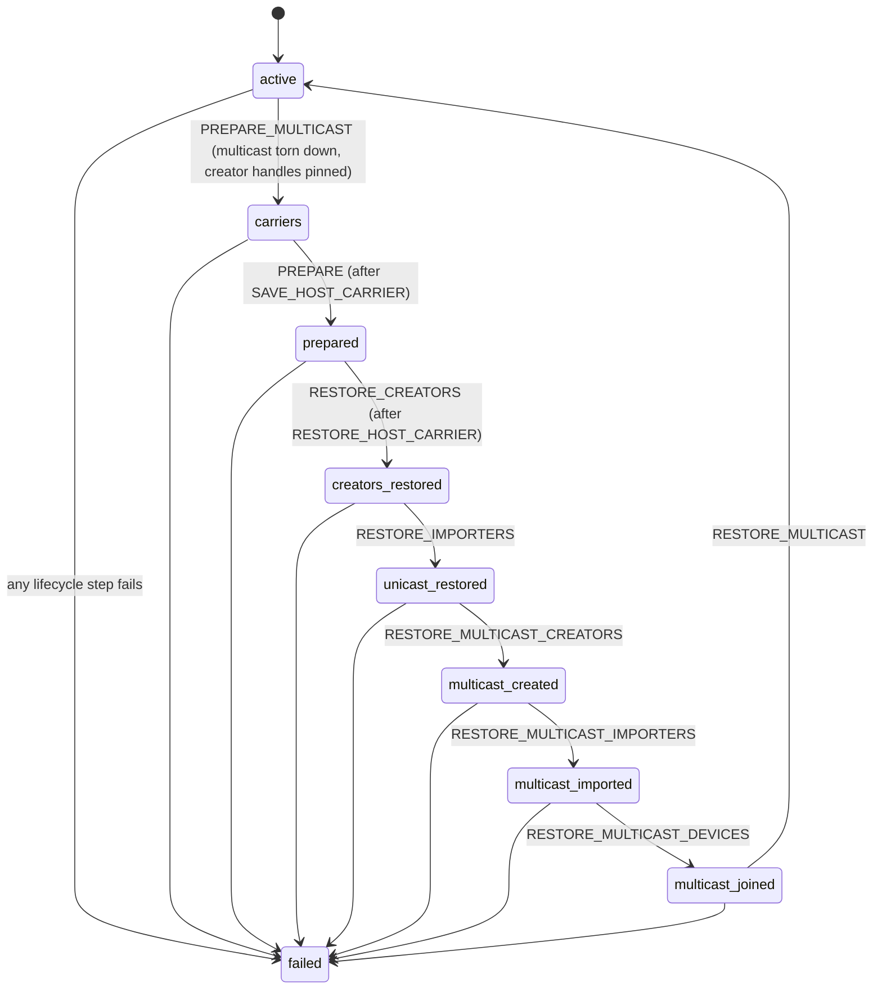

<!--
SPDX-FileCopyrightText: Copyright (c) 2026 NVIDIA CORPORATION & AFFILIATES. All rights reserved.
SPDX-License-Identifier: Apache-2.0
-->

# cuinterpose: checkpointing CUDA memory that processes share

> For someone reviewing the pull requests that add cuinterpose, who wants to
> understand what the pieces do and why. Not a specification: the code is the
> specification, and each section names the files that implement it.

## 1. The problem in one page

Snapshot checkpoints a container with CRIU for the CPU side and NVIDIA's
`cuda-checkpoint` for the GPU side. `cuda-checkpoint` saves each process's GPU
memory and restores it into a fresh allocation later. That works for memory a
process uses alone.

Inference servers do not use GPU memory alone. Tensor-parallel workers share
buffers between processes on the same node: one process allocates a buffer
with the CUDA virtual memory management API (`cuMemCreate`), exports it as a
file descriptor (`cuMemExportToShareableHandle`), passes the descriptor to a
sibling over a socket, and the sibling imports it (`cuMemImportFromShareableHandle`)
and maps it into its own address space. NCCL, FlashInfer, and PyTorch's
symmetric memory all do this. Multicast objects (`cuMulticastCreate`) go one
step further: several GPUs write one buffer through NVLink.

Two things break when such a process tree is checkpointed and restored:

1. **The restored copies are private.** `cuda-checkpoint` restores each
   process's memory as new allocations owned by that process. The importer's
   view of the creator's buffer becomes a separate buffer with a stale copy of
   the bytes. Nothing fails; the processes just stop seeing each other's
   writes.
2. **Exports of restored memory fail.** On the r615 driver, large device
   allocations carry a fabric linear address (FLA) handle from the moment they
   are created. That handle is not rebuilt on restore, so the next
   `cuMemExportToShareableHandle` on a restored allocation fails with
   `CUDA_ERROR_INVALID_VALUE`, and a multicast rebuild after restore cannot
   proceed.

cuinterpose fixes both by standing between the application and the driver.
It watches the sharing happen, takes the sharing apart just before the native
checkpoint so the driver only sees plain memory, and puts it back together just
after the native restore, in every process, in the right order.

## 2. The cast

| Piece | What it is | Where |
| --- | --- | --- |
| **Workload process** | vLLM, SGLang, or any CUDA program. Unchanged. | the source Pod |
| **Shim** (`libcuinterpose.so`) | A library loaded first via `LD_PRELOAD` into every container process. It replaces the CUDA driver functions that create, export, import, map, and bind shared memory, forwards each call to the real driver, and records what happened. | `agent/cmd/cuinterpose/interpose.c`, `multicast.c`, `symbols.c` |
| **Listener** | One thread the shim starts per process, serving a Unix socket at `/snapshot-control/cuinterpose-<pid>.sock` (pid as seen inside the container). Peers ask it for real file descriptors; the coordinator asks it to describe, tear down, and rebuild. Each request gets its own short-lived thread. | `interpose.c` |
| **Ticket** | What the application gets instead of a real exported descriptor: a sealed in-memory file (memfd) naming the creator process, the allocation, and a random authorization token. Applications pass tickets around exactly as they would pass descriptors. | `posix.c` |
| **Export cache** | The creator's real exported descriptor, kept open while the allocation is live so the listener can hand out copies without calling the driver or taking the shim's lock. | `export_cache.c` |
| **Tables** | Open-addressing hash tables (logical handle → record, allocation id → record) and a sorted range index (address → mapping) that shrink as well as grow, so a server that maps and unmaps all day does not slow down. | `table.c` |
| **Context helpers** | Remember which CUDA context an allocation belongs to and switch to it for the lifecycle work, falling back to the device's primary context for memory that never had one. | `context.c` |
| **Coordinator** (`cuinterpose-coordinator`) | A static program the agent runs once before checkpoint and once after restore. It talks to every listener, validates that the processes agree about what is shared, and drives them through the steps in order. It never touches the GPU. | `coordinator.c` |
| **snapshot-agent** | Decides *when*: detects the shim by its sockets, runs the coordinator, records what happened in the checkpoint manifest, mounts the shim at restore. | `agent/internal/cuda/cuinterpose.go`, `agent/internal/executor` |
| **Operator / podcontract** | Puts the shim into an opted-in Pod: an init container copies `libcuinterpose.so` and `cuda-checkpoint` from the agent image into an emptyDir, mounts it at `/tmp/cuinterpose`, sets `LD_PRELOAD`, and wraps the command with `cuda-checkpoint --launch-job`. | `api/podcontract/cuinterpose.go` |
| **cuda-checkpoint** | NVIDIA's tool. Saves and restores a process's GPU state natively. Sees only plain memory because the shim has taken the sharing apart first. | agent bundle |
| **CRIU** | Saves and restores the processes themselves, including the shim's own bookkeeping, which is ordinary process memory. | agent bundle |

The shim's bookkeeping surviving CRIU is the trick that makes restore possible:
after CRIU, every process still remembers exactly which allocations it created
or imported, at which addresses they were mapped, and with what access. Only
the driver-side objects behind those records are gone, and the coordinator's
job is to have each process recreate them.

## 3. Flows

### 3.1 Sharing an allocation while the workload runs

```mermaid
sequenceDiagram
    participant AppC as Creator process
    participant ShimC as Creator shim
    participant LisC as Creator listener
    participant AppI as Importer process
    participant ShimI as Importer shim
    AppC->>ShimC: cuMemCreate(POSIX fd handle type)
    ShimC->>ShimC: real cuMemCreate; record allocation; return a logical handle
    AppC->>ShimC: cuMemExportToShareableHandle
    ShimC->>ShimC: first export: real driver export, keep the fd (export cache)
    ShimC-->>AppC: ticket (sealed memfd)
    AppC->>AppI: ticket fd over the app's own channel (NCCL socket etc.)
    AppI->>ShimI: cuMemImportFromShareableHandle(ticket)
    ShimI->>LisC: connect to creator's socket, EXPORT{allocation, authorization}
    LisC-->>ShimI: copy of the cached fd (SCM_RIGHTS); no driver call, no shared lock
    ShimI->>ShimI: real cuMemImport; close fd; record importer entry
    ShimI-->>AppI: logical handle
```

Why a ticket and not the real fd: the shim must learn that a share happened
and who the two sides are. Handing out the real descriptor would make the
import invisible. Handing out a ticket makes the importer come back to the
creator, and that round trip is where the shim records the pair.

Why the listener never calls the driver: the creator's application
threads may be inside a long collective driver call holding the shim's lock.
An earlier version did the real export at request time, under that lock, and
peers timed out waiting. Exporting once at ticket time and serving copies
removes the dependency.

### 3.2 Checkpoint

```mermaid
sequenceDiagram
    participant Agent
    participant Coord as Coordinator
    participant P as Every CUDA process (shim listener)
    participant cc as cuda-checkpoint
    Agent->>Agent: requested := Pod annotation; sockets := detect
    Agent->>Coord: --prepare --proc-root /host/proc ...
    Coord->>P: IDENTIFY, INSPECT (records + live raw import count)
    Coord->>Coord: validate: one creator per allocation, mappings in bounds,<br/>multicast groups complete; refuse if any raw import is live
    Coord->>P: PREPARE_MULTICAST (all at once): unbind, unmap, release multicast objects
    Coord->>P: SAVE_HOST_CARRIER (creators, all at once): copy every creator allocation into one pinned host arena, free the device copies
    Coord->>P: PREPARE (all at once): unmap shared mappings, drop importer handles
    Coord->>Coord: write cuinterpose.state (rename + fsync)
    Agent->>Agent: manifest.cuinterpose.prepared = true
    Agent->>cc: lock + native checkpoint (sees only private memory)
    Agent->>Agent: CRIU dump (the host copies are ordinary process pages)
```

Order matters twice. Multicast bindings sit on top of unicast allocations, so
every process must finish multicast teardown before any process unmaps unicast
memory. And the state file is written last, so a state file's existence means
prepare completed everywhere.

### 3.3 Restore

```mermaid
sequenceDiagram
    participant Agent
    participant CRIU
    participant cc as cuda-checkpoint
    participant Coord as Coordinator
    participant P as Every CUDA process (shim listener)
    participant App as Application threads
    Agent->>Agent: mount the shim at /tmp/cuinterpose (manifest.requested)
    Agent->>Agent: delete stale cuinterpose-*.sock in /snapshot-control
    Agent->>Agent: open the coordinator binary (fd survives the mount namespace change)
    Agent->>CRIU: restore the process tree (app parked in its restore-complete poll loop)
    Agent->>cc: native restore + unlock
    Note over Agent: manifest.prepared but no cuinterpose.state → refuse
    Agent->>Coord: --restore --proc-root "" ...
    Coord->>P: IDENTIFY; participants must equal the checkpointed set
    Coord->>P: RESTORE_HOST_CARRIER (creators, all at once): new device allocations, copy back from the arena; the arena is unpinned after the reply
    Coord->>P: RESTORE_CREATORS (all at once): remap at the saved addresses, restore access, re-export
    Coord->>P: RESTORE_IMPORTERS (all at once): ask creators for fresh fds, import, remap
    Coord->>P: multicast: CREATE → IMPORT → ADD_DEVICE ⟂ BIND+MAP, barrier after each
    Coord->>P: INSPECT again; must equal the checkpointed topology
    Agent->>App: write restore-complete → application resumes
```

The barrier between ADD_DEVICE and BIND is not a design choice. The r615 driver
makes `cuMulticastBindMem` spin until every device in the team has been
attached, so a bind issued before every process finished attaching would wait
forever.

### 3.4 Other flows

**Fork.** The shim registers `pthread_atfork` handlers. The child of a fork
inherits none of the parent's records, descriptors, or socket: CUDA contexts do
not survive `fork()`, so nothing the parent tracked is usable in the child. The
child mints a new participant identity and starts its own listener on its first
CUDA activity (any interposed call or any driver symbol resolution). vLLM and
PyTorch fork their workers before touching CUDA, which is the supported shape;
forking a process that already holds tracked memory leaves the parent intact
and the child with a clean slate.

**Processes that come and go.** A CUDA server spawns thousands of short-lived
helpers (compilation workers, `nvidia-smi`, shells), and every one of them loads
the shim through `LD_PRELOAD` and gets a socket. A process that exits without
running destructors leaves its socket file behind; the next process to start an
endpoint in the same control directory removes the sockets whose owner is gone.

**Agent restart during restore.** The restore path is idempotent up to the
coordinator: the agent deletes stale `cuinterpose-*.sock` files before CRIU,
because CRIU would fail to `bind()` onto a path that exists. A restore that is
interrupted after the native restore but before the coordinator finished leaves
the shims in an intermediate phase, in which every VMM call answers
`CUDA_ERROR_NOT_READY`; the application, parked in its poll loop, notices
nothing until the sentinel is written, and the sentinel is written only after
the coordinator succeeded.

**Failed prepare.** A failure in INSPECT or validation is free: nothing was torn
down, the shims stay active, the checkpoint is reported failed. A failure in
PREPARE_MULTICAST, SAVE_HOST_CARRIER, or PREPARE is not: the shim that failed
moves to the *failed* phase and the others may already have torn down their
sharing. There is no rollback; the checkpoint fails and the source Pod is
terminated by the agent as it would be for any failed checkpoint.

**Failed restore.** The coordinator stops at the first failing phase, prints
which participant refused and why, and exits non-zero; the agent fails the
restore and the Pod. Restoring the same checkpoint again into a fresh Pod is
allowed: the state file is read-only.

## 4. Lifecycle phases

Each shim moves through these phases; the coordinator's requests are refused
out of order, so a stray or repeated request cannot corrupt the state.



What the application sees, by phase:

| Call on a tracked object | active | any other phase |
| --- | --- | --- |
| `cuMemCreate`, `cuMulticastCreate` with the POSIX handle type | tracked, logical handle returned | `CUDA_ERROR_NOT_READY` |
| map, unmap, set access, export, import, retain, release, bind, unbind | forwarded and recorded | `CUDA_ERROR_NOT_READY` |
| the same calls on untracked memory (other handle types, raw descriptors) | forwarded | forwarded |
| import of a ticket by a peer (listener EXPORT request) | served from the export cache | refused ("not accepting exports") |

`IDENTIFY` and `INSPECT` report the phase, so a coordinator that finds a shim
in the wrong phase can say so.

## 5. Formats

**Ticket** (`posix.h`): 256 bytes in a sealed memfd (`F_SEAL_WRITE`, `SHRINK`,
`GROW`, `SEAL`), which is how the shim tells a ticket apart from a real driver
descriptor (a character device, on which `F_GET_SEALS` fails). Fields: magic
and version; the creator's participant id (32 hex digits) and socket path; the
16-byte allocation id; a 32-byte random authorization token; the resource kind
(unicast allocation or multicast object); for multicast objects the requested
size, handle type, flags, and device count, which the importer checks against
an object it already knows.

**Control message** (`protocol.h`): one 256-byte header each way, optionally
followed by `count` records and optionally carrying one descriptor as
`SCM_RIGHTS`. The header names the operation, the participant, a status and
message, the allocation id and authorization for EXPORT, the live raw import
and pass-through creation counts and the phase in IDENTIFY/INSPECT replies,
`payload_size` (bytes copied) and `copy_us` (how long the copies took) in
carrier replies.

**Record** (`protocol.h`): 688 bytes describing one allocation, mapping,
multicast object, attached device, binding, or multicast mapping, with up to 32
access descriptors. Records sort so that an object precedes what depends on
it.

**State file** (`cuinterpose.state`, written by the coordinator): text. The
first line is `cuinterpose-state-v2`; then, for each participant in sorted
order, `participant <id> <count>` followed by `count` records, each one line of
hex. Written to a temporary name, fsynced, renamed, and the directory fsynced,
so a state file that exists is complete. Restore refuses to run without it when
the manifest says prepare ran.

**Manifest** (`agent/internal/types/manifest.go`): `cuinterpose.requested`
(the source Pod opted in; restore mounts the shim) and `cuinterpose.prepared`
(prepare wrote the state file; restore runs the coordinator, and a missing
state file is a hard failure).

## 6. Invariants

- **Creator anchor.** The process that created a shared allocation must still
  hold a handle to it or a mapping of it at checkpoint time. It is the only
  process that can re-export the memory after restore; without it the
  importers have nothing to import. The coordinator refuses a checkpoint that
  violates this.
- **Tickets live as long as the creator's local references.** When the creator
  releases its last handle and unmaps its last mapping, the allocation is
  gone from the shim's tables and any ticket for it is dead. This matches what
  the application asked for: freeing memory frees it.
- **One backing driver reference per allocation per process.** Several logical
  handles (from repeated imports or `cuMemRetainAllocationHandle`) share one
  driver handle; releasing the last logical handle releases the driver's.
- **Access is merged per location.** `cuMemSetAccess` may be called once per
  GPU; the shim keeps the union and replays it on restore.
- **Multicast phase barrier.** Every process finishes attaching devices before
  any process binds memory (see 3.3).
- **Quiescence.** From the moment the agent starts detecting until the source
  is terminated after checkpoint, and from CRIU restore until the
  restore-complete sentinel, the workload issues no CUDA calls and no shares.
  Dynamo workloads park in a poll loop for exactly this reason. The shim's
  "not ready" answers during that window are safe only because nothing is
  asking.
- **Prepare is one-way.** After prepare has torn down the sharing there is no
  rollback; a checkpoint that fails afterwards leaves the source unusable and
  the agent terminates it.
- **One real export per allocation or object per process while active.** The
  descriptor lives in the export cache and is closed by PREPARE (unicast) or
  PREPARE_MULTICAST (multicast, before the object is released, because the
  descriptor is itself a reference to the object); restore exports again.
- **Every tracked creator allocation is carried through the host.** Not just
  the exported ones: a never-exported allocation may be exported for the first
  time after restore, and the sticky fabric state would make that fail.
- **Lock order.** The shim's state lock is taken before the export cache's
  lock, never the other way; the listener takes only the cache lock. Team
  collectives (`cuMulticastCreate`, `AddDevice`, bind, map) run without the
  state lock and re-look up their object afterwards.

## 7. Performance

Measured on the nscale-dev cluster (B200, kernel driver 595.58.03) with the
vLLM guide's `app.py`, Qwen3-0.6B, tensor parallel 2, FlashInfer TRT-LLM
attention and fused allreduce, four CUDA processes:

| Step | Time | Notes |
| --- | --- | --- |
| checkpoint, total | 52 s | |
| of which CRIU dump | 48.9 s | process memory including the host arena and vLLM's CPU-offloaded weights |
| of which native `cuda-checkpoint` | 2.3 s | |
| of which cuinterpose prepare | 0.43 s | 1052 records, 382 carriers, 2.08 GB |
| restore, total | 5.7 s | Pod ready 13 s after the Deployment was applied |
| of which CRIU restore | 2.5 s | |
| of which native CUDA restore | 2.1 s | |
| of which cuinterpose restore | 0.35 s | host carriers 0.05 s (2.08 GB at 43 GB/s for the phase, 105 GB/s for the copies), unicast 0.09 s, multicast 0.18 s |

The host carrier copies are the part that scales with the workload, and the
version reviewed here changed how they are done. With one pinned buffer and
one staging mapping per allocation, the restore phase reached 17 to 30 GB/s
aggregate over two GPUs (256 MiB to 8 GiB per rank), against a pinned-copy
baseline of 55 GB/s per GPU: pinning, mapping, and unpinning each of vLLM's
hundreds of 2 MiB pieces cost more than moving the bytes. With one pinned
arena per process, one staging range per context, and the unpinning moved
after the reply, the same phase runs at 87 to 108 GB/s aggregate, and the
copies alone at 82 GB/s aggregate on the checkpoint side. The coordinator
prints both figures (`gb_per_s` for the phase, `copy_gb_per_s` for the
transfer) so a regression in either is visible in the agent log.

The remaining cost of the save phase (0.34 s for 2 GB, of which the copies are
25 ms) is populating and pinning the arena's pages; it happens before the
native checkpoint, off the restore hot path, and a `MAP_POPULATE` mapping is
already the cheapest way to get pinned pages the driver accepts.

## 8. Pitfalls we hit and fixed

- **Sticky fabric state (r615).** `cuMemCreate` attaches a fabric linear
  address to large allocations at creation and native restore does not rebuild
  it, so a restored allocation cannot be exported again and peer NVLink access
  fails. Fix: every creator allocation goes through a fresh allocation at
  restore, with its contents carried through pinned host memory.
- **Multicast capacity rounding (r615).** The driver gives a multicast object
  more capacity than requested (512 MiB granularity) and NCCL binds and maps
  into it. Fix: the shim reports the largest extent actually used, the
  coordinator checks bounds against the largest extent any participant
  reported, and restore replays the requested size.
- **Bind waits for the team.** `cuMulticastBindMem` spins until every device is
  attached. Fix: a coordinator barrier between the add-device and bind phases,
  and no shim lock held across the collective calls.
- **Listener starvation.** An earlier version exported on request, under the
  shim's lock, while application threads sat in long collective driver calls;
  peers timed out. Fix: export once at ticket time, serve copies from a cache
  the listener can read without the lock.
- **Per-allocation host pinning.** See section 7.
- **`cuMemCreate` without a current context.** The driver allows it; the first
  version of the shim refused it. Fix: adopt the context at the first map or
  export, fall back to the device's primary context in the lifecycle.
- **Stale sockets.** Short-lived helper processes left hundreds of socket files
  behind. Fix: sockets of dead processes are removed when an endpoint starts;
  the agent removes them before CRIU restore as well, since a stale path makes
  CRIU's `bind()` fail.
- **`strtol` under glibc 2.38 headers** resolves to `__isoc23_strtol@GLIBC_2.38`,
  and the shim must load on glibc 2.34 images. The build asserts the newest
  glibc symbol version; number parsing is done by hand.
- **Sanitized tests shelling out.** A child of a sanitizer-instrumented test
  inherits `LD_PRELOAD`, and the CUDA base image's `/bin/sh` runs a profile
  script whose helpers then report their own leaks. The tests never shell out.
- **Access granularity.** `cuMemSetAccess` is applied per location by the
  driver, so PyTorch's one-call-per-GPU pattern must be merged, not replaced;
  and eight GPUs plus host NUMA nodes overflow an eight-entry record. Records
  hold 32 access descriptors and the shim refuses a call that would exceed them
  before the driver sees it.
- **Duplicate driver references.** Repeated imports and
  `cuMemRetainAllocationHandle` each cost a driver reference and leaked memory.
  One driver handle per allocation per process; logical handles alias it.
- **Listener refusing multicast requests.** Left over from the layer that did
  not yet know multicast; caught by the two-rank fake-driver test.

## 9. Explicitly unsupported

The list in [`docs/limitations.md`](../limitations.md) is the user-facing one.
For a reviewer, the reasons:

- Raw imports (descriptors not produced by the shim), descriptors duplicated or
  passed outside the shim's view: native restore gives that process a private
  copy with no error, so the checkpoint is refused instead.
- Fabric handle types: untracked by decision; the allocators that prefer them
  can be steered to POSIX descriptors.
- Legacy CUDA IPC, multi-node multicast, a second `dlsym` interposer.
- Forking after tracked state exists; a checkpoint during communicator setup;
  any change of GPU count, multicast group, or per-rank `CUDA_VISIBLE_DEVICES`
  between checkpoint and restore.
- Partial-range unmap or access changes over tracked mappings; more than 32
  access locations per mapping; more than 4096 records per process.
- Rollback after prepare; state files from other builds; a restore node whose
  agent image differs from the checkpoint node's (fails inside CRIU's file
  validation with an unhelpful message; deferred).

## 10. Accepted risks

- Fabric pass-through makes fabric-capable allocator pools invisible to the
  shim; documented, and the coordinator's `passthrough_creations` count makes
  it visible in the agent log.
- Host staging is pool-sized: a workload that keeps its whole KV cache in
  tracked allocations carries it through pinned host memory and the CRIU image.
  vLLM's sleep mode makes this small in practice.
- One `/dev/nvidiactl` descriptor per exported allocation stays open in the
  creator while it is shared.
- The fake-driver tests run in the agent image build, not on pull requests.
- Fail-stop lifecycle: a failed prepare ends the source.
- Same-UID trust on the control sockets: file mode 0600 keeps other users out,
  and any process of the same user in the container could talk to a shim.
- Artifacts from before this stack are not restorable (state version 2).

## 11. Knobs, timeouts, and log lines

Environment, read by the shim and the coordinator: `SNAPSHOT_CONTROL_DIR`
(default `/snapshot-control`), `SNAPSHOT_PARTICIPANT_ID` (tests only),
`SNAPSHOT_CONTROL_TIMEOUT_SECONDS` (default 10) for every exchange except the
two that copy allocation contents, which use `SNAPSHOT_CARRIER_TIMEOUT_SECONDS`
(default 3600).

Chart: `cuinterpose.imagePullSecrets`; the agent image itself is `image.agent`.

Coordinator arguments: `--prepare|--restore --proc-root PATH --checkpoint-dir
PATH --control-dir PATH --process OBSERVED_PID NAMESPACE_PID...`.

Log lines an operator will see in the agent log:

- `cuinterpose coordinator phase` with `phase=`, `status=`, `elapsed_ms=`,
  `participants=`; INSPECT adds `records=`, `live_raw_imports=`,
  `passthrough_creations=`; the carrier phases add `carrier_count=`,
  `carrier_bytes=`, `gb_per_s=`, `copy_gb_per_s=`.
- `prepare refused: participant ... holds N live raw imports` when a checkpoint
  is refused.
- Timing summaries with `cuinterpose_prepare` and `cuinterpose_restore`
  phases.
- In the workload's own stderr: `cuinterpose: an allocation with the FABRIC
  handle type passed through untracked` (once per process), `cuinterpose: host
  carrier registration did not survive restore; re-registered`.

## 12. Test matrix

| Suite | Where it runs | Covers |
| --- | --- | --- |
| `proto_unit_test`, `table_unit_test` | agent image build | tickets, control messages, descriptor passing, tables, range index, export cache |
| `forward_preload_test` | agent image build | all four symbol resolution paths, argument forwarding, bind ABI selection |
| `coordinator_test` | agent image build | phase ordering, barriers, topology validation, raw import refusal, state file, restore preconditions |
| `state_preload_test` | agent image build | tracking: alias collapse, range unmap, access merging, tickets, cross-process import, churn |
| `lifecycle_preload_test` | agent image build | prepare and restore across two processes with the real coordinator, carriers, lost pinning, context-less allocations, fail-stop |
| `multicast_preload_test` | agent image build | two-rank multicast group round trip, effective extent, rebind by address, pass-through, refusal of untracked members, descriptor-before-object teardown |
| `tests/gpu` | manual, two GPUs, launch job | real driver: POSIX and multicast round trips with PyTorch, seeded contents, copy throughput against a pinned baseline, raw import refusal |
| cluster e2e | manual, nscale-dev | vLLM TP2 with FlashInfer TRT-LLM kernels through PodSnapshot and restore, coherent inference afterwards |

## 13. Reviewer's guide

1. **Delivery, orchestration, packaging** (`api/podcontract`, operator,
   chart, `agent/internal`, Dockerfile, the Makefile, `protocol.h`): the only
   PR that touches Go. Read section 2's operator and snapshot-agent rows,
   3.2 and 3.3 for what the agent does around the coordinator, and 5 for the
   manifest fields and the state file. The shim and coordinator here are
   placeholders; an annotated Pod is refused until PR 5.
2. **Symbol resolution and forwarding** (`symbols.c`, the `dlsym`
   replacement, `posix.c`): read 3.1 for what tickets are;
   `forward_preload_test` is the contract.
3. **Coordinator** (`coordinator.c`): read 3.2, 3.3, 5, and 6 (barriers).
4. **Tracking** (`interpose.c` without the lifecycle, `table.c`,
   `export_cache.c`): read 3.1 and 6 (creator anchor, one driver reference,
   access merging, lock order).
5. **Lifecycle** (`interpose.c` lifecycle, `context.c`, the coordinator's
   carrier phases): read 3.2, 3.3, 4, 7, and the first pitfall in 8.
6. **Multicast** (`multicast.c`): read 3.3's multicast phases, 6's barrier and
   export invariants, and the second and third pitfalls in 8.
7. **GPU tests** (`tests/gpu`): read 12; the harness mirrors the agent's
   sequence with the real driver.
8. **Docs**: this document, `docs/limitations.md`, the vLLM guide.
